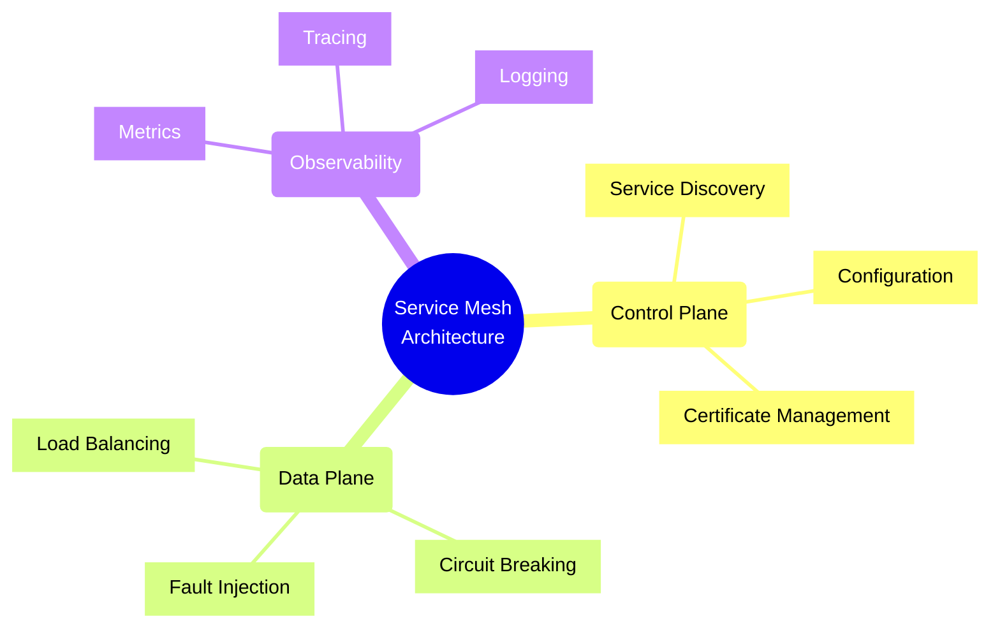
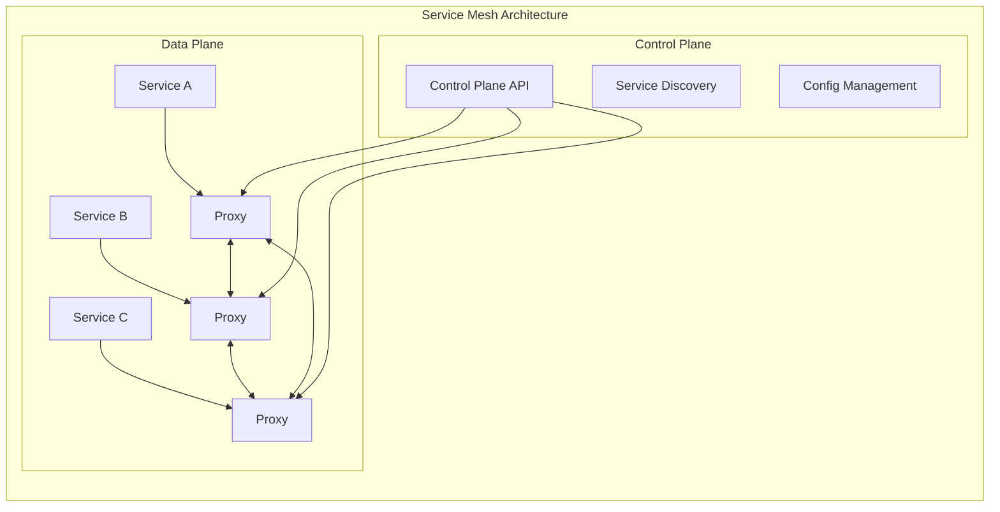
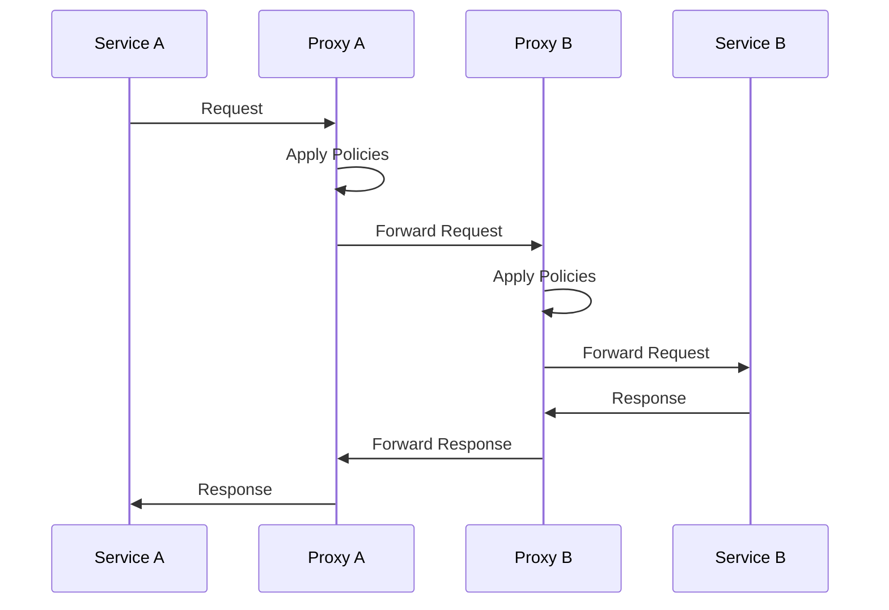
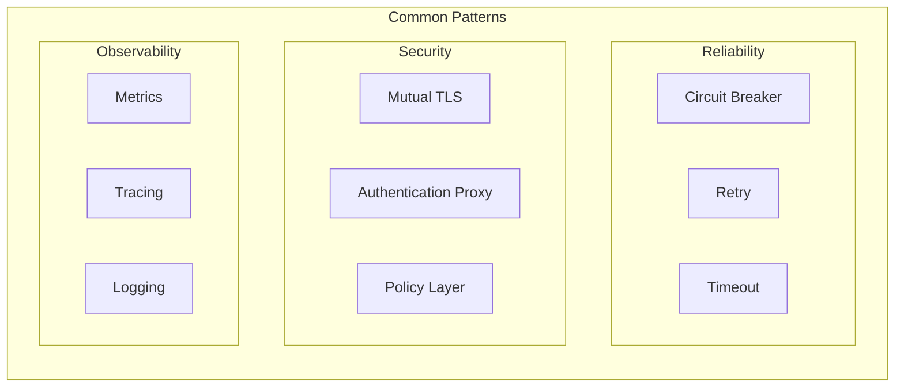

# Service Mesh Patterns and Implementation



## Service Mesh Components



## Service Communication Flow



## Implementation Examples

### 1. Proxy Configuration

```typescript
interface ProxyConfig {
    service: string;
    port: number;
    metrics: {
        enabled: boolean;
        port: number;
    };
    tracing: {
        enabled: boolean;
        sampling: number;
    };
    circuitBreaker: {
        enabled: boolean;
        failureThreshold: number;
        resetTimeout: number;
    };
}

class ServiceProxy {
    constructor(private config: ProxyConfig) {}

    async handleRequest(req: Request): Promise<Response> {
        if (this.config.circuitBreaker.enabled) {
            return this.withCircuitBreaker(req);
        }
        return this.forwardRequest(req);
    }

    private async withCircuitBreaker(req: Request): Promise<Response> {
        const breaker = new CircuitBreaker({
            failureThreshold: this.config.circuitBreaker.failureThreshold,
            resetTimeout: this.config.circuitBreaker.resetTimeout
        });

        return breaker.execute(() => this.forwardRequest(req));
    }
}
```

### 2. Service Discovery

```typescript
interface ServiceRegistry {
    register(service: ServiceMetadata): Promise<void>;
    deregister(serviceId: string): Promise<void>;
    discover(serviceName: string): Promise<ServiceInstance[]>;
}

class ConsulServiceRegistry implements ServiceRegistry {
    private consul: ConsulClient;

    async register(service: ServiceMetadata): Promise<void> {
        await this.consul.agent.service.register({
            name: service.name,
            id: service.id,
            address: service.address,
            port: service.port,
            tags: service.tags,
            checks: [{
                http: `http://${service.address}:${service.port}/health`,
                interval: '15s'
            }]
        });
    }

    async discover(serviceName: string): Promise<ServiceInstance[]> {
        const result = await this.consul.catalog.service.nodes(serviceName);
        return result.map(node => ({
            id: node.ServiceID,
            address: node.ServiceAddress,
            port: node.ServicePort
        }));
    }
}
```

### 3. Traffic Management

```typescript
interface TrafficPolicy {
    loadBalancer: {
        algorithm: 'round-robin' | 'least-conn' | 'random';
        healthCheck: {
            path: string;
            interval: number;
            timeout: number;
        };
    };
    retry: {
        attempts: number;
        backoff: {
            baseDelay: number;
            maxDelay: number;
        };
    };
}

class TrafficManager {
    constructor(private policy: TrafficPolicy) {}

    async routeRequest(req: Request): Promise<Response> {
        const instances = await this.getHealthyInstances();
        const target = this.selectTarget(instances);
        
        return this.withRetry(async () => {
            try {
                return await this.sendRequest(target, req);
            } catch (error) {
                this.markInstanceUnhealthy(target);
                throw error;
            }
        });
    }

    private async withRetry(fn: () => Promise<Response>): Promise<Response> {
        const retry = new RetryWithBackoff({
            maxAttempts: this.policy.retry.attempts,
            baseDelay: this.policy.retry.backoff.baseDelay,
            maxDelay: this.policy.retry.backoff.maxDelay
        });

        return retry.execute(fn);
    }
}
```

## Service Mesh Patterns



## Best Practices

1. **Traffic Management**
   - Implement intelligent routing
   - Use appropriate load balancing
   - Configure proper timeouts
   - Implement retry policies

2. **Security**
   - Enable mutual TLS
   - Implement access policies
   - Manage certificates
   - Monitor security events

3. **Observability**
   - Collect comprehensive metrics
   - Implement distributed tracing
   - Aggregate logs effectively
   - Monitor service health

4. **Performance**
   - Optimize proxy configuration
   - Monitor resource usage
   - Implement caching strategies
   - Profile service calls

Remember: Service mesh is a powerful but complex pattern. Start with essential features and gradually add complexity as your needs grow and your team becomes more comfortable with the implementation.