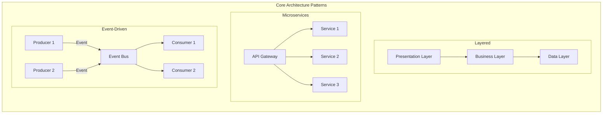
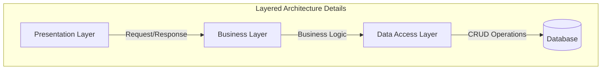

# Software Architecture Patterns

## Common Architecture Patterns



## 1. Layered (N-tier) Architecture
### Overview
A layered architecture divides the application into distinct horizontal layers, each performing a specific role.

### Common Layers
- Presentation Layer (UI)
- Application Layer (Business Logic)
- Domain Layer (Business Rules)
- Data Layer (Storage)

### Best Used When
- Building traditional business applications
- Maintaining separation of concerns
- Working with standard CRUD applications

### Example



### Pros
- Clear separation of concerns
- Easy to maintain and test
- Familiar to most developers

### Cons
- Can lead to "monolithic" applications
- Changes can affect multiple layers
- May introduce unnecessary complexity for simple applications

## 2. Microservices Architecture
### Overview
An architectural style that structures an application as a collection of small autonomous services, modeled around a business domain.

### Characteristics
- Independently deployable
- Loosely coupled
- Organized around business capabilities
- Owned by small teams

### Best Used When
- Building large, complex applications
- Requiring independent scaling of components
- Need for rapid, frequent deployments

### Example
```
User Service  →  Order Service  →  Payment Service
     ↓              ↓                ↓
User DB         Order DB         Payment DB
```

### Pros
- Independent deployability
- Technology diversity
- Better fault isolation
- Scalable development

### Cons
- Distributed system complexity
- Operational overhead
- Service coordination challenges

## 3. Event-Driven Architecture
### Overview
A pattern where components communicate through events, promoting loose coupling and scalability.

### Components
- Event Producers
- Event Channels
- Event Consumers
- Event Bus/Message Broker

### Best Used When
- Building reactive systems
- Handling asynchronous operations
- Need for real-time data processing

### Example
```
Producer → Message Queue → Consumer
           (Kafka/RabbitMQ)
```

### Pros
- Loose coupling
- Good scalability
- Real-time processing capability
- Improved responsiveness

### Cons
- Complex error handling
- Event consistency challenges
- Potential message ordering issues

## 4. Model-View-Controller (MVC)
### Overview
Separates application logic into three interconnected components.

### Components
- Model (Data and Business Logic)
- View (User Interface)
- Controller (Input Logic)

### Best Used When
- Building user interface applications
- Need clear separation between data and presentation
- Working with web applications

### Example
```
User Input → Controller → Model ← View
                ↓          ↑
              Updates   Notifies
```

### Pros
- Clear separation of concerns
- Parallel development
- Multiple views for same model

### Cons
- Can be overkill for simple applications
- Potential tight coupling
- Learning curve for beginners

## 5. Service-Oriented Architecture (SOA)
### Overview
Structures applications as a collection of services that communicate over a network.

### Characteristics
- Service contracts
- Loose coupling
- Abstraction
- Reusability

### Best Used When
- Enterprise-level applications
- Need for service reusability
- Integration of multiple systems

### Example
```
Enterprise Service Bus
    ↓         ↓         ↓
Service A  Service B  Service C
```

### Pros
- Service reusability
- Platform independence
- Improved maintainability
- Better scalability

### Cons
- Complex service management
- Performance overhead
- Potential for high latency

## 6. Hexagonal Architecture (Ports and Adapters)
### Overview
Allows an application to be equally driven by users, programs, automated tests, or batch scripts, and to be developed and tested in isolation from its eventual run-time devices and databases.

### Components
- Core Application
- Ports (Interfaces)
- Adapters (Implementations)

### Best Used When
- Need for technology independence
- Complex domain logic
- Multiple user interfaces or data sources

### Example
```
UI Adapter → Port → Core Business Logic → Port → Database Adapter
Test Adapter →               ↑                  → External Service Adapter
```

### Pros
- Technology independence
- Easy testing
- Flexible deployment options

### Cons
- Initial complexity
- Learning curve
- Can be overengineered for simple apps

## Best Practices for Pattern Selection

1. **Consider Your Context**
   - Application size and complexity
   - Team size and expertise
   - Business requirements
   - Scalability needs

2. **Pattern Combination**
   - Patterns can be combined
   - Use what makes sense for your specific case
   - Don't force patterns where they don't fit

3. **Evolution Considerations**
   - Start simple
   - Evolve as needed
   - Consider future requirements

4. **Performance Impact**
   - Evaluate pattern overhead
   - Consider latency requirements
   - Assess scalability needs

## Anti-Patterns to Avoid

1. **Big Ball of Mud**
   - No clear structure
   - Tangled dependencies
   - Difficult to maintain

2. **Golden Hammer**
   - Using one pattern for everything
   - Ignoring context-specific needs

3. **Premature Optimization**
   - Over-engineering from the start
   - Implementing complex patterns too early

Remember that patterns are guidelines, not strict rules. The best architecture is one that meets your specific requirements while remaining maintainable and scalable.