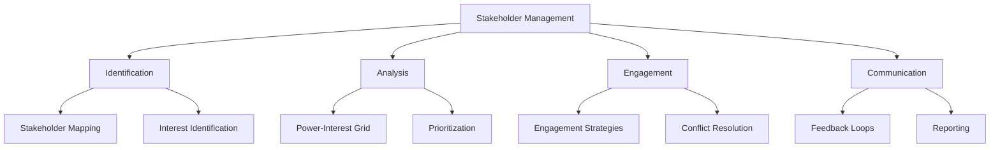
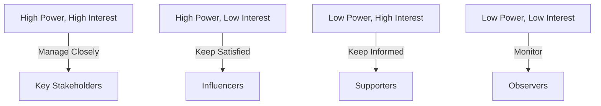

# Stakeholder Management

## Overview
Stakeholder management involves identifying, analyzing, and engaging with individuals or groups who have an interest in or influence over a project or initiative.

## Key Principles

### Identification
- Identify all stakeholders early in the project.
- Include internal and external stakeholders.
- Use stakeholder mapping tools.

### Analysis
- Assess stakeholders' power and interest.
- Prioritize stakeholders based on their influence.
- Understand stakeholders' expectations and concerns.

### Engagement
- Develop tailored engagement strategies.
- Address conflicts proactively.
- Build trust through transparency.

### Communication
- Use clear and consistent messaging.
- Establish feedback loops.
- Provide regular updates.

## Stakeholder Mapping

### Power-Interest Grid

### Stakeholder Matrix
| Stakeholder       | Role            | Power | Interest | Engagement Strategy |
|-------------------|-----------------|-------|----------|----------------------|
| Project Sponsor   | Decision Maker | High  | High     | Manage Closely       |
| End Users         | Consumers      | Low   | High     | Keep Informed        |
| IT Department     | Support Team   | Medium| Medium   | Collaborate          |
| Regulators        | Compliance     | High  | Low      | Keep Satisfied       |

## Engagement Strategies

### Key Stakeholders
- Schedule regular meetings.
- Involve them in decision-making.
- Address their concerns promptly.

### Influencers
- Provide high-level updates.
- Seek their input on critical decisions.
- Ensure their needs are met.

### Supporters
- Share progress reports.
- Highlight their contributions.
- Keep them motivated.

### Observers
- Monitor their feedback.
- Provide occasional updates.
- Address their concerns if raised.

## Best Practices Checklist

### Identification
- [ ] Identify all stakeholders.
- [ ] Use stakeholder mapping tools.
- [ ] Update the list regularly.

### Analysis
- [ ] Assess power and interest.
- [ ] Prioritize stakeholders.
- [ ] Understand expectations.

### Engagement
- [ ] Develop tailored strategies.
- [ ] Address conflicts proactively.
- [ ] Build trust through transparency.

### Communication
- [ ] Use clear and consistent messaging.
- [ ] Establish feedback loops.
- [ ] Provide regular updates.

## Tools and Techniques

### Stakeholder Management Tools
- RACI Matrix
- Power-Interest Grid
- Stakeholder Register

### Communication Tools
- Email platforms: Outlook, Gmail
- Collaboration tools: Slack, Microsoft Teams
- Reporting tools: Power BI, Tableau

## Common Challenges

### Identification
- Overlooking key stakeholders: Use a systematic approach.
- Late identification: Start early in the project.

### Analysis
- Misjudging power or interest: Validate with the team.
- Changing priorities: Update analysis regularly.

### Engagement
- Resistance to change: Address concerns transparently.
- Conflicting interests: Use conflict resolution techniques.

### Communication
- Information overload: Focus on key messages.
- Lack of feedback: Encourage open communication.

## Examples

### Stakeholder Register
| Name              | Role            | Power | Interest | Notes                |
|-------------------|-----------------|-------|----------|----------------------|
| John Doe          | Project Sponsor| High  | High     | Key decision maker   |
| Jane Smith        | End User       | Low   | High     | Needs training       |
| IT Support Team   | Support Team   | Medium| Medium   | Handles deployment   |
| Regulatory Body   | Compliance     | High  | Low      | Requires reports     |

### Communication Plan
| Stakeholder       | Communication Method | Frequency | Responsible Party |
|-------------------|----------------------|-----------|-------------------|
| Project Sponsor   | Weekly Meetings     | Weekly    | Project Manager   |
| End Users         | Email Updates       | Bi-weekly | Communication Lead|
| IT Department     | Slack Channel       | Daily     | IT Lead           |
| Regulators        | Compliance Reports  | Monthly   | Compliance Officer|

## Additional Resources
1. Books
   - "Stakeholder Management" by R. Edward Freeman
   - "Managing for Stakeholders" by Jeffrey S. Harrison
   - "The Art of Stakeholder Engagement" by Tony Simons

2. Online Courses
   - Stakeholder Management for Project Managers
   - Effective Communication with Stakeholders
   - Conflict Resolution in Teams

3. Tools
   - Miro for stakeholder mapping
   - Trello for task management
   - Power BI for reporting