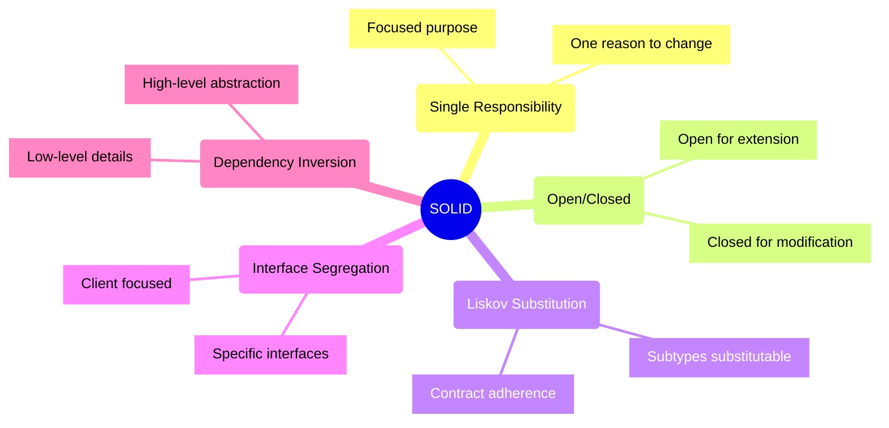
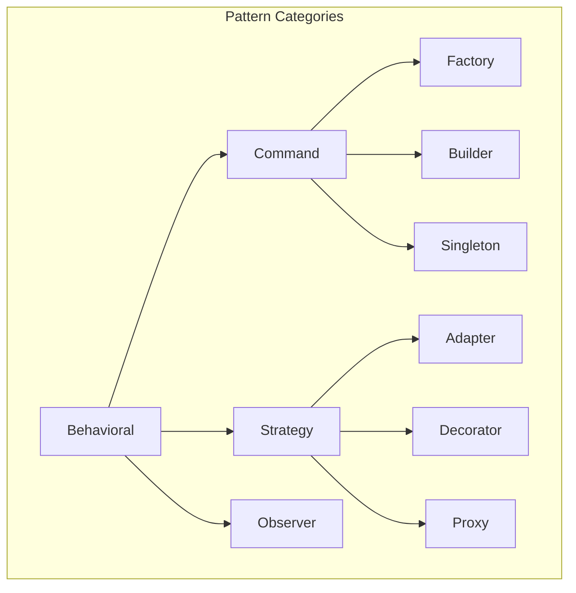
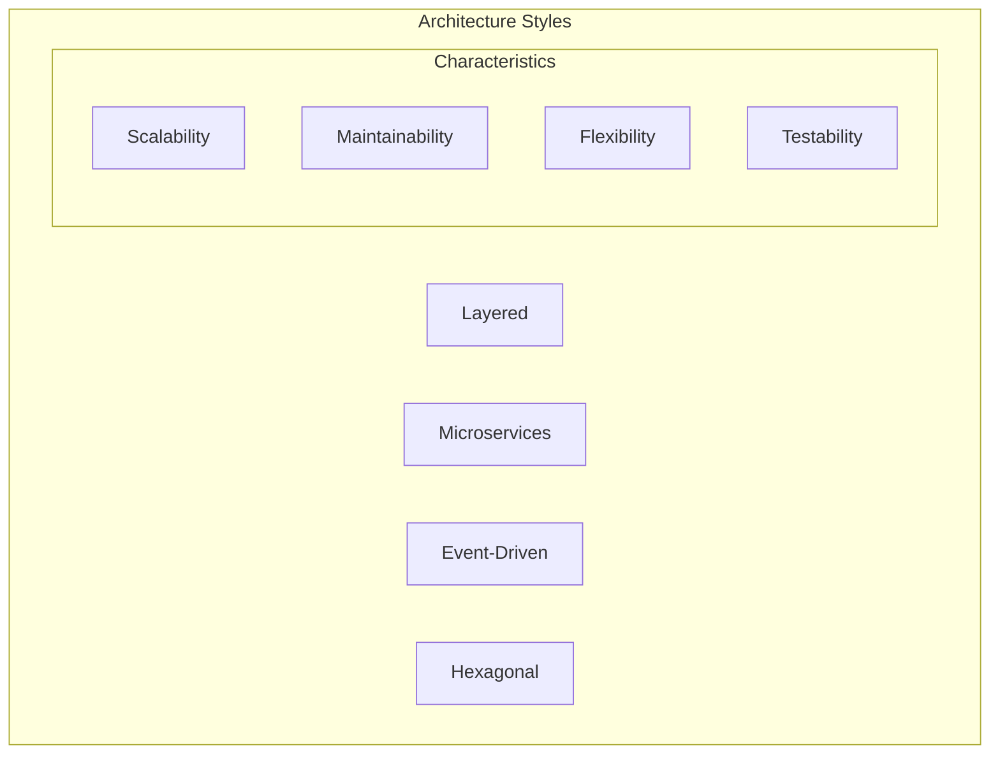
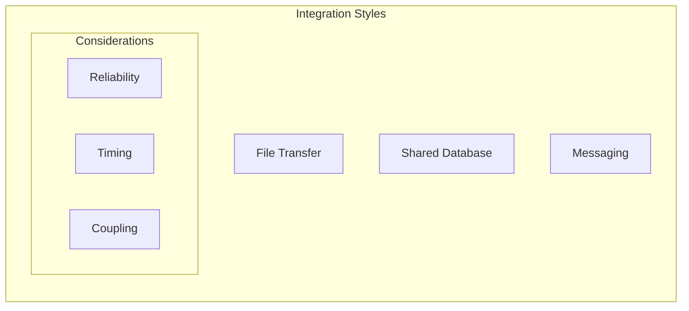
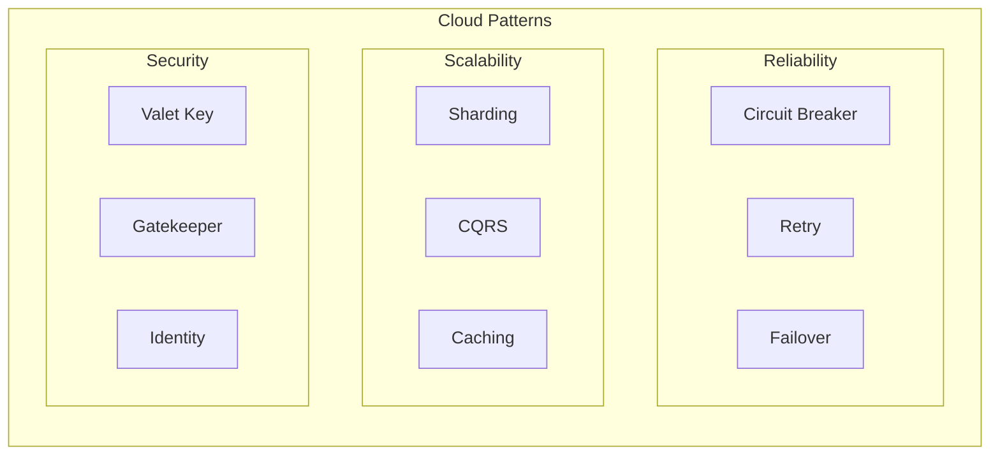
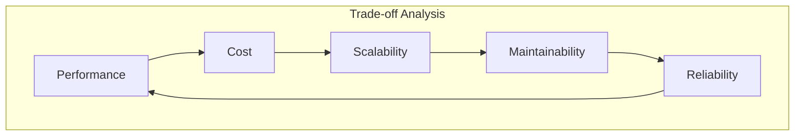
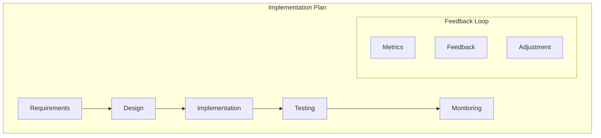

# System Design Principles and Patterns

## Design Principles

### 1. SOLID Principles



#### Essential Examples

1. **Single Responsibility**
```typescript
// Good: Each class has one responsibility
class UserAuthentication {
    authenticate(credentials: Credentials): boolean;
}

class UserProfile {
    updateProfile(data: ProfileData): void;
}

// Bad: Class does too many things
class User {
    authenticate(): boolean;
    updateProfile(): void;
    sendEmail(): void;
    generateReport(): void;
}
```

2. **Open/Closed**
```typescript
// Good: Open for extension, closed for modification
interface PaymentProcessor {
    process(payment: Payment): void;
}

class CreditCardProcessor implements PaymentProcessor {
    process(payment: Payment): void;
}

class PayPalProcessor implements PaymentProcessor {
    process(payment: Payment): void;
}
```

3. **Liskov Substitution**
```typescript
// Good: Square is a proper subtype of Rectangle
interface Shape {
    getArea(): number;
}

class Rectangle implements Shape {
    constructor(protected width: number, protected height: number) {}
    getArea(): number { return this.width * this.height; }
}

class Square implements Shape {
    constructor(protected size: number) {}
    getArea(): number { return this.size * this.size; }
}
```

### 2. Design Patterns



#### Pattern Selection Framework
| Pattern | Use Case | Benefits | Trade-offs |
|---------|----------|----------|------------|
| Factory | Object Creation | Encapsulation | Complexity |
| Singleton | Shared Resource | Single Instance | Global State |
| Observer | Event Handling | Loose Coupling | Memory Leaks |
| Strategy | Algorithm Variation | Flexibility | Class Explosion |

### 3. Architectural Patterns



#### Pattern Comparison
1. **Layered Architecture**
   - Clear separation
   - Easy to understand
   - Traditional approach
   - Potential tight coupling

2. **Microservices**
   - Service independence
   - Technology diversity
   - Scalability
   - Operational complexity

3. **Event-Driven**
   - Loose coupling
   - Scalability
   - Asynchronous
   - Complex debugging

4. **Hexagonal/Ports & Adapters**
   - Business logic isolation
   - External dependency separation
   - Testing flexibility
   - Additional abstractions

### 4. Integration Patterns



#### Pattern Selection
| Style | Synchronicity | Coupling | Reliability |
|-------|--------------|----------|-------------|
| File | Async | Low | High |
| Database | Sync | High | Medium |
| RPC | Sync | Medium | Medium |
| Message | Async | Low | High |

### 5. Cloud Patterns



## Design Decision Framework

### 1. Analysis Checklist
- [ ] Business requirements
- [ ] Technical constraints
- [ ] Team capabilities
- [ ] Time constraints
- [ ] Cost implications
- [ ] Maintenance needs

### 2. Trade-off Analysis


### 3. Quality Attributes
1. **Performance**
   - Response time
   - Throughput
   - Resource usage
   - Latency

2. **Scalability**
   - Vertical scaling
   - Horizontal scaling
   - Load distribution
   - Data partitioning

3. **Reliability**
   - Fault tolerance
   - Error handling
   - Data consistency
   - Recovery

4. **Security**
   - Authentication
   - Authorization
   - Data protection
   - Audit trails

### 4. Implementation Strategy



Remember: System design should balance immediate needs with long-term maintainability and evolution.