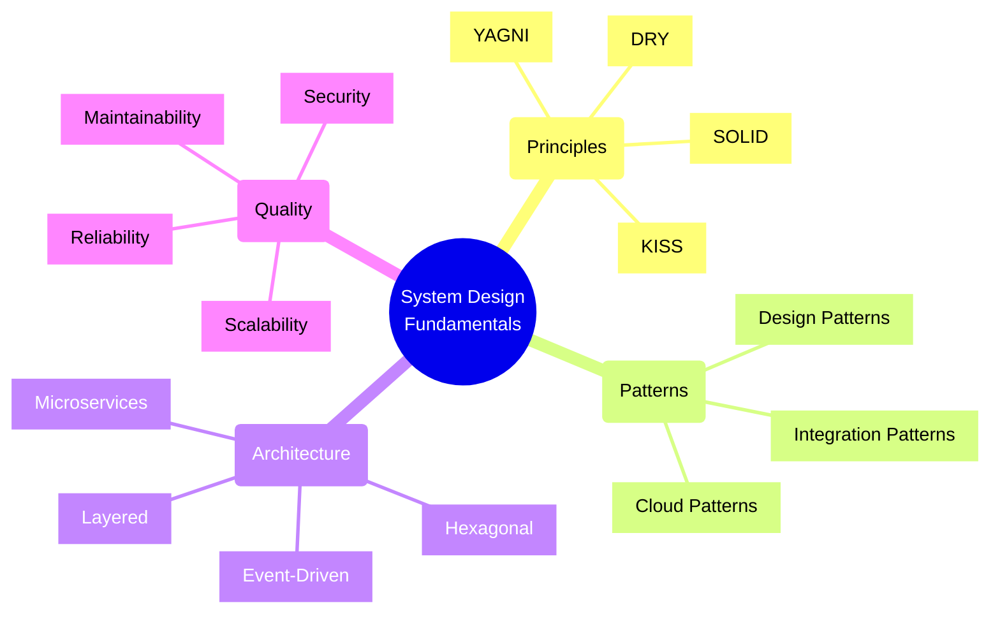
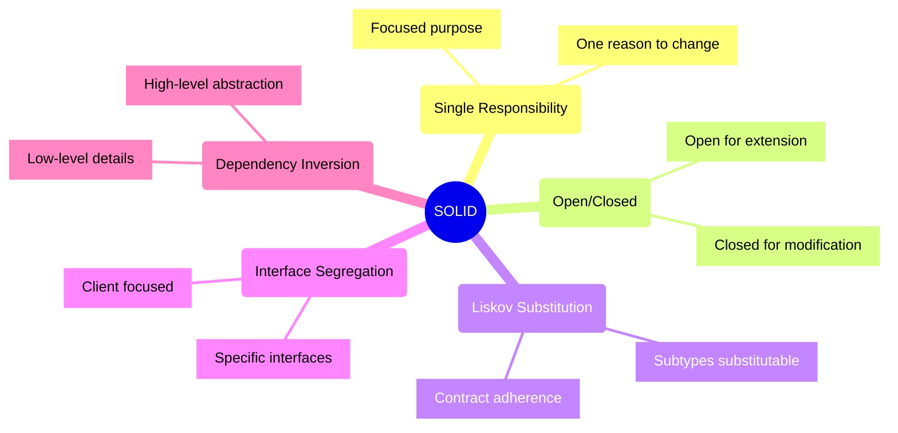
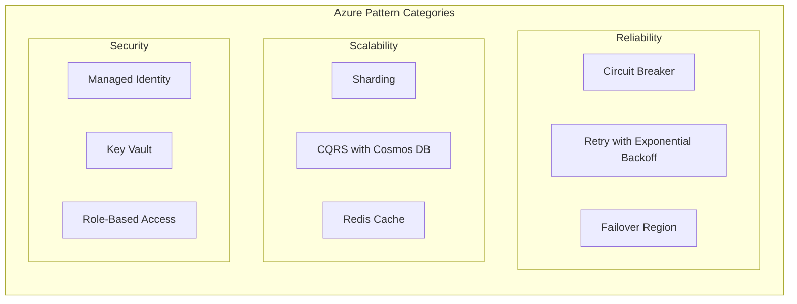
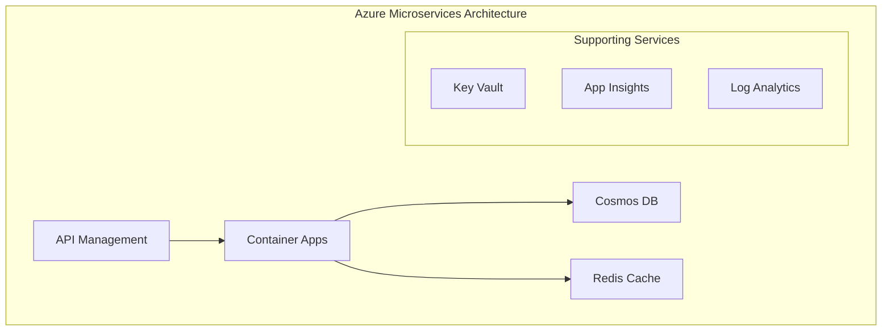
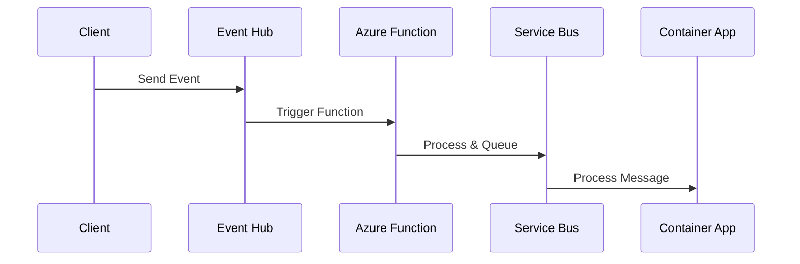
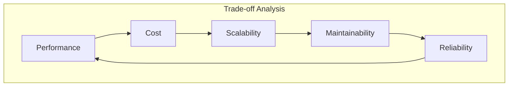
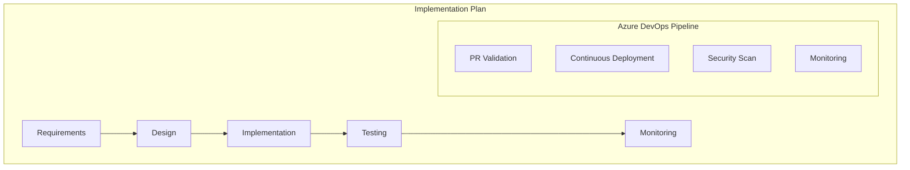

# System Design Principles and Patterns

## Core Concepts Overview



## Design Principles

### 1. SOLID Principles



#### Azure Implementation Examples

1. **Single Responsibility**
```typescript
// Good: Each class has one responsibility
class AzureKeyVaultSecretManager {
    constructor(private keyVaultClient: KeyVaultClient) {}
    
    async getSecret(secretName: string): Promise<string> {
        return await this.keyVaultClient.getSecret(secretName);
    }
}

class AzureStorageManager {
    constructor(private blobServiceClient: BlobServiceClient) {}
    
    async uploadBlob(containerName: string, blobName: string, data: Buffer): Promise<void> {
        const containerClient = this.blobServiceClient.getContainerClient(containerName);
        await containerClient.uploadBlob(blobName, data);
    }
}

// Bad: Mixed responsibilities
class AzureResourceManager {
    async getSecret(secretName: string): Promise<string> { /* ... */ }
    async uploadBlob(containerName: string, data: Buffer): Promise<void> { /* ... */ }
    async createVirtualMachine(vmName: string): Promise<void> { /* ... */ }
    async sendEmail(to: string, subject: string): Promise<void> { /* ... */ }
}
```

2. **Open/Closed**
```typescript
// Good: Open for extension with different Azure storage types
interface CloudStorageProvider {
    uploadFile(path: string, data: Buffer): Promise<void>;
    downloadFile(path: string): Promise<Buffer>;
}

class AzureBlobStorage implements CloudStorageProvider {
    // Implementation for Azure Blob Storage
}

class AzureFileStorage implements CloudStorageProvider {
    // Implementation for Azure File Storage
}

class AzureDataLakeStorage implements CloudStorageProvider {
    // Implementation for Azure Data Lake Storage
}
```

### 2. Azure Cloud Design Patterns



#### Implementation Checklist
- [ ] Use Managed Identities instead of connection strings/keys
- [ ] Implement retry patterns with exponential backoff
- [ ] Enable monitoring and diagnostics
- [ ] Configure appropriate RBAC roles
- [ ] Use Key Vault for secrets
- [ ] Enable encryption at rest and in transit
- [ ] Implement proper error handling
- [ ] Set up proper logging and monitoring

### 3. Azure Architecture Patterns

#### Microservices on Azure


#### Event-Driven Architecture on Azure


## Implementation Best Practices

### 1. Security
- Use Managed Identities for authentication
- Implement proper RBAC
- Store secrets in Key Vault
- Enable encryption at rest and in transit
- Implement network security groups
- Use Private Endpoints where possible

### 2. Scalability
- Implement auto-scaling
- Use caching strategically
- Design for horizontal scaling
- Implement proper data partitioning
- Use message queues for decoupling

### 3. Reliability
- Implement retry patterns
- Use multiple regions
- Implement circuit breakers
- Set up proper monitoring
- Design for failure

### 4. Cost Optimization
- Right-size resources
- Implement auto-scaling
- Use appropriate pricing tiers
- Monitor resource usage
- Implement proper tagging

## Design Decision Framework

### 1. Analysis Checklist
- [ ] Business requirements
- [ ] Technical constraints
- [ ] Team capabilities
- [ ] Time constraints
- [ ] Cost implications
- [ ] Maintenance needs
- [ ] Security requirements
- [ ] Compliance needs

### 2. Trade-off Analysis


### 3. Implementation Strategy



Remember: 
- Start with a clear understanding of requirements
- Choose patterns that solve specific problems
- Consider trade-offs in your design decisions
- Plan for future scalability and maintenance
- Always follow security best practices
- Monitor and measure system performance
- Document your design decisions and rationale