# System Design Principles and Patterns

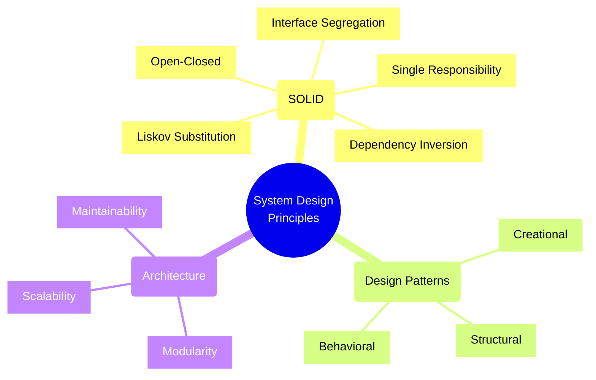

## Design Principles

### 1. SOLID Principles

**Single Responsibility Principle (SRP)**
* Definition: A class/module should have only one reason to change
* Example:
  ```
  // Good example
  class UserAuthenticator {
      authenticate(credentials) { /* ... */ }
  }
  class UserProfileManager {
      updateProfile(data) { /* ... */ }
  }

  // Bad example
  class User {
      authenticate() { /* ... */ }
      updateProfile() { /* ... */ }
      sendEmail() { /* ... */ }
  }
  ```

**Open/Closed Principle**
* Definition: Software entities should be open for extension but closed for modification
* Example: Using interfaces for payment methods
  ```
  interface PaymentProcessor {
      process(amount: number): void;
  }

  class CreditCardPayment implements PaymentProcessor {
      process(amount: number) { /* ... */ }
  }

  class PayPalPayment implements PaymentProcessor {
      process(amount: number) { /* ... */ }
  }
  ```

**Liskov Substitution Principle**
* Definition: Objects should be replaceable with their subtypes without affecting program correctness
* Example: Shape hierarchy
  ```
  class Rectangle {
      setWidth(w: number): void
      setHeight(h: number): void
      getArea(): number
  }

  class Square extends Rectangle {
      // Must maintain the rectangle contract
  }
  ```

**Interface Segregation Principle**
* Definition: Clients shouldn't be forced to depend on interfaces they don't use
* Example:
  ```
  // Bad
  interface Worker {
      work(): void;
      eat(): void;
  }

  // Good
  interface Workable {
      work(): void;
  }
  interface Eatable {
      eat(): void;
  }
  ```

**Dependency Inversion Principle**
* Definition: High-level modules shouldn't depend on low-level modules; both should depend on abstractions
* Example:
  ```
  // High-level module depending on abstraction
  class NotificationService {
      constructor(private messenger: IMessenger) {}
  }

  interface IMessenger {
      send(message: string): void;
  }

  // Low-level modules implementing abstraction
  class EmailMessenger implements IMessenger {}
  class SMSMessenger implements IMessenger {}
  ```

### 2. Other Key Principles

**DRY (Don't Repeat Yourself)**
* Definition: Avoid code duplication by extracting common functionality
* Example: Creating reusable utility functions
  ```
  // Instead of repeating validation
  function validateEmail(email: string): boolean {
      return /^[^\s@]+@[^\s@]+\.[^\s@]+$/.test(email);
  }
  ```

**KISS (Keep It Simple, Stupid)**
* Definition: Systems work best when kept simple
* Example: Using simple REST APIs over complex GraphQL when basic CRUD is sufficient

**YAGNI (You Aren't Gonna Need It)**
* Definition: Don't add functionality until it's necessary
* Example: Not implementing caching until performance metrics show it's needed

## Design Patterns

### 1. Creational Patterns

**Singleton Pattern**
* Purpose: Ensure a class has only one instance
* Example:
  ```typescript
  class DatabaseConnection {
      private static instance: DatabaseConnection;
      
      private constructor() {}
      
      public static getInstance(): DatabaseConnection {
          if (!DatabaseConnection.instance) {
              DatabaseConnection.instance = new DatabaseConnection();
          }
          return DatabaseConnection.instance;
      }
  }
  ```

**Factory Pattern**
* Purpose: Create objects without exposing creation logic
* Example:
  ```typescript
  interface Animal { speak(): void; }
  
  class Dog implements Animal {
      speak() { console.log('Woof!'); }
  }
  
  class Cat implements Animal {
      speak() { console.log('Meow!'); }
  }
  
  class AnimalFactory {
      createAnimal(type: string): Animal {
          switch(type) {
              case 'dog': return new Dog();
              case 'cat': return new Cat();
              default: throw new Error('Unknown animal type');
          }
      }
  }
  ```

### 2. Structural Patterns

**Adapter Pattern**
* Purpose: Allow incompatible interfaces to work together
* Example:
  ```typescript
  interface ModernPaymentGateway {
      processPayment(amount: number): void;
  }

  class LegacyPaymentSystem {
      oldProcessPayment(sum: number, currency: string): void {}
  }

  class PaymentAdapter implements ModernPaymentGateway {
      constructor(private legacySystem: LegacyPaymentSystem) {}
      
      processPayment(amount: number): void {
          this.legacySystem.oldProcessPayment(amount, 'USD');
      }
  }
  ```

### 3. Behavioral Patterns

**Observer Pattern**
* Purpose: Define one-to-many dependency between objects
* Example:
  ```typescript
  interface Observer {
      update(data: any): void;
  }

  class NewsAgency {
      private observers: Observer[] = [];
      
      attach(observer: Observer): void {
          this.observers.push(observer);
      }
      
      notifyObservers(news: string): void {
          this.observers.forEach(observer => observer.update(news));
      }
  }
  ```

### 4. Architectural Patterns

**Microservices Pattern**
* Purpose: Build application as suite of small services
* Example: E-commerce system split into:
  - User Service (authentication/profiles)
  - Product Service (catalog/inventory)
  - Order Service (order processing)
  - Payment Service (payment processing)

**Event-Driven Architecture**
* Purpose: Design systems around production, detection, and reaction to events
* Example:
  ```typescript
  interface EventBus {
      publish(event: string, data: any): void;
      subscribe(event: string, callback: (data: any) => void): void;
  }

  class OrderService {
      constructor(private eventBus: EventBus) {
          this.eventBus.subscribe('OrderPlaced', this.handleOrderPlaced);
      }
  }
  ```

### 5. Cloud Patterns

**Circuit Breaker Pattern**
* Purpose: Prevent system failure cascade
* Example:
  ```typescript
  class CircuitBreaker {
      private failures = 0;
      private threshold = 5;
      private state: 'CLOSED' | 'OPEN' = 'CLOSED';

      async call(fn: () => Promise<any>) {
          if (this.state === 'OPEN') {
              throw new Error('Circuit is OPEN');
          }

          try {
              const result = await fn();
              this.failures = 0;
              return result;
          } catch (error) {
              this.failures++;
              if (this.failures >= this.threshold) {
                  this.state = 'OPEN';
              }
              throw error;
          }
      }
  }
  ```

**Retry Pattern**
* Purpose: Handle transient failures
* Example:
  ```typescript
  async function withRetry<T>(
      fn: () => Promise<T>,
      maxAttempts: number = 3
  ): Promise<T> {
      let lastError: Error;
      
      for (let attempt = 1; attempt <= maxAttempts; attempt++) {
          try {
              return await fn();
          } catch (error) {
              lastError = error;
              await new Promise(resolve => 
                  setTimeout(resolve, Math.pow(2, attempt) * 1000)
              );
          }
      }
      
      throw lastError;
  }
  ```

## Design Patterns Overview

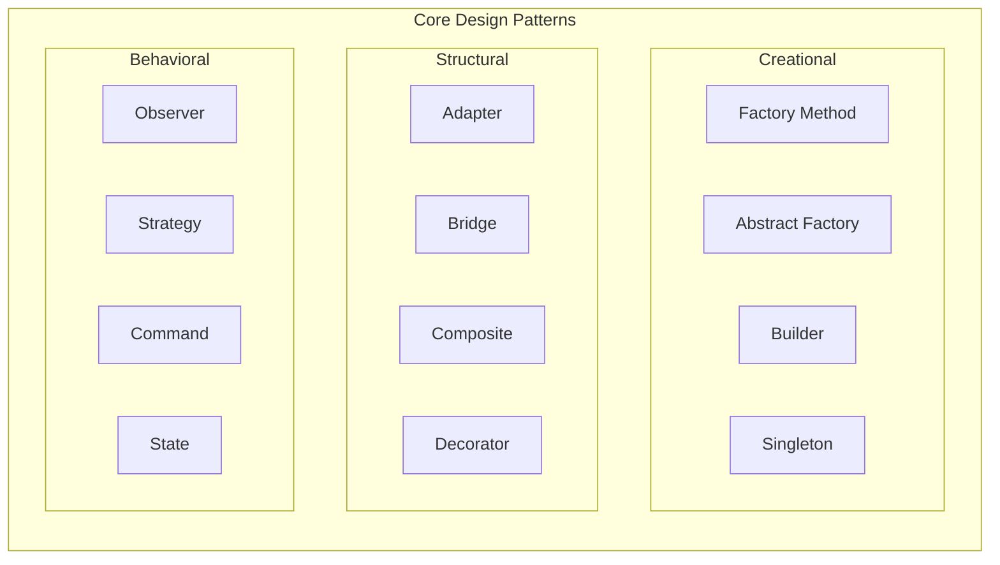

## Common Architecture Patterns

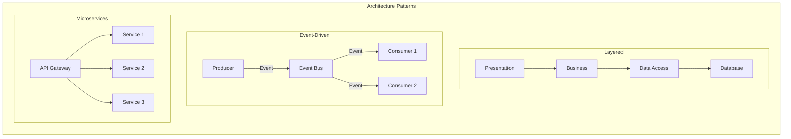

## Architectural Decision Framework

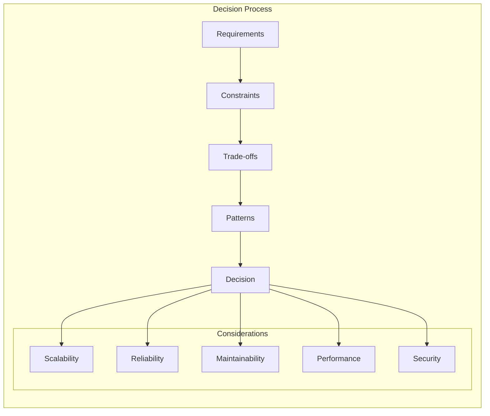

## System Quality Attributes

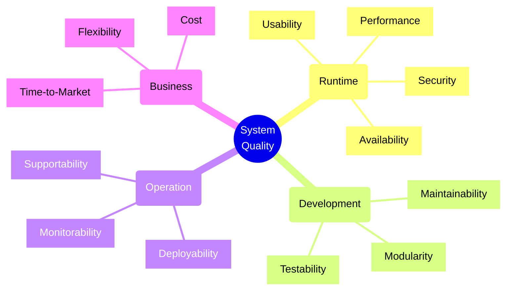

## Component Interaction Patterns

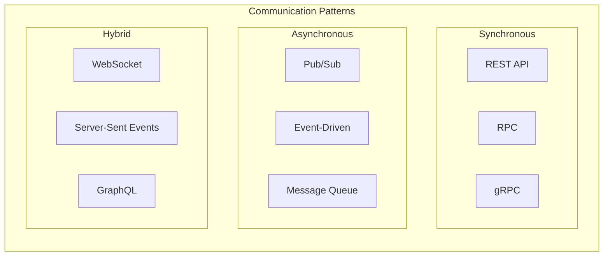

## System Design Process

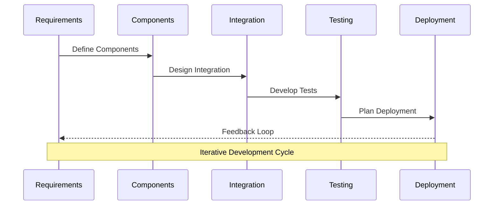

## Architectural Decision Process

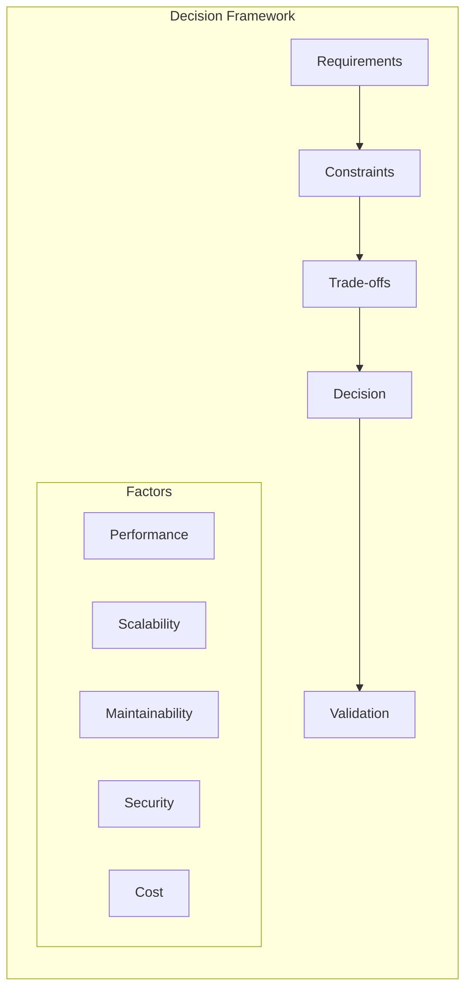

## Architecture Quality Attributes

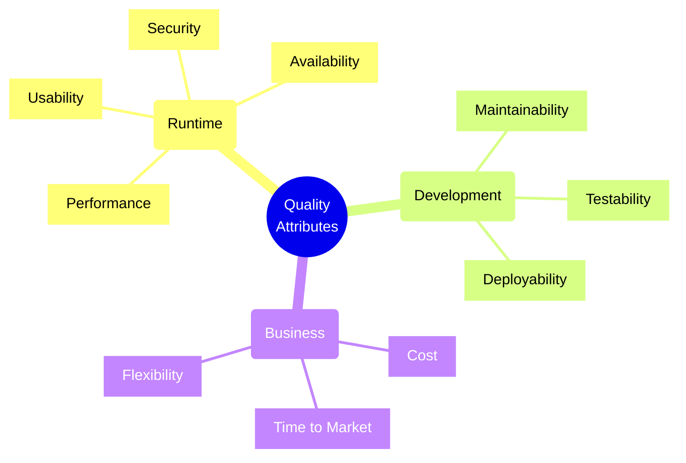

## Pattern Selection Guide

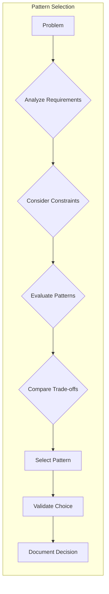

## Best Practices for Implementation

1. **Start with Principles**
   * Begin with SOLID principles as foundation
   * Apply patterns only when they solve specific problems

2. **Pattern Selection Criteria**
   * Problem fit
   * Maintenance complexity
   * Team expertise
   * Performance implications
   * Scalability requirements

3. **Common Pitfalls to Avoid**
   * Over-engineering
   * Pattern obsession
   * Premature optimization
   * Ignoring context

4. **Documentation Requirements**
   * Pattern usage justification
   * Trade-off analysis
   * Implementation details
   * Maintenance considerations

Remember: Patterns are solutions to common problems. Don't force them where they're not needed. Always consider the specific context and requirements of your system.

## Azure Implementation Patterns

For detailed implementation of Azure-specific high availability patterns and strategies, refer to the [High Availability Design](High_Availability_Design.md) document which covers:
- Detailed Azure Service SLAs
- Zone-to-Zone disaster recovery patterns
- Regional high availability implementations
- Azure-specific monitoring strategies

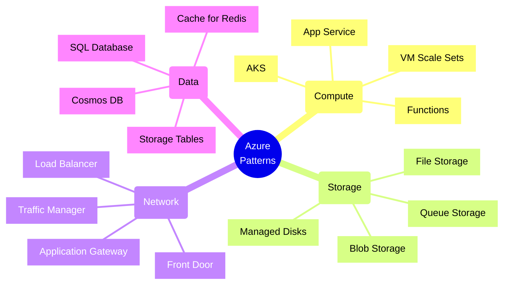

### 1. Scalability Patterns

```bicep
// VM Scale Set with Custom Scale Rules
resource vmss 'Microsoft.Compute/virtualMachineScaleSets@2021-07-01' = {
  name: 'app-vmss'
  location: location
  sku: {
    name: 'Standard_DS2_v2'
    tier: 'Standard'
    capacity: 2
  }
  properties: {
    upgradePolicy: {
      mode: 'Automatic'
    }
    automaticRepairsPolicy: {
      enabled: true
      gracePeriod: 'PT30M'
    }
    scaleInPolicy: {
      rules: ['Default']
    }
  }
}

// Auto-scale Settings
resource autoScaleSettings 'Microsoft.Insights/autoscalesettings@2021-05-01-preview' = {
  name: 'auto-scale-config'
  location: location
  properties: {
    targetResourceUri: vmss.id
    enabled: true
    profiles: [
      {
        name: 'Default'
        capacity: {
          minimum: '2'
          maximum: '10'
          default: '2'
        }
        rules: [
          {
            metricTrigger: {
              metricName: 'Percentage CPU'
              metricNamespace: 'microsoft.compute/virtualmachinescalesets'
              metricResourceUri: vmss.id
              timeGrain: 'PT1M'
              statistic: 'Average'
              timeWindow: 'PT10M'
              timeAggregation: 'Average'
              operator: 'GreaterThan'
              threshold: 75
            }
            scaleAction: {
              direction: 'Increase'
              type: 'ChangeCount'
              value: '1'
              cooldown: 'PT5M'
            }
          }
        ]
      }
    ]
  }
}
```

### 2. Reliability Patterns

#### Circuit Breaker with Azure Functions

```typescript
import { AzureFunction, Context } from "@azure/functions";
import { CircuitBreakerState, CircuitBreaker } from "./circuitBreaker";

const circuitBreaker = new CircuitBreaker({
    failureThreshold: 5,
    resetTimeout: 60000,
    monitorInterval: 10000
});

const httpTrigger: AzureFunction = async function (context: Context): Promise<void> {
    try {
        const result = await circuitBreaker.execute(async () => {
            // Call downstream service
            const response = await fetch("https://api.example.com/data");
            if (!response.ok) throw new Error(`HTTP error: ${response.status}`);
            return response.json();
        });

        context.res = {
            status: 200,
            body: result
        };
    } catch (error) {
        if (error instanceof CircuitBreakerError) {
            context.res = {
                status: 503,
                body: "Service temporarily unavailable"
            };
        } else {
            context.res = {
                status: 500,
                body: "Internal server error"
            };
        }
    }
};
```

### 3. Data Consistency Patterns

#### Cosmos DB Multi-Region Writes

```typescript
import { CosmosClient } from "@azure/cosmos";

const client = new CosmosClient({
    endpoint: process.env.COSMOS_ENDPOINT,
    key: process.env.COSMOS_KEY,
    connectionPolicy: {
        preferredLocations: ["East US", "West US"]
    }
});

async function performGlobalTransaction(): Promise<void> {
    const container = client.database("mydb").container("orders");
    
    try {
        const { resource: txnBatch } = await container.items.createTransaction();
        
        await txnBatch.createItem({
            id: "order1",
            type: "order",
            region: "East US",
            // ... other properties
        });
        
        await txnBatch.createItem({
            id: "inventory1",
            type: "inventory",
            region: "West US",
            // ... other properties
        });
        
        await txnBatch.commit();
    } catch (error) {
        // Handle transactional failures
        console.error("Transaction failed:", error);
        throw error;
    }
}
```

### 4. Monitoring Pattern

```yaml
# Application Insights Web Test
resource "azurerm_application_insights_web_test" "example" {
  name                    = "ha-webtest"
  location               = azurerm_resource_group.example.location
  resource_group_name    = azurerm_resource_group.example.name
  application_insights_id = azurerm_application_insights.example.id
  kind                   = "ping"
  frequency              = 300
  timeout                = 30
  enabled                = true
  geo_locations          = ["us-ca-sjc-azr", "us-tx-sn1-azr", "us-il-ch1-azr"]

  configuration = <<XML
<WebTest name="WebTest1" Enabled="True" Timeout="30" xmlns="http://microsoft.com/schemas/VisualStudio/TeamTest/2010">
    <Items>
        <Request Method="GET" Version="1.1" Url="https://www.myapp.com/health" ThinkTime="0" Timeout="30" ParseDependentRequests="True" FollowRedirects="True" />
    </Items>
    <ValidationRules>
        <ValidationRule Classname="Microsoft.VisualStudio.TestTools.WebTesting.Rules.ValidationRuleFindText, Microsoft.VisualStudio.QualityTools.WebTestFramework, Version=10.0.0.0" DisplayName="Find Text">
            <RuleParameters>
                <RuleParameter Name="FindText" Value="healthy" />
                <RuleParameter Name="IgnoreCase" Value="True" />
                <RuleParameter Name="UseRegularExpression" Value="False" />
                <RuleParameter Name="PassIfTextFound" Value="True" />
            </RuleParameters>
        </ValidationRule>
    </ValidationRules>
</WebTest>
XML
}
```

## Pattern Selection Framework

When selecting patterns for Azure implementations, consider:

1. **Service Level Requirements**
   - Availability targets (99.9% to 99.999%)
   - Recovery time objectives (RTO)
   - Recovery point objectives (RPO)
   - Geographic distribution needs

2. **Operational Requirements**
   - Monitoring and alerting needs
   - Deployment frequency
   - Maintenance windows
   - Support requirements

3. **Technical Constraints**
   - Azure region availability
   - Service limits and quotas
   - Network latency requirements
   - Data residency requirements

4. **Cost Considerations**
   - Service tier pricing
   - Data transfer costs
   - Redundancy costs
   - Operational costs

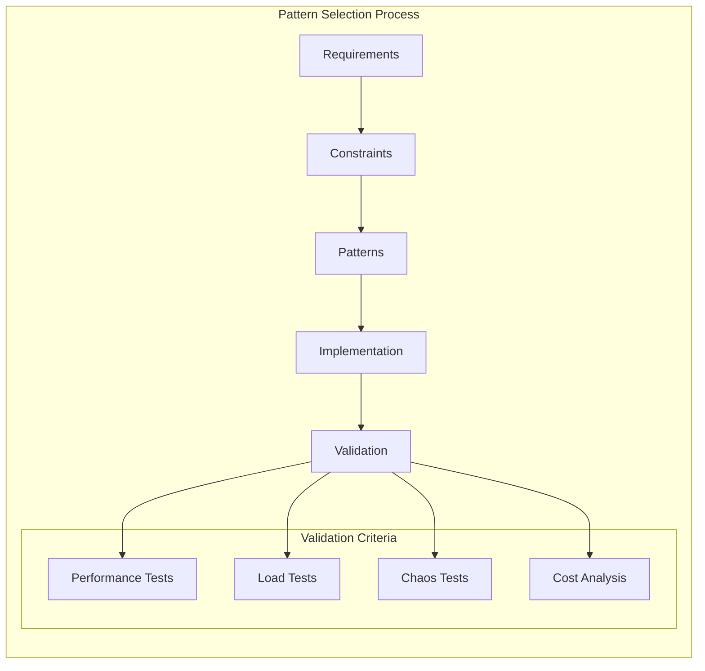

## Azure Implementation Best Practices

1. **Security Integration**
   - Use Managed Identities for authentication
   - Implement proper RBAC
   - Enable encryption at rest and in transit
   - Use Azure Key Vault for secrets

2. **Monitoring Implementation**
   - Configure Application Insights
   - Set up Log Analytics
   - Implement custom metrics
   - Create actionable alerts

3. **Cost Optimization**
   - Use appropriate service tiers
   - Implement auto-scaling
   - Monitor resource usage
   - Optimize data transfer

4. **Performance Tuning**
   - Use caching effectively
   - Implement CDN where appropriate
   - Optimize database queries
   - Monitor and adjust resource allocation

Remember: Design patterns should be selected based on specific requirements and constraints. Always validate pattern implementations through testing and monitoring to ensure they meet the desired objectives.