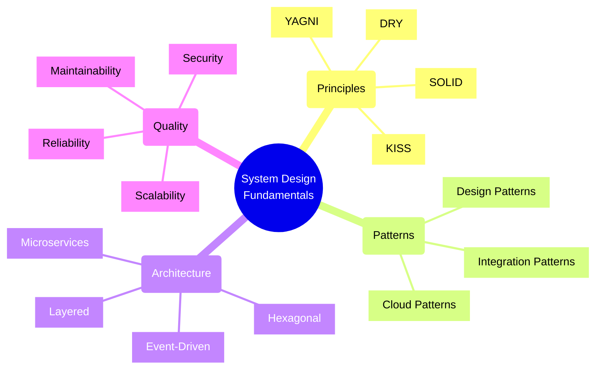
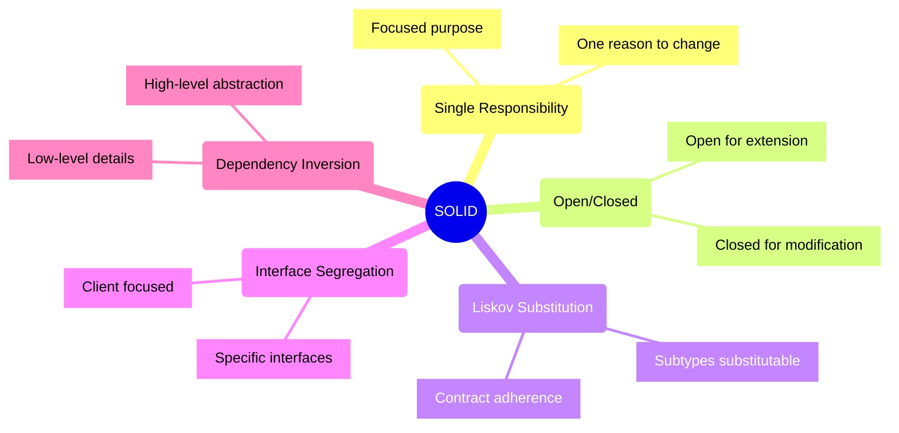
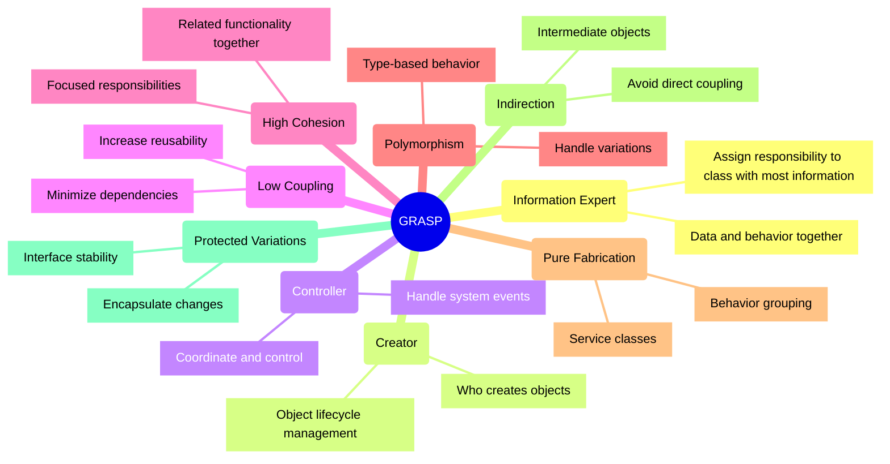
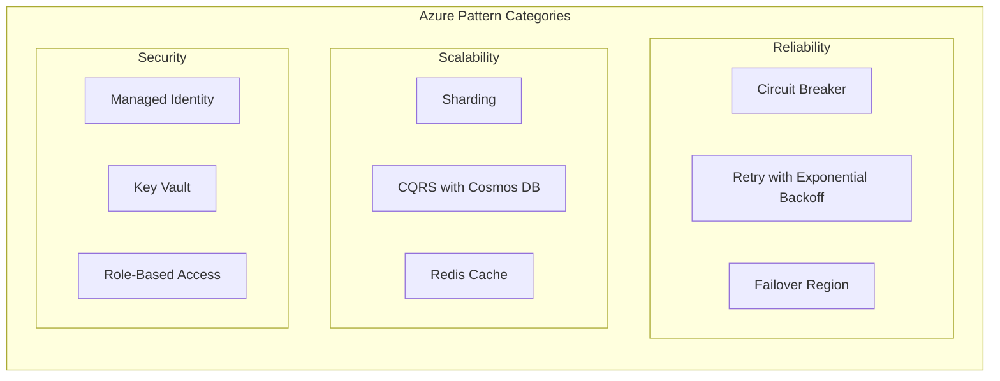
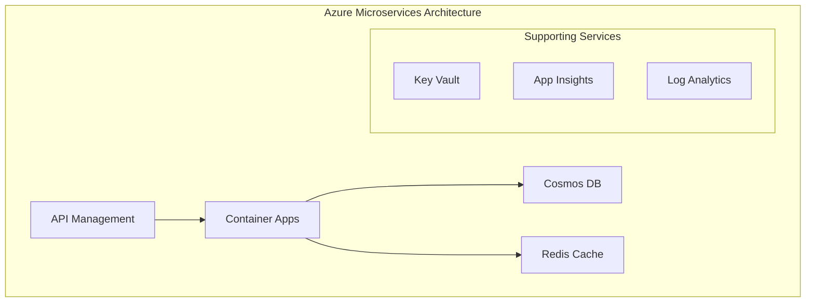
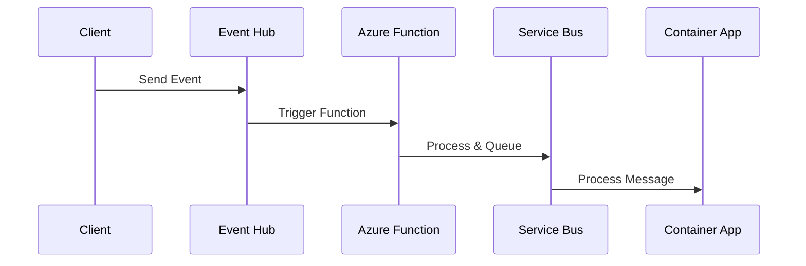
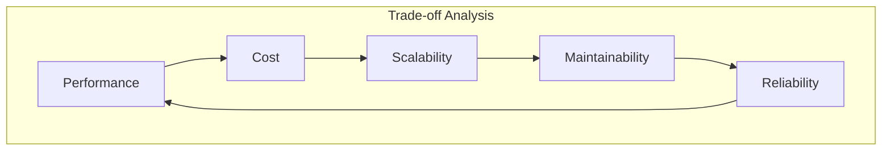
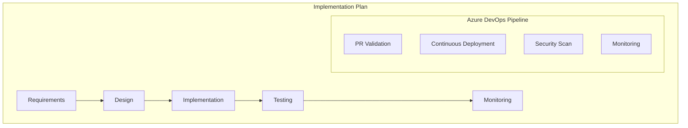

# System Design Principles and Patterns

## Core Concepts Overview



## Design Principles

### 1. SOLID Principles



#### Azure Implementation Examples

1. **Single Responsibility**
```typescript
// Good: Each class has one responsibility
class AzureKeyVaultSecretManager {
    constructor(private keyVaultClient: KeyVaultClient) {}
    
    async getSecret(secretName: string): Promise<string> {
        return await this.keyVaultClient.getSecret(secretName);
    }
}

class AzureStorageManager {
    constructor(private blobServiceClient: BlobServiceClient) {}
    
    async uploadBlob(containerName: string, blobName: string, data: Buffer): Promise<void> {
        const containerClient = this.blobServiceClient.getContainerClient(containerName);
        await containerClient.uploadBlob(blobName, data);
    }
}

// Bad: Mixed responsibilities
class AzureResourceManager {
    async getSecret(secretName: string): Promise<string> { /* ... */ }
    async uploadBlob(containerName: string, data: Buffer): Promise<void> { /* ... */ }
    async createVirtualMachine(vmName: string): Promise<void> { /* ... */ }
    async sendEmail(to: string, subject: string): Promise<void> { /* ... */ }
}
```

2. **Open/Closed**
```typescript
// Good: Open for extension with different Azure storage types
interface CloudStorageProvider {
    uploadFile(path: string, data: Buffer): Promise<void>;
    downloadFile(path: string): Promise<Buffer>;
}

class AzureBlobStorage implements CloudStorageProvider {
    // Implementation for Azure Blob Storage
}

class AzureFileStorage implements CloudStorageProvider {
    // Implementation for Azure File Storage
}

class AzureDataLakeStorage implements CloudStorageProvider {
    // Implementation for Azure Data Lake Storage
}
```

3. **Liskov Substitution**
```typescript
// Good: Derived classes can be substituted for base class
interface IStorageProvider {
    uploadFile(data: Buffer): Promise<string>;
    downloadFile(id: string): Promise<Buffer>;
    deleteFile(id: string): Promise<void>;
}

class AzureBlobStorageProvider implements IStorageProvider {
    async uploadFile(data: Buffer): Promise<string> {
        // Azure Blob specific implementation
        return blobId;
    }
    
    async downloadFile(id: string): Promise<Buffer> {
        // Azure Blob specific implementation
        return fileData;
    }
    
    async deleteFile(id: string): Promise<void> {
        // Azure Blob specific implementation
    }
}

class AzureFileShareProvider implements IStorageProvider {
    async uploadFile(data: Buffer): Promise<string> {
        // File Share specific implementation
        return fileId;
    }
    
    async downloadFile(id: string): Promise<Buffer> {
        // File Share specific implementation
        return fileData;
    }
    
    async deleteFile(id: string): Promise<void> {
        // File Share specific implementation
    }
}

// Both providers can be used interchangeably
function backupData(storage: IStorageProvider) {
    // Works with any storage provider
}
```

4. **Interface Segregation**
```typescript
// Good: Segregated interfaces for different Azure service functionalities
interface IAzureQueueOperations {
    enqueueMessage(message: string): Promise<void>;
    dequeueMessage(): Promise<string>;
}

interface IAzureTopicOperations {
    publishMessage(message: string): Promise<void>;
    subscribe(handler: (message: string) => void): Promise<void>;
}

interface IAzureDeadLetterOperations {
    processDeadLetters(): Promise<void>;
    moveToDeadLetter(messageId: string): Promise<void>;
}

// Services implement only what they need
class AzureServiceBusQueue implements IAzureQueueOperations {
    async enqueueMessage(message: string): Promise<void> {
        // Implementation
    }
    
    async dequeueMessage(): Promise<string> {
        // Implementation
        return message;
    }
}

class AzureServiceBusTopic implements IAzureTopicOperations {
    async publishMessage(message: string): Promise<void> {
        // Implementation
    }
    
    async subscribe(handler: (message: string) => void): Promise<void> {
        // Implementation
    }
}

// Bad: Fat interface that forces unnecessary implementations
interface IMessageBus {
    enqueueMessage(message: string): Promise<void>;
    dequeueMessage(): Promise<string>;
    publishMessage(message: string): Promise<void>;
    subscribe(handler: (message: string) => void): Promise<void>;
    processDeadLetters(): Promise<void>;
    moveToDeadLetter(messageId: string): Promise<void>;
}
```

5. **Dependency Inversion**
```typescript
// Good: High-level modules depend on abstractions
interface ILogger {
    log(message: string, level: string): Promise<void>;
}

interface IMetricsCollector {
    trackMetric(name: string, value: number): Promise<void>;
}

class AzureAppInsightsLogger implements ILogger {
    async log(message: string, level: string): Promise<void> {
        // Application Insights specific logging
    }
}

class AzureMonitorMetrics implements IMetricsCollector {
    async trackMetric(name: string, value: number): Promise<void> {
        // Azure Monitor specific metrics
    }
}

// High-level module depends on abstractions
class OrderProcessor {
    constructor(
        private logger: ILogger,
        private metrics: IMetricsCollector
    ) {}

    async processOrder(order: Order): Promise<void> {
        await this.logger.log(`Processing order ${order.id}`, 'info');
        // Process order
        await this.metrics.trackMetric('orders_processed', 1);
    }
}

// Configuration/DI setup
const logger = new AzureAppInsightsLogger();
const metrics = new AzureMonitorMetrics();
const processor = new OrderProcessor(logger, metrics);

// Bad: High-level module depends on concrete classes
class TightlyCoupledOrderProcessor {
    private logger = new AzureAppInsightsLogger();
    private metrics = new AzureMonitorMetrics();

    async processOrder(order: Order): Promise<void> {
        // Tightly coupled to specific implementations
    }
}
```

### 2. GRASP Principles


#### Azure Implementation Examples

1. **Information Expert & Creator**
```typescript
// Good: Storage account manager has the information needed to manage blobs
class AzureStorageAccountManager {
    constructor(private storageAccount: BlobServiceClient) {
        // Information Expert: Has all storage account details
    }

    // Creator: Creates container clients as it has the necessary information
    async createContainer(containerName: string): Promise<ContainerClient> {
        const containerClient = this.storageAccount.getContainerClient(containerName);
        await containerClient.create();
        return containerClient;
    }
}
```

2. **Controller & Low Coupling**
```typescript
// Controller pattern in Azure Function
class OrderProcessingController {
    constructor(
        private orderService: OrderService,
        private storageService: AzureStorageService,
        private notificationService: NotificationService
    ) {}

    // Controller coordinates the flow but delegates actual work
    async processOrder(order: Order): Promise<void> {
        await this.orderService.validateOrder(order);
        await this.storageService.saveOrder(order);
        await this.notificationService.notifyCustomer(order);
    }
}
```

3. **High Cohesion & Protected Variations**
```typescript
// High Cohesion: Interface focuses on a single aspect
interface MessageQueueClient {
    sendMessage(message: any): Promise<void>;
    receiveMessage(): Promise<any>;
}

// Protected Variations: Different implementations behind same interface
class ServiceBusQueueClient implements MessageQueueClient {
    // Implementation for Azure Service Bus
}

class EventHubClient implements MessageQueueClient {
    // Implementation for Azure Event Hub
}
```

4. **Polymorphism & Indirection**
```typescript
// Polymorphism with Azure Storage options
interface CloudStorage {
    store(data: Buffer): Promise<string>;
    retrieve(id: string): Promise<Buffer>;
}

class AzureBlobStorage implements CloudStorage {
    async store(data: Buffer): Promise<string> {
        // Blob storage specific implementation
    }
    
    async retrieve(id: string): Promise<Buffer> {
        // Blob storage specific implementation
    }
}

class AzureFileShare implements CloudStorage {
    async store(data: Buffer): Promise<string> {
        // File share specific implementation
    }
    
    async retrieve(id: string): Promise<Buffer> {
        // File share specific implementation
    }
}
```

### 3. Azure Cloud Design Patterns



#### Implementation Checklist
- [ ] Use Managed Identities instead of connection strings/keys
- [ ] Implement retry patterns with exponential backoff
- [ ] Enable monitoring and diagnostics
- [ ] Configure appropriate RBAC roles
- [ ] Use Key Vault for secrets
- [ ] Enable encryption at rest and in transit
- [ ] Implement proper error handling
- [ ] Set up proper logging and monitoring

### 3. Azure Architecture Patterns

#### Microservices on Azure


#### Event-Driven Architecture on Azure


## Implementation Best Practices

### 1. Security
- Use Managed Identities for authentication
- Implement proper RBAC
- Store secrets in Key Vault
- Enable encryption at rest and in transit
- Implement network security groups
- Use Private Endpoints where possible

### 2. Scalability
- Implement auto-scaling
- Use caching strategically
- Design for horizontal scaling
- Implement proper data partitioning
- Use message queues for decoupling

### 3. Reliability
- Implement retry patterns
- Use multiple regions
- Implement circuit breakers
- Set up proper monitoring
- Design for failure

### 4. Cost Optimization
- Right-size resources
- Implement auto-scaling
- Use appropriate pricing tiers
- Monitor resource usage
- Implement proper tagging

## Design Decision Framework

### 1. Analysis Checklist
- [ ] Business requirements
- [ ] Technical constraints
- [ ] Team capabilities
- [ ] Time constraints
- [ ] Cost implications
- [ ] Maintenance needs
- [ ] Security requirements
- [ ] Compliance needs

### 2. Trade-off Analysis


### 3. Implementation Strategy



Remember: 
- Start with a clear understanding of requirements
- Choose patterns that solve specific problems
- Consider trade-offs in your design decisions
- Plan for future scalability and maintenance
- Always follow security best practices
- Monitor and measure system performance
- Document your design decisions and rationale
