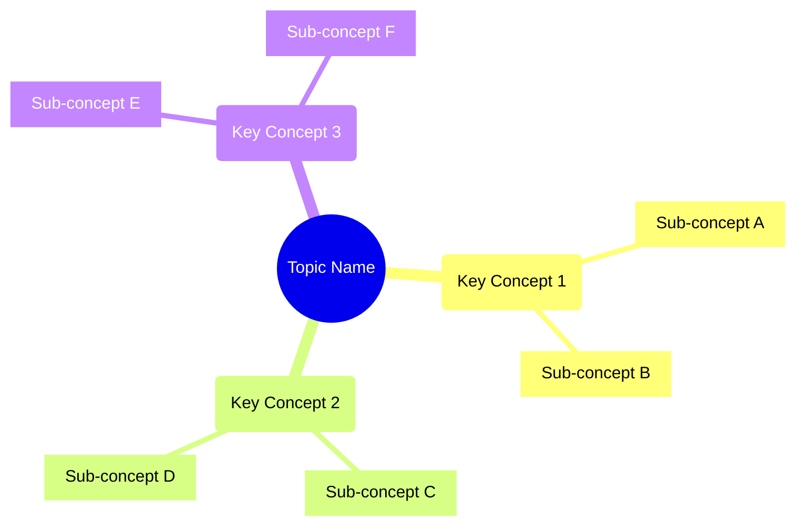

# Title of the Topic

## Overview
A brief introduction to the topic and its importance in software architecture.



## Problem it Solves
- Clear description of the problems this architectural concept addresses
- Business scenarios where this is applicable
- Common challenges it helps overcome

## Core Concepts
1. **Concept One**
   - Definition
   - Key characteristics
   - When to use

2. **Concept Two**
   - Definition
   - Key characteristics
   - When to use

## Implementation Considerations
### Architecture Impact
- How it affects overall system architecture
- Integration points to consider
- Dependencies and requirements

### Performance Implications
- Impact on system performance
- Scalability considerations
- Resource requirements

### Security Considerations
- Security implications
- Risk factors
- Mitigation strategies

## Best Practices
1. **Best Practice One**
   - Description
   - Implementation tips
   - Examples

2. **Best Practice Two**
   - Description
   - Implementation tips
   - Examples

## Common Pitfalls
1. **Pitfall One**
   - Description
   - Warning signs
   - How to avoid

2. **Pitfall Two**
   - Description
   - Warning signs
   - How to avoid

## Implementation Examples

### Example 1: [Scenario Name]
```[language]
// Code example or configuration
```

### Example 2: [Scenario Name]
```[language]
// Code example or configuration
```

## Trade-offs Analysis

### Advantages
- Advantage 1
- Advantage 2
- Advantage 3

### Disadvantages
- Disadvantage 1
- Disadvantage 2
- Disadvantage 3

## Real-world Use Cases
1. **Use Case One**
   - Context
   - Implementation approach
   - Results and lessons learned

2. **Use Case Two**
   - Context
   - Implementation approach
   - Results and lessons learned

## Tools and Technologies
### Popular Tools
1. Tool One
   - Key features
   - Use cases
   - Installation/Setup

2. Tool Two
   - Key features
   - Use cases
   - Installation/Setup

## Monitoring and Maintenance
- Key metrics to monitor
- Maintenance considerations
- Troubleshooting guidelines

## Future Considerations
- Emerging trends
- Potential changes
- Areas of evolution

## References
- [Reference 1 Title](url)
- [Reference 2 Title](url)
- [Reference 3 Title](url)

## Related Topics
- [Related Topic 1](../src/Related_Topic_1.md)
- [Related Topic 2](../src/Related_Topic_2.md)
- [Related Topic 3](../src/Related_Topic_3.md)

## Checklist
Before implementing this pattern/concept, ensure:
- [ ] Requirement 1 is met
- [ ] Requirement 2 is considered
- [ ] Requirement 3 is validated

## Glossary
- **Term 1**: Definition
- **Term 2**: Definition
- **Term 3**: Definition