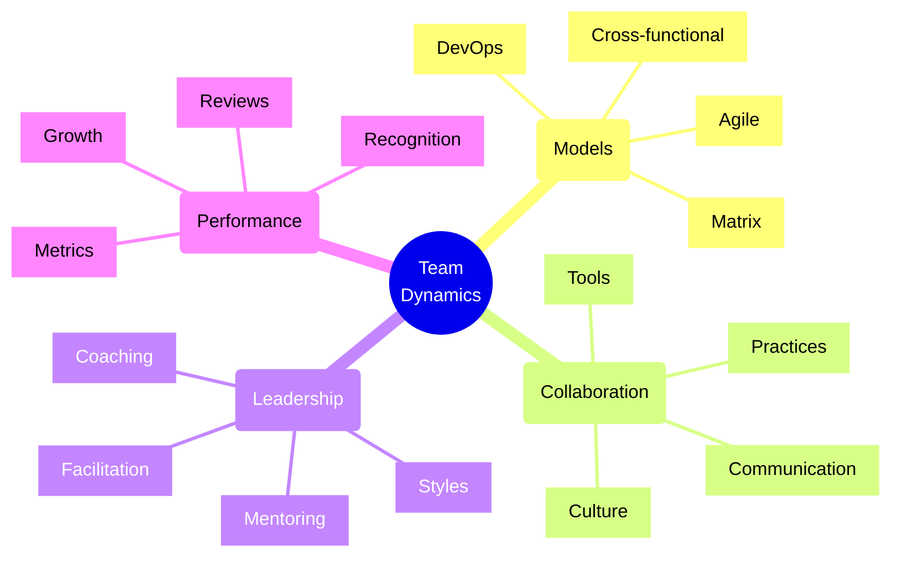
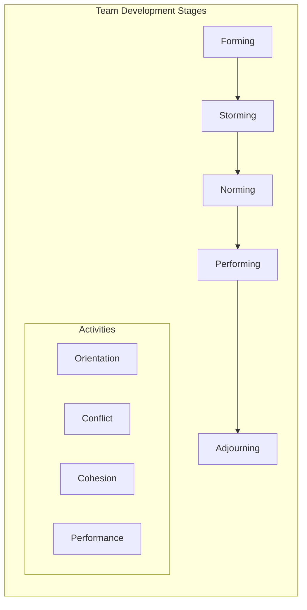
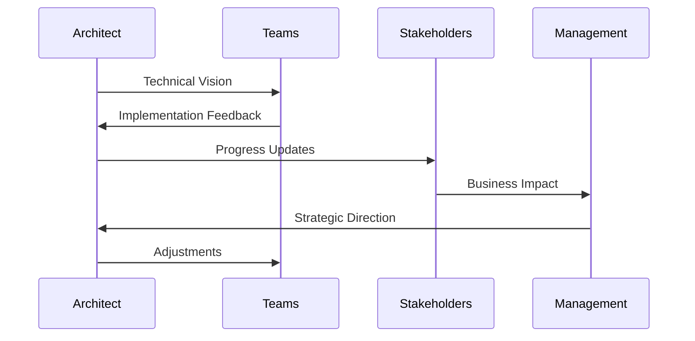
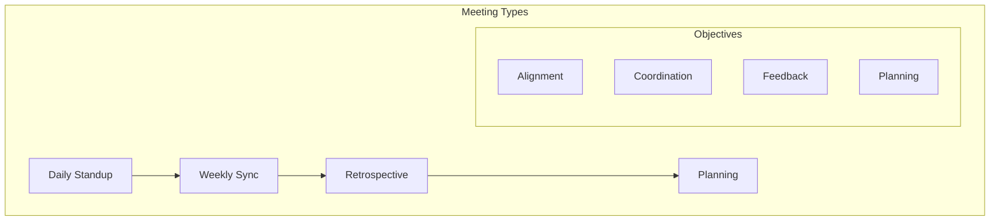

# Team Dynamics and Collaboration Models

## Core Concepts Overview



## Team Formation Stages

### 1. Tuckman's Model



### 2. Collaboration Framework



## Implementation Examples

### 1. Team Collaboration Tools
```typescript
// Example: Team Collaboration Platform Setup
class CollaborationPlatform {
    private tools: Map<string, CollaborationTool>;
    private channels: Map<string, Channel>;
    
    constructor() {
        this.initializeTools();
        this.setupChannels();
    }
    
    private initializeTools() {
        // Set up communication tools
        this.tools.set('chat', new ChatTool({
            channels: ['architecture', 'dev-team', 'operations'],
            integrations: ['github', 'jira', 'confluence']
        }));
        
        // Set up documentation tools
        this.tools.set('docs', new DocumentationTool({
            templates: ['architecture-decision-record', 'technical-spec'],
            permissions: this.getDocumentationPermissions()
        }));
        
        // Set up collaboration tools
        this.tools.set('whiteboard', new WhiteboardTool({
            features: ['realtime-collaboration', 'diagram-support'],
            storage: this.getCloudStorage()
        }));
    }
    
    private setupChannels() {
        // Architecture discussion channel
        this.channels.set('arch-review', {
            type: 'structured',
            participants: ['architects', 'tech-leads', 'senior-devs'],
            schedule: 'weekly',
            templates: this.getDiscussionTemplates()
        });
        
        // Cross-team coordination channel
        this.channels.set('cross-team', {
            type: 'async',
            participants: ['all-teams'],
            integrations: this.getCrossFunctionalIntegrations()
        });
    }
}
```

### 2. Team Management System
```typescript
// Example: Team Management and Metrics
class TeamManagement {
    private teams: Map<string, Team>;
    private metrics: TeamMetrics;
    
    async trackTeamHealth(teamId: string): Promise<HealthReport> {
        const team = this.teams.get(teamId);
        if (!team) throw new Error('Team not found');
        
        // Collect metrics
        const velocityMetrics = await this.metrics.getVelocity(teamId);
        const collaborationMetrics = await this.metrics.getCollaboration(teamId);
        const satisfactionMetrics = await this.metrics.getSatisfaction(teamId);
        
        // Analyze trends
        const trends = this.analyzeTrends({
            velocity: velocityMetrics,
            collaboration: collaborationMetrics,
            satisfaction: satisfactionMetrics
        });
        
        // Generate recommendations
        const recommendations = this.generateRecommendations(trends);
        
        return {
            metrics: {
                velocity: velocityMetrics,
                collaboration: collaborationMetrics,
                satisfaction: satisfactionMetrics
            },
            trends,
            recommendations,
            actionItems: this.createActionItems(recommendations)
        };
    }
}
```

## Collaboration Models

### 1. Cross-functional Teams
- Diverse skill sets
- Shared objectives
- Self-organizing
- End-to-end ownership
- Regular syncs

### 2. Matrix Organization
- Multiple reporting lines
- Resource sharing
- Skill optimization
- Project flexibility
- Clear communication

### 3. Communities of Practice
- Knowledge sharing
- Best practices
- Skill development
- Cross-pollination
- Innovation focus

## Implementation Checklist

### Setup Phase
- [ ] Define team structure
- [ ] Establish roles
- [ ] Set up tools
- [ ] Create channels
- [ ] Define processes
- [ ] Plan meetings

### Operation Phase
- [ ] Regular check-ins
- [ ] Track metrics
- [ ] Foster communication
- [ ] Address issues
- [ ] Share knowledge
- [ ] Review progress

### Improvement Phase
- [ ] Gather feedback
- [ ] Analyze metrics
- [ ] Identify gaps
- [ ] Plan improvements
- [ ] Implement changes
- [ ] Monitor results

## Best Practices

### 1. Communication
- Clear channels
- Regular updates
- Active listening
- Constructive feedback
- Documentation
- Transparency

### 2. Collaboration
- Shared goals
- Trust building
- Knowledge sharing
- Cross-training
- Pair programming
- Code reviews

### 3. Culture
- Psychological safety
- Learning environment
- Innovation support
- Work-life balance
- Recognition
- Continuous improvement

## Team Performance Framework

| Area | Metrics | Tools | Best Practices |
|------|---------|-------|----------------|
| Productivity | Velocity, Quality | Project tracking | Regular reviews |
| Collaboration | PRs, Knowledge sharing | Communication platforms | Cross-training |
| Innovation | Ideas, Implementations | Innovation platforms | Hackathons |
| Growth | Skills, Promotions | Learning platforms | Mentoring |

## Meeting Framework



## Team Growth Models

### 1. Skill Development
- Technical training
- Soft skills
- Leadership
- Mentoring
- Certifications
- Conferences

### 2. Career Progression
- Clear paths
- Regular reviews
- Goal setting
- Feedback loops
- Recognition
- Opportunities

### 3. Knowledge Sharing
- Documentation
- Tech talks
- Pair programming
- Code reviews
- Workshops
- Brown bags

## Common Challenges & Solutions

### 1. Communication Issues
- Regular sync-ups
- Clear channels
- Written documentation
- Active listening
- Feedback loops
- Tool optimization

### 2. Collaboration Barriers
- Team building
- Clear processes
- Shared goals
- Tool integration
- Cross-training
- Cultural awareness

### 3. Performance Problems
- Clear expectations
- Regular feedback
- Support systems
- Resource access
- Training options
- Recognition programs

Remember:
- Foster psychological safety
- Encourage open communication
- Build trust
- Support growth
- Celebrate success
- Learn from failures
- Adapt processes
- Stay agile