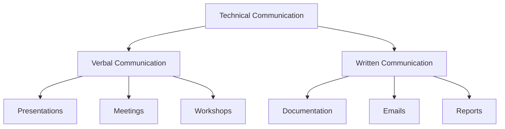

# Technical Communication (Verbal and Written)

## Overview
Technical communication is the practice of conveying complex technical information in a clear, concise, and effective manner to diverse audiences, including technical and non-technical stakeholders.



## Key Principles

### Clarity
- Use simple and precise language.
- Avoid jargon unless necessary.
- Define technical terms.

### Audience Awareness
- Tailor content to the audience's knowledge level.
- Use examples relevant to the audience.
- Anticipate questions and concerns.

### Structure
- Organize content logically.
- Use headings, bullet points, and visuals.
- Highlight key points.

### Conciseness
- Eliminate unnecessary details.
- Focus on the main message.
- Use active voice.

### Feedback
- Encourage questions and feedback.
- Iterate based on input.
- Validate understanding.

## Verbal Communication

### Presentations
- Use visuals to support key points.
- Practice delivery to ensure confidence.
- Engage the audience with questions.

### Meetings
- Prepare an agenda and share it in advance.
- Summarize key points and action items.
- Follow up with meeting notes.

### Workshops
- Use interactive activities to engage participants.
- Provide clear instructions and objectives.
- Collect feedback to improve future sessions.

## Written Communication

### Documentation
- Use templates for consistency.
- Include diagrams and examples.
- Keep it up-to-date.

### Emails
- Use clear subject lines.
- State the purpose in the first sentence.
- Use bullet points for clarity.

### Reports
- Start with an executive summary.
- Use data and visuals to support arguments.
- Include recommendations and next steps.

## Best Practices Checklist

### Verbal Communication
- [ ] Prepare and rehearse.
- [ ] Use visuals effectively.
- [ ] Engage the audience.
- [ ] Summarize key points.
- [ ] Follow up with notes.

### Written Communication
- [ ] Use templates for consistency.
- [ ] Organize content logically.
- [ ] Use visuals and examples.
- [ ] Proofread for errors.
- [ ] Keep it concise.

## Tools and Techniques

### Verbal Communication
- Presentation tools: PowerPoint, Keynote, Google Slides
- Virtual meeting platforms: Zoom, Microsoft Teams, Google Meet
- Interactive tools: Miro, Mentimeter, Kahoot

### Written Communication
- Documentation tools: Confluence, Notion, Google Docs
- Diagramming tools: Lucidchart, Draw.io, Visio
- Proofreading tools: Grammarly, Hemingway Editor

## Common Challenges

### Verbal Communication
- Nervousness: Practice and use notes.
- Audience disengagement: Use questions and visuals.
- Time management: Stick to the agenda.

### Written Communication
- Lack of clarity: Use simple language and examples.
- Overloading information: Focus on key points.
- Inconsistent style: Use templates and guidelines.

## Examples

### Presentation Slide
```plaintext
Title: System Architecture Overview

- Key Components:
  - API Gateway
  - Microservices
  - Database

- Data Flow:
  - User -> API Gateway -> Services -> Database

- Benefits:
  - Scalability
  - Resilience
  - Maintainability
```

### Email Template
```plaintext
Subject: Project Update - [Project Name]

Hi [Team/Stakeholder],

Here is the latest update on [Project Name]:

- Current Status: [Brief summary]
- Key Achievements: [List of achievements]
- Next Steps: [List of next steps]

Please let me know if you have any questions or need further details.

Best regards,
[Your Name]
```

### Documentation Example
```markdown
# API Design Guidelines

## Overview
This document outlines the best practices for designing APIs.

## Principles
- Consistency: Use standard naming conventions.
- Simplicity: Avoid unnecessary complexity.
- Security: Implement authentication and authorization.

## Examples
### Good
```http
GET /users/{id}
```

### Bad
```http
GET /getUserById/{id}
```
```

## Additional Resources
1. Books
   - "Made to Stick" by Chip Heath and Dan Heath
   - "The Art of Explanation" by Lee LeFever
   - "Presentation Zen" by Garr Reynolds

2. Online Courses
   - Technical Writing for Engineers
   - Public Speaking for Professionals
   - Effective Business Communication

3. Tools
   - Grammarly for proofreading
   - Canva for visuals
   - Notion for documentation