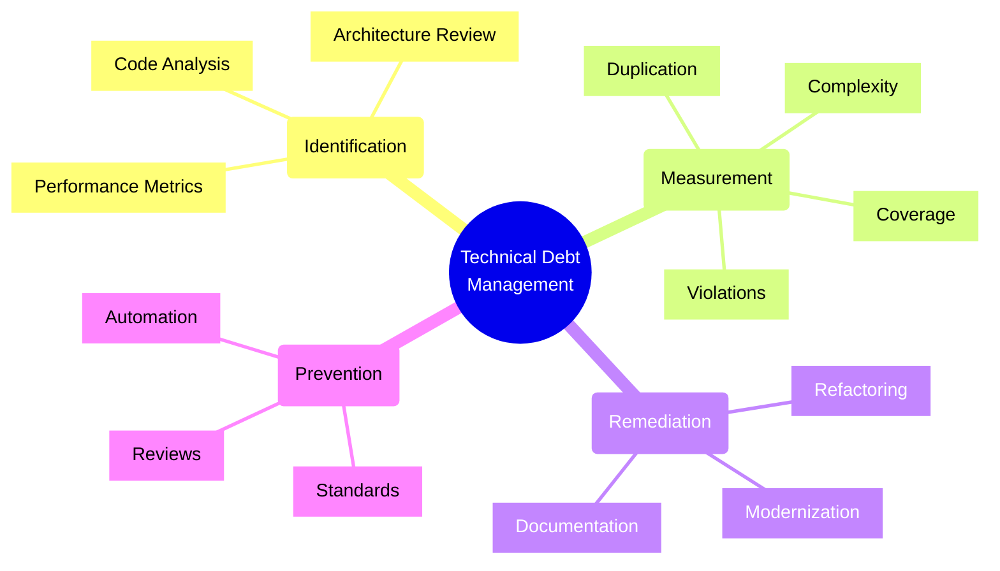
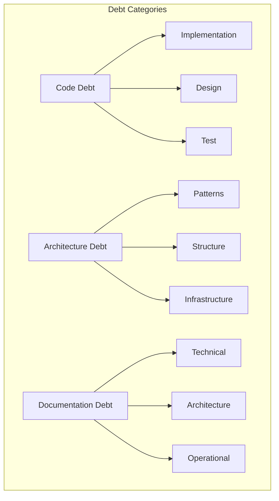
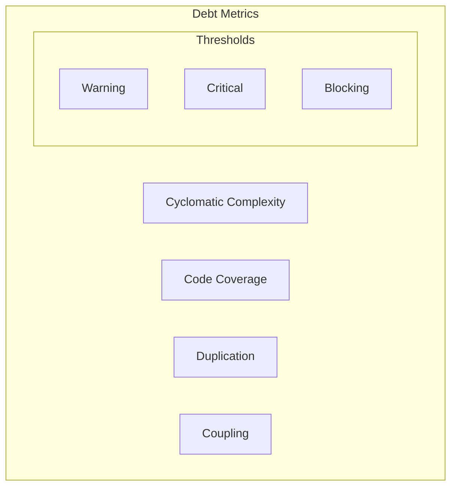
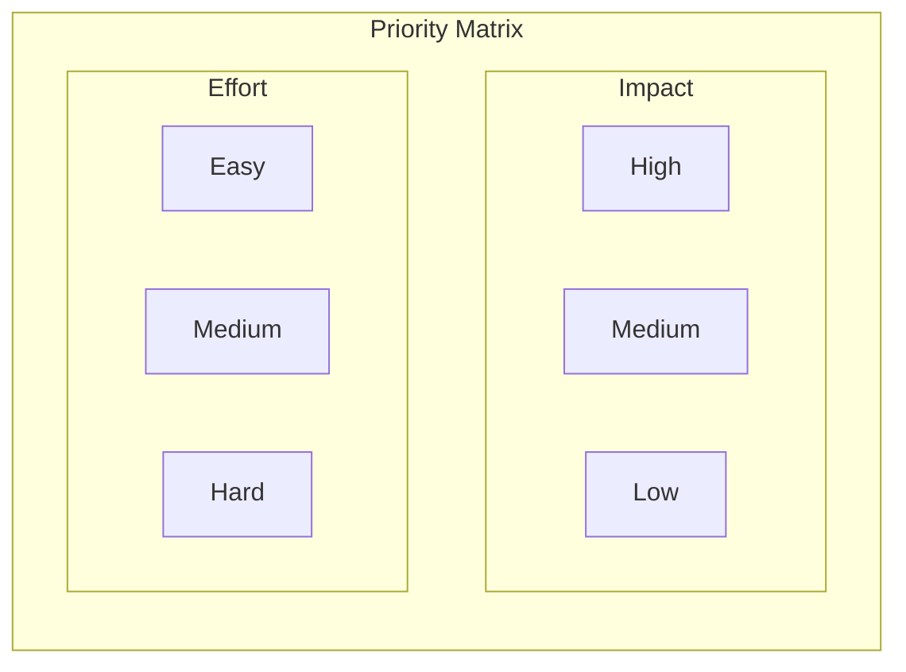
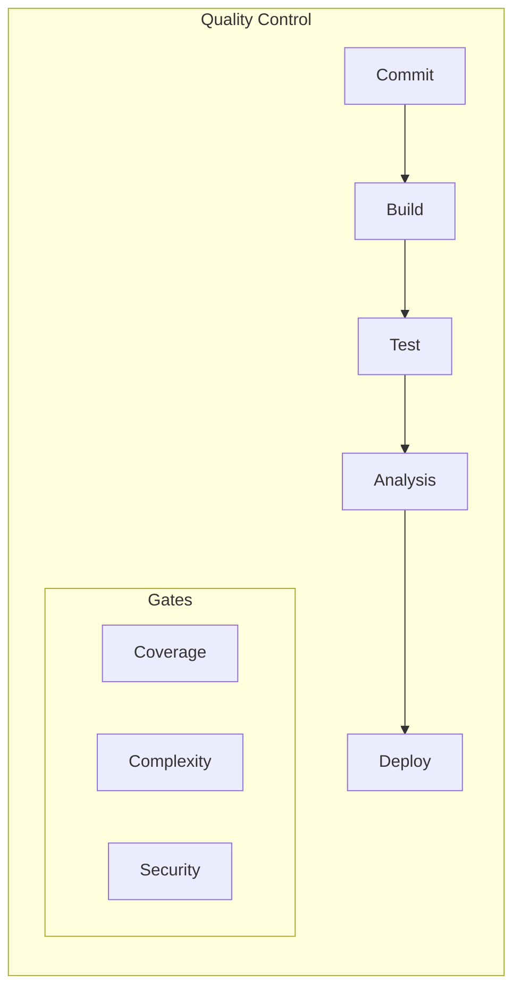
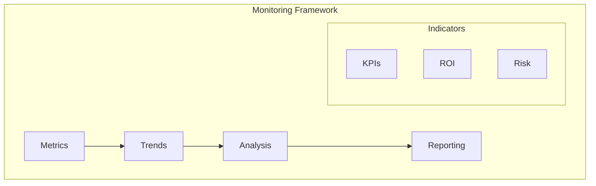

# Technical Debt Management

## Framework Overview

## Debt Classification

### 1. Types of Technical Debt

### 2. Impact Matrix
| Type | Business Impact | Maintenance Cost | Resolution Priority |
|------|----------------|------------------|---------------------|
| Code | Medium | High | Medium |
| Architecture | High | Very High | High |
| Infrastructure | Medium | Medium | Low |
| Documentation | Low | Low | Low |

## Measurement Framework

### 1. Key Metrics

### 2. Scoring Model
| Metric | Weight | Warning | Critical |
|--------|--------|---------|----------|
| Complexity | 30% | > 10 | > 20 |
| Coverage | 25% | < 80% | < 60% |
| Duplication | 25% | > 5% | > 10% |
| Violations | 20% | > 10 | > 20 |

## Remediation Strategy

### 1. Prioritization Framework

### 2. Action Plan
1. **Quick Wins**
   - High impact
   - Low effort
   - Immediate ROI

2. **Strategic Initiatives**
   - High impact
   - High effort
   - Long-term value

3. **Gradual Improvements**
   - Low impact
   - Low effort
   - Continuous progress

## Prevention Framework

### 1. Quality Gates

### 2. Standards Checklist
- [ ] Code style guide
- [ ] Architecture principles
- [ ] Testing requirements
- [ ] Documentation standards
- [ ] Review process
- [ ] CI/CD practices

### 3. Review Process
1. **Code Review**
   - Style compliance
   - Best practices
   - Security checks
   - Performance review

2. **Architecture Review**
   - Pattern compliance
   - Design principles
   - Integration approach
   - Scalability review

## Monitoring and Reporting

### 1. Debt Dashboard

### 2. Progress Tracking
| Metric | Current | Target | Trend |
|--------|---------|--------|-------|
| Debt Ratio | 25% | 15% | ↓ |
| Coverage | 75% | 85% | ↑ |
| Complexity | Medium | Low | → |
| Violations | 45 | 20 | ↓ |

## Best Practices

### 1. Management Strategy
- Regular assessment
- Clear ownership
- Dedicated budget
- Measurable goals
- Regular reviews

### 2. Team Culture
- Knowledge sharing
- Technical excellence
- Continuous learning
- Quality mindset
- Proactive approach

### 3. Communication
1. **Stakeholder Engagement**
   - Business impact
   - Cost implications
   - Risk assessment
   - Value proposition

2. **Progress Reporting**
   - Metrics tracking
   - Trend analysis
   - Success stories
   - Lessons learned

Remember: Technical debt management should be a continuous process integrated into the development lifecycle, not a one-time effort.