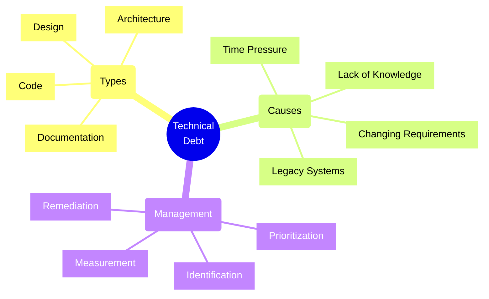
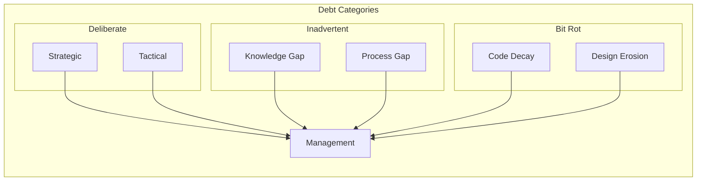
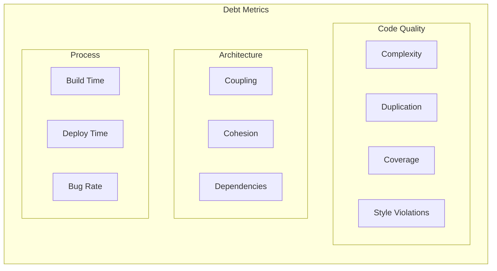
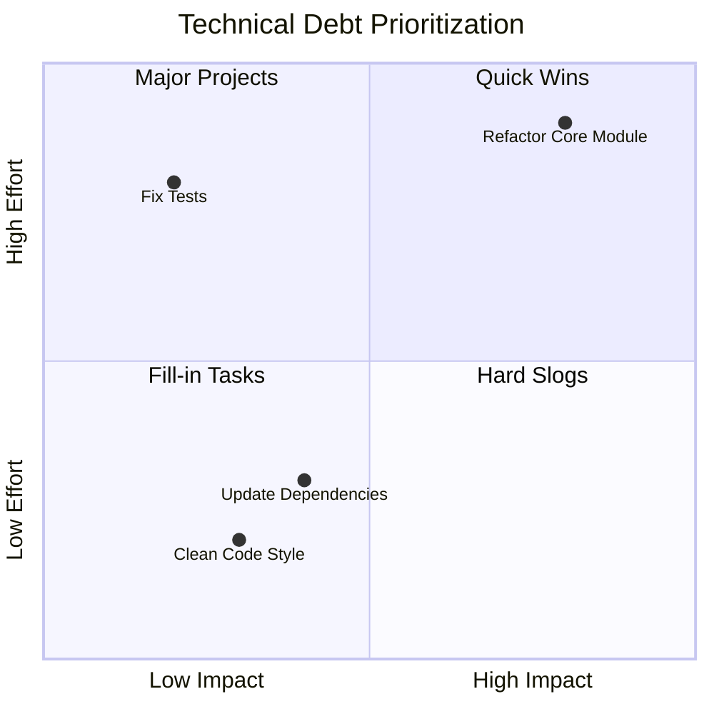
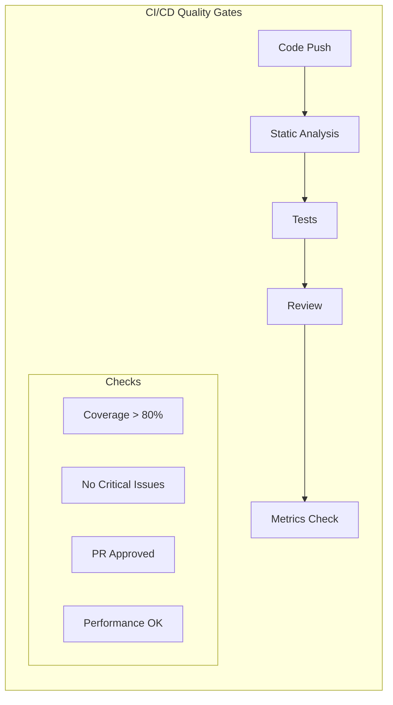
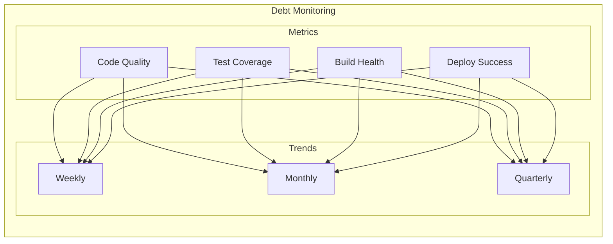

# Technical Debt Management



## Debt Classification

### 1. Types of Technical Debt



## Measurement Framework

### 1. Debt Metrics



### 2. Measurement Tools
```typescript
// Code Quality Analyzer
interface CodeMetrics {
    complexity: number;
    duplication: number;
    coverage: number;
    violations: number;
}

class TechnicalDebtAnalyzer {
    async analyzeCodebase(): Promise<CodeMetrics> {
        const metrics: CodeMetrics = {
            complexity: await this.calculateComplexity(),
            duplication: await this.findDuplication(),
            coverage: await this.measureCoverage(),
            violations: await this.checkViolations()
        };
        
        return metrics;
    }

    private async calculateDebtCost(metrics: CodeMetrics): Promise<number> {
        const remediation = {
            complexity: 2,  // hours per point
            duplication: 1, // hours per instance
            coverage: 3,    // hours per % below threshold
            violations: 0.5 // hours per violation
        };

        return (
            metrics.complexity * remediation.complexity +
            metrics.duplication * remediation.duplication +
            Math.max(0, (80 - metrics.coverage)) * remediation.coverage +
            metrics.violations * remediation.violations
        );
    }
}
```

## Management Strategy

### 1. Prioritization Matrix



### 2. Remediation Planning
```typescript
// Debt Item Tracking
interface DebtItem {
    id: string;
    title: string;
    category: 'code' | 'design' | 'architecture' | 'documentation';
    impact: number;  // 1-10
    effort: number;  // story points
    risk: number;    // 1-10
    cost: number;    // estimated hours
}

class DebtTracker {
    private items: Map<string, DebtItem> = new Map();

    addDebtItem(item: DebtItem): void {
        this.items.set(item.id, item);
    }

    getPrioritizedItems(): DebtItem[] {
        return Array.from(this.items.values())
            .sort((a, b) => {
                const aScore = this.calculatePriorityScore(a);
                const bScore = this.calculatePriorityScore(b);
                return bScore - aScore;
            });
    }

    private calculatePriorityScore(item: DebtItem): number {
        return (item.impact * 0.4) + 
               (1 / item.effort * 0.3) + 
               (item.risk * 0.3);
    }
}
```

## Debt Prevention

### 1. Quality Gates



### 2. Prevention Strategies
```typescript
// Quality Gate Implementation
class QualityGate {
    async checkQuality(build: Build): Promise<boolean> {
        const checks = [
            this.checkCoverage(build),
            this.checkCodeSmells(build),
            this.checkDuplication(build),
            this.checkPerformance(build)
        ];

        const results = await Promise.all(checks);
        return results.every(result => result);
    }

    private async checkCoverage(build: Build): Promise<boolean> {
        const coverage = await this.getCoverage(build);
        return coverage >= 80;
    }

    private async checkCodeSmells(build: Build): Promise<boolean> {
        const smells = await this.getCodeSmells(build);
        return smells.critical === 0;
    }
}
```

## Monitoring and Reporting

### 1. Debt Dashboard



## Best Practices

1. **Regular Assessment**
   - Schedule debt reviews
   - Use automated tools
   - Track trends over time
   - Set improvement goals

2. **Strategic Management**
   - Balance new features vs debt
   - Set aside maintenance time
   - Create dedicated stories
   - Monitor ROI of fixes

3. **Team Culture**
   - Share knowledge
   - Code review focus
   - Continuous learning
   - Documentation habits

4. **Process Integration**
   - Include in sprint planning
   - Regular refactoring
   - Automated checks
   - Clear standards

Remember: Technical debt is inevitable, but it should be managed actively. The goal is not to eliminate all debt, but to maintain it at a sustainable level while delivering business value.