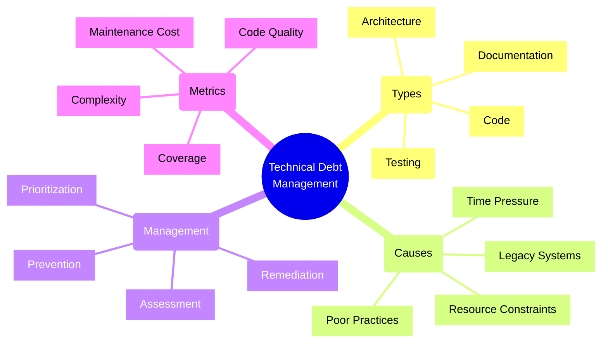
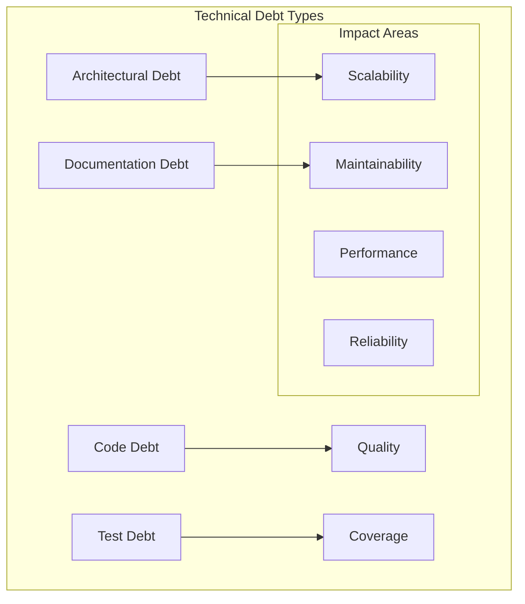
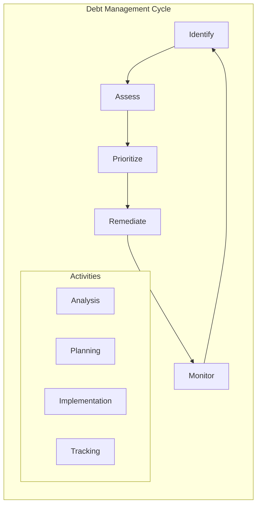

# Technical Debt Management

## Core Components

### 1. Debt Classification

### 2. Management Process

## Implementation Checklist

### Debt Assessment
- [ ] Code quality analysis
- [ ] Architecture review
- [ ] Test coverage audit
- [ ] Documentation review
- [ ] Performance analysis
- [ ] Security assessment
- [ ] Dependencies audit
- [ ] Infrastructure review
- [ ] Cost impact analysis

### Prioritization Process
- [ ] Impact assessment
- [ ] Cost estimation
- [ ] Risk evaluation
- [ ] Resource planning
- [ ] Timeline creation
- [ ] Stakeholder alignment
- [ ] ROI calculation
- [ ] Priority matrix
- [ ] Action plan

### Remediation Planning
- [ ] Team allocation
- [ ] Sprint planning
- [ ] Resource scheduling
- [ ] Task breakdown
- [ ] Risk mitigation
- [ ] Progress tracking
- [ ] Quality gates
- [ ] Review process
- [ ] Success metrics

### Prevention Strategy
- [ ] Coding standards
- [ ] Review process
- [ ] Automated testing
- [ ] CI/CD pipeline
- [ ] Documentation requirements
- [ ] Training program
- [ ] Monitoring setup
- [ ] Regular audits
- [ ] Feedback loops

## Trade-offs

### Quick Fixes vs. Long-term Solutions
- **Quick Fixes**
  - Pros:
    * Faster implementation
    * Immediate results
    * Lower initial cost
  - Cons:
    * Technical debt accumulation
    * Future complications
    * Higher long-term cost

### Feature Development vs. Debt Repayment
- **Feature Focus**
  - Pros:
    * Business value delivery
    * Customer satisfaction
    * Market competitiveness
  - Cons:
    * Debt accumulation
    * Decreased velocity
    * Higher maintenance cost

### Complete Rewrite vs. Incremental Change
- **Complete Rewrite**
  - Pros:
    * Clean implementation
    * Modern architecture
    * Better performance
  - Cons:
    * High risk
    * Long duration
    * Resource intensive

### Prevention vs. Remediation
- **Prevention Focus**
  - Pros:
    * Lower long-term cost
    * Better quality
    * Sustainable development
  - Cons:
    * Higher initial cost
    * Slower development
    * More process overhead

## Best Practices

1. **Assessment & Monitoring**
   - Regular code reviews
   - Automated analysis
   - Metrics tracking
   - Impact assessment
   - Cost monitoring
   - Progress tracking
   - Regular reporting

2. **Planning & Prioritization**
   - Clear criteria
   - Stakeholder input
   - Risk assessment
   - Cost-benefit analysis
   - Resource allocation
   - Timeline planning
   - Regular reviews

3. **Implementation**
   - Clear standards
   - Quality gates
   - Automated testing
   - Regular reviews
   - Documentation
   - Progress tracking
   - Knowledge sharing

4. **Prevention**
   - Development standards
   - Review processes
   - Automated checks
   - Team training
   - Regular audits
   - Feedback loops
   - Continuous improvement

## Technical Debt Matrix

| Type | Impact | Cost | Priority | Timeline |
|------|--------|------|----------|----------|
| Code Quality | High | Medium | P1 | Short-term |
| Architecture | Critical | High | P0 | Long-term |
| Testing | Medium | Medium | P2 | Mid-term |
| Documentation | Low | Low | P3 | Ongoing |
| Infrastructure | High | High | P1 | Mid-term |
| Security | Critical | High | P0 | Immediate |

## Debt Categories

1. **Code Debt**
   - Poor structure
   - Duplicate code
   - Missing tests
   - Complex logic
   - Poor performance

2. **Architecture Debt**
   - Rigid design
   - Poor scalability
   - High coupling
   - Low cohesion
   - Outdated patterns

3. **Infrastructure Debt**
   - Outdated systems
   - Manual processes
   - Poor monitoring
   - Security issues
   - Scaling limitations

4. **Knowledge Debt**
   - Poor documentation
   - Tribal knowledge
   - Missing standards
   - Unclear processes
   - Training gaps

Remember: Technical debt management requires a balanced approach between immediate business needs and long-term sustainability. Regular assessment and proactive management are key to maintaining a healthy codebase.