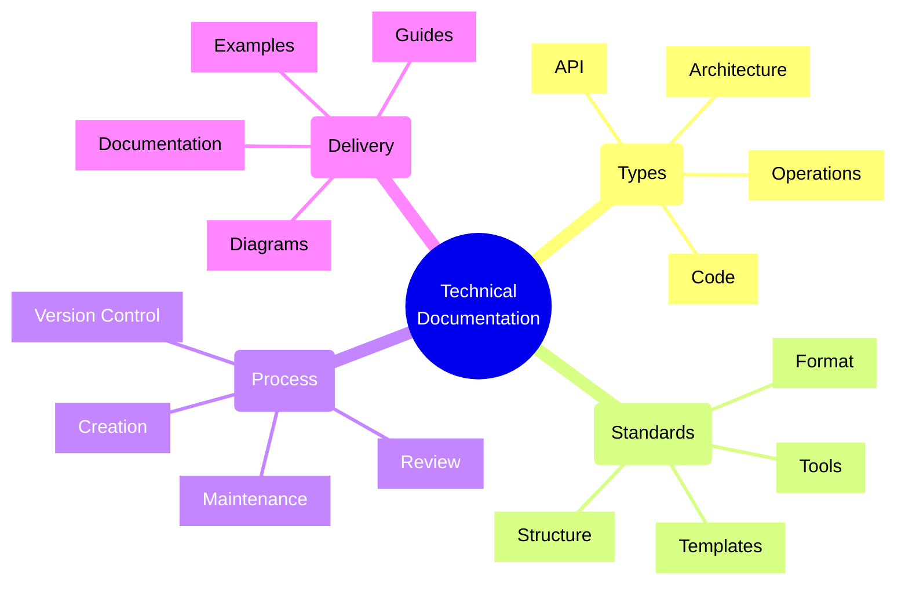
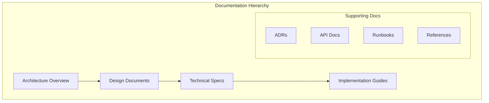
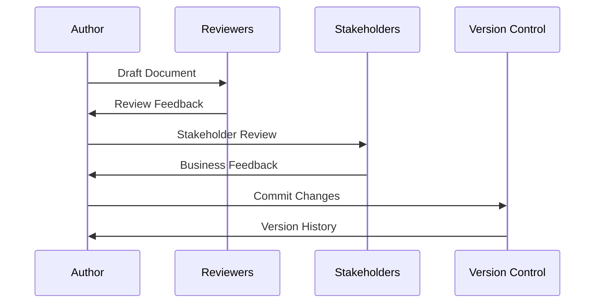
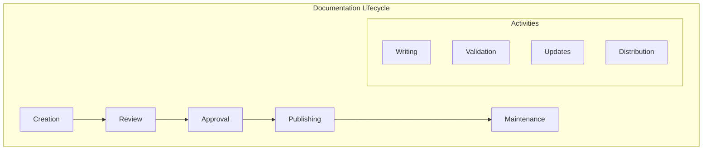

# Technical Documentation Standards

## Core Concepts Overview



## Documentation Architecture

### 1. Documentation Structure



### 2. Documentation Flow



## Implementation Examples

### 1. Architecture Decision Record (ADR)
```markdown
# ADR-001: Service Mesh Implementation

## Status
Accepted

## Context
Our microservices architecture needs improved service-to-service communication, 
observability, and security controls.

## Decision
We will implement Istio as our service mesh solution.

## Consequences
### Positive
- Enhanced observability through unified telemetry
- Improved security with mutual TLS
- Centralized traffic management
- Built-in resilience features

### Negative
- Additional operational complexity
- Learning curve for the team
- Resource overhead for sidecars

## Implementation
### Phase 1: Infrastructure Setup
- Deploy Istio control plane
- Configure monitoring tools
- Set up mTLS policies

### Phase 2: Service Migration
- Identify pilot services
- Gradually onboard services
- Monitor and adjust configurations

## References
- [Istio Documentation](https://istio.io/docs/)
- [Service Mesh Patterns](./service-mesh-patterns.md)
- [Security Standards](./security-standards.md)
```

### 2. API Documentation
```yaml
# Example: OpenAPI Specification
openapi: 3.0.0
info:
  title: User Management API
  version: 1.0.0
  description: |
    API for managing user accounts and permissions.
    Follows REST principles and implements RBAC.

servers:
  - url: https://api.example.com/v1
    description: Production server
  - url: https://staging-api.example.com/v1
    description: Staging server

paths:
  /users:
    get:
      summary: List users
      description: Retrieves a paginated list of users
      parameters:
        - name: page
          in: query
          schema:
            type: integer
            minimum: 1
            default: 1
        - name: limit
          in: query
          schema:
            type: integer
            minimum: 1
            maximum: 100
            default: 20
      responses:
        '200':
          description: Successful response
          content:
            application/json:
              schema:
                type: object
                properties:
                  users:
                    type: array
                    items:
                      $ref: '#/components/schemas/User'
                  pagination:
                    $ref: '#/components/schemas/Pagination'
        '401':
          $ref: '#/components/responses/Unauthorized'
        '403':
          $ref: '#/components/responses/Forbidden'
```

## Documentation Standards

### 1. Structure Standards
- Clear hierarchy
- Consistent formatting
- Logical organization
- Version control
- Change tracking
- Cross-references

### 2. Content Standards
- Clear language
- Technical accuracy
- Code examples
- Diagrams
- Use cases
- Troubleshooting

### 3. Review Standards
- Technical review
- Peer review
- Stakeholder review
- Regular updates
- Version history
- Change log

## Implementation Checklist

### Planning Phase
- [ ] Define document types
- [ ] Create templates
- [ ] Set up tools
- [ ] Define workflow
- [ ] Assign roles
- [ ] Plan reviews

### Creation Phase
- [ ] Follow templates
- [ ] Include diagrams
- [ ] Add examples
- [ ] Link references
- [ ] Review clarity
- [ ] Check accuracy

### Review Phase
- [ ] Technical review
- [ ] Peer feedback
- [ ] Update content
- [ ] Fix issues
- [ ] Final approval
- [ ] Publish docs

## Best Practices

### 1. Document Organization
- Clear structure
- Consistent naming
- Logical grouping
- Easy navigation
- Search functionality
- Version tracking

### 2. Writing Style
- Clear and concise
- Technical accuracy
- Active voice
- Consistent terminology
- Proper formatting
- Regular updates

### 3. Tools and Automation
- Documentation tools
- Diagram tools
- Version control
- CI/CD integration
- Automated checks
- Publishing workflow

## Documentation Types Framework

| Type | Purpose | Tools | Best Practices |
|------|---------|-------|----------------|
| Architecture | System design | C4 Model, UML | Clear diagrams |
| API | Interface specs | OpenAPI, AsyncAPI | Examples |
| Code | Implementation | JSDoc, Sphinx | Context |
| Operations | Runbooks | Markdown, Wiki | Steps |

## Documentation Process Framework



## Common Documentation Types

### 1. Architecture Documentation
- System overview
- Component diagrams
- Interaction flows
- Decision records
- Trade-off analysis
- Future roadmap

### 2. API Documentation
- Endpoint specifications
- Request/response examples
- Authentication details
- Error handling
- Rate limits
- SDK examples

### 3. Implementation Guides
- Setup instructions
- Code examples
- Configuration guides
- Best practices
- Troubleshooting
- FAQs

### 4. Operational Documentation
- Deployment guides
- Monitoring setup
- Alerting rules
- Incident response
- Backup procedures
- Recovery steps

## Documentation Tools

### 1. Writing Tools
- Markdown editors
- Wiki platforms
- Doc generators
- Collaboration tools
- Version control
- CI/CD integration

### 2. Diagram Tools
- Draw.io/diagrams.net
- PlantUML
- Mermaid
- C4 Model tools
- Enterprise Architect
- Lucidchart

### 3. API Documentation
- Swagger/OpenAPI
- AsyncAPI
- Postman
- Insomnia
- API Blueprint
- RAML

Remember:
- Keep docs updated
- Use clear language
- Include examples
- Add diagrams
- Review regularly
- Gather feedback
- Automate where possible
- Version control everything