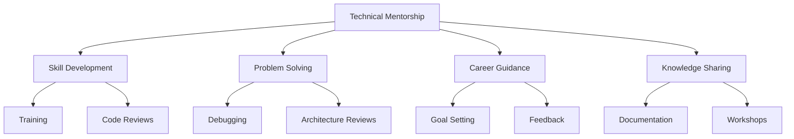

# Technical Mentorship

## Overview
Technical mentorship involves guiding and supporting individuals or teams to enhance their technical skills, solve complex problems, and achieve their career goals.



## Key Principles

### Build Trust
- Be approachable and supportive.
- Maintain confidentiality.
- Show genuine interest in mentees' growth.

### Encourage Learning
- Promote a growth mindset.
- Provide constructive feedback.
- Encourage experimentation and innovation.

### Share Knowledge
- Document best practices.
- Conduct regular knowledge-sharing sessions.
- Use real-world examples to explain concepts.

### Set Goals
- Help mentees define clear and achievable goals.
- Align goals with organizational objectives.
- Track progress and celebrate achievements.

## Mentorship Activities

### Skill Development
- Conduct training sessions on technical topics.
- Provide resources like books, courses, and tools.
- Review code and provide actionable feedback.

### Problem Solving
- Assist with debugging and troubleshooting.
- Review architectural designs and suggest improvements.
- Encourage collaborative problem-solving.

### Career Guidance
- Help mentees identify career paths.
- Provide feedback on performance and areas for improvement.
- Share insights on industry trends and opportunities.

### Knowledge Sharing
- Create and maintain technical documentation.
- Organize workshops and hackathons.
- Share lessons learned from past projects.

## Best Practices Checklist

### Build Trust
- [ ] Be approachable and supportive.
- [ ] Maintain confidentiality.
- [ ] Show genuine interest in mentees' growth.

### Encourage Learning
- [ ] Promote a growth mindset.
- [ ] Provide constructive feedback.
- [ ] Encourage experimentation and innovation.

### Share Knowledge
- [ ] Document best practices.
- [ ] Conduct regular knowledge-sharing sessions.
- [ ] Use real-world examples to explain concepts.

### Set Goals
- [ ] Help mentees define clear and achievable goals.
- [ ] Align goals with organizational objectives.
- [ ] Track progress and celebrate achievements.

## Tools and Techniques

### Mentorship Tools
- Code Review Tools: GitHub, GitLab, Bitbucket
- Collaboration Tools: Slack, Microsoft Teams
- Learning Platforms: Pluralsight, Udemy, Coursera

### Knowledge Sharing Tools
- Documentation: Confluence, Notion
- Diagramming: Lucidchart, Draw.io
- Presentation: PowerPoint, Google Slides

## Common Challenges

### Building Trust
- Lack of rapport: Spend time understanding mentees.
- Fear of judgment: Create a safe environment for questions.

### Encouraging Learning
- Resistance to feedback: Use a positive and constructive approach.
- Lack of motivation: Set achievable and rewarding goals.

### Sharing Knowledge
- Information overload: Focus on key concepts.
- Outdated resources: Regularly update documentation and materials.

### Setting Goals
- Unrealistic expectations: Align goals with current skills and resources.
- Lack of follow-up: Schedule regular check-ins to track progress.

## Examples

### Mentorship Plan
| Activity          | Frequency       | Responsible Party |
|-------------------|-----------------|-------------------|
| Code Reviews      | Weekly          | Mentor            |
| Training Sessions | Monthly         | Mentor            |
| Career Check-ins  | Quarterly       | Mentor            |
| Knowledge Sharing | Bi-weekly       | Mentor            |

### Feedback Template
```plaintext
Subject: Feedback on [Project/Task]

Hi [Mentee],

Here is my feedback on [Project/Task]:

- Strengths: [List strengths]
- Areas for Improvement: [List areas for improvement]
- Suggestions: [Provide actionable suggestions]

Let me know if you have any questions or need further clarification.

Best regards,
[Your Name]
```

### Knowledge Sharing Session
```plaintext
Topic: Best Practices for API Design

Agenda:
1. Introduction to API Design Principles
2. Common Pitfalls and How to Avoid Them
3. Real-World Examples
4. Q&A

Duration: 1 Hour
Audience: Development Team
```

## Additional Resources
1. Books
   - "The Mentor's Guide" by Lois J. Zachary
   - "Radical Candor" by Kim Scott
   - "The Coaching Habit" by Michael Bungay Stanier

2. Online Courses
   - Mentorship Skills for Leaders
   - Effective Code Reviews
   - Career Development for Engineers

3. Tools
   - GitHub for code reviews
   - Notion for documentation
   - Slack for communication