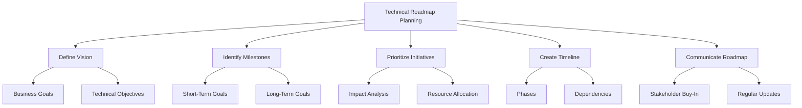
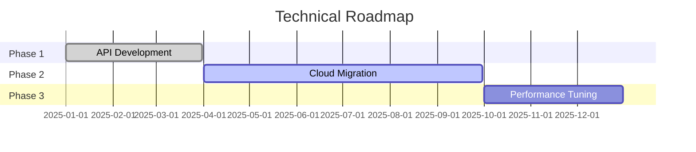

# Technical Roadmap Planning

## Overview
Technical roadmap planning is the process of defining and visualizing the strategic direction of technical initiatives to align with business goals.

## Key Principles

### Define Vision
- Align technical objectives with business goals.
- Focus on long-term outcomes.
- Ensure clarity and feasibility.

### Identify Milestones
- Break down the vision into achievable goals.
- Include both short-term and long-term milestones.
- Define success criteria for each milestone.

### Prioritize Initiatives
- Assess impact on business and technical goals.
- Consider resource availability and constraints.
- Use frameworks like RICE (Reach, Impact, Confidence, Effort).

### Create Timeline
- Organize initiatives into phases.
- Identify dependencies and risks.
- Allocate resources effectively.

### Communicate Roadmap
- Share the roadmap with stakeholders.
- Use visuals for clarity.
- Provide regular updates and revisions.

## Roadmap Components

### Example Structure
| Phase           | Initiative         | Milestone         | Timeline       | Owner          |
|-----------------|--------------------|-------------------|----------------|----------------|
| Phase 1         | API Development   | MVP Release       | Q1 2025        | Dev Team Lead  |
| Phase 2         | Cloud Migration   | Complete Migration| Q3 2025        | Infra Team Lead|
| Phase 3         | Performance Tuning| Achieve 99.9% SLA | Q4 2025        | Ops Team Lead  |

### Visual Representation

## Best Practices Checklist

### Define Vision
- [ ] Align with business goals.
- [ ] Focus on long-term outcomes.
- [ ] Ensure clarity and feasibility.

### Identify Milestones
- [ ] Break down the vision into achievable goals.
- [ ] Include short-term and long-term milestones.
- [ ] Define success criteria for each milestone.

### Prioritize Initiatives
- [ ] Assess impact on goals.
- [ ] Consider resource constraints.
- [ ] Use prioritization frameworks.

### Create Timeline
- [ ] Organize initiatives into phases.
- [ ] Identify dependencies and risks.
- [ ] Allocate resources effectively.

### Communicate Roadmap
- [ ] Share with stakeholders.
- [ ] Use visuals for clarity.
- [ ] Provide regular updates.

## Tools and Techniques

### Roadmap Tools
- Gantt Chart Tools: Microsoft Project, Smartsheet
- Visualization Tools: Miro, Lucidchart
- Collaboration Tools: Confluence, Trello

### Prioritization Frameworks
- RICE (Reach, Impact, Confidence, Effort)
- MoSCoW (Must Have, Should Have, Could Have, Won't Have)
- Weighted Scoring Models

## Common Challenges

### Defining Vision
- Misalignment with business goals: Involve stakeholders early.
- Overly ambitious objectives: Focus on feasibility.

### Identifying Milestones
- Lack of clarity: Define success criteria.
- Missing dependencies: Use dependency mapping.

### Prioritizing Initiatives
- Conflicting priorities: Use a structured framework.
- Resource constraints: Reassess timelines and scope.

### Creating Timeline
- Unrealistic deadlines: Validate with teams.
- Ignoring risks: Include risk mitigation plans.

### Communicating Roadmap
- Lack of stakeholder buy-in: Use visuals and clear messaging.
- Outdated roadmap: Schedule regular updates.

## Examples

### Vision Statement
"Enable seamless scalability and resilience by migrating to a cloud-native architecture, achieving a 99.9% SLA by Q4 2025."

### Milestone Breakdown
| Milestone         | Success Criteria                | Timeline       |
|-------------------|---------------------------------|----------------|
| MVP Release       | API handles 1000 RPS           | Q1 2025        |
| Cloud Migration   | 80% workloads on the cloud     | Q3 2025        |
| Performance Tuning| 99.9% SLA achieved             | Q4 2025        |

### Prioritization Example
| Initiative         | Reach | Impact | Confidence | Effort | Score |
|--------------------|-------|--------|------------|--------|-------|
| API Development    | 8     | 9      | 7          | 5      | 7.8   |
| Cloud Migration    | 7     | 8      | 8          | 6      | 7.5   |
| Performance Tuning | 6     | 9      | 6          | 4      | 7.2   |

## Additional Resources
1. Books
   - "The Art of Scalability" by Martin L. Abbott
   - "Roadmapping Essentials" by Bruce McCarthy
   - "Strategic Planning for Technology" by William R. King

2. Online Courses
   - Roadmap Planning for Technology Leaders
   - Strategic Planning for IT Projects
   - Prioritization Techniques for Product Managers

3. Tools
   - Smartsheet for Gantt charts
   - Miro for visual roadmaps
   - Trello for tracking initiatives