# Testing Best Practices

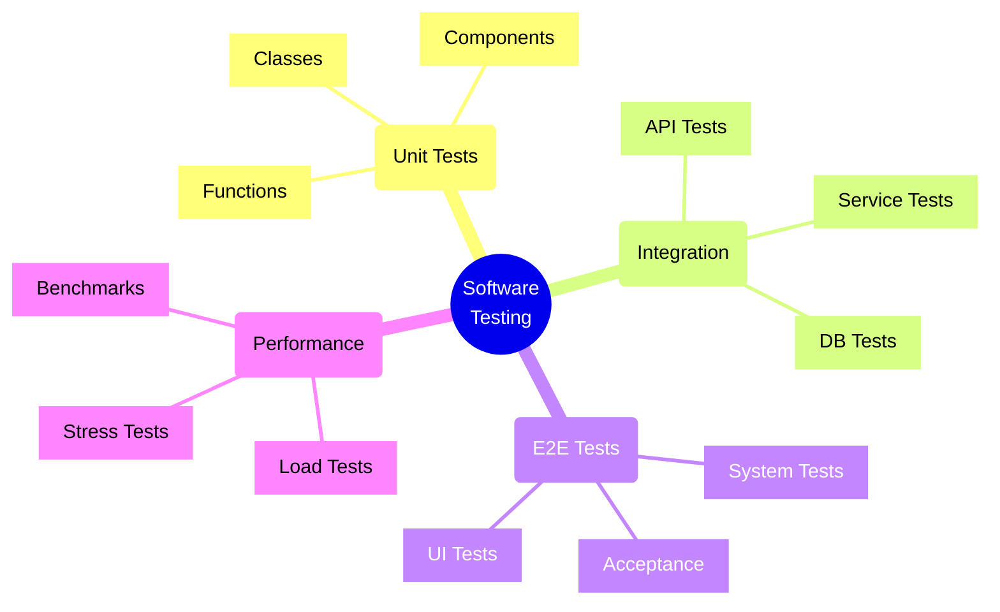

## Testing Pyramid

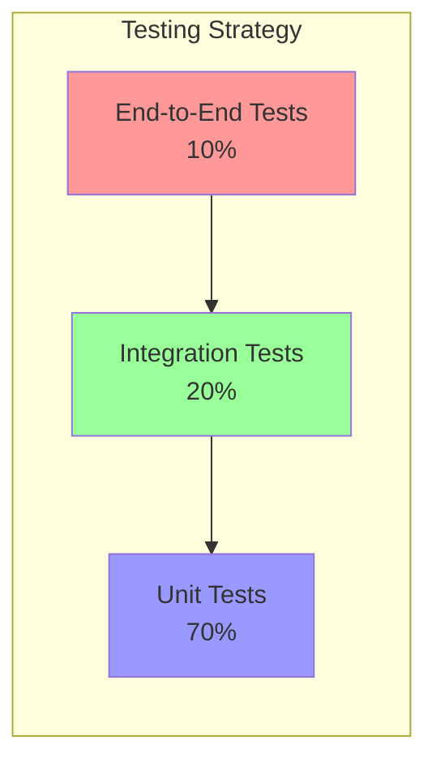

## Test Implementation Flow

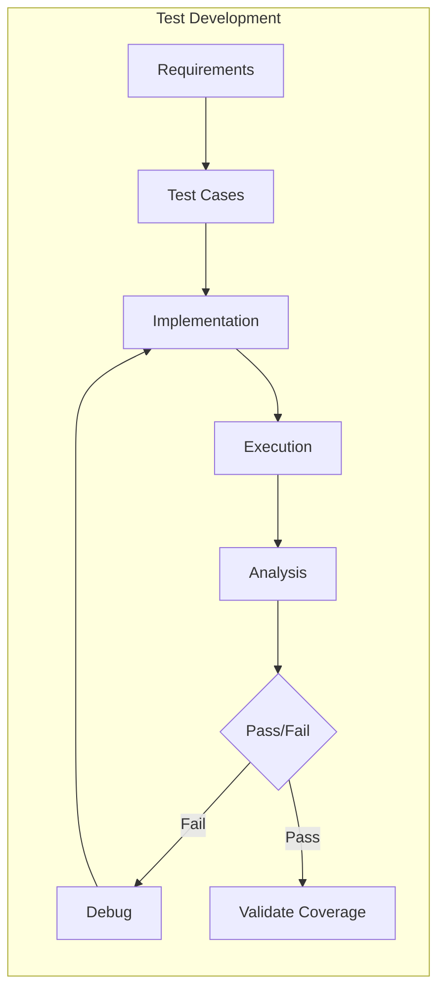

## 1. Unit Testing

### Best Practices
- Test one thing at a time
- Follow AAA (Arrange-Act-Assert) pattern
- Use meaningful test names
- Maintain test independence

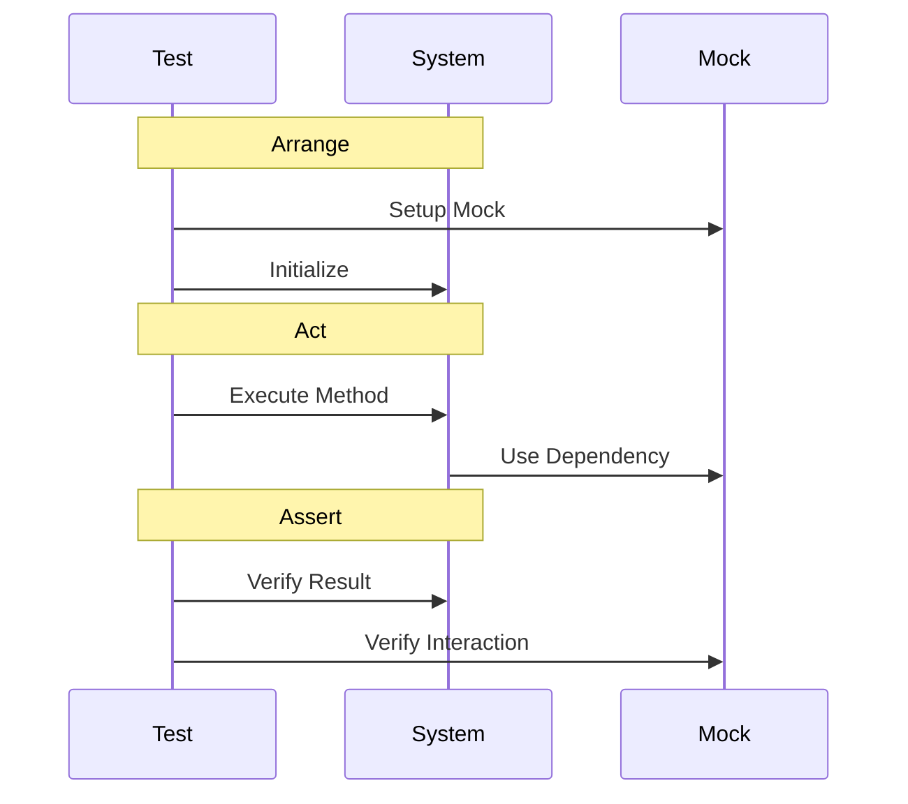

### Example Implementation
```typescript
describe('UserService', () => {
    let userService: UserService;
    let userRepo: MockUserRepository;

    beforeEach(() => {
        userRepo = new MockUserRepository();
        userService = new UserService(userRepo);
    });

    it('should create user with valid data', async () => {
        // Arrange
        const userData = {
            name: 'John Doe',
            email: 'john@example.com'
        };

        // Act
        const result = await userService.createUser(userData);

        // Assert
        expect(result.success).toBe(true);
        expect(userRepo.save).toHaveBeenCalledWith(userData);
    });
});
```

## 2. Integration Testing

### Key Areas
- API Testing
- Database Integration
- Service Communication
- External Dependencies

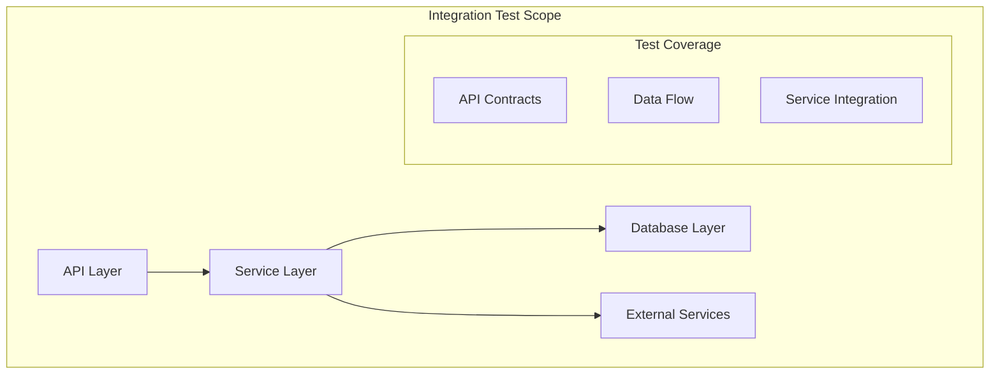

### Example Implementation
```typescript
describe('Order Integration', () => {
    it('should process order end-to-end', async () => {
        // Setup test database
        const db = await createTestDatabase();
        
        // Create test API client
        const client = createTestClient();
        
        // Create order
        const response = await client.post('/api/orders', {
            items: [{ id: 'item1', quantity: 2 }],
            userId: 'user123'
        });
        
        // Verify database state
        const order = await db.orders.findOne({ id: response.orderId });
        expect(order.status).toBe('processed');
        
        // Verify external service calls
        expect(mockPaymentService.process).toHaveBeenCalled();
    });
});
```

## 3. End-to-End Testing

### Focus Areas
- User Flows
- System Integration
- Real Environment Testing

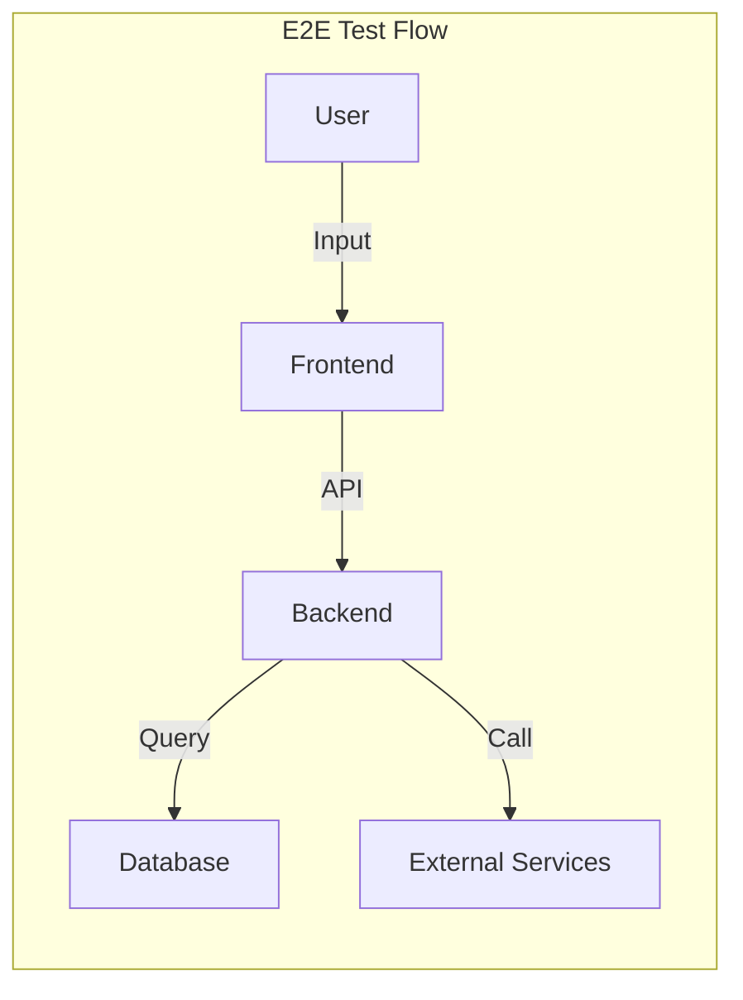

### Example Implementation (Cypress)
```typescript
describe('User Registration Flow', () => {
    it('should register a new user', () => {
        cy.visit('/register');
        
        // Fill registration form
        cy.get('#name').type('John Doe');
        cy.get('#email').type('john@example.com');
        cy.get('#password').type('secure123');
        
        // Submit form
        cy.get('button[type="submit"]').click();
        
        // Verify successful registration
        cy.url().should('include', '/dashboard');
        cy.get('.welcome-message')
          .should('contain', 'Welcome, John');
    });
});
```

## 4. Performance Testing

### Types of Tests
- Load Testing
- Stress Testing
- Endurance Testing
- Spike Testing

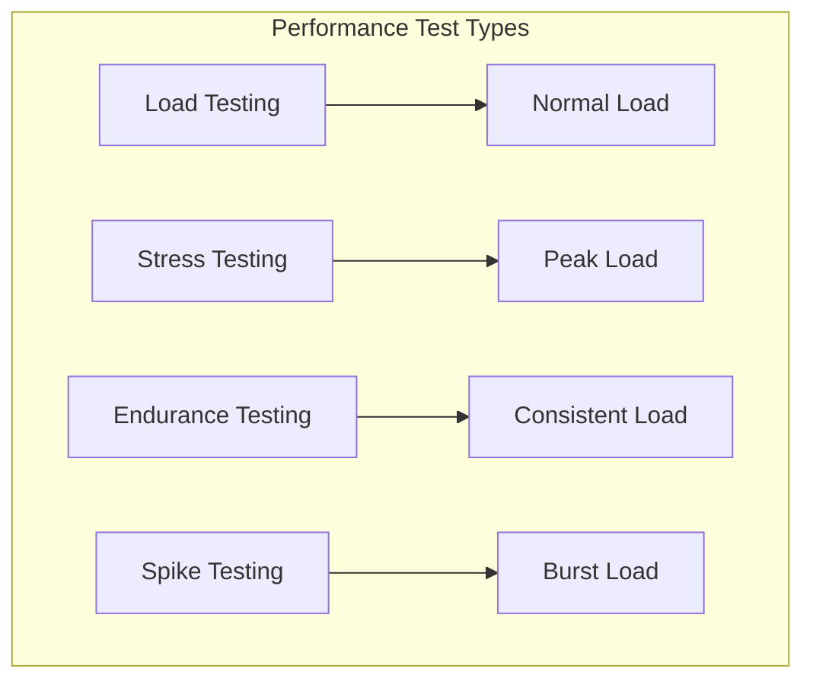

### Example Implementation (k6)
```javascript
import http from 'k6/http';
import { check, sleep } from 'k6';

export const options = {
    stages: [
        { duration: '2m', target: 100 }, // Ramp up
        { duration: '5m', target: 100 }, // Stay at 100 users
        { duration: '2m', target: 0 },   // Ramp down
    ],
    thresholds: {
        http_req_duration: ['p(95)<500'], // 95% requests within 500ms
        http_req_failed: ['rate<0.01'],   // Less than 1% errors
    },
};

export default function() {
    const response = http.get('https://api.example.com/users');
    
    check(response, {
        'is status 200': (r) => r.status === 200,
        'response time < 500ms': (r) => r.timings.duration < 500,
    });
    
    sleep(1);
}
```

## 5. Security Testing

### Key Areas
- Vulnerability Scanning
- Penetration Testing
- Security Compliance
- Authentication/Authorization

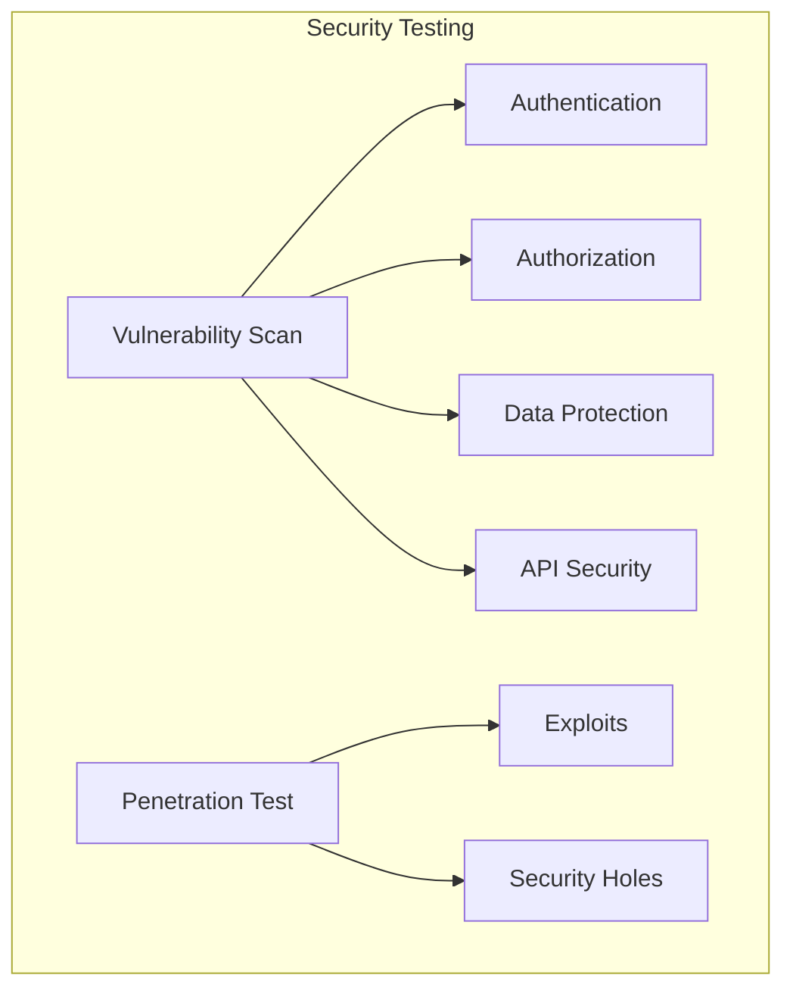

## Advanced Testing Patterns

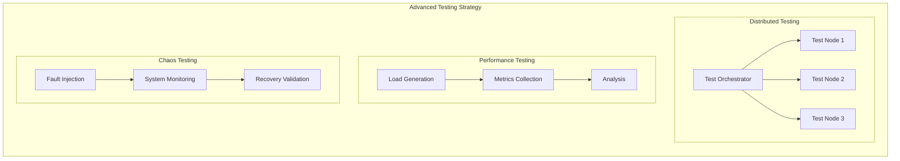

## Performance Test Flow

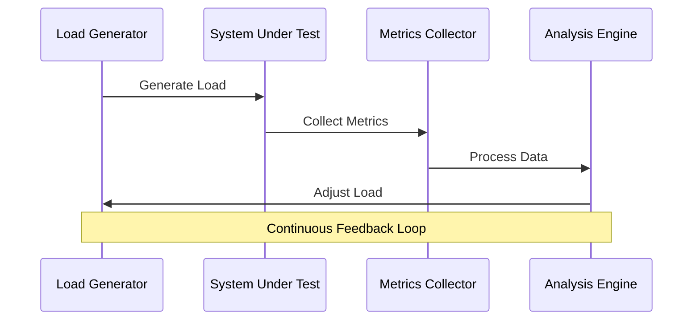

## Distributed System Testing

```typescript
// Distributed Test Orchestrator
interface TestNode {
    id: string;
    capacity: number;
    status: 'idle' | 'running' | 'failed';
}

class DistributedTestOrchestrator {
    private nodes: Map<string, TestNode> = new Map();
    private testQueue: TestCase[] = [];

    async executeDistributedTests(tests: TestCase[]): Promise<TestResult[]> {
        this.testQueue = [...tests];
        const results: TestResult[] = [];

        while (this.testQueue.length > 0 || this.hasRunningTests()) {
            const availableNodes = this.getAvailableNodes();
            
            for (const node of availableNodes) {
                const test = this.testQueue.shift();
                if (!test) break;
                
                const result = await this.executeTestOnNode(node, test);
                results.push(result);
            }

            await this.waitForCompletion();
        }

        return results;
    }

    private async executeTestOnNode(
        node: TestNode, 
        test: TestCase
    ): Promise<TestResult> {
        try {
            node.status = 'running';
            // Execute test on remote node
            const result = await this.runRemoteTest(node, test);
            return result;
        } catch (error) {
            return {
                testId: test.id,
                status: 'failed',
                error: error.message
            };
        } finally {
            node.status = 'idle';
        }
    }
}
```

## Performance Validation Implementation

```typescript
interface PerformanceMetrics {
    responseTime: number;
    throughput: number;
    errorRate: number;
    resourceUtilization: {
        cpu: number;
        memory: number;
        network: number;
    };
}

class PerformanceValidator {
    private metrics: PerformanceMetrics[] = [];
    private thresholds: Map<string, number> = new Map();

    async runLoadTest(
        config: LoadTestConfig
    ): Promise<PerformanceTestResult> {
        const generator = new LoadGenerator(config);
        const collector = new MetricsCollector();

        try {
            // Start load generation
            await generator.start();

            // Collect metrics during test
            while (generator.isRunning()) {
                const metrics = await collector.collectMetrics();
                this.metrics.push(metrics);

                if (this.hasThresholdViolation(metrics)) {
                    await generator.stop();
                    return {
                        status: 'failed',
                        violations: this.getViolations(metrics)
                    };
                }
            }

            return {
                status: 'passed',
                metrics: this.analyzeMetrics()
            };
        } finally {
            await generator.stop();
        }
    }

    private hasThresholdViolation(
        metrics: PerformanceMetrics
    ): boolean {
        return (
            metrics.responseTime > this.thresholds.get('responseTime') ||
            metrics.errorRate > this.thresholds.get('errorRate')
        );
    }

    private analyzeMetrics(): PerformanceAnalysis {
        // Analyze collected metrics
        const analysis = {
            mean: this.calculateMean(),
            percentiles: this.calculatePercentiles(),
            trends: this.analyzeTrends()
        };

        return analysis;
    }
}
```

## Advanced Testing Best Practices

1. **Distributed Testing Strategy**
   - Scale test execution across nodes
   - Manage test data distribution
   - Handle node failures gracefully
   - Aggregate results effectively

2. **Performance Testing Guidelines**
   - Define clear performance criteria
   - Use realistic test data
   - Monitor system resources
   - Analyze trends over time

3. **Chaos Engineering Principles**
   - Start with controlled experiments
   - Measure system response
   - Increase complexity gradually
   - Document and share findings

4. **Test Data Management**
   - Maintain test data versioning
   - Handle distributed datasets
   - Ensure data consistency
   - Clean up test data properly

## Best Practices

1. **Write Tests First**
   - Practice TDD when possible
   - Define acceptance criteria
   - Plan test cases before implementation

2. **Maintain Test Quality**
   - Keep tests simple and readable
   - Avoid test duplication
   - Regular test maintenance
   - Use test coverage tools

3. **Automate Testing**
   - CI/CD integration
   - Automated test runs
   - Regular scheduling
   - Fast feedback loops

4. **Test Data Management**
   - Use test data factories
   - Maintain test database
   - Clean up test data
   - Use realistic data sets

5. **Monitoring and Reporting**
   - Track test metrics
   - Generate test reports
   - Monitor test trends
   - Regular review cycles

## Test Organization Pattern

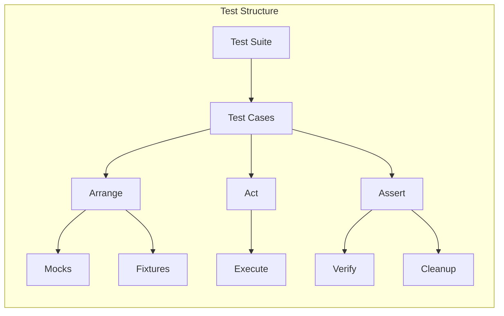

Remember: Testing is an integral part of the development process, not an afterthought. Invest time in creating and maintaining a comprehensive test suite to ensure long-term code quality and reliability.