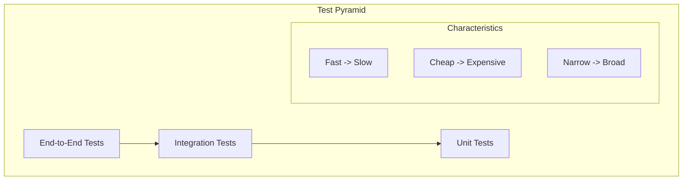
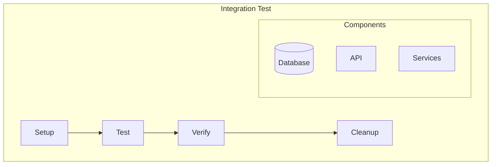
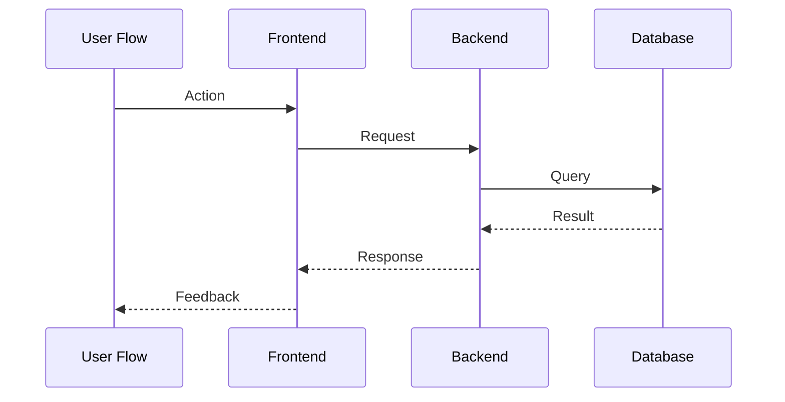
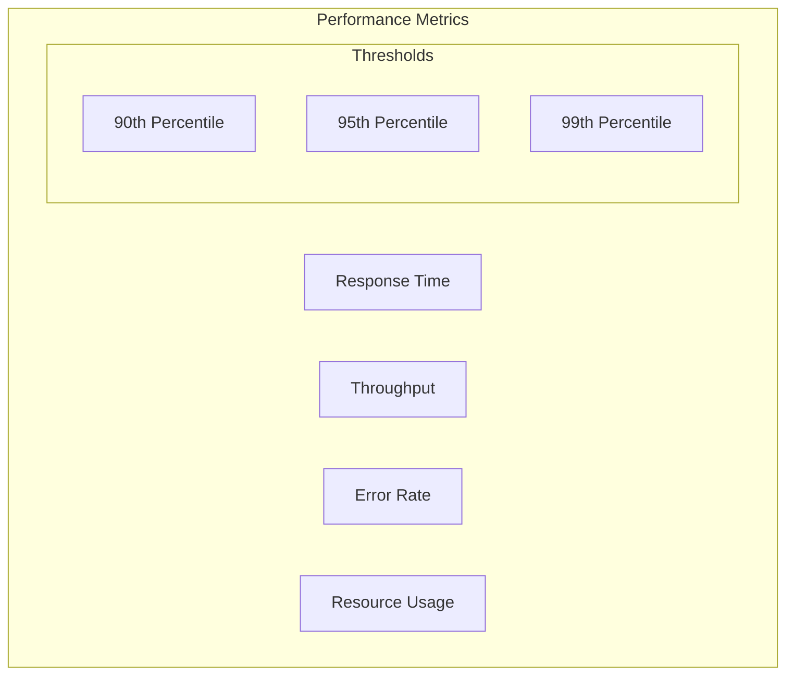
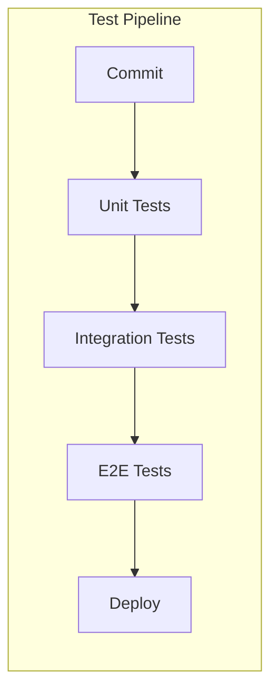

# Testing Best Practices

## Test Pyramid Structure



## 1. Unit Testing

### Principles
- Test one unit of work
- Isolate dependencies
- Fast execution
- Clear assertions

### Test Structure
```typescript
describe('Component/Unit Name', () => {
    // Setup/Teardown
    beforeEach(() => {
        // Initialize test context
    });

    it('should do something specific', () => {
        // Arrange
        // Act
        // Assert
    });
});
```

### Best Practices
1. **Naming**
   - Clear description
   - Behavior-focused
   - Consistent format

2. **Isolation**
   - Mock dependencies
   - Control environment
   - Reset state

3. **Coverage**
   - Happy path
   - Edge cases
   - Error conditions

## 2. Integration Testing

### Focus Areas
- Component interactions
- External dependencies
- Data flow
- Error handling

### Test Structure Pattern


### Best Practices
1. **Test Environment**
   - Isolated resources
   - Known state
   - Clean up after tests

2. **Data Management**
   - Test data setup
   - State management
   - Cleanup routines

## 3. End-to-End Testing

### Focus Areas
- User workflows
- System integration
- Performance
- Reliability

### Test Structure


### Framework Selection Matrix

| Framework | Use Case | Strengths | Trade-offs |
|-----------|----------|-----------|------------|
| Jest | Unit/Integration | Fast, Simple | Limited E2E |
| Cypress | E2E Web | Real browser | Single browser |
| Selenium | Cross-browser | Comprehensive | Complex setup |
| k6 | Performance | Scalable | Limited UI testing |

## 4. Performance Testing

### Types
1. **Load Testing**
   - Concurrent users
   - Response times
   - Resource usage

2. **Stress Testing**
   - System limits
   - Breaking points
   - Recovery behavior

3. **Endurance Testing**
   - Long-duration
   - Memory leaks
   - Resource degradation

### Metrics Framework


## 5. Security Testing

### Areas of Focus
1. **Authentication**
   - Login flows
   - Session management
   - Token handling

2. **Authorization**
   - Access control
   - Role permissions
   - Resource protection

3. **Data Protection**
   - Encryption
   - Input validation
   - Output encoding

### Security Test Checklist
- [ ] Authentication bypass
- [ ] Authorization checks
- [ ] Input validation
- [ ] Session management
- [ ] Data encryption
- [ ] API security
- [ ] Error handling
- [ ] Audit logging

## Test Automation Strategy

### 1. CI/CD Integration


### 2. Test Data Management
- Test data generation
- Data isolation
- Environment refresh
- Cleanup procedures

### 3. Reporting Framework
- Test results
- Coverage metrics
- Performance data
- Trend analysis

## Best Practices Summary

1. **Test Design**
   - Single responsibility
   - Clear purpose
   - Maintainable code
   - Reliable execution

2. **Test Organization**
   - Logical grouping
   - Clear hierarchy
   - Reusable components
   - Shared utilities

3. **Test Maintenance**
   - Regular updates
   - Dependency management
   - Performance optimization
   - Documentation

Remember: Testing is about confidence in the system behavior, not just code coverage.