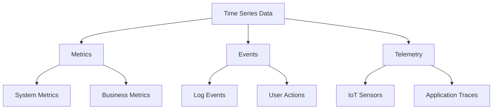
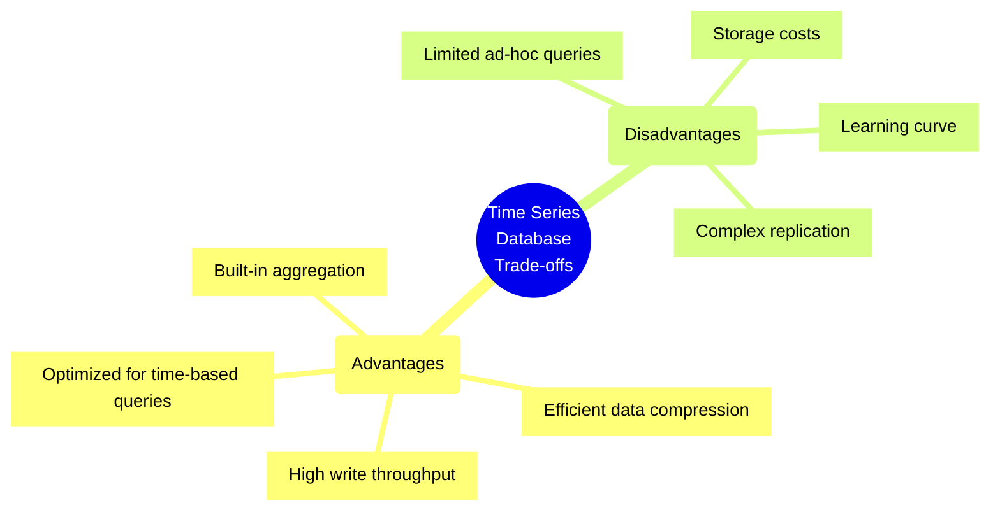

# Time Series Databases

## Overview
Time Series Databases (TSDBs) are optimized for handling time-series data: sequences of data points indexed by time.



## Key Characteristics
- Optimized for time-based queries
- High write throughput
- Efficient data compression
- Automatic data retention policies
- Built-in aggregation functions

## Common Use Cases
1. Infrastructure Monitoring
2. IoT Data Collection
3. Financial Market Data
4. Application Performance Monitoring
5. Weather Data Analysis

## Popular Time Series Databases

### InfluxDB
- Open-source
- Built-in HTTP API
- SQL-like query language (InfluxQL)
- Strong compression algorithms

### Prometheus
- Pull-based monitoring
- Powerful query language (PromQL)
- Built-in alerting
- Service discovery

### TimescaleDB
- PostgreSQL extension
- SQL interface
- Automatic partitioning
- Continuous aggregations

## Best Practices Checklist

### Data Model Design
- [ ] Use appropriate timestamp precision
- [ ] Define retention policies
- [ ] Plan for data aggregation
- [ ] Choose efficient tags/labels

### Performance Optimization
- [ ] Implement proper indexing
- [ ] Use batch writes
- [ ] Configure appropriate chunk sizes
- [ ] Plan for downsampling

### Operations
- [ ] Monitor storage usage
- [ ] Implement backup strategy
- [ ] Configure retention policies
- [ ] Plan for scaling

## Trade-offs Analysis



### When to Use
- High-frequency time-stamped data
- Need for time-based analytics
- Requirement for data retention policies
- Performance-critical time-series operations

### When Not to Use
- Complex relationships between entities
- Need for ACID transactions
- Random access patterns
- Frequent updates to historical data

## Tools and Ecosystem

### Visualization
- Grafana
- Chronograf
- Kibana

### Integration
- Telegraf
- Prometheus Exporters
- Beats

### Management
- Kapacitor (alerting)
- Continuous Queries
- Retention Policies

## Performance Considerations
1. Write Performance
   - Batch writes
   - Proper timestamp indexing
   - Efficient tag cardinality

2. Query Performance
   - Use of materialized views
   - Proper time-bucket selection
   - Index optimization

3. Storage Optimization
   - Compression algorithms
   - Data downsampling
   - Retention policies

## Security Best Practices
1. Authentication
   - Enable authentication
   - Use TLS/SSL
   - Implement role-based access

2. Network Security
   - Configure firewalls
   - Use VPCs/private networks
   - Implement IP whitelisting

3. Data Protection
   - Regular backups
   - Encryption at rest
   - Audit logging

## Sample Implementation

### Basic Data Model
```sql
// Example InfluxDB data model
measurement,tag_set field_set timestamp
cpu,host=server01,region=us-west usage_idle=98.2,usage_user=1.8 1434067467000000000
```

### Common Queries
```sql
// Example InfluxDB queries
-- Get average CPU usage by host for last hour
SELECT mean("usage_user") 
FROM "cpu" 
WHERE time > now() - 1h 
GROUP BY host, time(5m)

-- Find highest memory usage spikes
SELECT max("used_percent") 
FROM "mem" 
WHERE time > now() - 24h 
GROUP BY host
```

## Monitoring Checklist
- [ ] Query performance metrics
- [ ] Write throughput
- [ ] Storage capacity
- [ ] Compression ratio
- [ ] Cache hit ratio
- [ ] Query response times

## Disaster Recovery
1. Backup Strategy
   - Regular snapshots
   - Continuous replication
   - Point-in-time recovery

2. Recovery Procedures
   - Data restoration process
   - Service failover
   - Consistency verification

## Additional Resources
1. Documentation
   - [InfluxDB Documentation](https://docs.influxdata.com/)
   - [Prometheus Documentation](https://prometheus.io/docs/)
   - [TimescaleDB Documentation](https://docs.timescale.com/)

2. Learning Resources
   - Time Series Database Courses
   - Community Forums
   - Technical Blogs