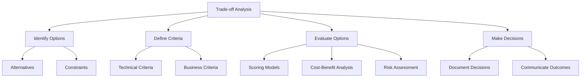

# Trade-off Analysis

## Overview
Trade-off analysis is the process of evaluating multiple options by comparing their benefits, costs, and risks to make informed decisions.



## Key Principles

### Identify Options
- List all viable alternatives.
- Consider constraints and dependencies.
- Include "do nothing" as an option.

### Define Criteria
- Use both technical and business criteria.
- Prioritize criteria based on goals.
- Ensure criteria are measurable.

### Evaluate Options
- Use scoring models for comparison.
- Perform cost-benefit analysis.
- Assess risks and trade-offs.

### Make Decisions
- Document the rationale for decisions.
- Communicate outcomes to stakeholders.
- Revisit decisions as new information arises.

## Evaluation Techniques

### Scoring Model
| Option         | Criteria 1 | Criteria 2 | Criteria 3 | Total Score |
|----------------|------------|------------|------------|-------------|
| Option A       | 8          | 7          | 9          | 24          |
| Option B       | 6          | 9          | 8          | 23          |
| Option C       | 7          | 8          | 7          | 22          |

### Cost-Benefit Analysis
| Option         | Benefits ($) | Costs ($) | Net Benefit ($) |
|----------------|--------------|-----------|-----------------|
| Option A       | 100,000      | 50,000    | 50,000          |
| Option B       | 120,000      | 70,000    | 50,000          |
| Option C       | 90,000       | 40,000    | 50,000          |

### Risk Assessment
| Option         | Risk         | Impact    | Likelihood | Mitigation Strategy |
|----------------|--------------|-----------|------------|---------------------|
| Option A       | Data Loss    | High      | Medium     | Backup Systems      |
| Option B       | Downtime     | Medium    | High       | Redundant Systems   |
| Option C       | Cost Overrun | High      | Low        | Budget Monitoring   |

## Best Practices Checklist

### Identify Options
- [ ] List all viable alternatives.
- [ ] Consider constraints and dependencies.
- [ ] Include "do nothing" as an option.

### Define Criteria
- [ ] Use both technical and business criteria.
- [ ] Prioritize criteria based on goals.
- [ ] Ensure criteria are measurable.

### Evaluate Options
- [ ] Use scoring models for comparison.
- [ ] Perform cost-benefit analysis.
- [ ] Assess risks and trade-offs.

### Make Decisions
- [ ] Document the rationale for decisions.
- [ ] Communicate outcomes to stakeholders.
- [ ] Revisit decisions as new information arises.

## Tools and Techniques

### Decision-Making Tools
- Weighted Scoring Models
- Decision Trees
- SWOT Analysis

### Collaboration Tools
- Miro for brainstorming
- Trello for tracking options
- Google Sheets for scoring models

## Common Challenges

### Identifying Options
- Overlooking alternatives: Use brainstorming sessions.
- Ignoring constraints: Validate options with stakeholders.

### Defining Criteria
- Misaligned priorities: Align with project goals.
- Unmeasurable criteria: Use quantifiable metrics.

### Evaluating Options
- Bias in scoring: Use diverse perspectives.
- Ignoring risks: Include risk assessment in evaluation.

### Making Decisions
- Lack of documentation: Use decision logs.
- Poor communication: Share outcomes with all stakeholders.

## Examples

### Decision Log
| Decision        | Rationale                          | Date       | Owner          |
|-----------------|------------------------------------|------------|----------------|
| Use Option A    | Best balance of cost and benefits | 2025-05-02 | Project Manager|
| Defer Option B  | High risk of downtime             | 2025-05-02 | Tech Lead      |

### Weighted Scoring Model
```plaintext
Criteria:
- Performance: Weight = 40%
- Cost: Weight = 30%
- Scalability: Weight = 30%

Options:
- Option A: Performance = 8, Cost = 7, Scalability = 9
- Option B: Performance = 7, Cost = 9, Scalability = 8

Scores:
- Option A: (8*0.4) + (7*0.3) + (9*0.3) = 8.1
- Option B: (7*0.4) + (9*0.3) + (8*0.3) = 7.9

Decision: Choose Option A
```

## Additional Resources
1. Books
   - "Decision Analysis for Management" by Ralph L. Keeney
   - "Smart Choices" by John S. Hammond
   - "The Art of Decision Making" by Joseph Bikart

2. Online Courses
   - Decision-Making Strategies for Leaders
   - Risk Assessment and Mitigation
   - Cost-Benefit Analysis Techniques

3. Tools
   - Excel for scoring models
   - Lucidchart for decision trees
   - Jira for tracking decisions