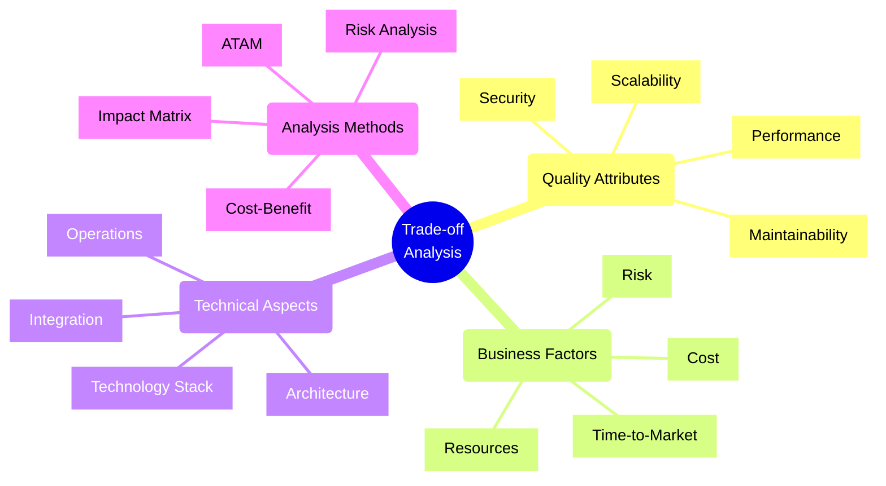
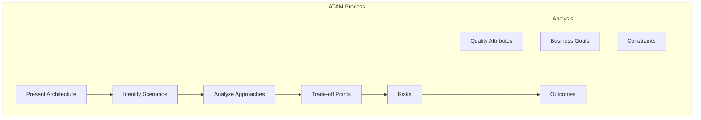
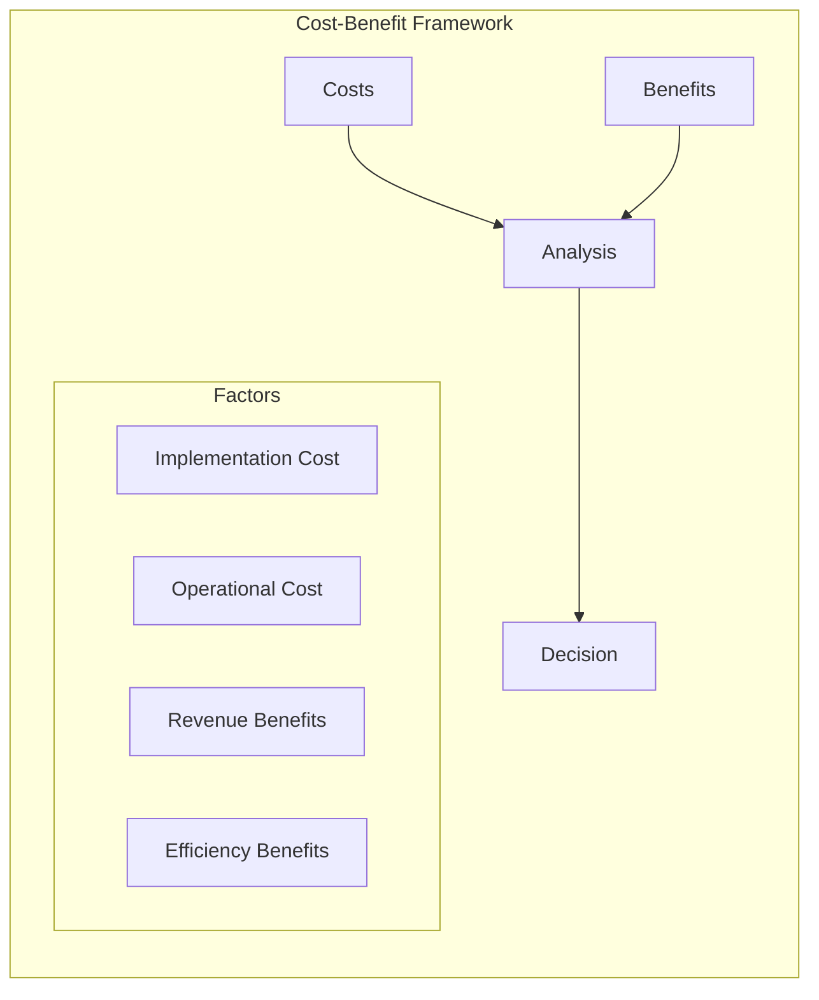
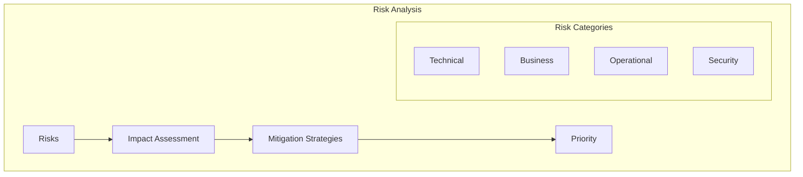
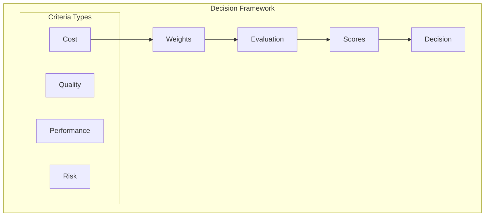

# Trade-off Analysis



## Core Analysis Methods

### 1. Architecture Trade-off Analysis Method (ATAM)



Implementation Example:
```typescript
// ATAM analysis framework
class ATAMAnalysis {
    constructor(
        private scenarios: Scenario[],
        private qualityAttributes: QualityAttribute[],
        private approaches: ArchitecturalApproach[]
    ) {}

    async analyzeArchitecture(): Promise<AnalysisResult> {
        // 1. Analyze each scenario against quality attributes
        const scenarioAnalysis = await Promise.all(
            this.scenarios.map(scenario =>
                this.analyzeScenario(scenario)
            )
        );

        // 2. Identify trade-off points
        const tradeoffs = this.identifyTradeoffs(scenarioAnalysis);

        // 3. Assess risks
        const risks = await this.assessRisks(tradeoffs);

        // 4. Generate recommendations
        const recommendations = this.generateRecommendations(
            risks,
            tradeoffs
        );

        return {
            scenarioResults: scenarioAnalysis,
            tradeoffPoints: tradeoffs,
            risks,
            recommendations
        };
    }

    private async analyzeScenario(
        scenario: Scenario
    ): Promise<ScenarioAnalysis> {
        const impacts = await Promise.all(
            this.qualityAttributes.map(attr =>
                this.assessImpact(scenario, attr)
            )
        );

        return {
            scenario,
            impacts,
            sensitivityPoints: this.findSensitivityPoints(impacts)
        };
    }
}
```

### 2. Cost-Benefit Analysis



Implementation Example:
```typescript
// Cost-benefit analysis system
class CostBenefitAnalyzer {
    async analyzeSolution(
        solution: ArchitectureSolution
    ): Promise<AnalysisResult> {
        // Calculate costs
        const implementationCost = await this.calculateImplementationCost(solution);
        const operationalCost = await this.calculateOperationalCost(solution);
        const maintenanceCost = await this.calculateMaintenanceCost(solution);

        const totalCost = implementationCost + operationalCost + maintenanceCost;

        // Calculate benefits
        const directBenefits = await this.calculateDirectBenefits(solution);
        const indirectBenefits = await this.calculateIndirectBenefits(solution);
        const strategicValue = await this.calculateStrategicValue(solution);

        const totalBenefits = directBenefits + indirectBenefits + strategicValue;

        // Calculate ROI and payback period
        const roi = this.calculateROI(totalBenefits, totalCost);
        const paybackPeriod = this.calculatePaybackPeriod(totalBenefits, totalCost);

        return {
            costs: {
                implementation: implementationCost,
                operational: operationalCost,
                maintenance: maintenanceCost,
                total: totalCost
            },
            benefits: {
                direct: directBenefits,
                indirect: indirectBenefits,
                strategic: strategicValue,
                total: totalBenefits
            },
            metrics: {
                roi,
                paybackPeriod,
                benefitCostRatio: totalBenefits / totalCost
            }
        };
    }
}
```

### 3. Risk-Impact Analysis



Implementation Example:
```typescript
// Risk analysis framework
class RiskAnalyzer {
    async analyzeRisks(
        solution: ArchitectureSolution
    ): Promise<RiskAnalysis> {
        // Identify risks across categories
        const technicalRisks = await this.identifyTechnicalRisks(solution);
        const businessRisks = await this.identifyBusinessRisks(solution);
        const operationalRisks = await this.identifyOperationalRisks(solution);
        
        // Assess impact and probability
        const riskAssessments = await Promise.all([
            ...technicalRisks,
            ...businessRisks,
            ...operationalRisks
        ].map(risk => this.assessRisk(risk)));

        // Prioritize risks
        const prioritizedRisks = this.prioritizeRisks(riskAssessments);

        // Develop mitigation strategies
        const mitigationStrategies = await this.developMitigationStrategies(
            prioritizedRisks
        );

        return {
            risks: prioritizedRisks,
            mitigationStrategies,
            riskMatrix: this.generateRiskMatrix(prioritizedRisks),
            recommendations: this.generateRecommendations(
                prioritizedRisks,
                mitigationStrategies
            )
        };
    }

    private async assessRisk(risk: Risk): Promise<RiskAssessment> {
        const impact = await this.calculateImpact(risk);
        const probability = await this.calculateProbability(risk);
        const severity = impact * probability;

        return {
            risk,
            impact,
            probability,
            severity,
            category: this.categorizeRisk(severity)
        };
    }
}
```

## Decision Making Framework

### 1. Multi-Criteria Decision Analysis



Implementation Example:
```typescript
// Multi-criteria decision analysis
class DecisionAnalyzer {
    constructor(
        private criteria: DecisionCriterion[],
        private weights: Map<string, number>
    ) {}

    async evaluateOptions(
        options: ArchitectureOption[]
    ): Promise<DecisionResult> {
        // Evaluate each option against criteria
        const evaluations = await Promise.all(
            options.map(option =>
                this.evaluateOption(option)
            )
        );

        // Calculate weighted scores
        const scores = evaluations.map(eval => ({
            option: eval.option,
            score: this.calculateWeightedScore(eval)
        }));

        // Rank options
        const rankedOptions = this.rankOptions(scores);

        // Generate decision matrix
        const decisionMatrix = this.generateDecisionMatrix(
            evaluations,
            scores
        );

        return {
            evaluations,
            scores,
            rankedOptions,
            decisionMatrix,
            recommendation: rankedOptions[0]
        };
    }

    private calculateWeightedScore(
        evaluation: OptionEvaluation
    ): number {
        return this.criteria.reduce((score, criterion) => {
            const weight = this.weights.get(criterion.id) || 0;
            const value = evaluation.scores.get(criterion.id) || 0;
            return score + (weight * value);
        }, 0);
    }
}
```

## Best Practices

1. **Analysis Process**
   - Document assumptions
   - Use quantitative metrics
   - Consider all stakeholders
   - Review historical data

2. **Decision Making**
   - Use structured methods
   - Consider multiple perspectives
   - Document rationale
   - Plan for iterations

3. **Risk Management**
   - Identify early
   - Assess thoroughly
   - Plan mitigations
   - Monitor continuously

4. **Communication**
   - Present clear options
   - Show analysis methods
   - Explain trade-offs
   - Get stakeholder input

Remember: Trade-off analysis is crucial for making informed architectural decisions. Always consider multiple factors, document your reasoning, and involve stakeholders in the decision-making process.