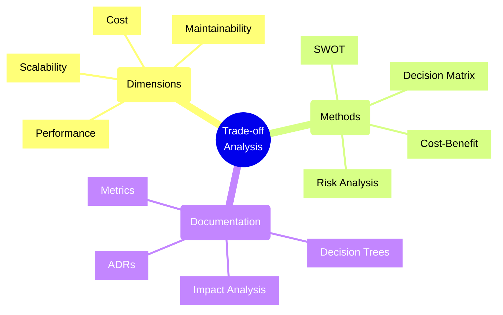
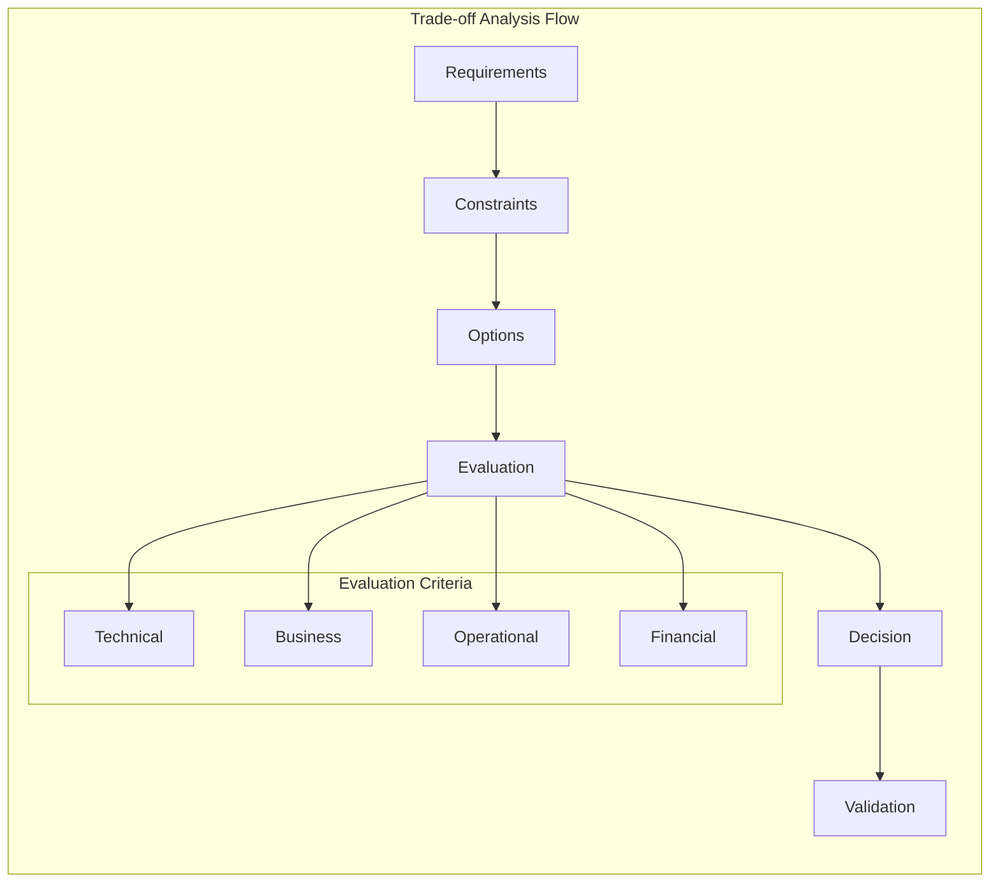
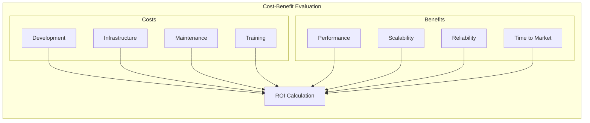
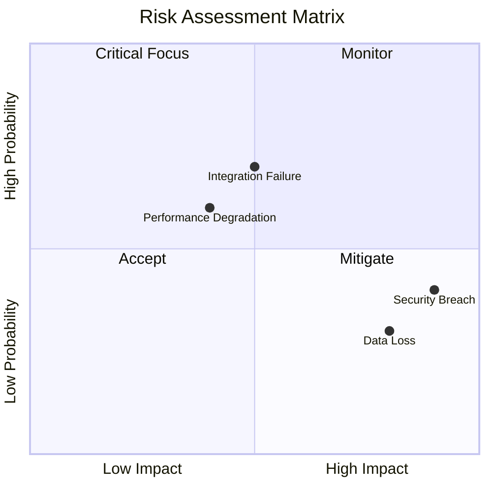
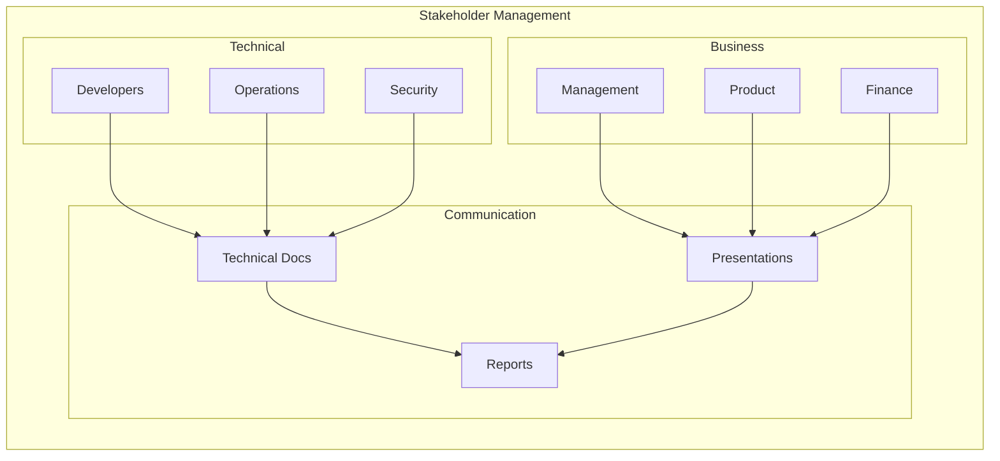

# Trade-off Analysis in Software Architecture



## Decision-Making Framework

### 1. Analysis Process



## Decision Documentation

### 1. Architecture Decision Record (ADR)

```markdown
# ADR Template

## Title
Brief decision title

## Status
[Proposed, Accepted, Deprecated, Superseded]

## Context
- Business requirements
- Technical constraints
- Environmental factors

## Options Considered
1. Option A
   - Pros: [List advantages]
   - Cons: [List disadvantages]
2. Option B
   - Pros: [List advantages]
   - Cons: [List disadvantages]

## Decision
Chosen option and rationale

## Consequences
- Positive impacts
- Negative impacts
- Risks and mitigations
```

### 2. Decision Matrix Example
```typescript
interface Option {
    name: string;
    scores: {
        performance: number;
        cost: number;
        maintainability: number;
        scalability: number;
        security: number;
    };
}

class DecisionMatrix {
    private weights = {
        performance: 0.3,
        cost: 0.2,
        maintainability: 0.2,
        scalability: 0.2,
        security: 0.1
    };

    evaluateOptions(options: Option[]): Option {
        return options.reduce((best, current) => {
            const currentScore = this.calculateWeightedScore(current);
            const bestScore = this.calculateWeightedScore(best);
            return currentScore > bestScore ? current : best;
        });
    }

    private calculateWeightedScore(option: Option): number {
        return Object.entries(option.scores)
            .reduce((total, [criterion, score]) => {
                return total + score * this.weights[criterion];
            }, 0);
    }
}
```

## Analysis Patterns

### 1. Cost-Benefit Analysis



### 2. SWOT Analysis Template
```typescript
interface SWOTAnalysis {
    strengths: string[];
    weaknesses: string[];
    opportunities: string[];
    threats: string[];
}

class ArchitectureAnalysis {
    performSWOT(option: string): SWOTAnalysis {
        return {
            strengths: [
                "High performance",
                "Scalable architecture",
                "Modern technology stack"
            ],
            weaknesses: [
                "Complex deployment",
                "Learning curve",
                "Higher initial cost"
            ],
            opportunities: [
                "Future extensibility",
                "Market advantages",
                "Innovation potential"
            ],
            threats: [
                "Technology obsolescence",
                "Security vulnerabilities",
                "Vendor lock-in"
            ]
        };
    }
}
```

## Risk Assessment

### 1. Risk Matrix



### 2. Risk Assessment Implementation
```typescript
class RiskAssessment {
    private risks: Map<string, Risk> = new Map();

    addRisk(risk: Risk): void {
        const score = this.calculateRiskScore(risk);
        risk.score = score;
        risk.category = this.categorizeRisk(score);
        this.risks.set(risk.id, risk);
    }

    private calculateRiskScore(risk: Risk): number {
        return risk.probability * risk.impact;
    }

    private categorizeRisk(score: number): RiskCategory {
        if (score >= 0.7) return 'Critical';
        if (score >= 0.4) return 'High';
        if (score >= 0.2) return 'Medium';
        return 'Low';
    }

    getMitigationPlan(): MitigationAction[] {
        return Array.from(this.risks.values())
            .filter(risk => risk.category === 'Critical' || risk.category === 'High')
            .map(risk => this.createMitigationAction(risk));
    }
}
```

## Communication Strategies

### 1. Stakeholder Analysis



## Best Practices

1. **Decision Process**
   - Gather comprehensive data
   - Consider multiple perspectives
   - Document assumptions
   - Validate decisions

2. **Stakeholder Management**
   - Identify key stakeholders
   - Tailor communication
   - Build consensus
   - Maintain transparency

3. **Documentation**
   - Use clear templates
   - Include context
   - Document alternatives
   - Track decisions

4. **Review Process**
   - Regular reviews
   - Measure outcomes
   - Learn from experience
   - Adjust approach

Remember: Trade-off analysis is not about finding perfect solutions, but about making well-informed decisions that balance competing concerns and stakeholder needs.