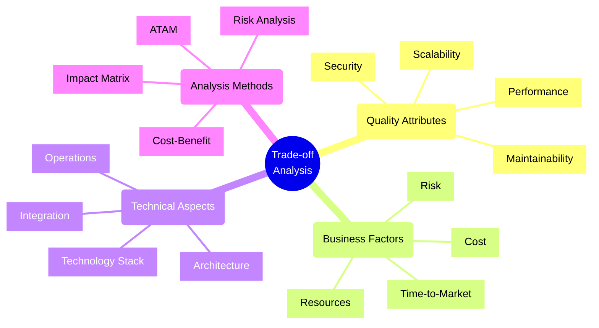
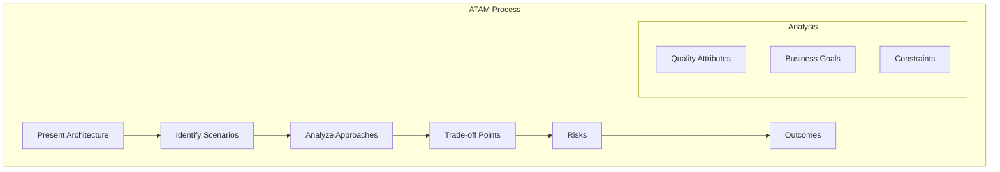
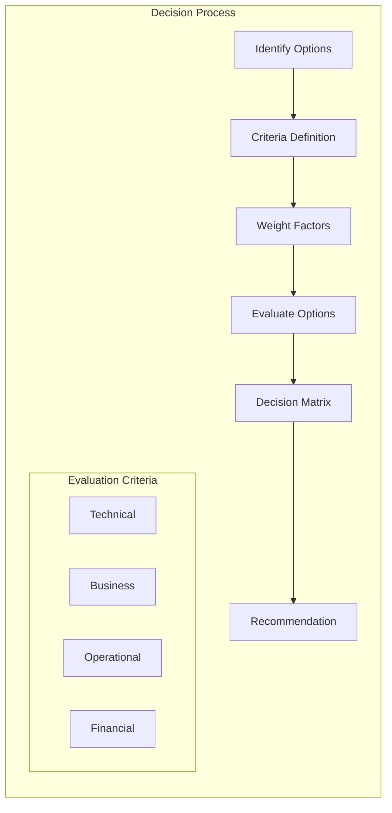

# Trade-off Analysis

## Core Analysis Methods

### 1. Architecture Trade-off Analysis Method (ATAM)

## Implementation Checklist

### ATAM Analysis
- [ ] Present architecture overview
- [ ] Identify business drivers
- [ ] Document quality attributes
- [ ] Generate utility tree
- [ ] Analyze architectural approaches
- [ ] Brainstorm scenarios
- [ ] Prioritize scenarios
- [ ] Analyze risks and trade-offs
- [ ] Present findings

### Cost-Benefit Analysis
- [ ] Identify costs
  - [ ] Implementation costs
  - [ ] Operational costs
  - [ ] Maintenance costs
  - [ ] Training costs
- [ ] Identify benefits
  - [ ] Direct benefits
  - [ ] Indirect benefits
  - [ ] Strategic value
- [ ] Calculate ROI
- [ ] Document assumptions
- [ ] Validate with stakeholders

### Risk Analysis
- [ ] Identify risks
  - [ ] Technical risks
  - [ ] Business risks
  - [ ] Operational risks
  - [ ] Security risks
- [ ] Assess impact
- [ ] Evaluate probability
- [ ] Develop mitigation strategies
- [ ] Monitor and review

## Common Trade-offs Matrix

### Performance vs. Cost
- **High Performance**
  - Pros:
    * Better user experience
    * Higher throughput
    * Improved reliability
  - Cons:
    * Higher infrastructure costs
    * More complex architecture
    * Increased maintenance

### Security vs. Usability
- **High Security**
  - Pros:
    * Better protection
    * Compliance adherence
    * Reduced risk
  - Cons:
    * User friction
    * Lower adoption
    * Higher complexity

### Time-to-Market vs. Quality
- **Fast Delivery**
  - Pros:
    * Earlier market entry
    * Faster feedback
    * Competitive advantage
  - Cons:
    * Technical debt
    * Potential bugs
    * Limited features

### Scalability vs. Simplicity
- **High Scalability**
  - Pros:
    * Better growth handling
    * Improved reliability
    * Future-proof
  - Cons:
    * Higher complexity
    * Increased costs
    * More maintenance

## Decision Making Framework

## Best Practices

1. **Analysis Process**
   - Document assumptions
   - Use quantitative metrics
   - Consider all stakeholders
   - Review historical data
   - Validate decisions
   - Plan for iterations
   - Monitor outcomes

2. **Decision Making**
   - Use structured methods
   - Consider multiple perspectives
   - Document rationale
   - Get stakeholder input
   - Define clear criteria
   - Set review points
   - Plan for changes

3. **Risk Management**
   - Identify early
   - Assess thoroughly
   - Plan mitigations
   - Monitor continuously
   - Review regularly
   - Update strategies
   - Document lessons

4. **Communication**
   - Present clear options
   - Show analysis methods
   - Explain trade-offs
   - Get stakeholder input
   - Document decisions
   - Share outcomes
   - Review feedback

## Quality Attributes Assessment

| Attribute | Metrics | Trade-offs | Priority |
|-----------|---------|------------|----------|
| Performance | Response Time, Throughput | Cost, Complexity | High |
| Security | Vulnerabilities, Compliance | Usability, Cost | High |
| Maintainability | Change Cost, Tech Debt | Development Speed | Medium |
| Scalability | Load Handling, Cost Efficiency | Complexity, Cost | High |
| Reliability | Uptime, MTBF | Cost, Complexity | High |
| Usability | User Satisfaction, Adoption | Security, Cost | Medium |

Remember: Trade-off analysis is crucial for making informed architectural decisions. Always consider multiple factors, document your reasoning, and involve stakeholders in the decision-making process.