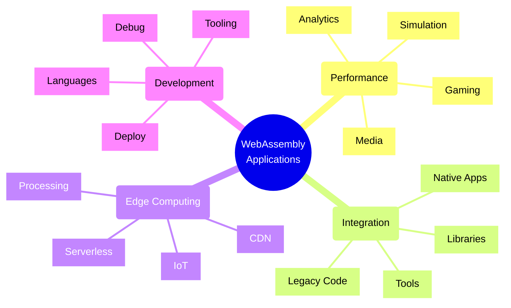
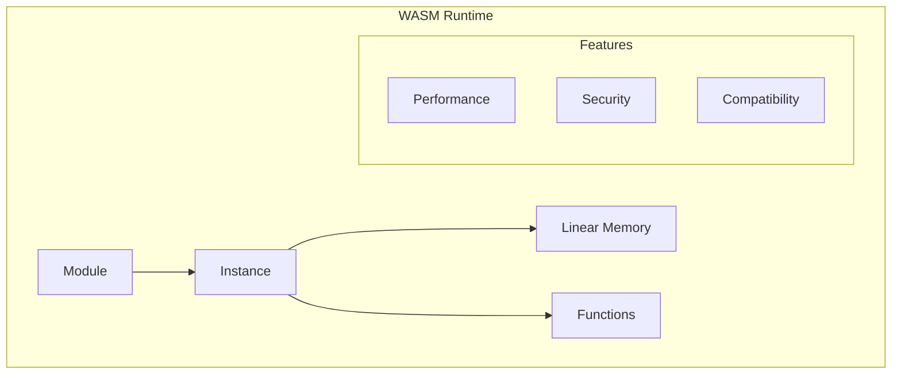
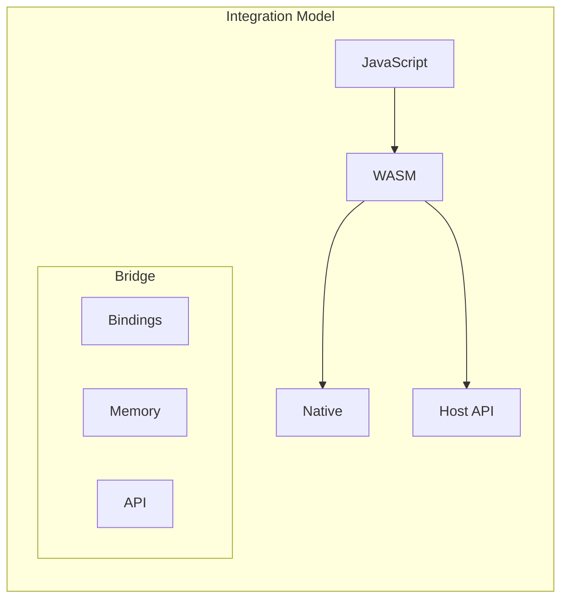

# WebAssembly Use Cases



## Core Architecture Components

### 1. WebAssembly Runtime



### 2. Integration Architecture



## Implementation Patterns

### 1. JavaScript Integration Pattern
```typescript
interface WasmModule {
    instance: WebAssembly.Instance;
    memory: WebAssembly.Memory;
    exports: WasmExports;
}

class WasmService {
    constructor(
        private module: WasmModule,
        private memory: SharedArrayBuffer,
        private importObject: WebAssembly.Imports
    ) {}

    async initialize(): Promise<void> {
        // Load and instantiate
        const response = await fetch('module.wasm');
        const bytes = await response.arrayBuffer();
        const result = await WebAssembly.instantiate(bytes, this.importObject);
        
        // Setup memory and exports
        this.setupMemory(result.instance);
        this.setupExports(result.instance);
    }

    private setupMemory(instance: WebAssembly.Instance): void {
        // Configure shared memory
        const memory = instance.exports.memory as WebAssembly.Memory;
        this.memory = memory.buffer;
    }
}
```

### 2. Performance Critical Operations Pattern
```typescript
interface ComputeTask {
    input: Float64Array;
    output: Float64Array;
    operation: OperationType;
}

class WasmCompute {
    constructor(
        private wasmModule: WasmModule,
        private workerPool: WorkerPool
    ) {}

    async processData(task: ComputeTask): Promise<void> {
        // Prepare memory
        const inputPtr = await this.allocateMemory(task.input.length);
        const outputPtr = inputPtr + task.input.length * 8;
        
        // Copy input data
        new Float64Array(this.wasmModule.memory.buffer)
            .set(task.input, inputPtr / 8);
        
        // Process data
        await this.wasmModule.exports.processData(
            inputPtr,
            outputPtr,
            task.input.length,
            task.operation
        );
        
        // Copy output
        task.output.set(
            new Float64Array(
                this.wasmModule.memory.buffer,
                outputPtr,
                task.input.length
            )
        );
    }
}
```

## Common Use Cases

### 1. High-Performance Computing
- Scientific simulations
- 3D rendering
- Video processing
- Data analytics
- Machine learning
- Image processing

### 2. Legacy Code Migration
- C/C++ libraries
- Gaming engines
- Media codecs
- Compression tools
- Cryptography
- Math libraries

### 3. Edge Computing
- Data processing
- Content filtering
- Code execution
- Media encoding
- Security scanning
- Analytics

### 4. Gaming
- Game engines
- Physics simulation
- AI/pathfinding
- Asset loading
- Audio processing
- State management

## Implementation Framework

### Module Types
| Type | Use Case | Benefits | Considerations |
|------|----------|----------|----------------|
| Compute | Number crunching | Performance | Memory management |
| Codec | Media processing | Standards | Binary size |
| Game | Interactive content | Speed | Integration |
| Tool | Development | Reuse | Complexity |

### Integration Methods
| Method | Scenario | Pros | Cons |
|--------|----------|------|------|
| Direct | Simple apps | Easy | Limited |
| Workers | Heavy compute | Parallel | Overhead |
| Streaming | Media | Efficient | Complex |
| Dynamic | Plugins | Flexible | Security |

## Azure WebAssembly Implementation

### 1. Edge Computing
- Azure CDN integration
- Edge Functions
- Static Web Apps
- Container Apps
- IoT Edge modules

### 2. Development Tools
- VS Code support
- Azure DevOps
- GitHub Actions
- Container registry
- Application Insights

### 3. Hosting Options
- App Service
- Container Apps
- Static Web Apps
- Functions
- Edge zones

## Best Practices

### 1. Module Design
- Small module size
- Clear interfaces
- Memory efficiency
- Error handling
- Performance focus
- Security checks
- Documentation

### 2. Integration Design
- Proper bindings
- Memory management
- Error handling
- Type safety
- Performance
- Worker usage
- Testing

### 3. Operations
- Module loading
- Memory monitoring
- Performance tracking
- Error logging
- Version control
- Security updates
- Health checks

Remember:
- Performance first
- Memory management
- Type safety
- Error handling
- Security focus
- Clear interfaces
- Good testing