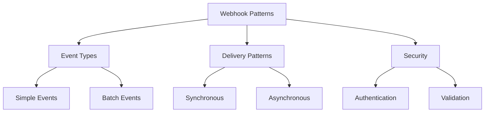
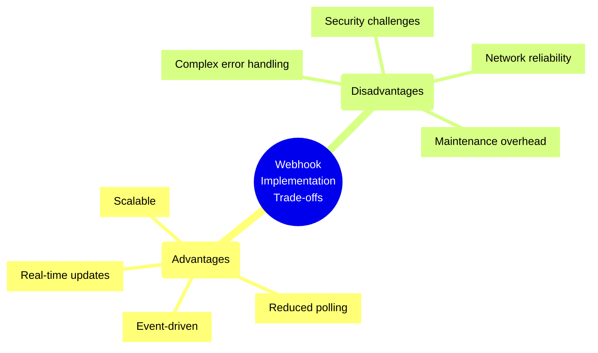
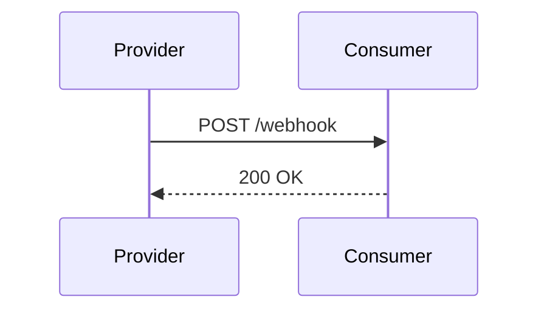
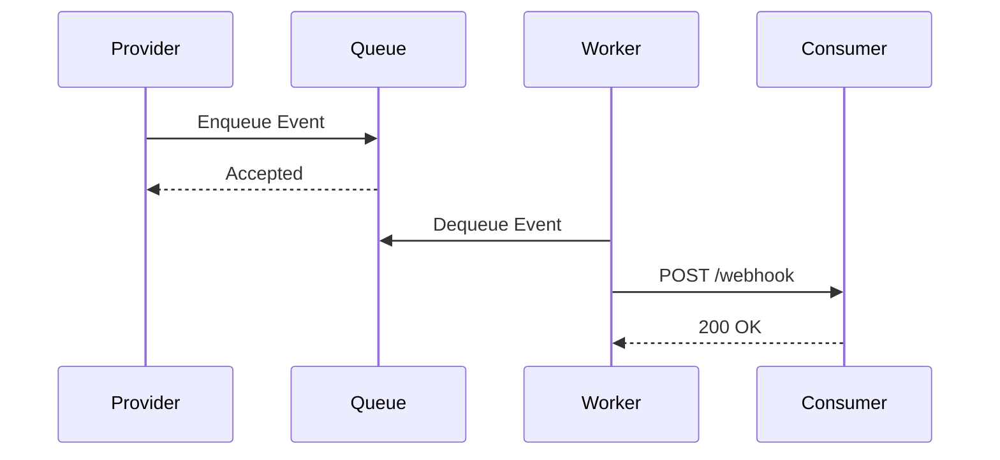
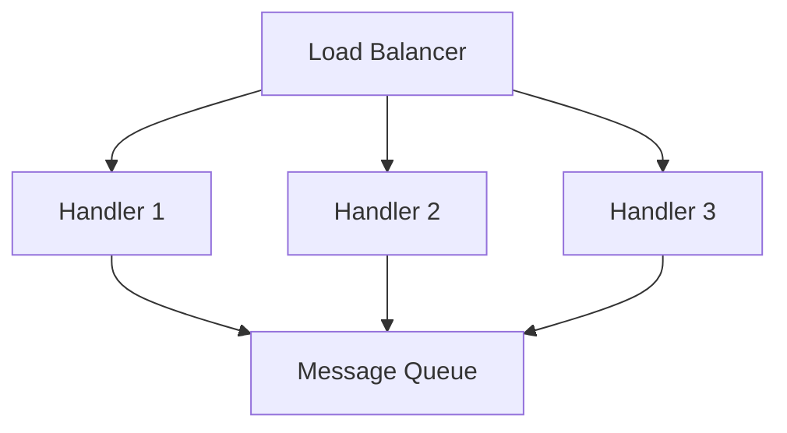

# Webhook Implementation Patterns

## Overview
Webhooks are user-defined HTTP callbacks that enable real-time, event-driven communication between systems.



## Core Concepts

### Event Structure
```json
{
  "id": "evt_123456789",
  "type": "order.created",
  "created": "2025-05-02T10:00:00Z",
  "data": {
    "order_id": "ord_987654321",
    "amount": 99.99,
    "currency": "USD"
  }
}
```

## Best Practices Checklist

### Design
- [ ] Use unique event IDs
- [ ] Include timestamps
- [ ] Provide event types
- [ ] Version payloads
- [ ] Define retry policies

### Security
- [ ] Implement HMAC signing
- [ ] Use HTTPS only
- [ ] Validate payloads
- [ ] Rate limit requests
- [ ] Authenticate senders

### Reliability
- [ ] Implement retries
- [ ] Use delivery queues
- [ ] Monitor failures
- [ ] Log attempts
- [ ] Handle duplicates

## Implementation Patterns

### Simple Webhook Handler
```python
from flask import Flask, request
import hmac
import hashlib

app = Flask(__name__)

@app.route('/webhook', methods=['POST'])
def webhook_handler():
    # Verify signature
    signature = request.headers.get('X-Webhook-Signature')
    payload = request.get_data()
    expected_signature = hmac.new(
        key=b'your_secret_key',
        msg=payload,
        digestmod=hashlib.sha256
    ).hexdigest()
    
    if not hmac.compare_digest(signature, expected_signature):
        return 'Invalid signature', 401
        
    # Process the webhook
    event = request.json
    event_type = event['type']
    
    if event_type == 'order.created':
        process_order(event['data'])
    
    return 'OK', 200
```

## Trade-offs Analysis



## Delivery Patterns

### Synchronous Delivery


### Asynchronous Delivery


## Security Implementation

### HMAC Signature Generation
```javascript
const crypto = require('crypto');

function generateSignature(payload, secret) {
  return crypto
    .createHmac('sha256', secret)
    .update(JSON.stringify(payload))
    .digest('hex');
}

function verifySignature(payload, signature, secret) {
  const expectedSignature = generateSignature(payload, secret);
  return crypto.timingSafeEqual(
    Buffer.from(signature),
    Buffer.from(expectedSignature)
  );
}
```

## Retry Strategies

### Exponential Backoff
```python
import time
from typing import Callable

def retry_with_backoff(
    func: Callable,
    max_retries: int = 5,
    initial_delay: float = 1.0
) -> None:
    retries = 0
    delay = initial_delay
    
    while retries < max_retries:
        try:
            return func()
        except Exception as e:
            retries += 1
            if retries == max_retries:
                raise e
            
            time.sleep(delay)
            delay *= 2  # Exponential backoff
```

## Monitoring and Observability

### Key Metrics
- Delivery success rate
- Response time
- Error rates
- Retry counts
- Payload size
- Queue depth

### Logging Example
```python
import logging

logging.basicConfig(level=logging.INFO)
logger = logging.getLogger(__name__)

def log_webhook_event(event_id: str, status: str, attempt: int):
    logger.info(
        'Webhook delivery: id=%s status=%s attempt=%d',
        event_id, status, attempt
    )
```

## Error Handling Patterns

### HTTP Status Codes
- 200: Success
- 201: Created
- 4xx: Client errors
- 5xx: Server errors

### Common Error Scenarios
1. Network Failures
   - Connection timeouts
   - DNS failures
   - SSL errors

2. Application Errors
   - Invalid payload
   - Authentication failures
   - Rate limiting

## Testing Strategies

### Local Development
```python
# Mock webhook sender
def mock_webhook_sender(url: str, payload: dict):
    signature = generate_signature(payload)
    headers = {'X-Webhook-Signature': signature}
    
    response = requests.post(
        url,
        json=payload,
        headers=headers
    )
    return response
```

### Integration Testing
```python
def test_webhook_handler():
    payload = {
        'id': 'test_123',
        'type': 'test.event',
        'data': {'foo': 'bar'}
    }
    
    response = mock_webhook_sender(
        'http://localhost:8000/webhook',
        payload
    )
    
    assert response.status_code == 200
```

## Scaling Considerations

### Load Balancing


### Rate Limiting
```python
from flask import Flask
from flask_limiter import Limiter

app = Flask(__name__)
limiter = Limiter(app)

@app.route('/webhook')
@limiter.limit('100/minute')
def webhook_handler():
    # Handler implementation
    pass
```

## Best Practices Examples

### Payload Validation
```typescript
interface WebhookPayload {
  id: string;
  type: string;
  timestamp: string;
  data: Record<string, unknown>;
}

function validatePayload(payload: unknown): payload is WebhookPayload {
  if (!payload || typeof payload !== 'object') {
    return false;
  }
  
  const p = payload as WebhookPayload;
  return (
    typeof p.id === 'string' &&
    typeof p.type === 'string' &&
    typeof p.timestamp === 'string' &&
    p.data !== null &&
    typeof p.data === 'object'
  );
}
```

## Additional Resources
1. Documentation
   - [Webhook Security Best Practices](https://webhooks.fyi)
   - [GitHub Webhooks Guide](https://docs.github.com/webhooks)
   - [Stripe Webhooks Documentation](https://stripe.com/docs/webhooks)

2. Learning Resources
   - Event-Driven Architecture
   - API Security
   - Distributed Systems
   - Error Handling Patterns