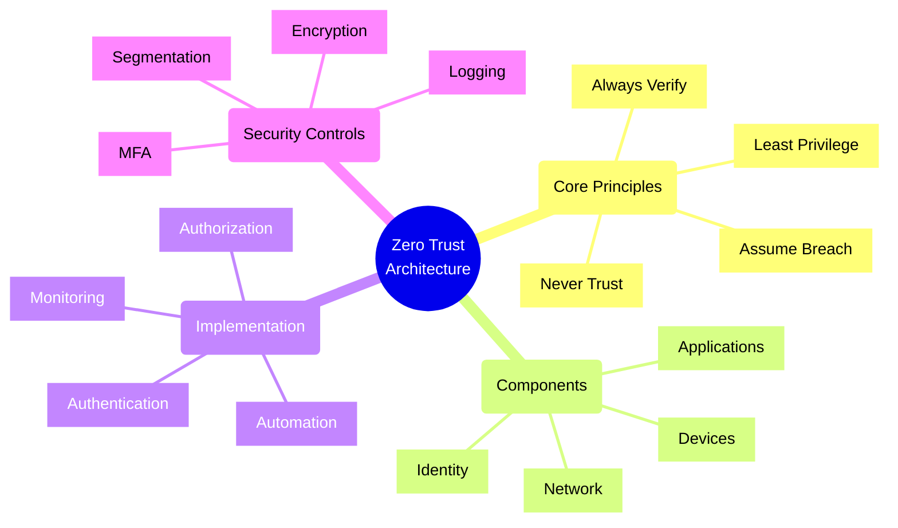
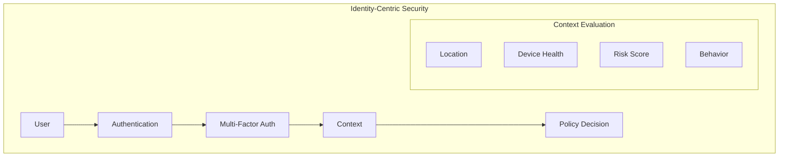
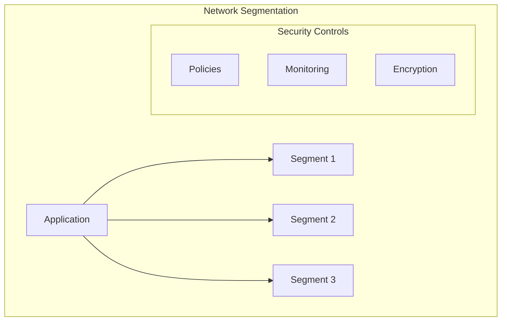
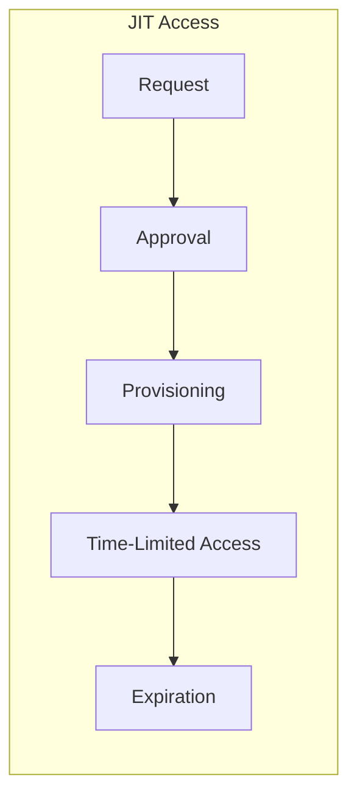
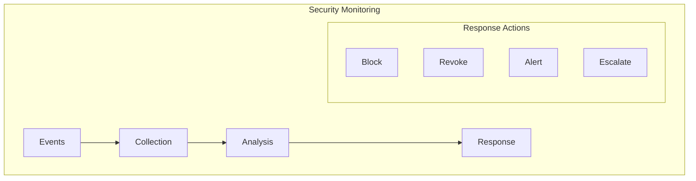

# Zero Trust Architecture Principles

## Core Zero Trust Principles

### 1. Identity as the New Perimeter

### 2. Micro-Segmentation

### 3. Just-In-Time Access

### 4. Continuous Monitoring

## Implementation Checklist

### Identity and Access Management
- [ ] Implement strong MFA
- [ ] Configure Conditional Access policies
- [ ] Enable Just-In-Time access
- [ ] Set up identity protection
- [ ] Configure risk-based authentication
- [ ] Implement session management
- [ ] Set up privileged identity management

### Network Security
- [ ] Implement micro-segmentation
- [ ] Configure network monitoring
- [ ] Set up traffic encryption
- [ ] Deploy network analytics
- [ ] Configure access controls
- [ ] Enable DDoS protection
- [ ] Implement network isolation

### Device Security
- [ ] Enable device registration
- [ ] Implement compliance policies
- [ ] Configure device health checks
- [ ] Set up device monitoring
- [ ] Enable automatic updates
- [ ] Configure device encryption
- [ ] Implement endpoint protection

### Data Security
- [ ] Enable data encryption
- [ ] Implement access controls
- [ ] Set up data classification
- [ ] Configure data monitoring
- [ ] Enable DLP policies
- [ ] Implement backup policies
- [ ] Configure audit logging

## Trade-offs

### Security vs. Usability
- **High Security**
  - Pros: Better protection, reduced risk
  - Cons: More friction, reduced productivity

### Granular Control vs. Management Overhead
- **Fine-grained Control**
  - Pros: Precise access control, better security
  - Cons: Complex management, higher costs

### Real-time Monitoring vs. Performance
- **Continuous Monitoring**
  - Pros: Quick detection, better response
  - Cons: Resource intensive, potential latency

### Automation vs. Flexibility
- **High Automation**
  - Pros: Consistent enforcement, reduced human error
  - Cons: Less adaptability, potential false positives

## Best Practices

1. **Design Principles**
   - Verify explicitly
   - Use least privilege access
   - Assume breach
   - Verify end-to-end

2. **Security Controls**
   - Implement MFA everywhere
   - Enable continuous monitoring
   - Use automation
   - Regular auditing

3. **Operational Security**
   - Monitor continuously
   - Respond automatically
   - Update regularly
   - Train users

4. **Compliance**
   - Document controls
   - Regular assessments
   - Policy enforcement
   - Audit logging

Remember: Zero Trust is a journey, not a destination. Continuously evaluate and improve your security posture, and always verify every access request regardless of source.