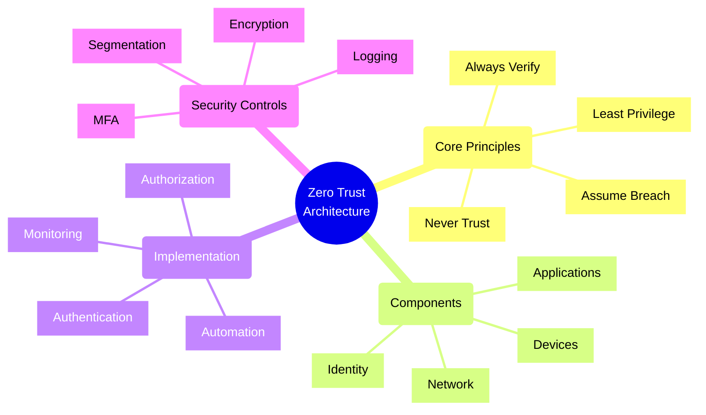
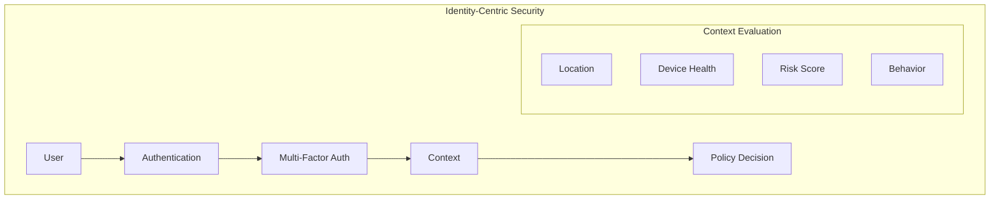
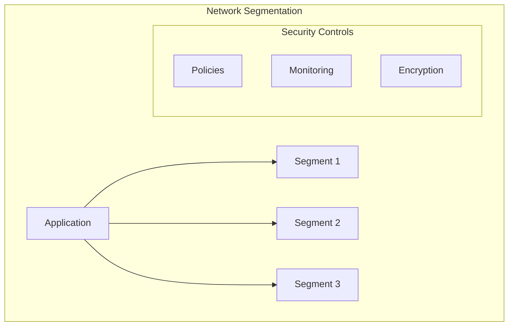
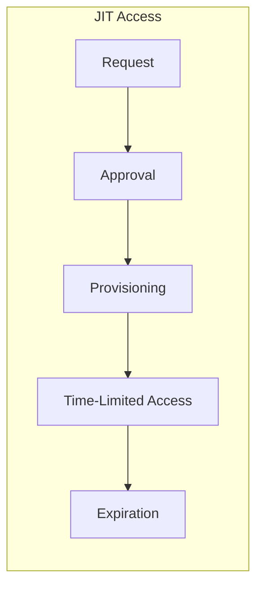
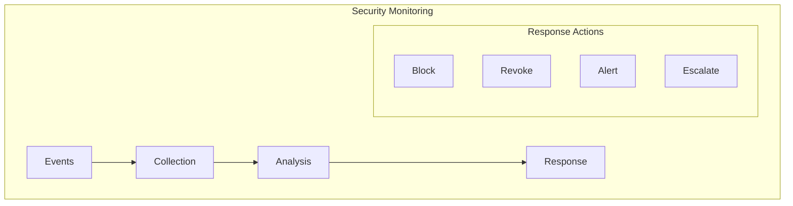

# Zero Trust Architecture Principles



## Core Zero Trust Principles

### 1. Identity as the New Perimeter



Implementation Example (Azure AD):
```typescript
// Zero Trust authentication implementation
class ZeroTrustAuthenticator {
    constructor(
        private identityProvider: AzureAD,
        private deviceManager: IntuneMDM,
        private riskEngine: RiskAssessmentEngine
    ) {}

    async authenticateRequest(
        request: AuthRequest
    ): Promise<AuthResult> {
        // 1. Verify identity with MFA
        const identity = await this.verifyIdentity(request);
        
        // 2. Check device compliance
        const device = await this.verifyDevice(request.deviceId);
        
        // 3. Assess risk
        const riskScore = await this.assessRisk(request, identity);
        
        // 4. Apply conditional access
        const accessDecision = await this.evaluateAccess({
            identity,
            device,
            riskScore,
            request
        });

        return this.generateAuthResult(accessDecision);
    }

    private async verifyIdentity(request: AuthRequest): Promise<Identity> {
        const authResult = await this.identityProvider.authenticate({
            username: request.username,
            requireMfa: true,
            contextData: {
                location: request.location,
                deviceId: request.deviceId,
                applicationId: request.applicationId
            }
        });

        if (!authResult.mfaCompleted) {
            throw new AuthenticationError('MFA required');
        }

        return authResult.identity;
    }
}
```

### 2. Micro-Segmentation



Implementation Example:
```typescript
// Network segmentation with Azure NSGs
class NetworkSegmentation {
    async createSegmentationPolicy(
        segment: NetworkSegment
    ): Promise<SecurityPolicy> {
        const policy = new SecurityPolicy({
            name: `${segment.name}-policy`,
            rules: [
                // Allow only necessary inbound traffic
                {
                    name: 'allow-internal',
                    priority: 100,
                    direction: 'Inbound',
                    source: segment.trusted_sources,
                    destination: segment.resources,
                    ports: segment.required_ports,
                    protocol: 'Tcp',
                    access: 'Allow'
                },
                // Default deny all
                {
                    name: 'deny-all',
                    priority: 1000,
                    direction: 'Inbound',
                    source: '*',
                    destination: '*',
                    access: 'Deny'
                }
            ],
            // Enable flow logs for monitoring
            flowLogs: {
                enabled: true,
                retentionDays: 90
            }
        });

        await this.applyEncryption(segment);
        await this.setupMonitoring(segment);
        
        return policy;
    }
}
```

### 3. Just-In-Time Access



Implementation Example:
```typescript
// Just-In-Time access control
class JITAccessManager {
    constructor(
        private readonly accessControl: AccessControl,
        private readonly monitoring: SecurityMonitoring
    ) {}

    async requestAccess(
        request: AccessRequest
    ): Promise<AccessGrant> {
        // 1. Validate request
        await this.validateRequest(request);
        
        // 2. Check approvals
        const approval = await this.getApprovals(request);
        
        // 3. Generate time-limited credentials
        const credentials = await this.generateTimeLimit({
            userId: request.userId,
            resource: request.resource,
            duration: request.duration,
            approvals: approval
        });

        // 4. Set up monitoring
        await this.setupAccessMonitoring(credentials);

        // 5. Schedule automatic revocation
        await this.scheduleRevocation(credentials);

        return {
            credentials,
            expiration: credentials.expiration,
            monitoring: this.getMonitoringInfo(credentials)
        };
    }

    private async setupAccessMonitoring(
        credentials: TimeBasedCredentials
    ): Promise<void> {
        await this.monitoring.createAlert({
            name: `jit-access-${credentials.id}`,
            conditions: [
                {
                    type: 'ActivityLog',
                    level: 'Critical',
                    status: 'Started',
                    operation: credentials.allowedOperations
                }
            ],
            actions: [
                {
                    type: 'Email',
                    recipients: ['security-team@company.com']
                },
                {
                    type: 'Webhook',
                    uri: 'https://security.company.com/alerts'
                }
            ]
        });
    }
}
```

### 4. Continuous Monitoring



Implementation Example:
```typescript
// Security monitoring and response
class SecurityMonitor {
    constructor(
        private dataCollector: SecurityDataCollector,
        private analyzer: SecurityAnalyzer,
        private responder: SecurityResponder
    ) {}

    async monitorSecurityEvents(): Promise<void> {
        // 1. Collect security events
        const events = await this.dataCollector.collectEvents({
            sources: ['AzureAD', 'ResourceLogs', 'NetworkLogs'],
            timeWindow: '5m'
        });

        // 2. Analyze for threats
        const threats = await this.analyzer.analyzeBatch(events);

        // 3. Respond to threats
        for (const threat of threats) {
            await this.handleThreat(threat);
        }
    }

    private async handleThreat(threat: SecurityThreat): Promise<void> {
        const response = await this.responder.determineResponse(threat);

        switch (response.action) {
            case 'BLOCK':
                await this.blockAccess(threat.source);
                break;
            case 'REVOKE':
                await this.revokeCredentials(threat.credentials);
                break;
            case 'ALERT':
                await this.sendAlert(threat);
                break;
            case 'ESCALATE':
                await this.escalateToSOC(threat);
                break;
        }

        // Log response action
        await this.logResponseAction(threat, response);
    }
}
```

## Implementation Strategy

1. **Identity and Access Management**
   - Implement strong MFA
   - Use Conditional Access
   - Enable JIT access
   - Monitor identity risks

2. **Network Security**
   - Implement micro-segmentation
   - Enable encryption in transit
   - Use network monitoring
   - Apply least privilege

3. **Device Security**
   - Enforce device compliance
   - Monitor device health
   - Update management
   - Data protection

4. **Application Security**
   - Secure authentication
   - API security
   - Data encryption
   - Access control

## Best Practices

1. **Design Principles**
   - Verify explicitly
   - Use least privilege access
   - Assume breach
   - Verify end-to-end

2. **Security Controls**
   - Implement MFA everywhere
   - Enable continuous monitoring
   - Use automation
   - Regular auditing

3. **Operational Security**
   - Monitor continuously
   - Respond automatically
   - Update regularly
   - Train users

4. **Compliance**
   - Document controls
   - Regular assessments
   - Policy enforcement
   - Audit logging

Remember: Zero Trust is a journey, not a destination. Continuously evaluate and improve your security posture, and always verify every access request regardless of source.