# Azure App Service

Azure App Service is a fully managed platform for building, deploying, and scaling web applications and APIs. It supports multiple programming languages and frameworks while handling infrastructure management, allowing developers to focus on their code. With features like auto-scaling, continuous deployment, and built-in authentication, App Service provides enterprise-grade hosting for your applications.

## Overview
Azure App Service is a fully managed platform for building, deploying, and scaling web apps. It supports multiple programming languages and frameworks, with built-in infrastructure maintenance, security patching, and scaling.

## Core Components

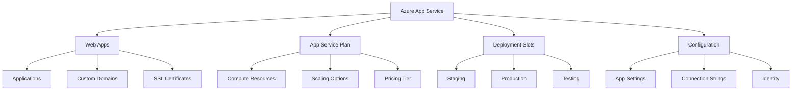

## Service Plans and Pricing Tiers

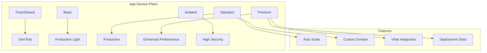

## Deployment Methods

### 1. Continuous Deployment
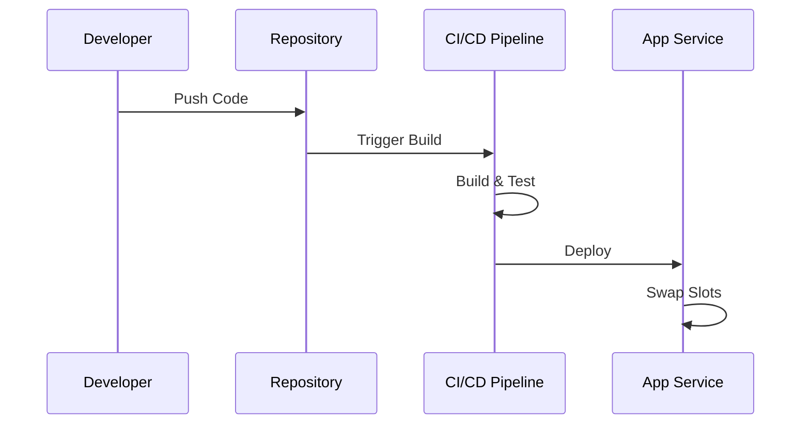

### 2. Manual Deployment
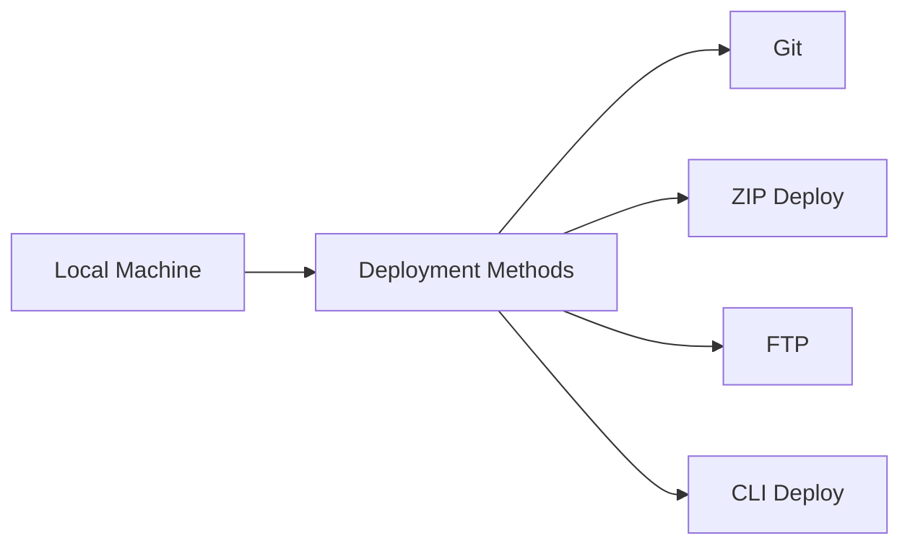

## Application Architecture

### 1. Basic Web App
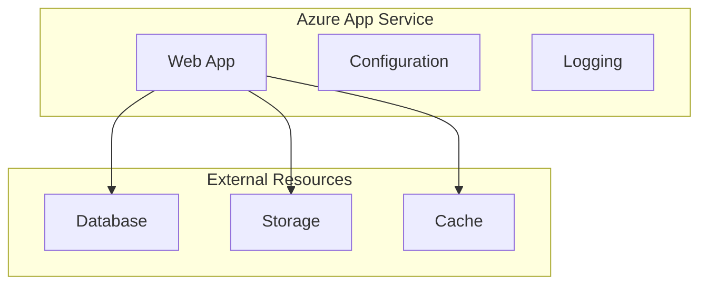

### 2. Multi-tier Application
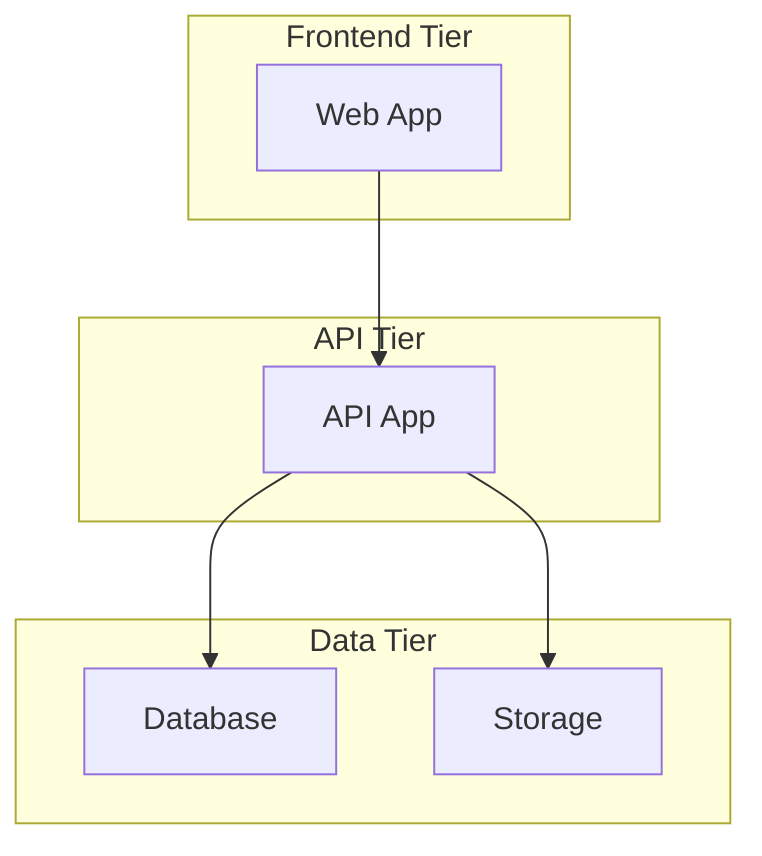

## Authentication and Security

### 1. Authentication Providers
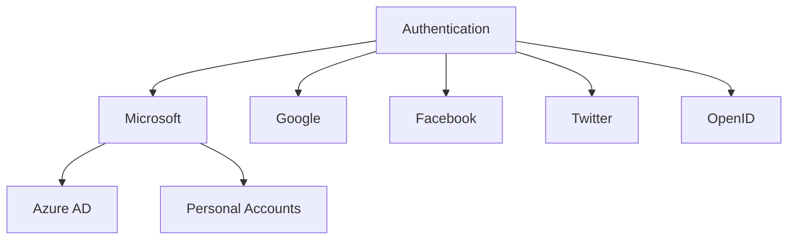

### 2. Security Features
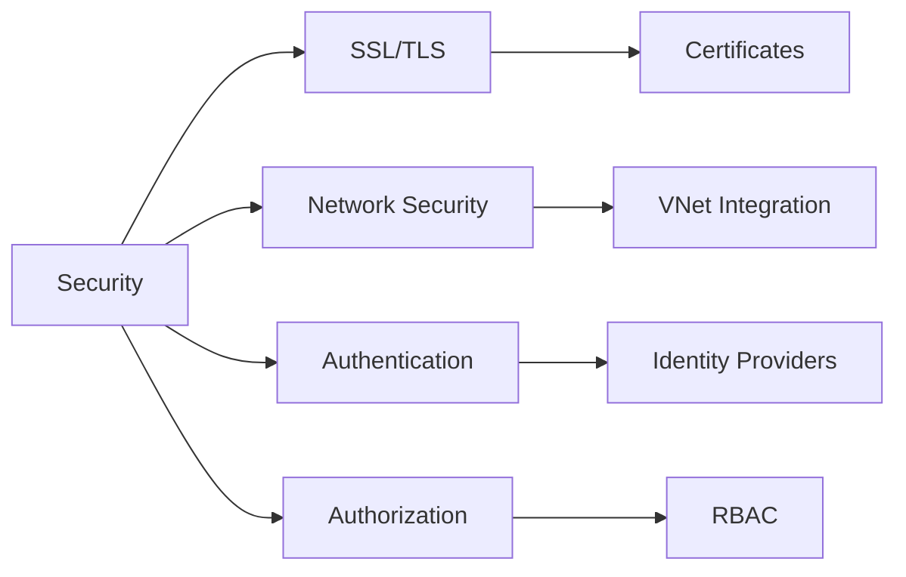

## Monitoring and Diagnostics

### 1. Application Insights Integration
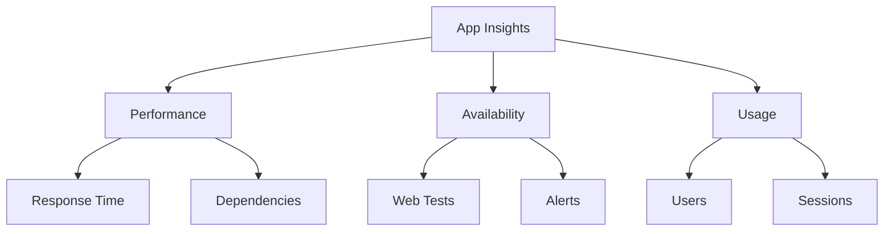

### 2. Diagnostic Tools
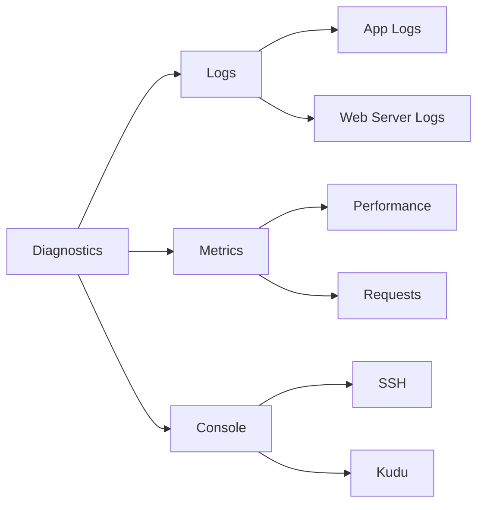

## Best Practices

### 1. Performance Optimization
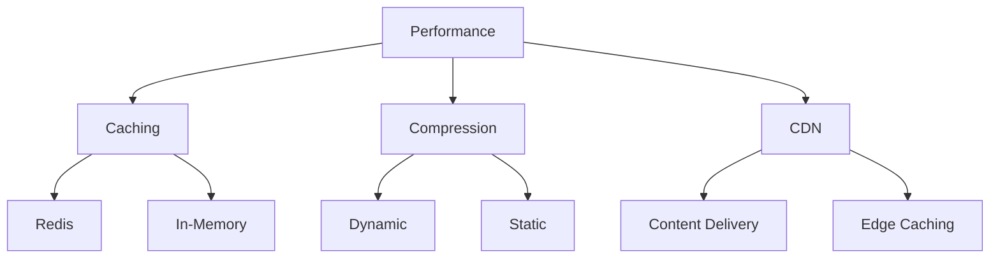

### 2. Cost Management
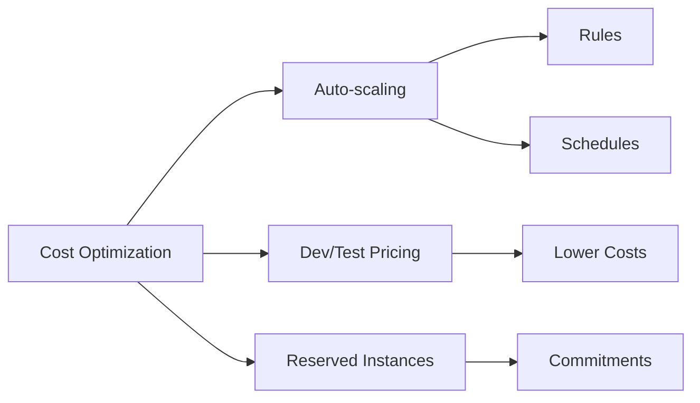

## Scaling Strategies

### 1. Vertical Scaling (Scale Up/Down)
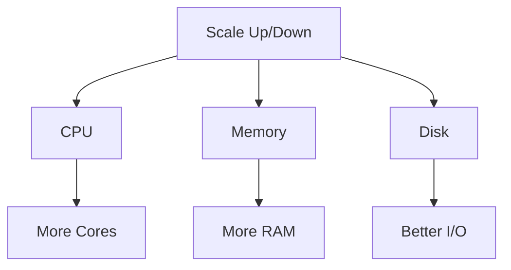

### 2. Horizontal Scaling (Scale Out/In)
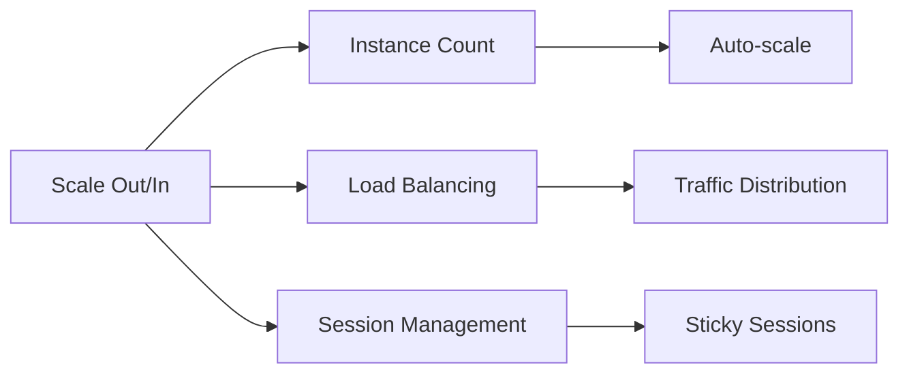

## Integration Features

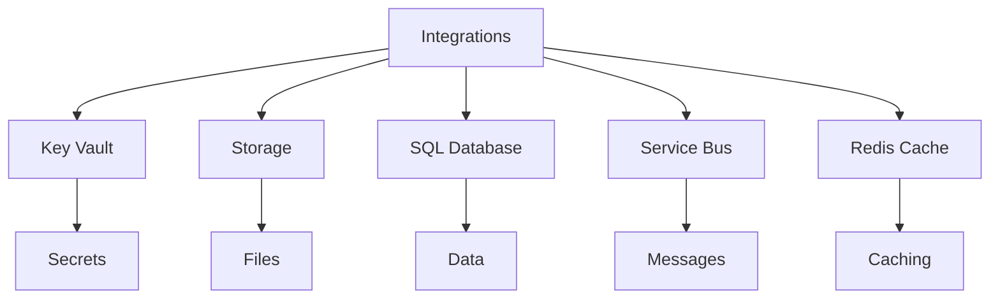

## Deployment Slots

### 1. Slot Usage
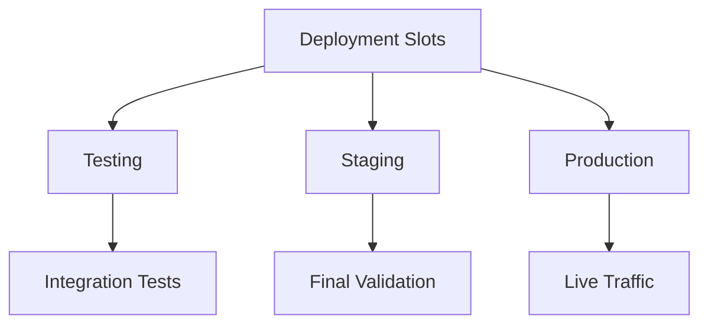

### 2. Slot Swapping
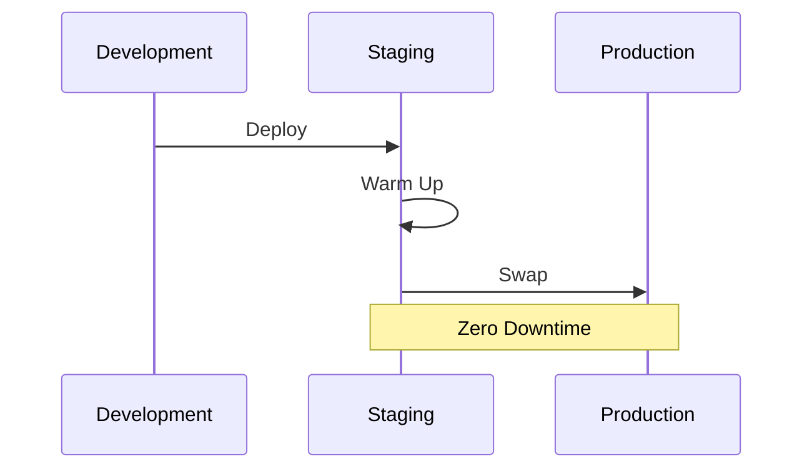

## Troubleshooting Guide

1. **Common Issues**
   - Application not starting
   - Slow performance
   - Connection issues
   - Certificate problems

2. **Diagnostic Tools**
   ```mermaid
   graph TB
       A[Diagnostics] --> B[Kudu Console]
       A --> C[Log Stream]
       A --> D[Process Explorer]
       
       B --> E[Files]
       B --> F[Processes]
       
       C --> G[Real-time Logs]
       
       D --> H[Memory]
       D --> I[CPU]
   ```

## Further Reading
- [Azure App Service Documentation](https://learn.microsoft.com/en-us/azure/app-service/)
- [App Service Best Practices](https://learn.microsoft.com/en-us/azure/app-service/best-practices)
- [Security in App Service](https://learn.microsoft.com/en-us/azure/app-service/overview-security)