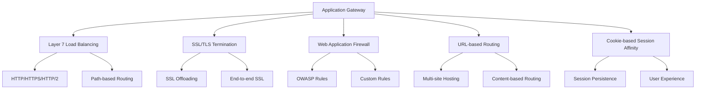
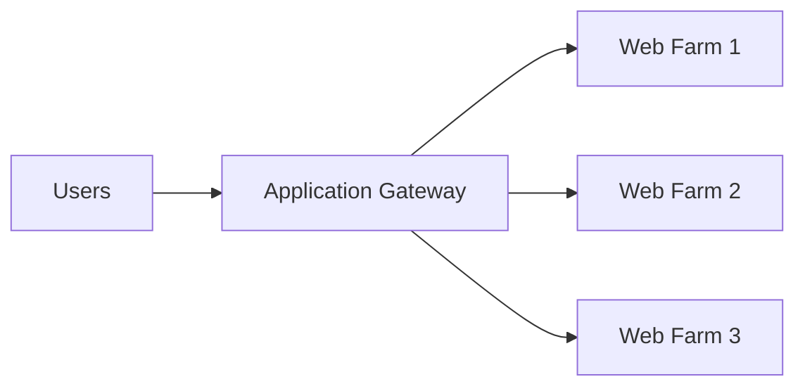
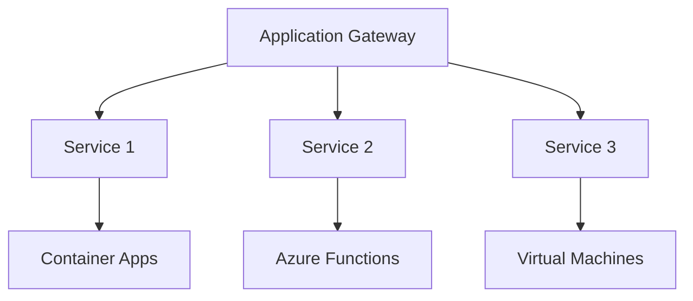
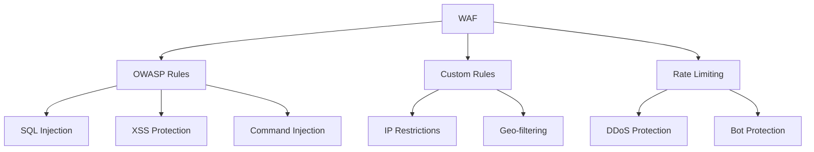
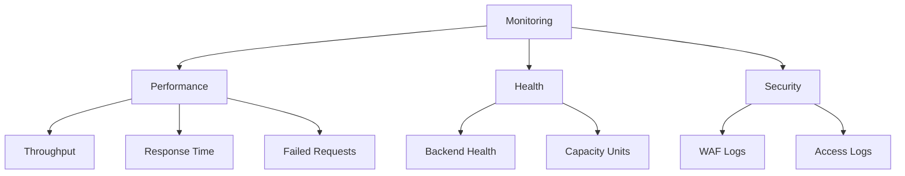
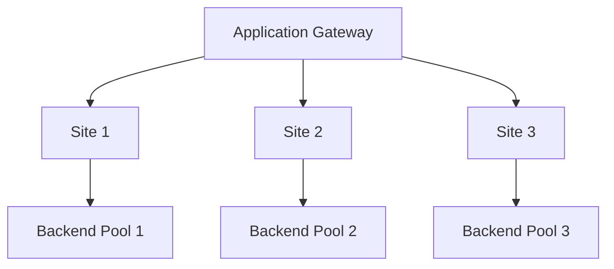
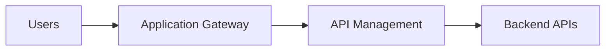
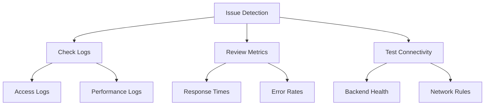

# Azure Application Gateway

Azure Application Gateway is a web traffic load balancer and application delivery controller (ADC) that operates at Layer 7 (application layer) of the OSI model. It provides advanced request routing, SSL termination, web application firewall (WAF), and URL-based content routing capabilities for your web applications.

## Key Features and Benefits



## Comparison with Traffic Manager

| Feature | Application Gateway | Traffic Manager |
|---------|-------------------|-----------------|
| Layer | Layer 7 (Application) | DNS (Global) |
| Scope | Regional | Global |
| Protocol Support | HTTP/HTTPS/HTTP/2 | Any TCP/IP protocol |
| Routing Methods | URL-based, Path-based | Performance, Weighted, Priority, Geographic |
| Health Probes | HTTP/HTTPS | HTTP/HTTPS/TCP |
| SSL Termination | Yes | No |
| WAF Capabilities | Yes | No |
| Session Affinity | Yes | No |

## Common Use Cases

1. **Web Application Hosting**


2. **Microservices Architecture**


## Security Features

### WAF Capabilities


## Best Practices

1. **Performance Optimization**
   - Enable auto-scaling
   - Configure appropriate instance count
   - Use appropriate tier (Standard/WAF)
   - Monitor backend health

2. **Security Configuration**
   ```mermaid
   graph LR
       A[Security] --> B[SSL Policy]
       A --> C[WAF Rules]
       A --> D[Network Security]
       
       B --> E[TLS Version]
       C --> F[Rule Sets]
       D --> G[NSG Config]
   ```

3. **High Availability**
   - Deploy across availability zones
   - Configure multiple backend instances
   - Implement health monitoring
   - Use backup pools

## Monitoring and Diagnostics

### Metrics to Monitor


## Integration Patterns

1. **Multi-site Hosting**


2. **API Management**


## Troubleshooting Guide

1. **Common Issues**
   - Backend health problems
   - Certificate issues
   - Routing problems
   - Performance bottlenecks

2. **Diagnostic Steps**


## Further Reading
- [Application Gateway Documentation](https://learn.microsoft.com/en-us/azure/application-gateway/)
- [WAF Configuration Guide](https://learn.microsoft.com/en-us/azure/web-application-firewall/)
- [Performance Best Practices](https://learn.microsoft.com/en-us/azure/application-gateway/configuration-best-practices)