# Microsoft Entra ID (formerly Azure Active Directory)

## Overview
Microsoft Entra ID is Azure's cloud-based identity and access management service. It handles authentication, authorization, and identity management for Azure resources, Microsoft 365, and third-party applications.

## Core Components

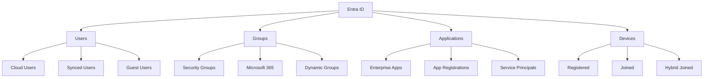

## Identity Management

### 1. User Management
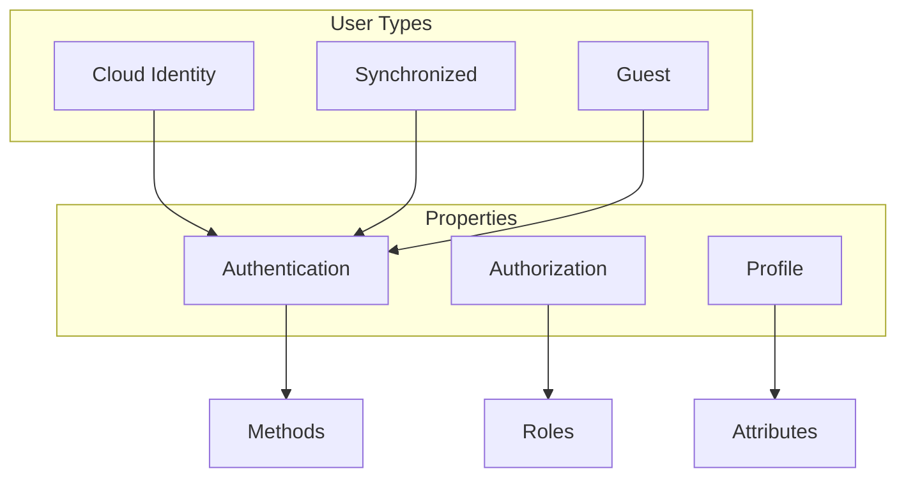

### 2. Group Management
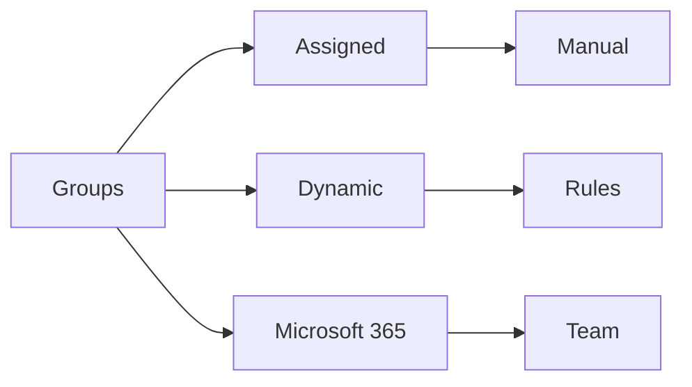

## Authentication Methods

### 1. Authentication Types
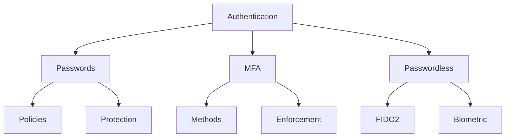

### 2. Conditional Access
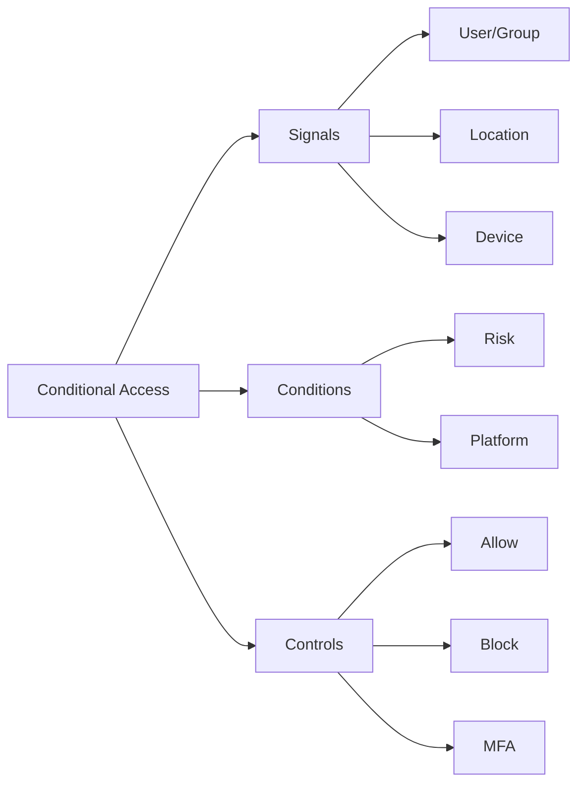

## Application Integration

### 1. App Registration
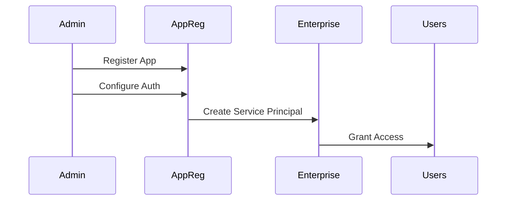

### 2. Enterprise Applications
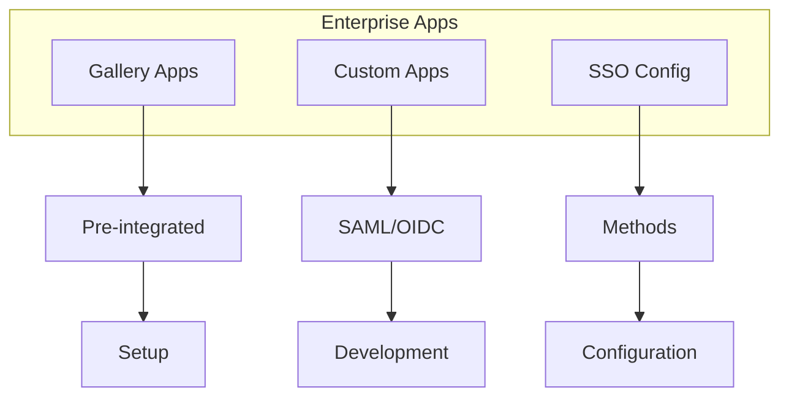

## Identity Protection

### 1. Risk Detection
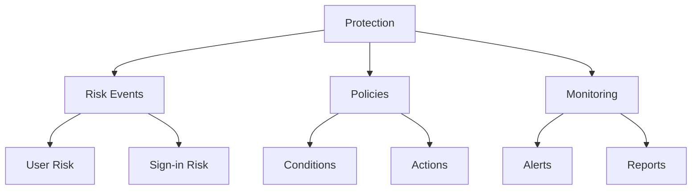

### 2. Security Features
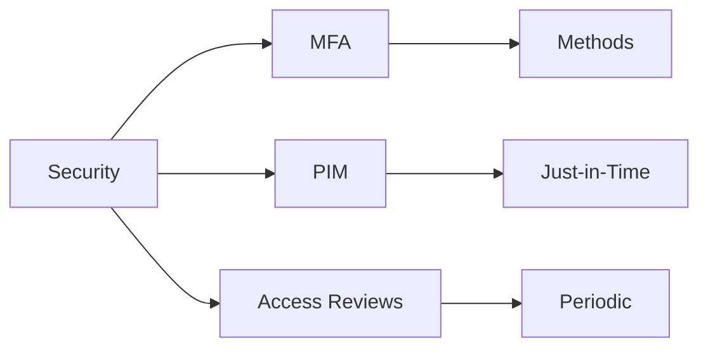

## Hybrid Identity

### 1. Synchronization
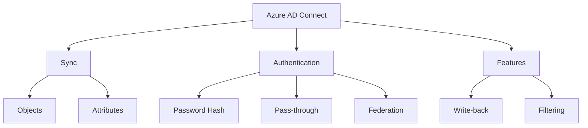

### 2. Federation
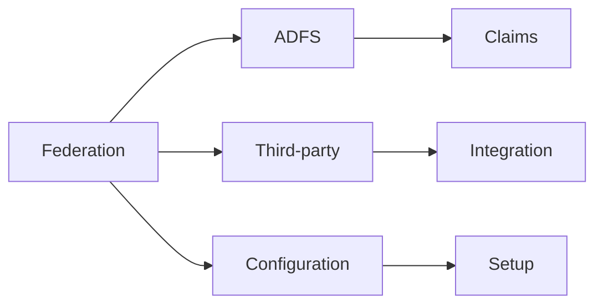

## Monitoring and Reporting

### 1. Audit Logs
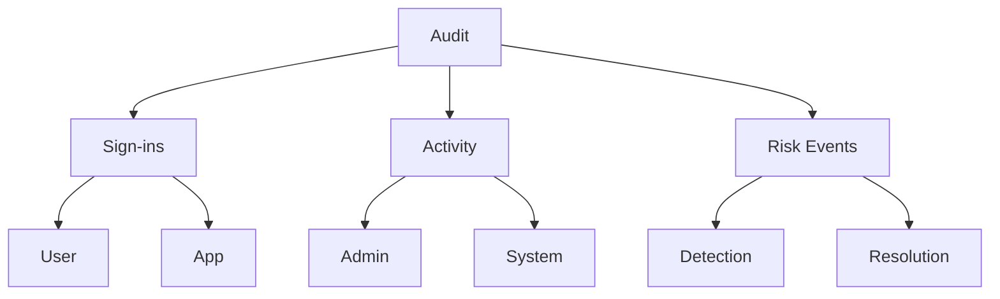

### 2. Security Reports
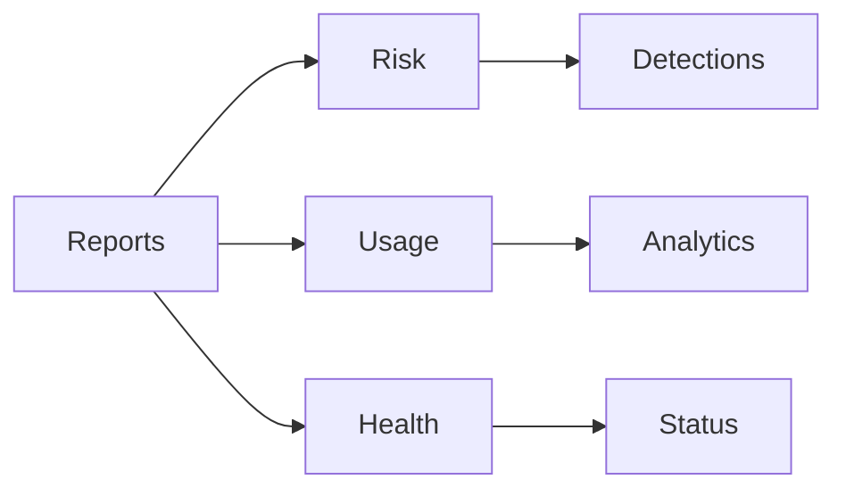

## Governance Features

### 1. Access Reviews
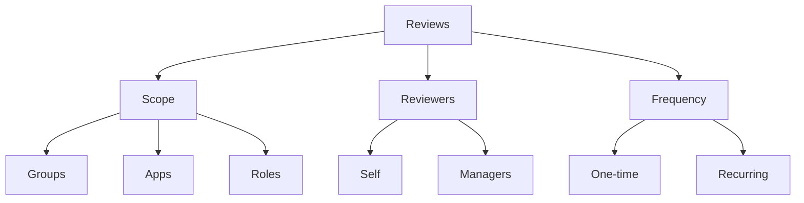

### 2. PIM Configuration
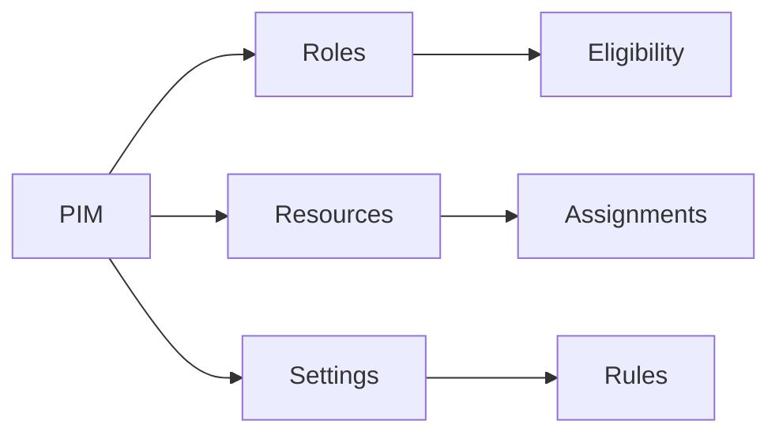

## Best Practices

### 1. Identity Security
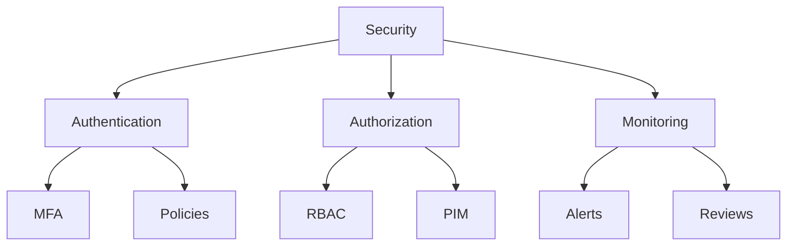

### 2. Configuration Guidelines
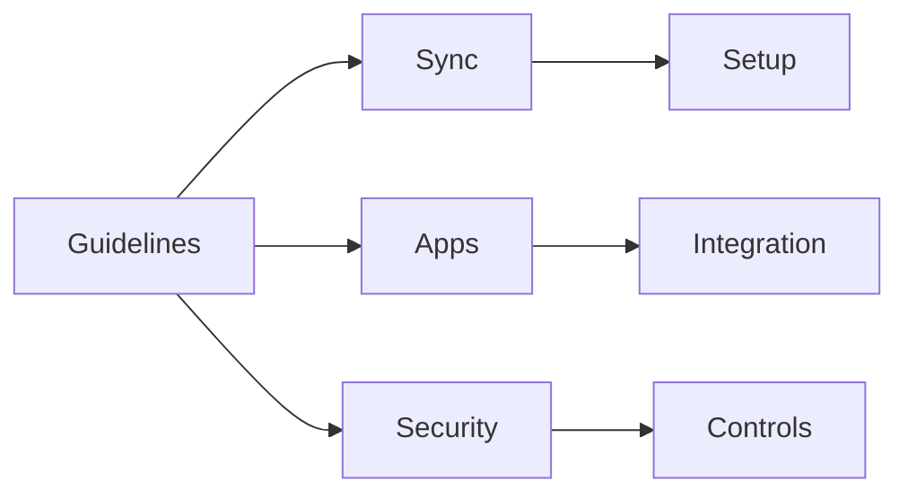

## Best Practices Summary

1. **Identity Management**
   - Enable MFA
   - Use Conditional Access
   - Implement PIM
   - Regular access reviews

2. **Application Security**
   - Configure proper permissions
   - Use managed identities
   - Implement SSO
   - Monitor usage

3. **Governance**
   - Document policies
   - Regular reviews
   - Monitor compliance
   - Automate processes

## Further Reading
- [Microsoft Entra Documentation](https://learn.microsoft.com/en-us/entra/)
- [Identity Security Best Practices](https://learn.microsoft.com/en-us/azure/security/fundamentals/identity-management-best-practices)
- [Hybrid Identity Documentation](https://learn.microsoft.com/en-us/azure/active-directory/hybrid/)