# Azure Batch

Azure Batch is a cloud-scale job scheduling and compute management service that enables you to run large-scale parallel and high-performance computing (HPC) applications efficiently in Azure. It automatically scales compute resources to meet your job's needs, making it ideal for batch processing, scientific simulations, financial modeling, and rendering workloads.

## Overview

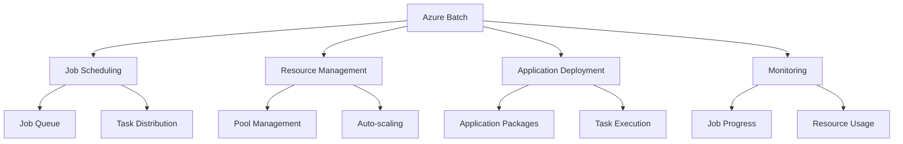

## Core Components

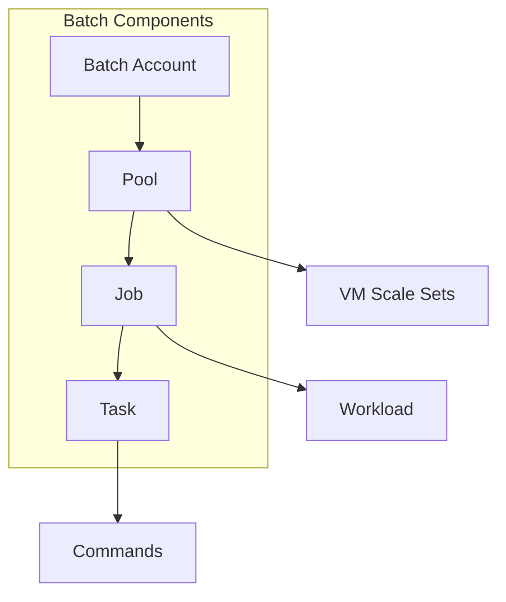

## Job and Task Management

### 1. Job Structure
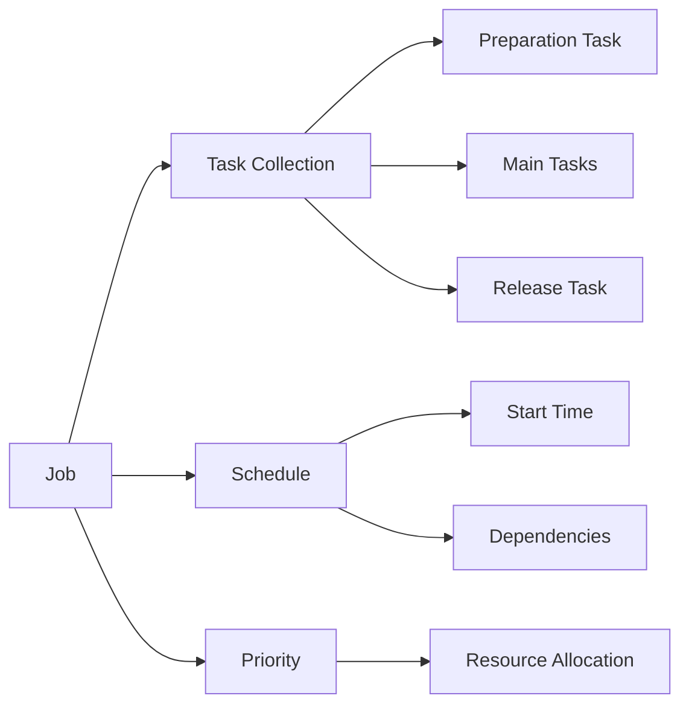

### 2. Task Dependencies
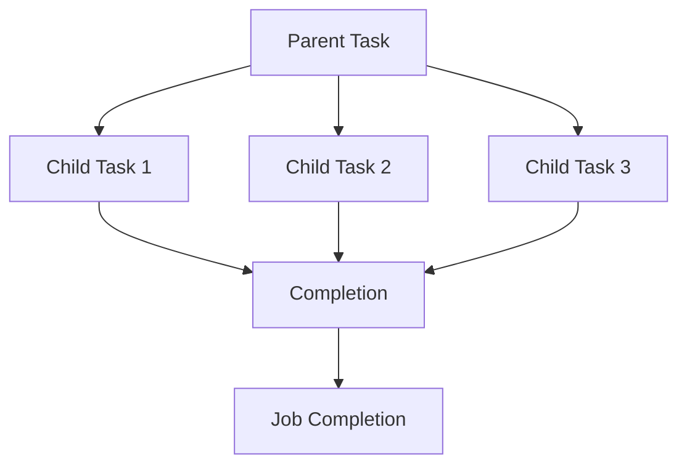

## Pool Management

### 1. Pool Configuration
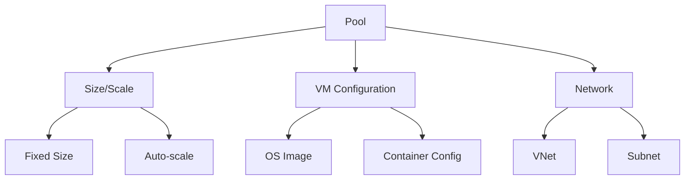

### 2. Auto-scaling
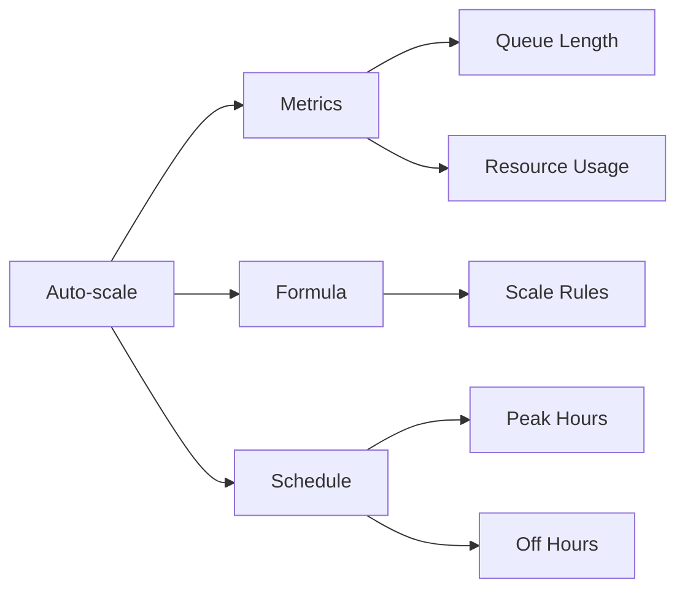

## Application Packages

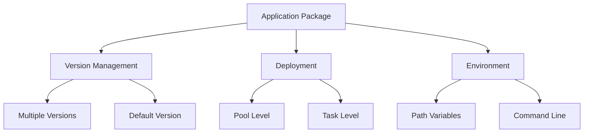

## Monitoring and Analytics

### 1. Performance Monitoring
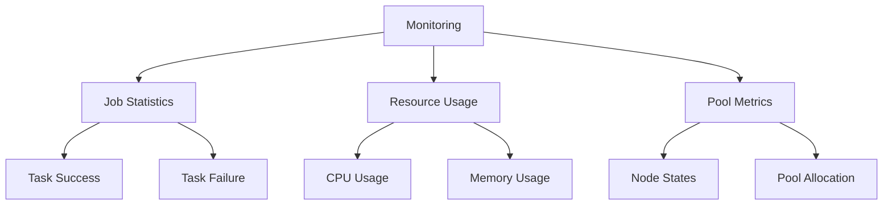

### 2. Diagnostic Logging
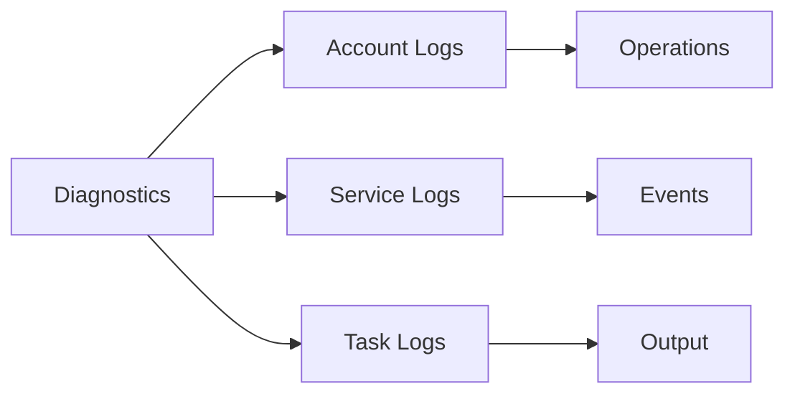

## Security Features

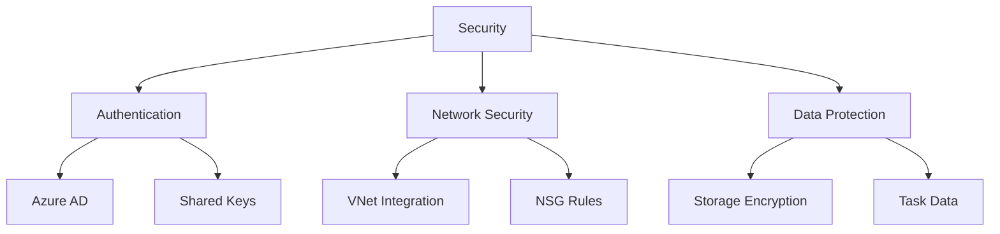

## Best Practices

1. **Resource Optimization**
   - Use appropriate VM sizes
   - Implement auto-scaling
   - Monitor resource usage
   - Clean up unused resources

2. **Job Management**
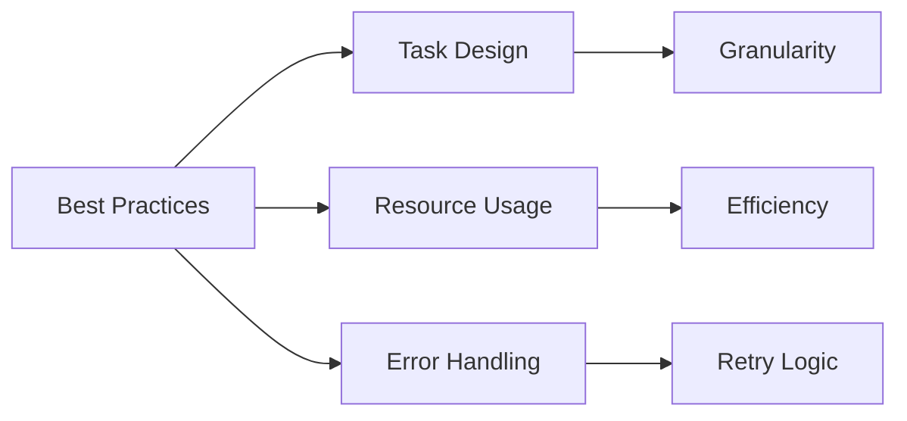

## Integration Patterns

### 1. Storage Integration
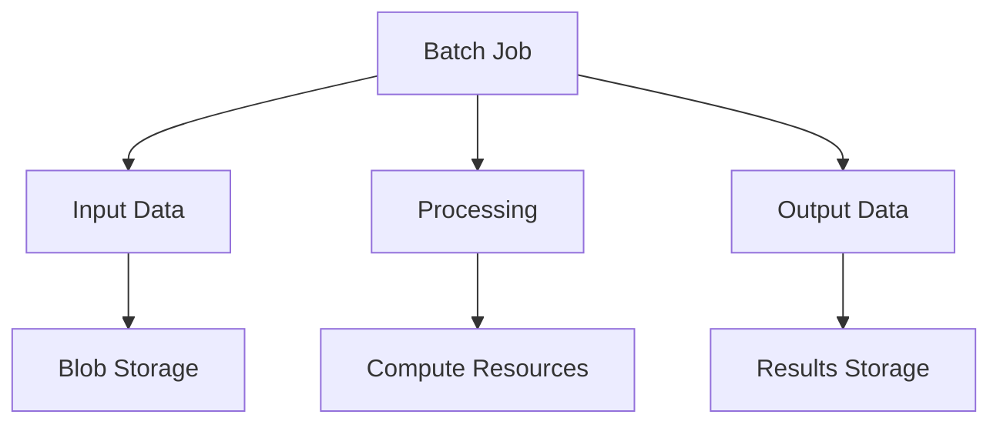

### 2. Container Support
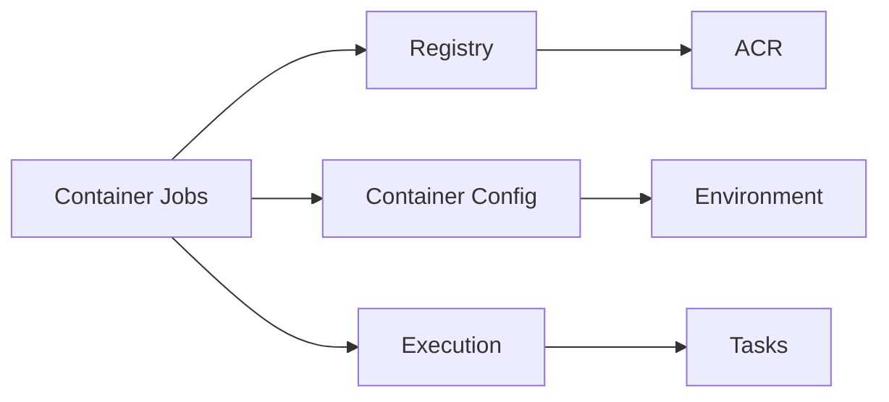

## Cost Management

### 1. Cost Components
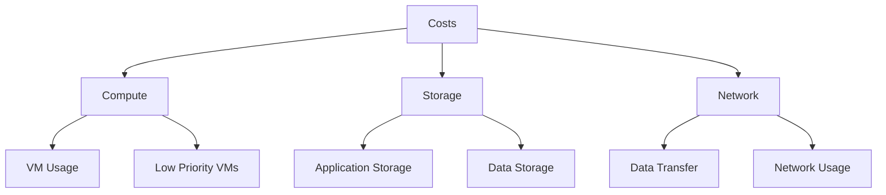

### 2. Cost Optimization
- Use low-priority VMs
- Implement efficient auto-scaling
- Clean up resources promptly
- Monitor usage patterns

## Troubleshooting Guide

1. **Common Issues**
   - Task failures
   - Pool allocation issues
   - Network connectivity
   - Application errors

2. **Resolution Steps**
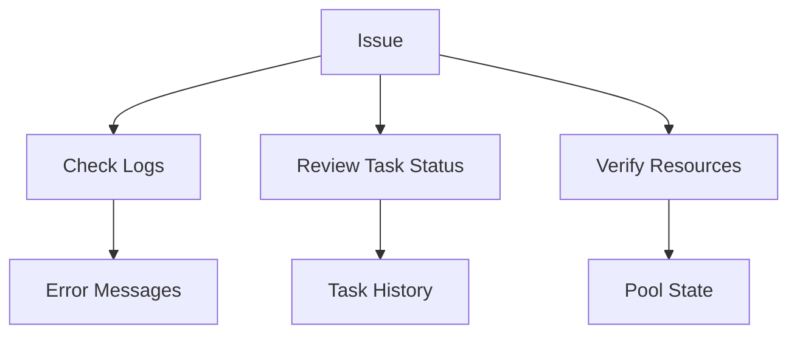

## Further Reading
- [Azure Batch Documentation](https://learn.microsoft.com/en-us/azure/batch/)
- [Batch Best Practices](https://learn.microsoft.com/en-us/azure/batch/batch-best-practices)
- [High-Performance Computing Guide](https://learn.microsoft.com/en-us/azure/architecture/topics/high-performance-computing)