# Azure Data Box

Azure Data Box is a physical data transfer service that helps move large amounts of data to and from Azure when network transfer isn't feasible due to time, cost, or bandwidth constraints. It provides secure, tamper-resistant devices for offline data transfer, making it ideal for large-scale data migration, disaster recovery, and archival storage scenarios.

## Overview

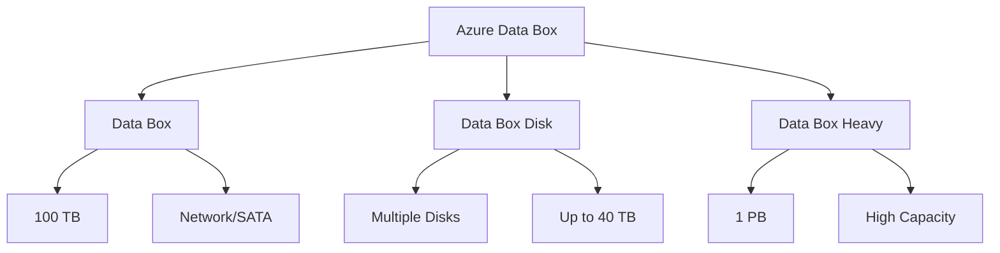

## Use Cases

### 1. Data Migration
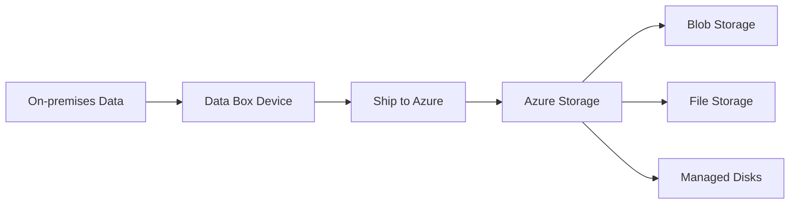

### 2. Disaster Recovery
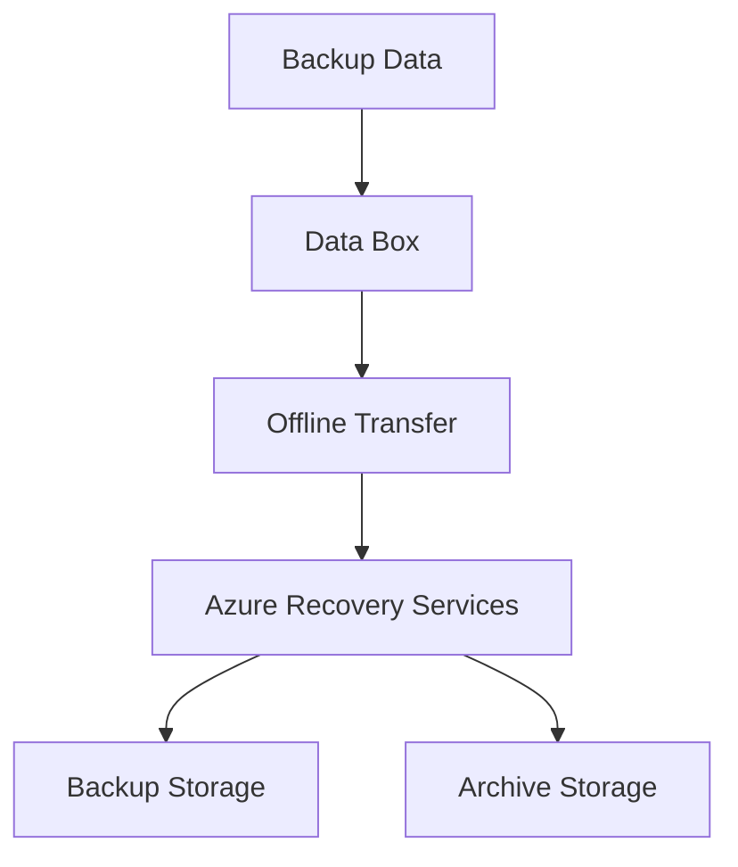

## Device Options

### Data Box Specifications
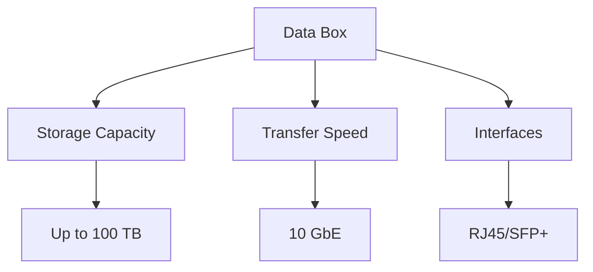

### Data Box Disk Features
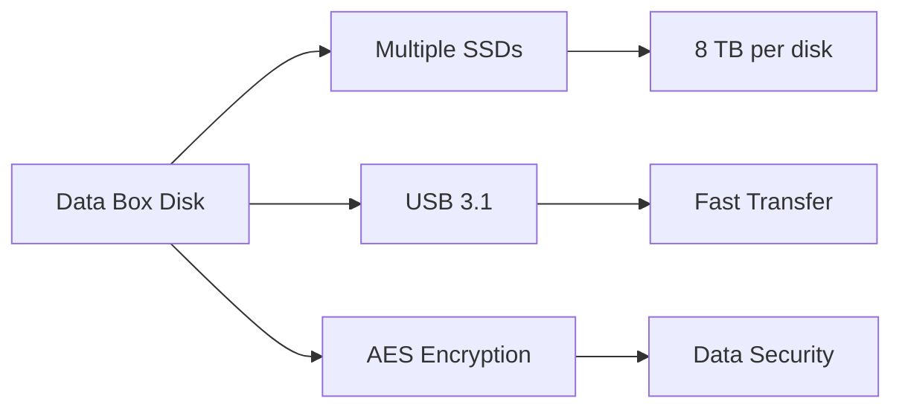

## Security Features

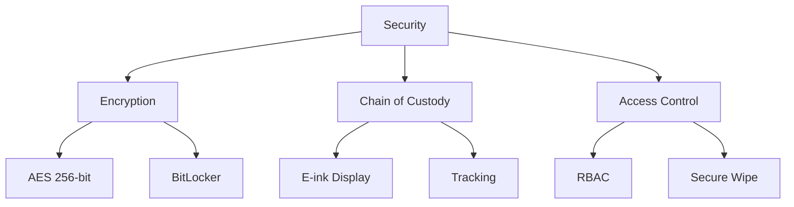

## Implementation Process

### 1. Order and Setup
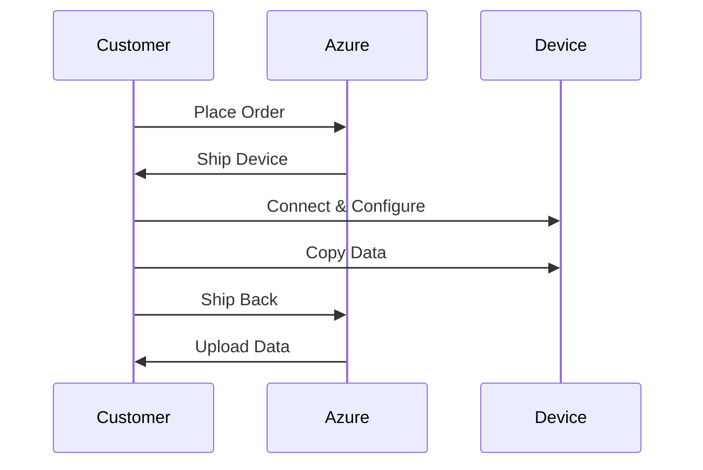

### 2. Data Copy Process
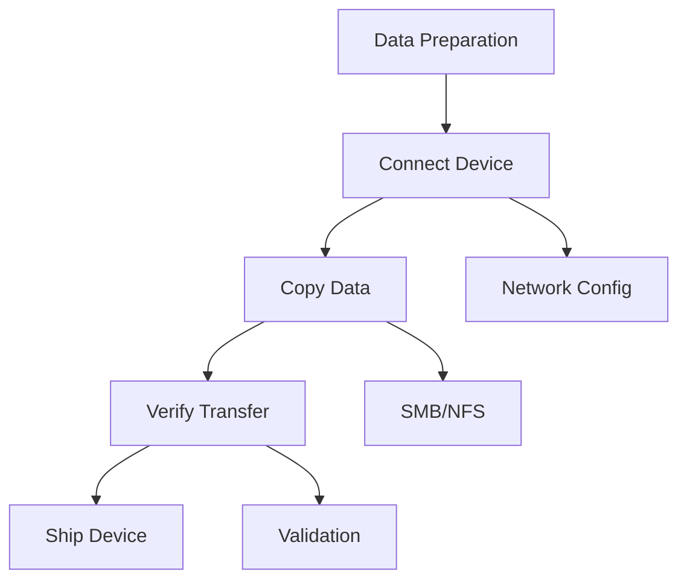

## Best Practices

1. **Data Organization**
   - Plan folder structure
   - Use recommended naming
   - Validate file sizes
   - Track progress

2. **Performance Optimization**
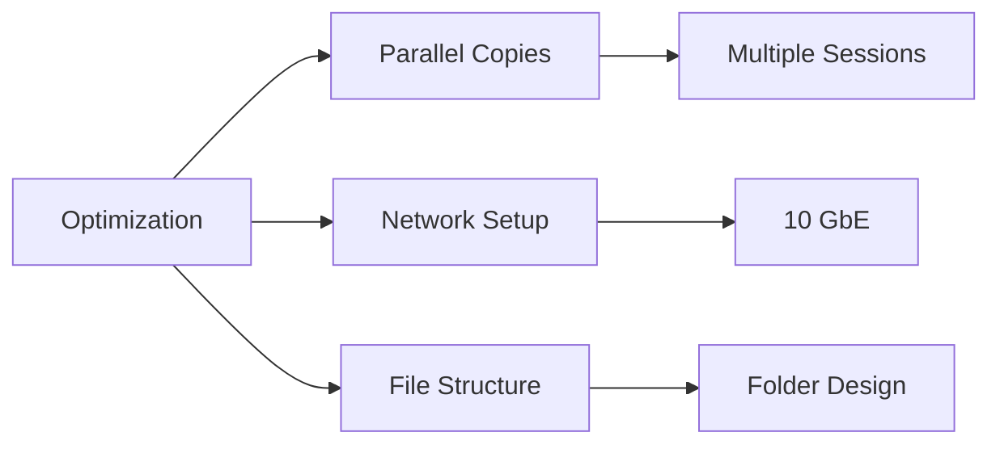

## Monitoring and Tracking

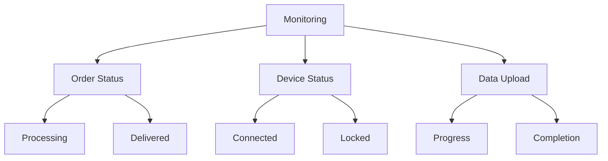

## Cost Considerations

### 1. Pricing Components
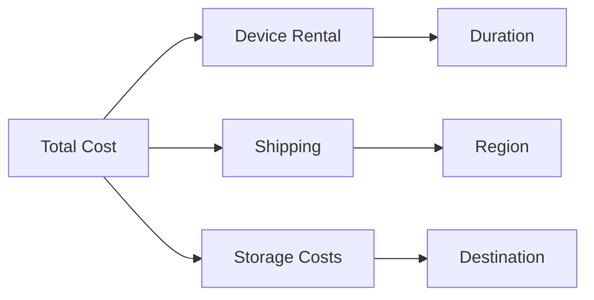

### 2. Cost Optimization
- Plan transfer windows
- Choose appropriate device
- Optimize storage usage
- Consider regional pricing

## Troubleshooting Guide

1. **Common Issues**
   - Connection problems
   - Copy failures
   - Validation errors
   - Device lockout

2. **Resolution Steps**
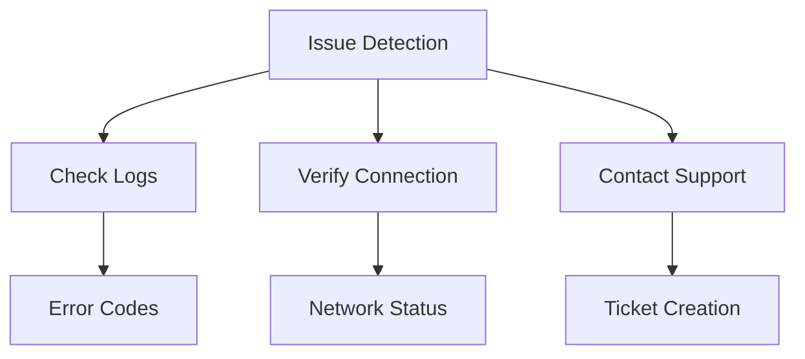

## Integration with Azure Services

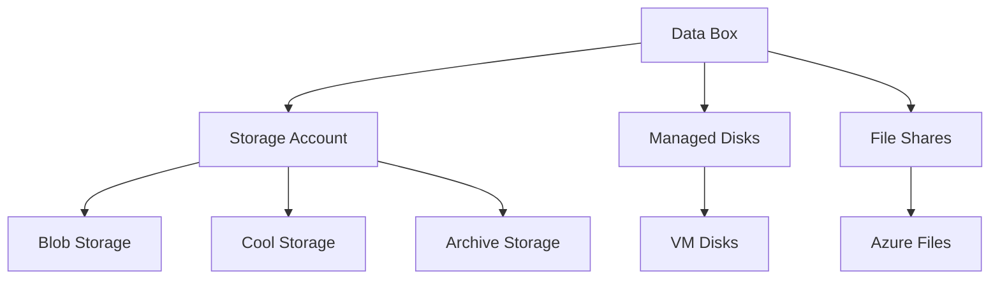

## Further Reading
- [Azure Data Box Documentation](https://learn.microsoft.com/en-us/azure/databox/)
- [Data Box Security Guide](https://learn.microsoft.com/en-us/azure/databox/data-box-security)
- [Migration Best Practices](https://learn.microsoft.com/en-us/azure/storage/common/storage-migration-overview)