# Azure Metric Charts

Azure Metric Charts provide powerful visualization capabilities for monitoring and analyzing metrics from Azure resources. These charts offer real-time and historical views of performance data, helping you understand resource behavior, troubleshoot issues, and make informed scaling decisions.

## Overview

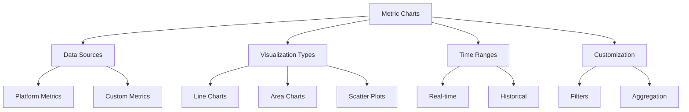

## Chart Types and Use Cases

### 1. Line Charts
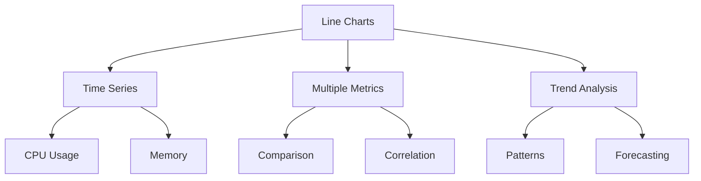

### 2. Area Charts
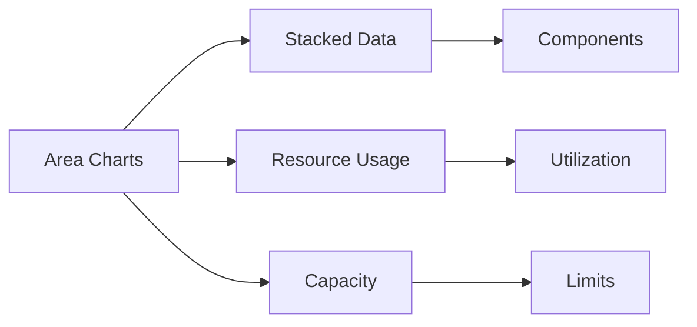

## Metric Configuration

### 1. Data Collection
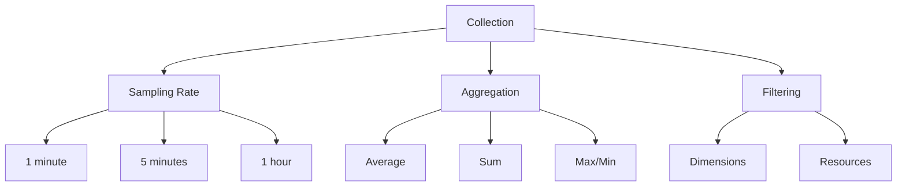

### 2. Visualization Settings
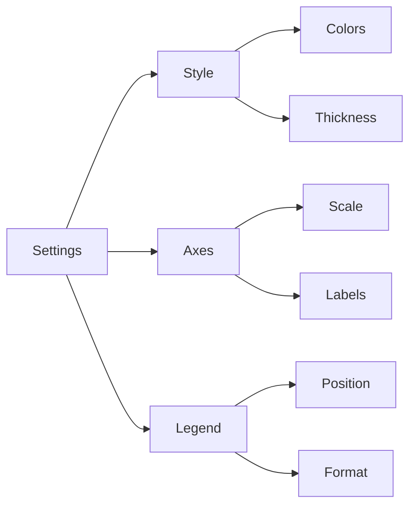

## Common Metrics and Charts

### 1. Infrastructure Metrics
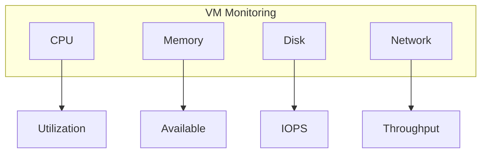

### 2. Application Metrics
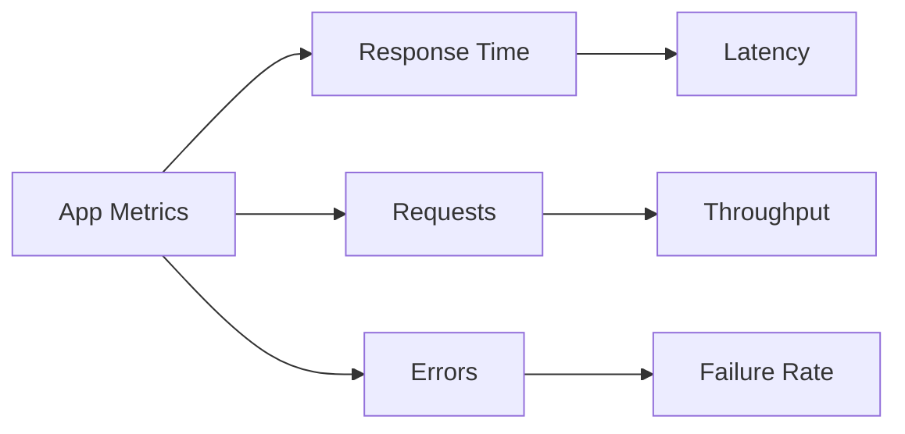

## Advanced Features

### 1. Composite Charts
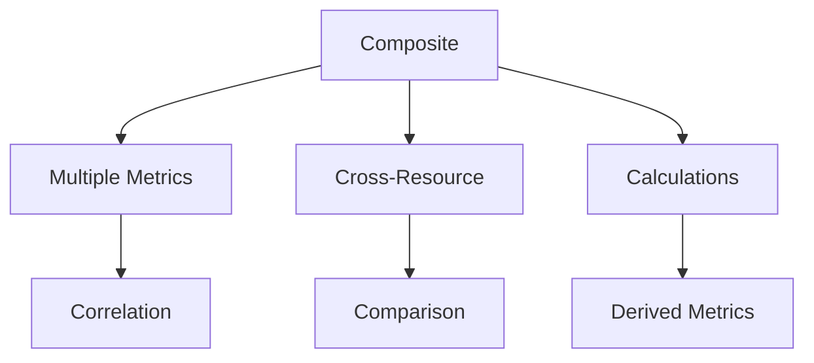

### 2. Dynamic Thresholds
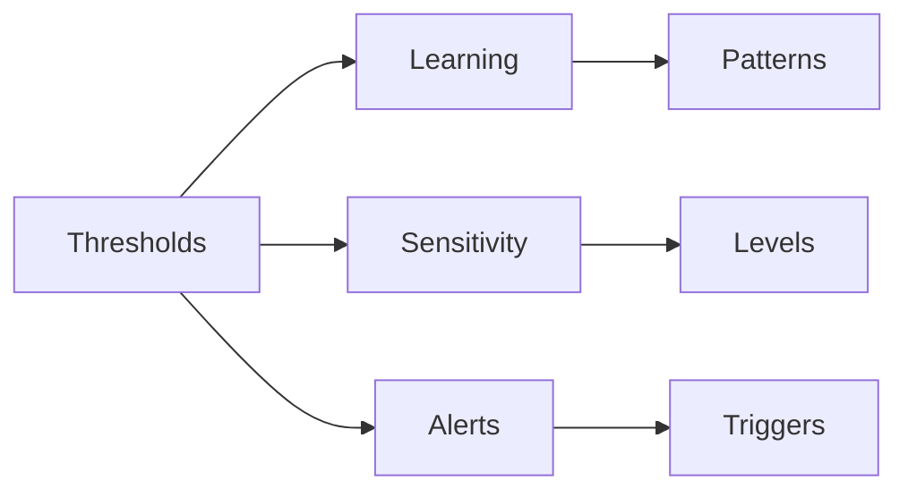

## Best Practices

1. **Chart Design**
   - Choose appropriate chart types
   - Set meaningful time ranges
   - Use clear labels
   - Apply relevant aggregations

2. **Performance Optimization**
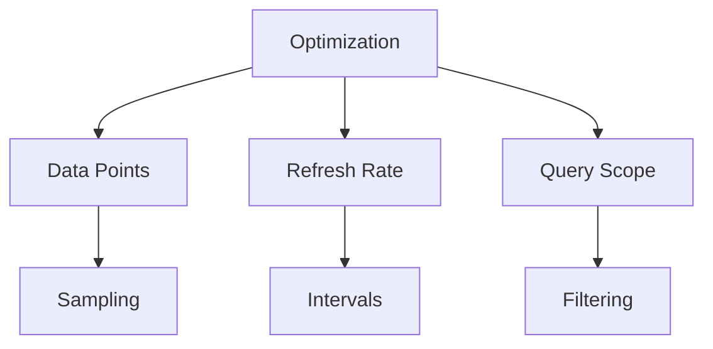

## Workbook Integration

### 1. Template Design
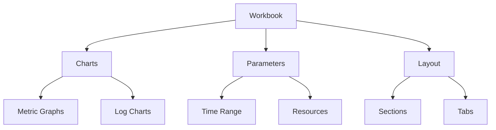

### 2. Sharing and Export
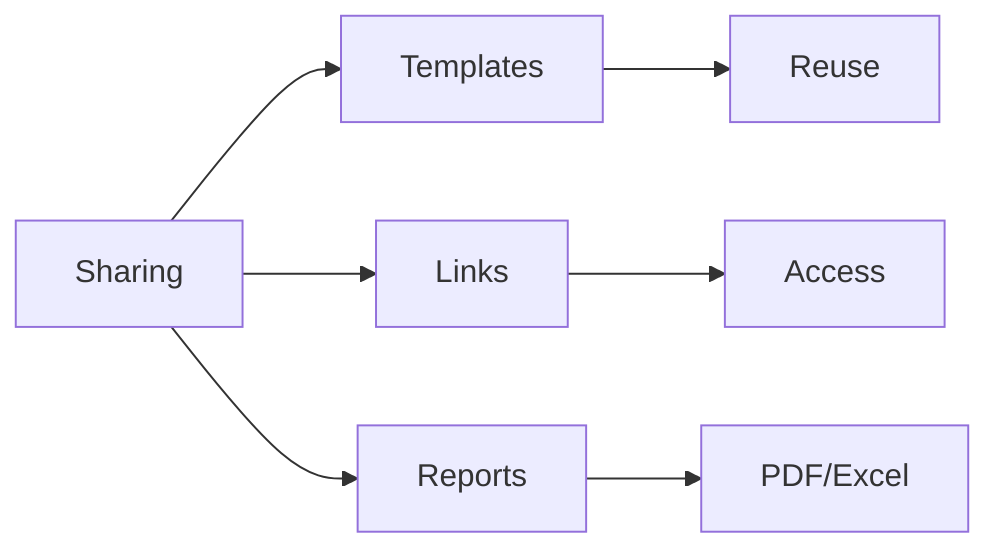

## Dashboard Integration

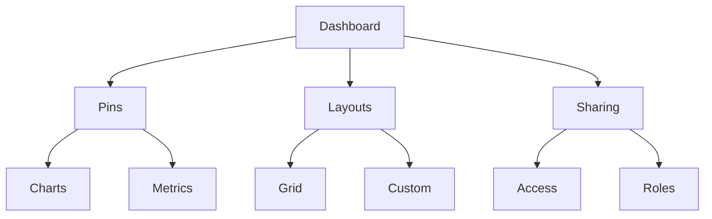

## Alerting Integration

### 1. Alert Configuration
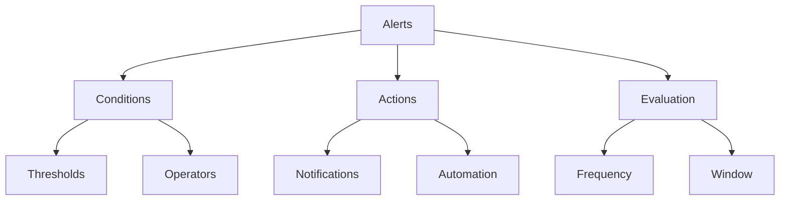

### 2. Alert Management
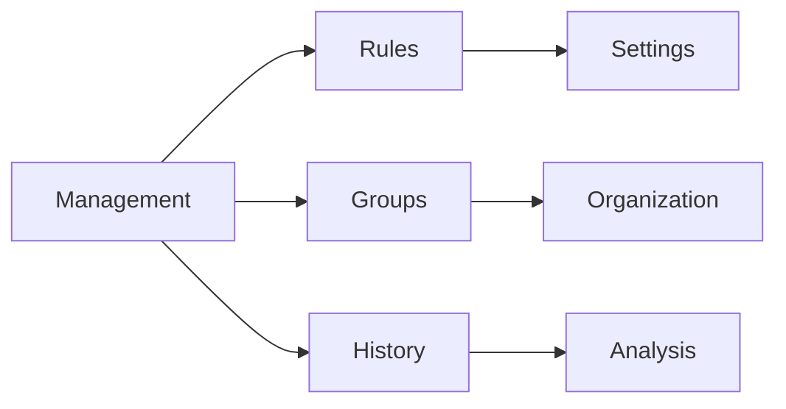

## Troubleshooting Guide

1. **Common Issues**
   - Missing data
   - Aggregation problems
   - Display issues
   - Performance concerns

2. **Resolution Steps**
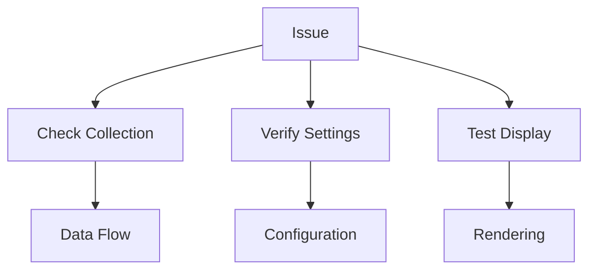

## Further Reading
- [Azure Monitor Documentation](https://learn.microsoft.com/en-us/azure/azure-monitor/)
- [Metrics Explorer Guide](https://learn.microsoft.com/en-us/azure/azure-monitor/essentials/metrics-getting-started)
- [Chart Configuration](https://learn.microsoft.com/en-us/azure/azure-monitor/visualizations)