# Azure Monitor and Log Analytics

## Overview
Azure Monitor is a comprehensive solution for collecting, analyzing, and acting on telemetry from cloud and on-premises environments. It helps you maximize performance and availability while ensuring security and compliance.

## Core Components

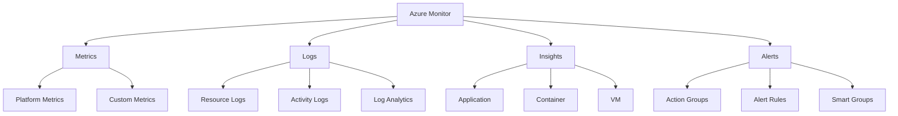

## Data Collection Architecture

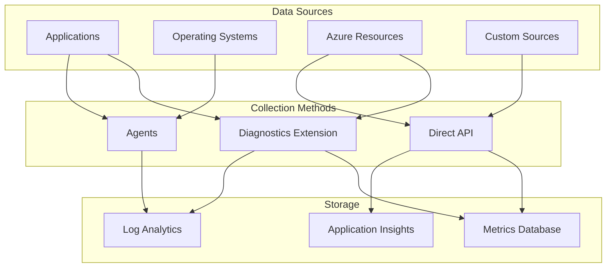

## Log Analytics Features

### 1. Data Sources
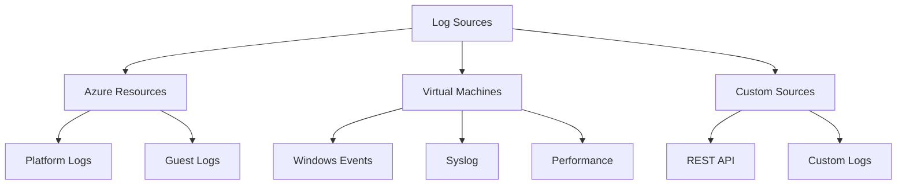

### 2. Query and Analysis
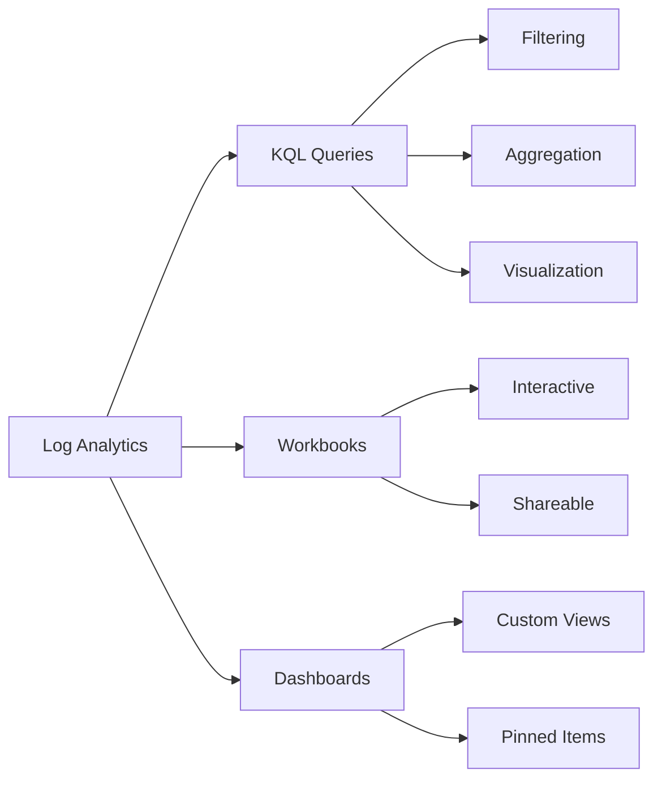

## Monitoring Solutions

### 1. Application Monitoring
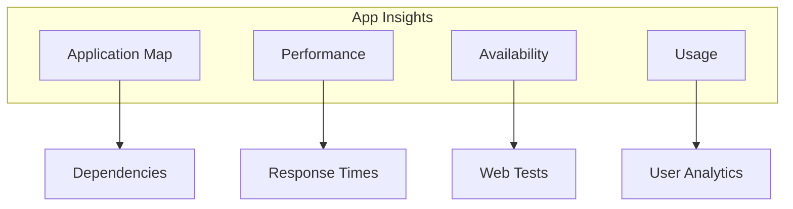

### 2. Infrastructure Monitoring
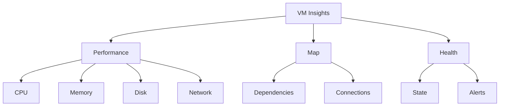

## Alert Configuration

### 1. Alert Rules
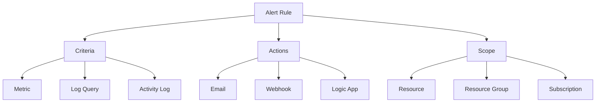

### 2. Action Groups
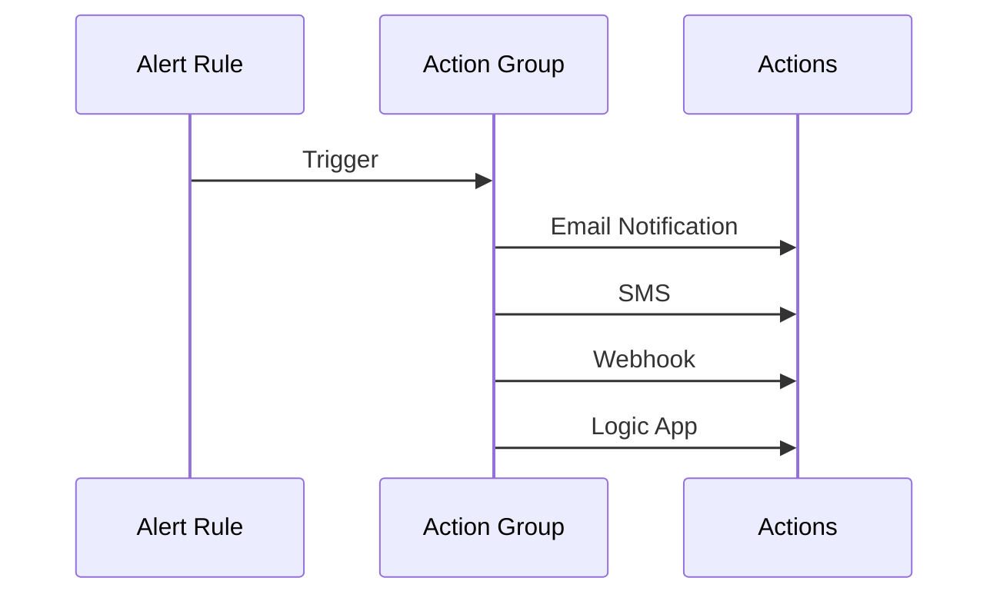

## Workbooks and Dashboards

### 1. Workbook Components
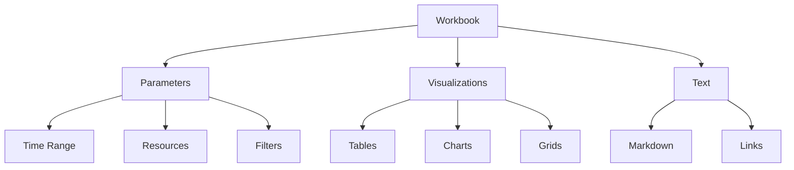

### 2. Dashboard Organization
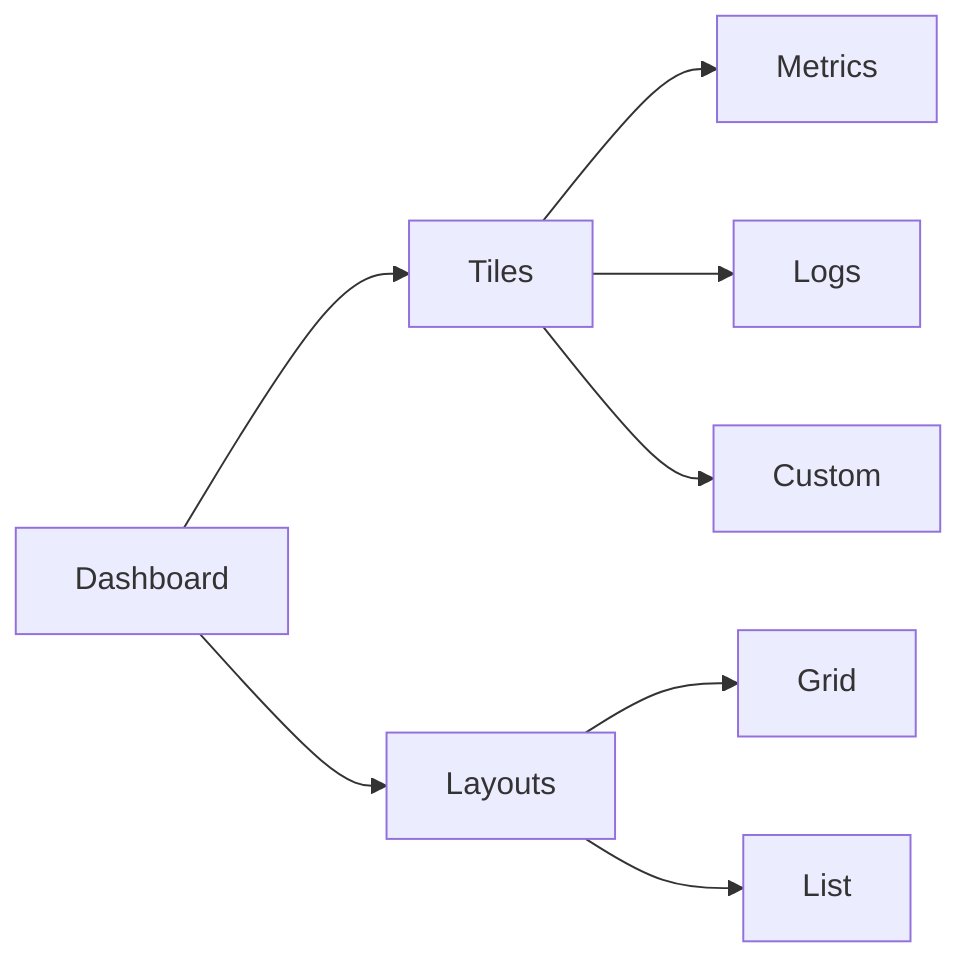

## Best Practices

### 1. Data Collection
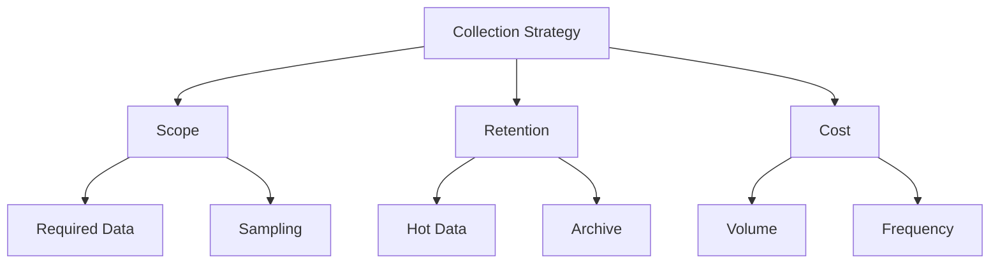

### 2. Alert Configuration
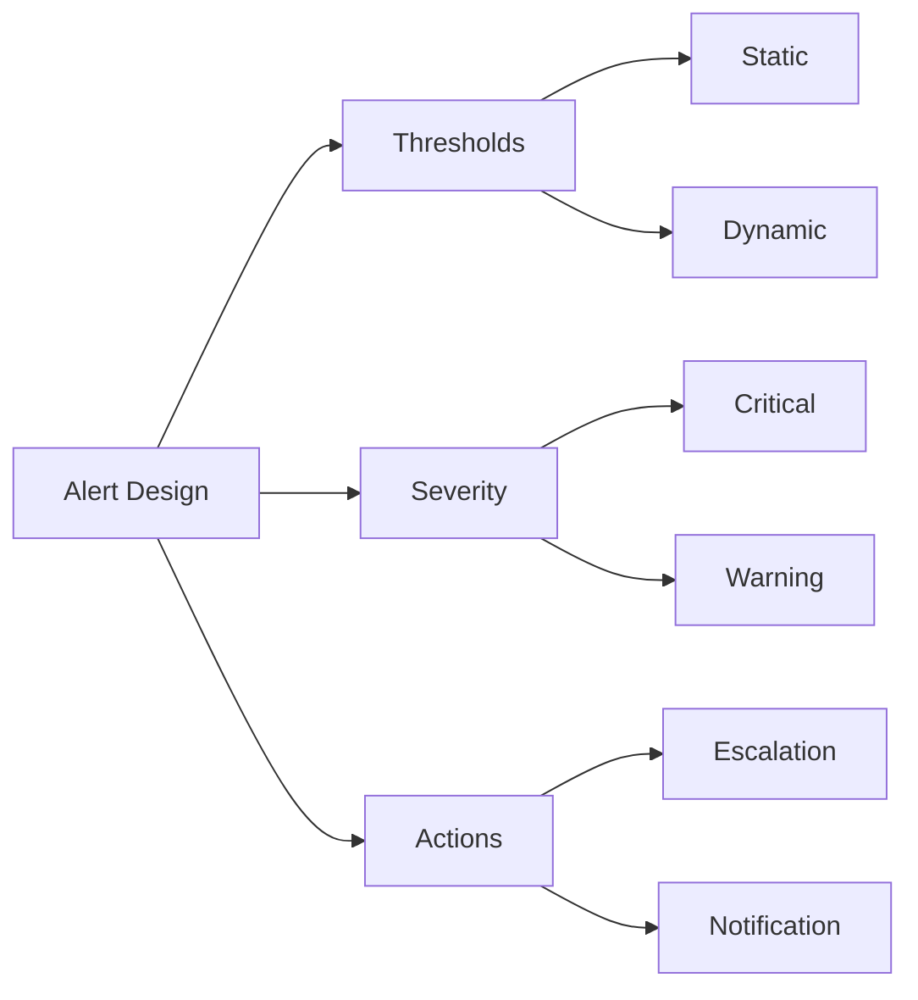

## Cost Management

### 1. Data Volume Control
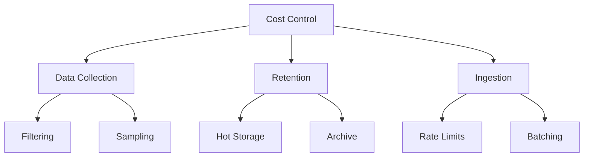

### 2. Optimization Strategies
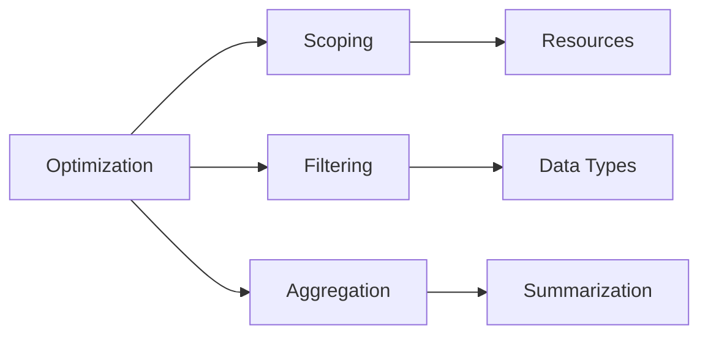

## Integration Features

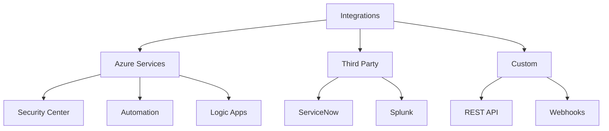

## Troubleshooting Guide

1. **Common Issues**
   - Data collection delays
   - Missing logs
   - Alert misfires
   - Query performance

2. **Diagnostic Process**
   ```mermaid
   graph TB
       A[Troubleshooting] --> B[Data Flow]
       A --> C[Configuration]
       A --> D[Connectivity]
       
       B --> E[Collection]
       B --> F[Processing]
       
       C --> G[Settings]
       C --> H[Permissions]
       
       D --> I[Network]
       D --> J[Firewall]
   ```

## Further Reading
- [Azure Monitor Documentation](https://learn.microsoft.com/en-us/azure/azure-monitor/)
- [Log Analytics Best Practices](https://learn.microsoft.com/en-us/azure/azure-monitor/logs/log-analytics-best-practices)
- [Monitoring and Alerting Guidance](https://learn.microsoft.com/en-us/azure/azure-monitor/best-practices-monitoring)