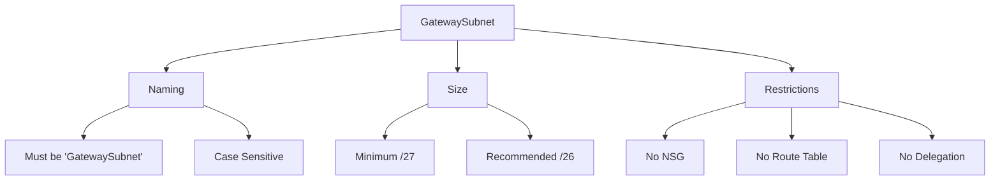
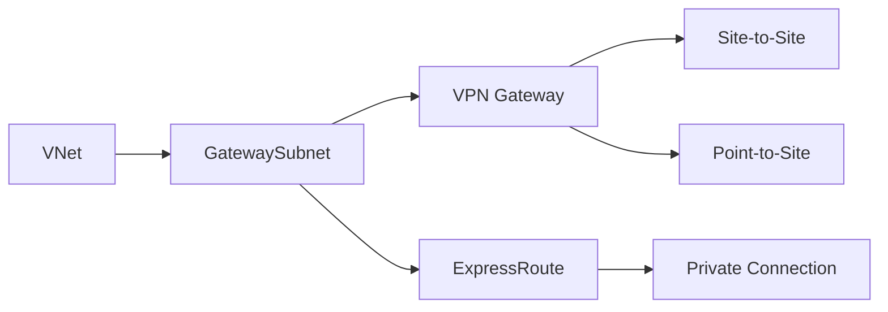
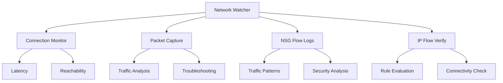
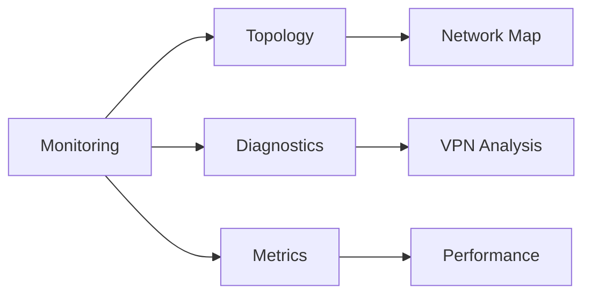
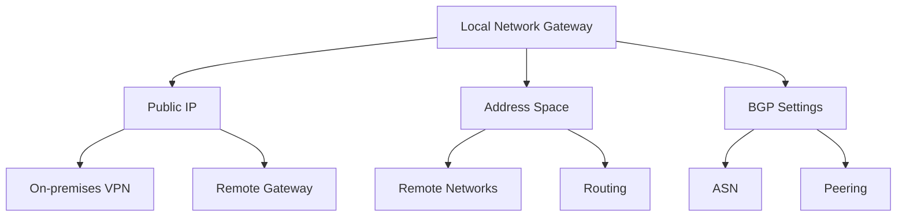
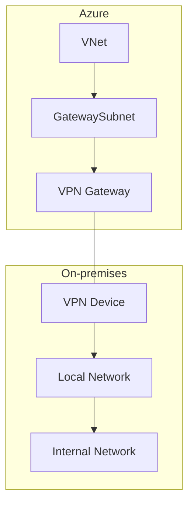
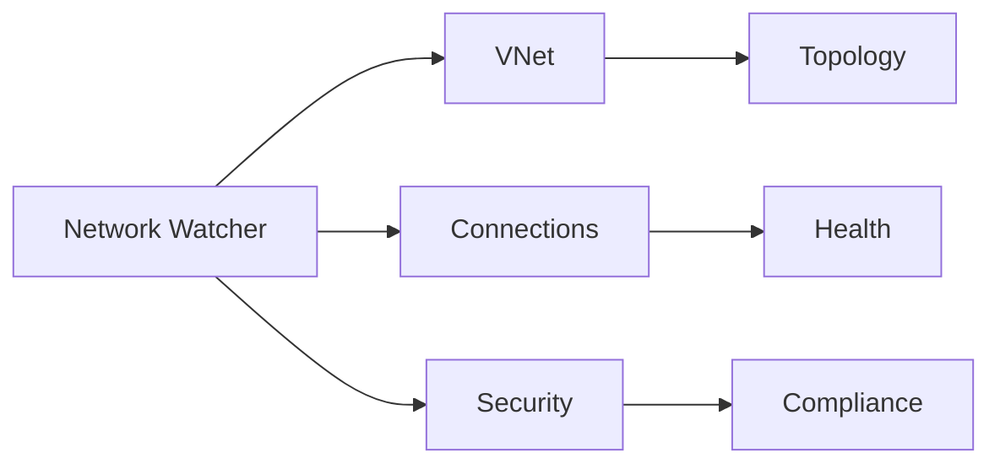
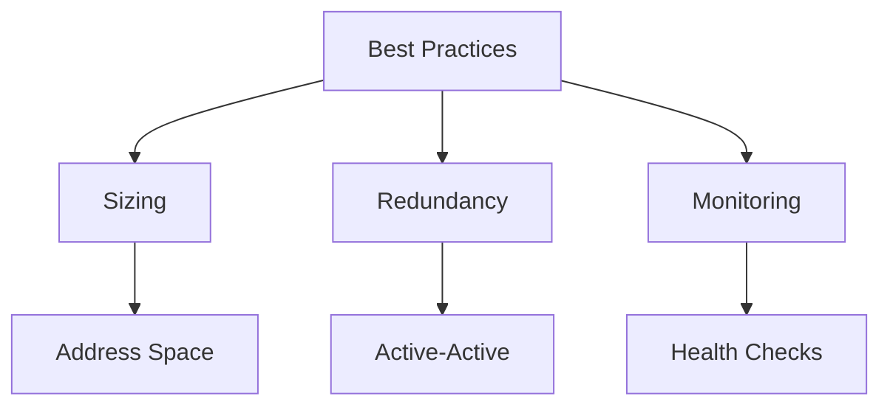
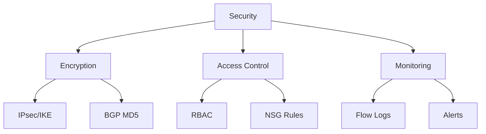
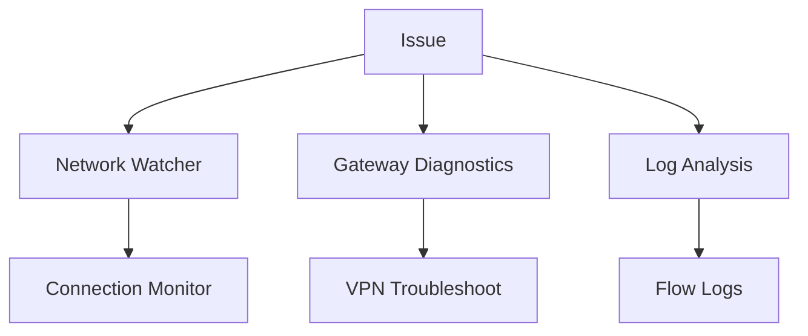

# Azure Networking Concepts

This document covers key Azure networking concepts including CIDR notation, GatewaySubnet requirements, Network Watcher capabilities, and Local Network Gateway configuration.

## CIDR (Classless Inter-Domain Routing)

```mermaid
graph TB
    A[CIDR Notation] --> B[Network Prefix]
    A --> C[Subnet Mask]
    A --> D[Available IPs]
    
    B --> B1[IP Range]
    B --> B2[Network ID]
    
    C --> C1[/8 to /32]
    C --> C2[Subnet Size]
    
    D --> D1[Host Addresses]
    D --> D2[Reserved IPs]
```

### Common CIDR Blocks in Azure
| CIDR Block | Subnet Mask | Available IPs | Common Use |
|------------|-------------|---------------|------------|
| /16 | 255.255.0.0 | 65,534 | VNet Address Space |
| /24 | 255.255.255.0 | 254 | Standard Subnet |
| /26 | 255.255.255.192 | 62 | AKS Subnet |
| /27 | 255.255.255.224 | 30 | GatewaySubnet |
| /28 | 255.255.255.240 | 14 | Small Subnet |
| /29 | 255.255.255.248 | 6 | Minimal Subnet |

## GatewaySubnet

### 1. Configuration Requirements


### 2. Implementation


## Network Watcher

### 1. Diagnostic Features


### 2. Monitoring Capabilities


## Local Network Gateway

### 1. Core Components


### 2. Configuration Example
```yaml
localNetworkGateway:
  name: "on-prem-gateway"
  publicIPAddress: "203.0.113.1"
  addressPrefixes:
    - "10.0.0.0/16"
    - "192.168.1.0/24"
  bgpSettings:
    asn: "65515"
    bgpPeeringAddress: "10.0.0.254"
```

## Integration Patterns

### 1. Hybrid Connectivity


### 2. Network Monitoring


## Best Practices

1. **CIDR Planning**
   - Reserve larger ranges for future growth
   - Use consistent sizing across environments
   - Document IP allocation
   - Consider service requirements

2. **Gateway Configuration**


3. **Network Watcher Usage**
   - Enable NSG flow logs
   - Configure connection monitoring
   - Use packet capture for troubleshooting
   - Implement regular diagnostics

## Security Considerations



## Troubleshooting Guide

1. **Common Issues**
   - Gateway connection problems
   - BGP route propagation
   - Subnet sizing constraints
   - NSG rule conflicts

2. **Resolution Steps**


## Further Reading
- [CIDR and Subnetting Guide](https://learn.microsoft.com/en-us/azure/virtual-network/virtual-networks-cidr)
- [GatewaySubnet Configuration](https://learn.microsoft.com/en-us/azure/vpn-gateway/vpn-gateway-about-vpn-gateway-settings)
- [Network Watcher Overview](https://learn.microsoft.com/en-us/azure/network-watcher/network-watcher-overview)
- [Local Network Gateway Guide](https://learn.microsoft.com/en-us/azure/vpn-gateway/vpn-gateway-howto-site-to-site-resource-manager-portal)