# Azure Stack

Azure Stack is a portfolio of products that extend Azure services and capabilities to your environment of choice—from the datacenter to edge locations and remote offices. It includes Azure Stack HCI for hyperconverged infrastructure, Azure Stack Hub for cloud-native apps, and Azure Stack Edge for edge computing and AI inferencing.

## Product Portfolio

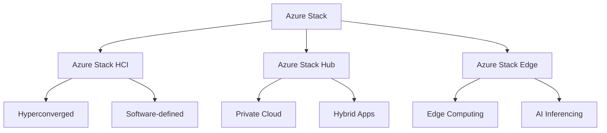

## Azure Stack HCI

### 1. Core Features
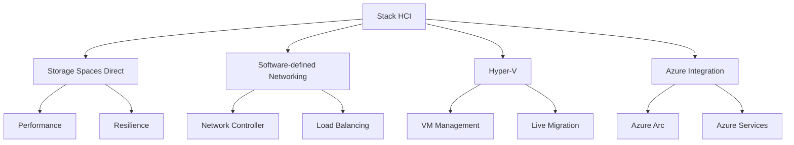

### 2. Management
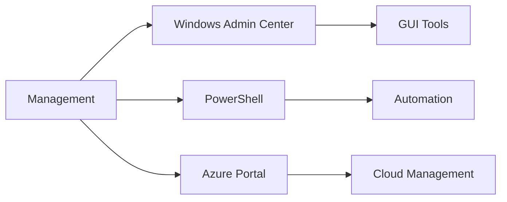

## Azure Stack Hub

### 1. Architecture
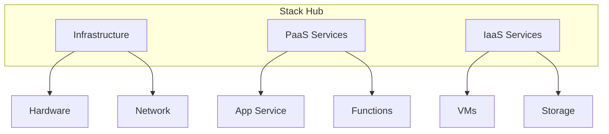

### 2. Service Delivery
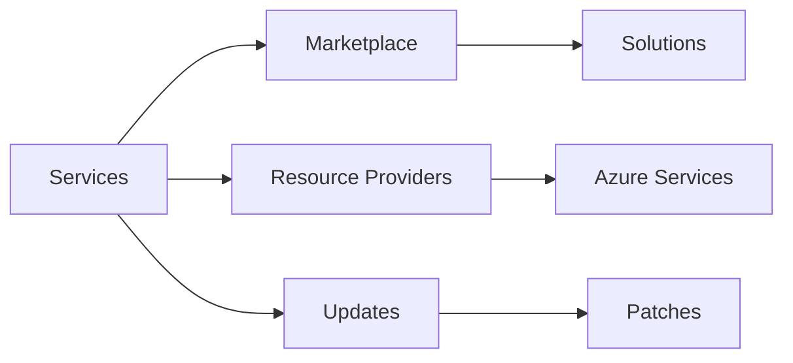

## Azure Stack Edge

### 1. Edge Computing Features
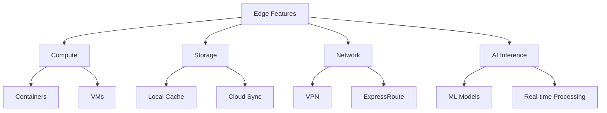

### 2. Data Processing
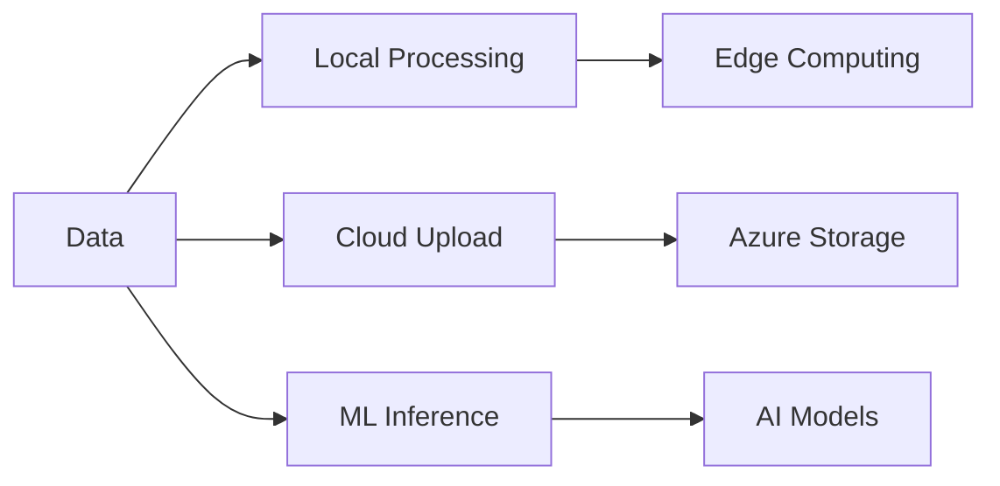

## Security and Compliance

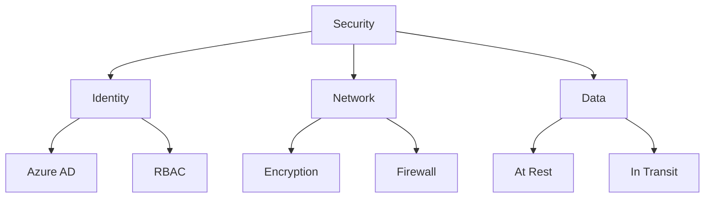

## Deployment Models

### 1. Connected Deployment
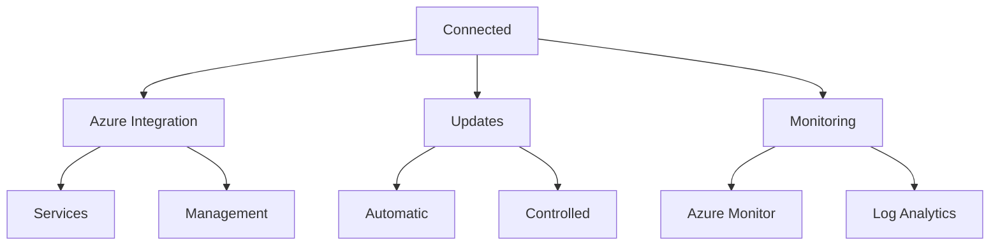

### 2. Disconnected Deployment
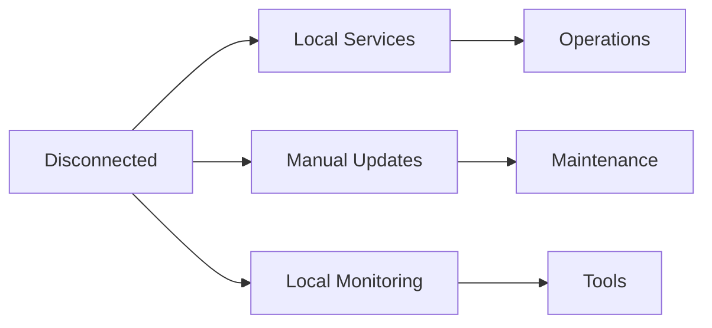

## Best Practices

1. **Infrastructure Planning**
   - Validate hardware requirements
   - Plan network connectivity
   - Design for scale
   - Consider redundancy

2. **Operations Management**
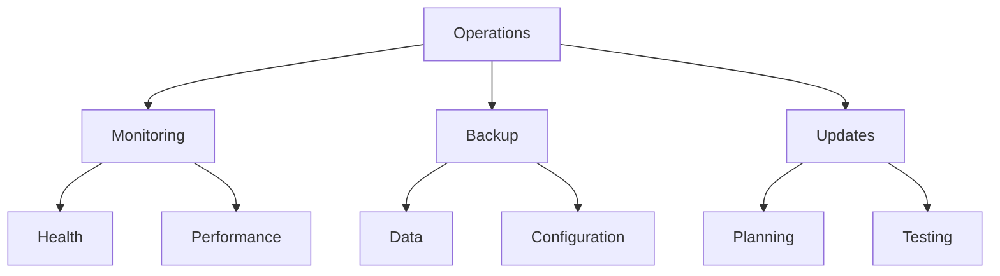

## Integration Patterns

### 1. Hybrid Identity
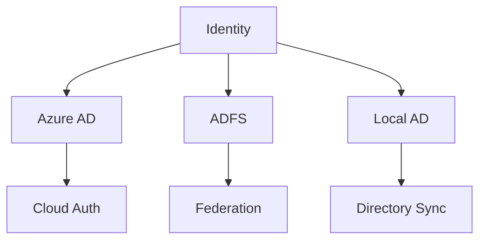

### 2. Network Integration
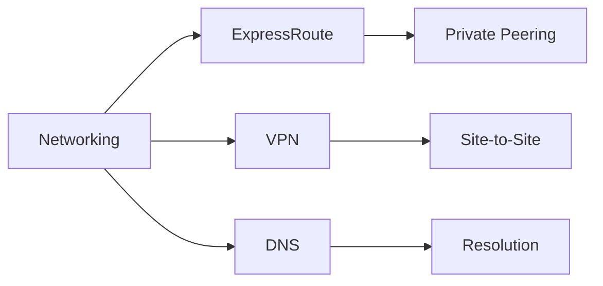

## Monitoring and Management

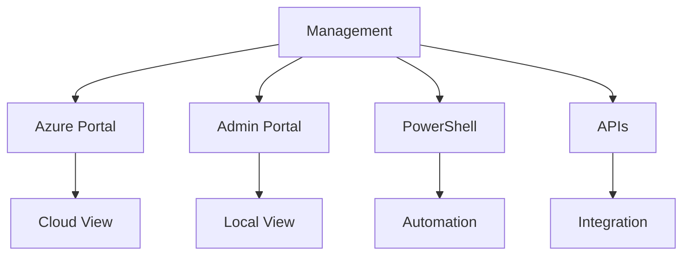

## Cost Considerations

### 1. Cost Components
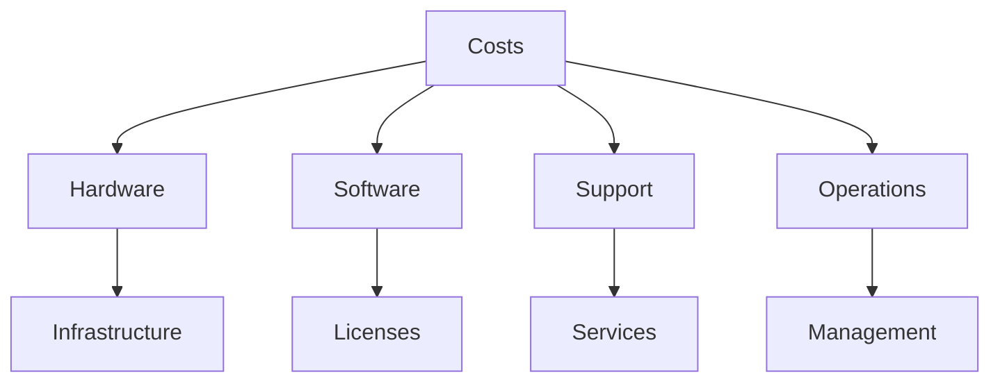

### 2. Optimization Strategies
- Right-size infrastructure
- Optimize resource usage
- Plan capacity effectively
- Monitor consumption

## Troubleshooting Guide

1. **Common Issues**
   - Connectivity problems
   - Update failures
   - Resource provisioning
   - Performance issues

2. **Resolution Steps**
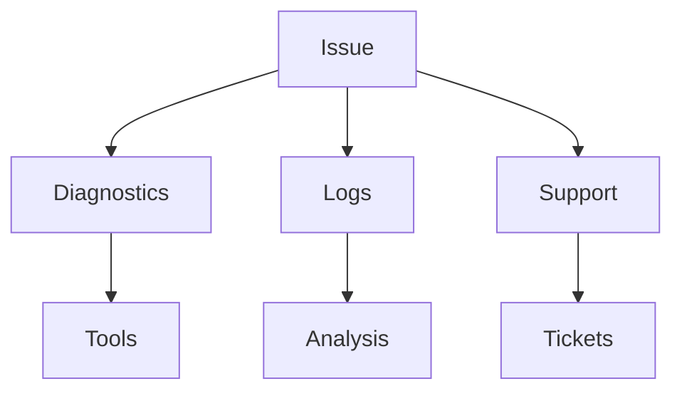

## Further Reading
- [Azure Stack Documentation](https://learn.microsoft.com/en-us/azure-stack/)
- [Azure Stack HCI Guide](https://learn.microsoft.com/en-us/azure-stack/hci/)
- [Stack Hub Planning Guide](https://learn.microsoft.com/en-us/azure-stack/operator/azure-stack-capacity-planning)