# Azure StorSimple

Azure StorSimple is a hybrid cloud storage solution that integrates on-premises storage with Azure cloud storage, providing automated storage tiering, data protection, and disaster recovery capabilities. It helps organizations optimize storage costs while maintaining high performance for frequently accessed data.

## Core Components

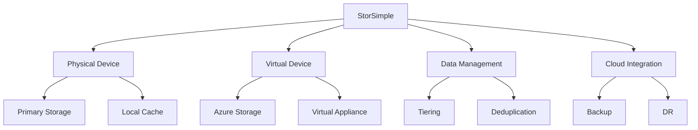

## Storage Tiering

### 1. Tiering Architecture
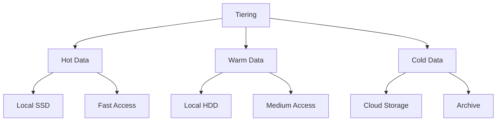

### 2. Data Movement
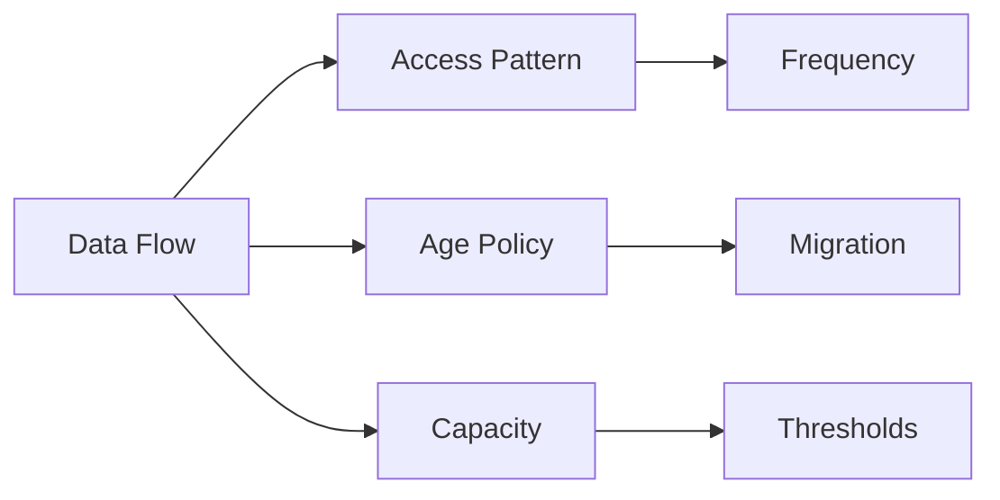

## Data Protection

### 1. Backup Features
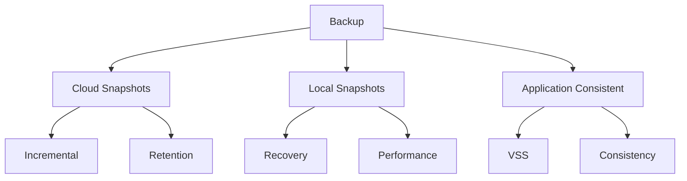

### 2. Disaster Recovery
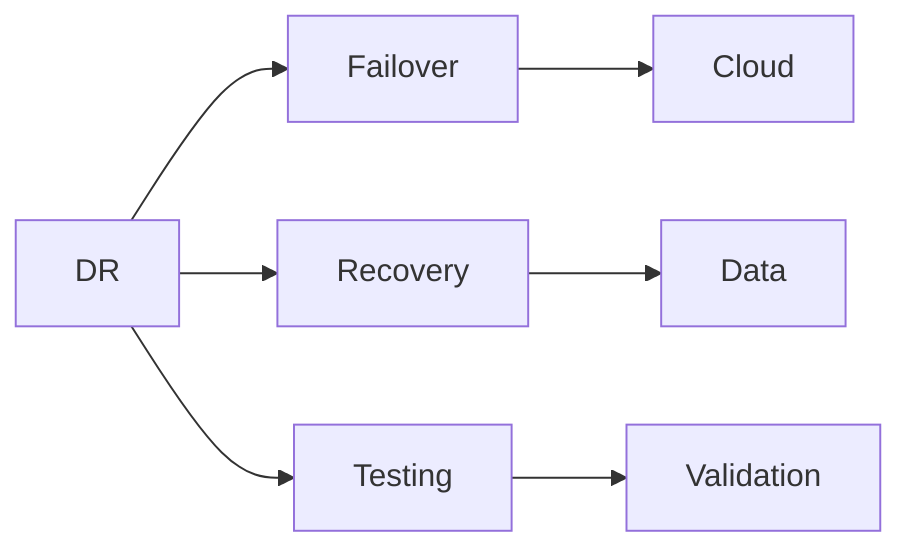

## Performance Optimization

### 1. Cache Management
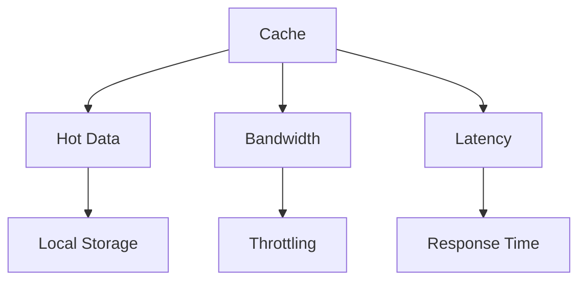

### 2. Network Configuration
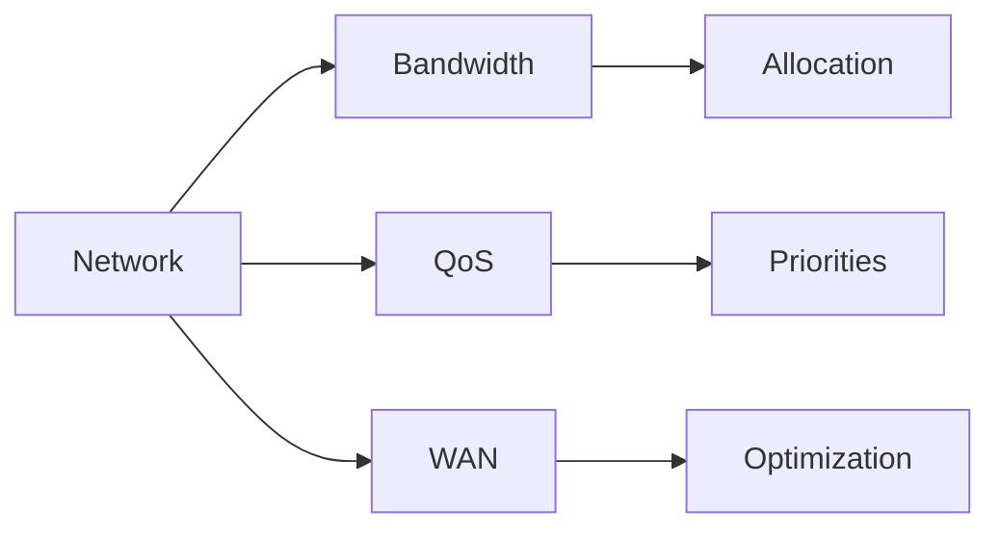

## Monitoring and Management

### 1. Performance Monitoring
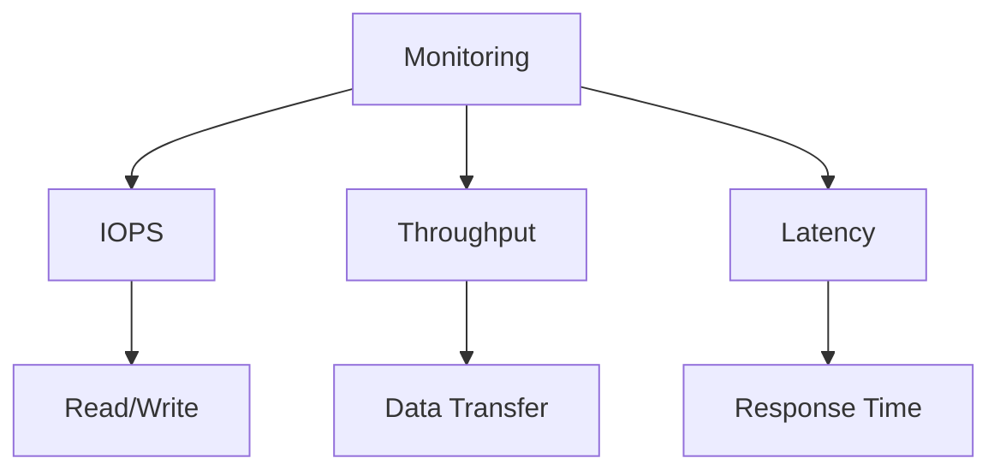

### 2. Capacity Planning
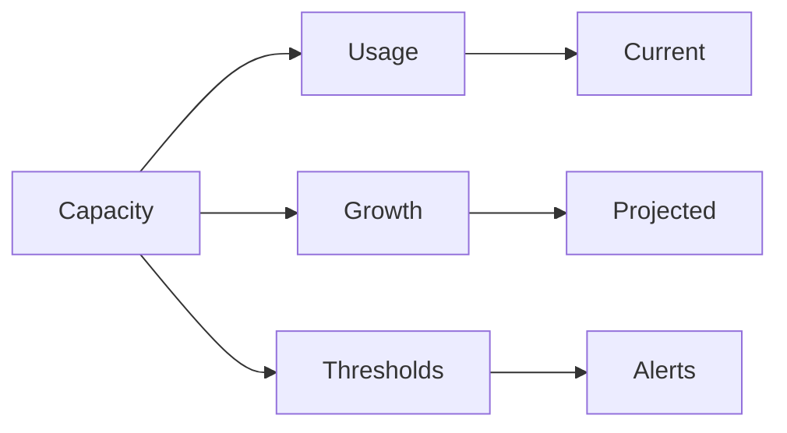

## Security Features

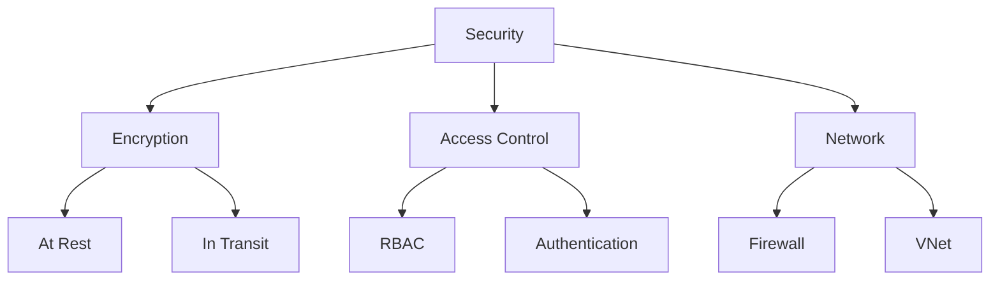

## Integration with Azure

### 1. Cloud Services
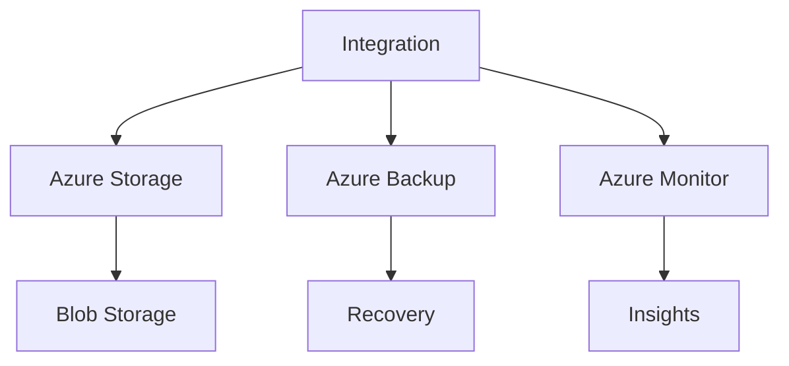

### 2. Management Tools
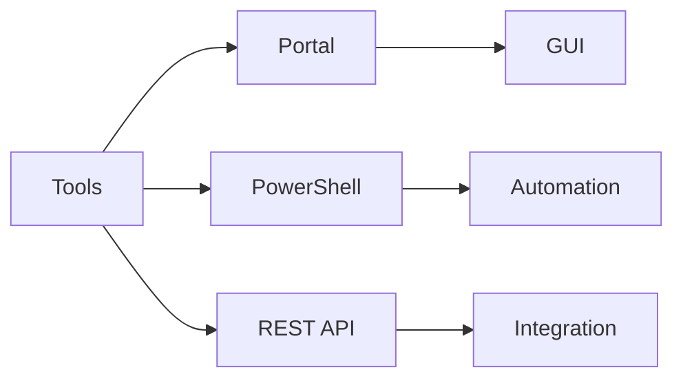

## Best Practices

1. **Implementation Guidelines**
   - Plan capacity properly
   - Configure network QoS
   - Set up monitoring
   - Regular maintenance

2. **Operational Management**
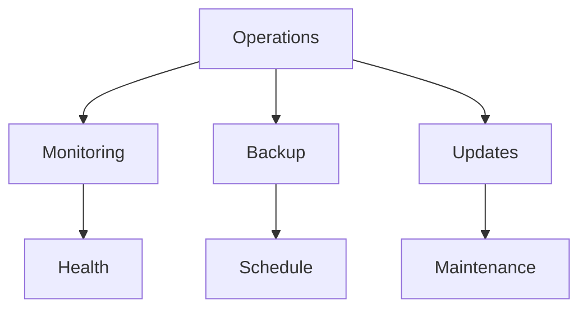

## Troubleshooting Guide

1. **Common Issues**
   - Performance problems
   - Connectivity issues
   - Tiering failures
   - Backup errors

2. **Resolution Steps**
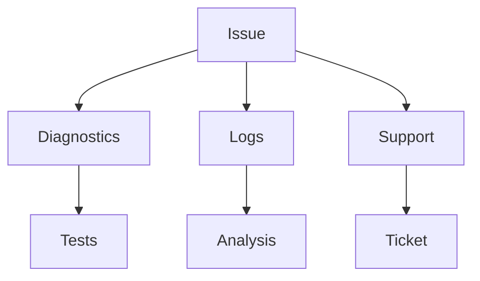

## Further Reading
- [StorSimple Documentation](https://learn.microsoft.com/en-us/azure/storsimple/)
- [Implementation Guide](https://learn.microsoft.com/en-us/azure/storsimple/storsimple-8000-deployment-walkthrough-u2)
- [Best Practices](https://learn.microsoft.com/en-us/azure/storsimple/storsimple-8000-best-practices)