# Azure Backup and Site Recovery

## Overview
Azure Backup and Azure Site Recovery (ASR) are Azure's built-in disaster recovery services. Azure Backup provides data protection and recovery capabilities, while ASR ensures business continuity through replication and failover.

## Azure Backup

### Core Components

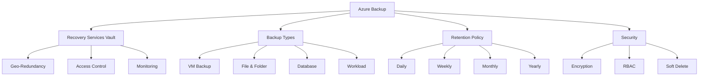

### Backup Scenarios

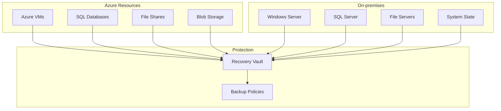

## Azure Site Recovery

### Architecture Components

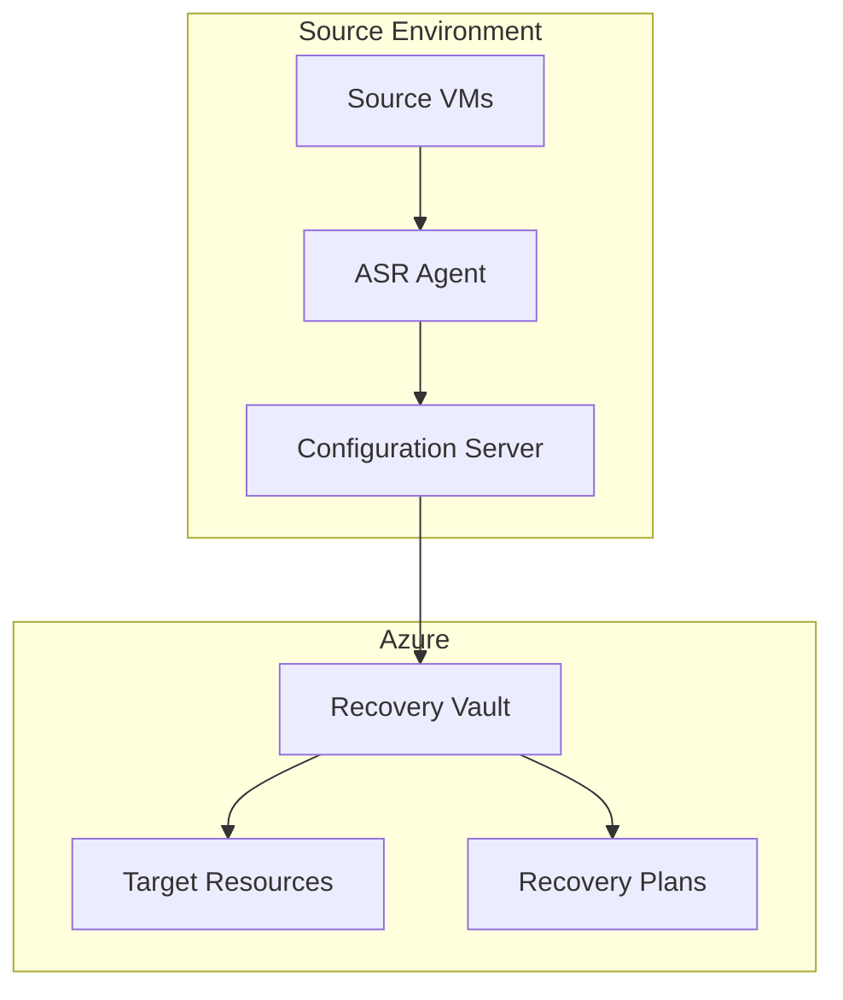

### Replication Process

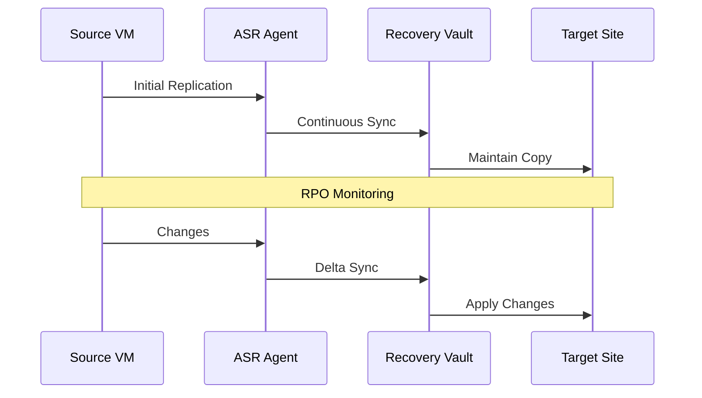

## Implementation Examples

### 1. VM Backup Strategy
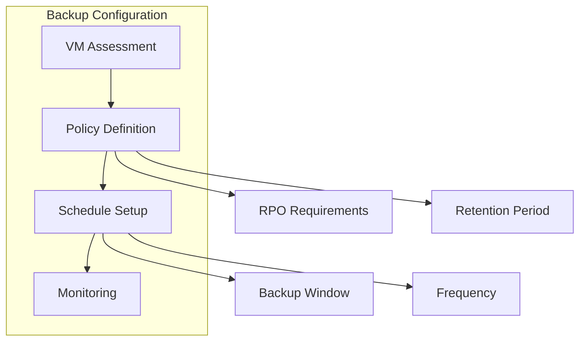

### 2. Site Recovery Implementation
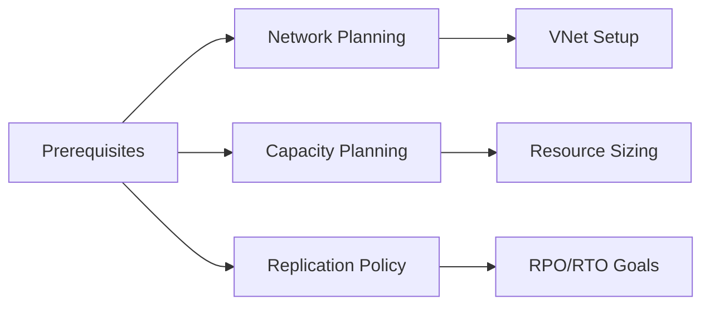

## Disaster Recovery Scenarios

### 1. Azure-to-Azure DR
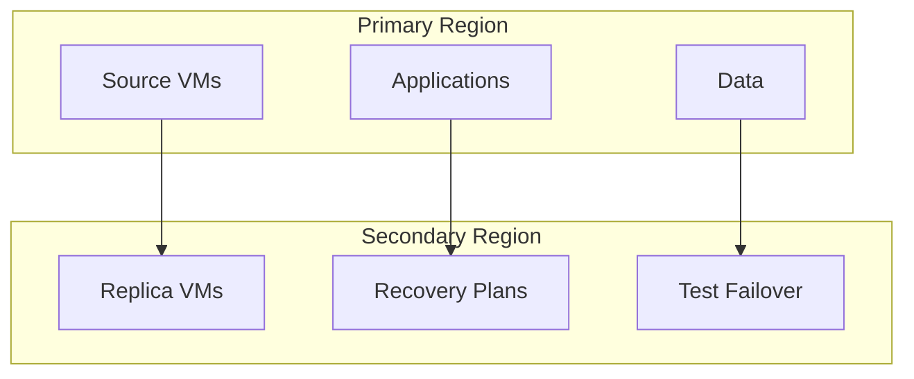

### 2. On-Premises to Azure

## Monitoring and Management

### 1. Backup Monitoring
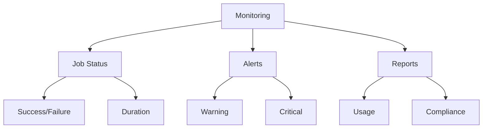

### 2. ASR Health Monitoring
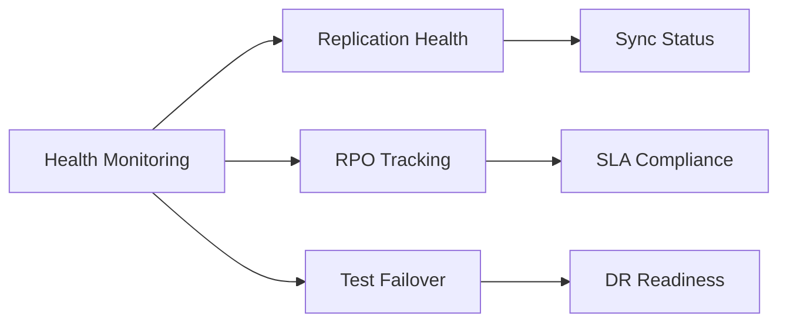

## Best Practices

### 1. Backup Strategy
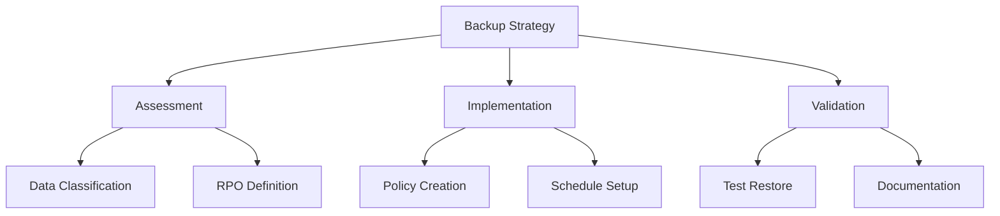

### 2. DR Planning
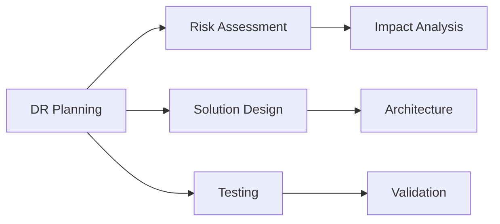

## Cost Optimization

### 1. Backup Costs
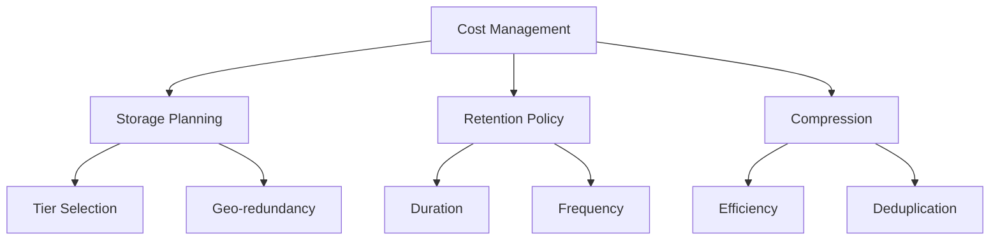

### 2. ASR Cost Control
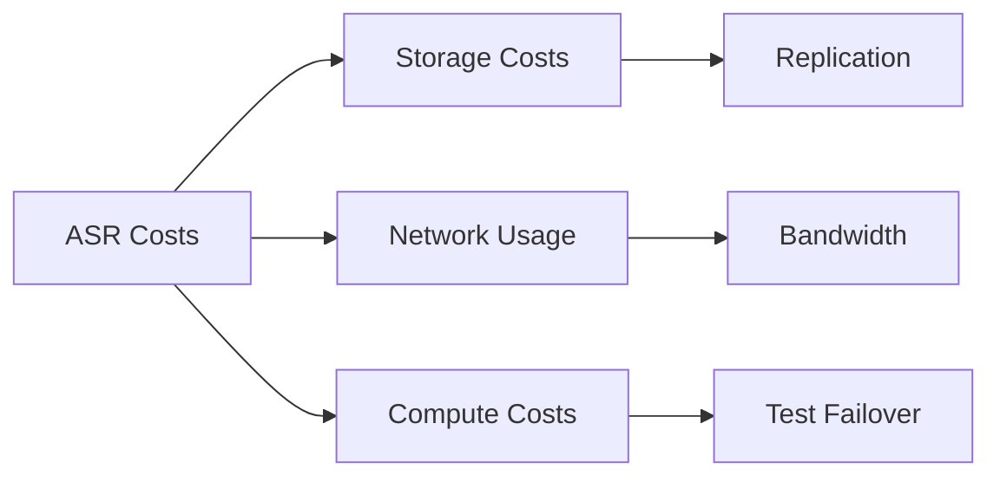

## Recovery Testing

### 1. Backup Recovery Testing
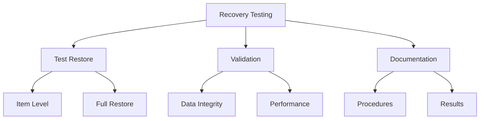

### 2. DR Testing
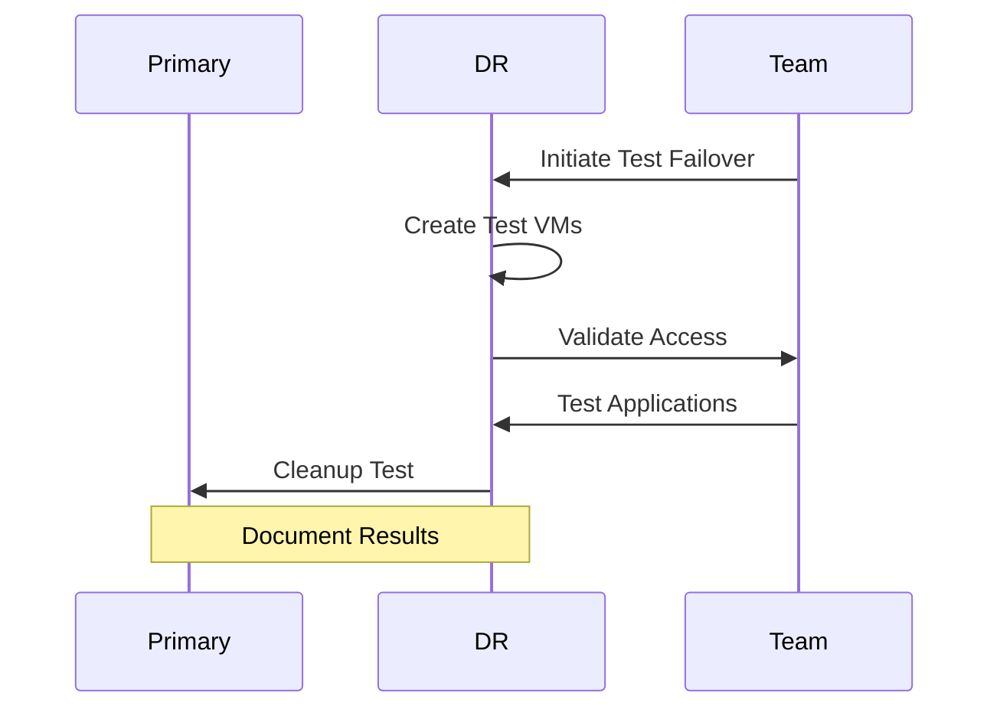

## Best Practices Summary

1. **Backup Management**
   - Regular testing of restores
   - Monitor backup status
   - Review retention policies
   - Document procedures

2. **DR Implementation**
   - Regular DR testing
   - Keep documentation updated
   - Monitor replication health
   - Review RPO/RTO compliance

3. **Security Considerations**
   - Enable soft delete
   - Implement RBAC
   - Use encryption
   - Monitor access logs

## Further Reading
- [Azure Backup Documentation](https://learn.microsoft.com/en-us/azure/backup/)
- [Azure Site Recovery Documentation](https://learn.microsoft.com/en-us/azure/site-recovery/)
- [Disaster Recovery Best Practices](https://learn.microsoft.com/en-us/azure/site-recovery/site-recovery-best-practices)