# Cloud-Init in Azure

Cloud-init is the industry standard for cross-platform cloud instance initialization, enabling you to automate the initial setup of virtual machines in Azure. It provides a flexible way to handle first-boot initialization tasks, package installation, and configuration management across various Linux distributions.

## Overview

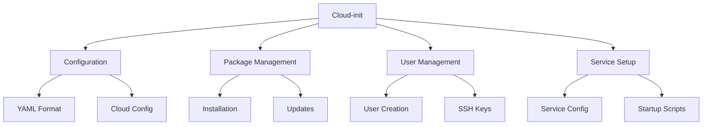

## Common Tasks and Examples

### 1. Basic Configuration
```yaml
#cloud-config
package_upgrade: true
packages:
  - nginx
  - docker.io
  - git

runcmd:
  - systemctl start nginx
  - systemctl enable nginx

users:
  - default
  - name: devops
    sudo: ALL=(ALL) NOPASSWD:ALL
    shell: /bin/bash
    ssh_authorized_keys:
      - ssh-rsa AAAA...
```

### 2. Storage Configuration
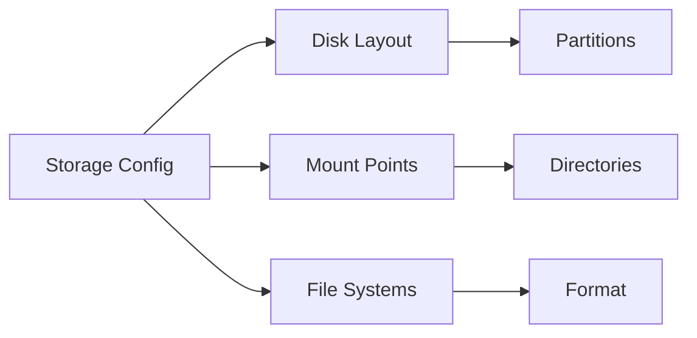

## Implementation Patterns

### 1. Web Server Setup
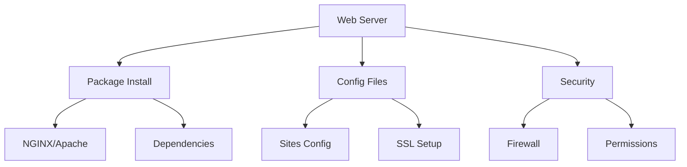

### 2. Application Deployment
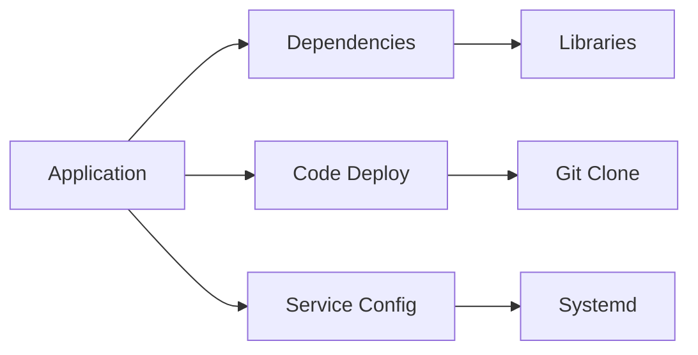

## Best Practices

### 1. Script Organization
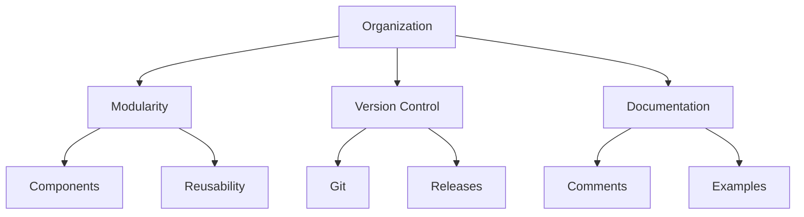

### 2. Error Handling
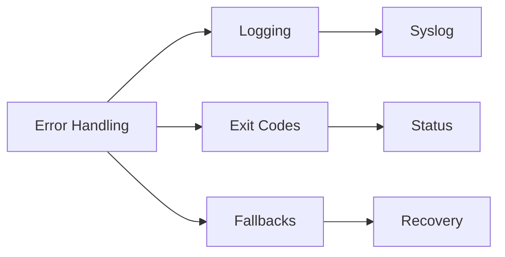

## Security Considerations

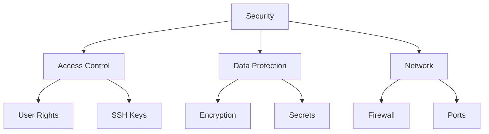

## Integration with Azure

### 1. VM Deployment
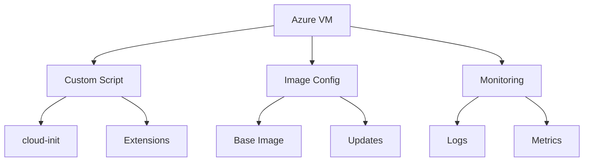

### 2. Automation Integration
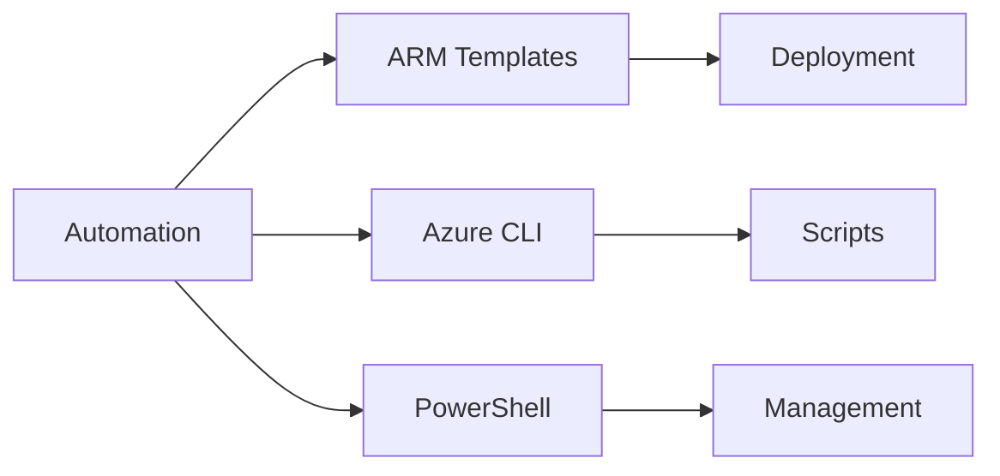

## Performance Optimization

### 1. Boot Time Optimization
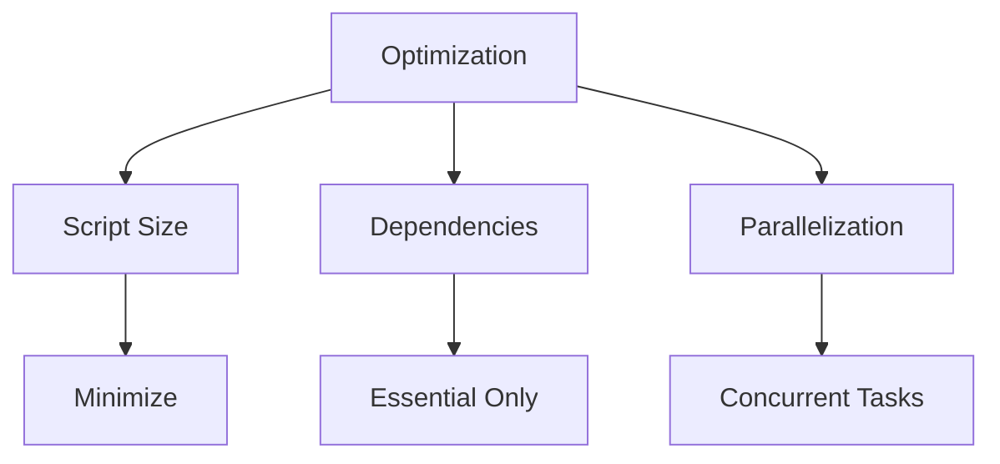

### 2. Resource Management
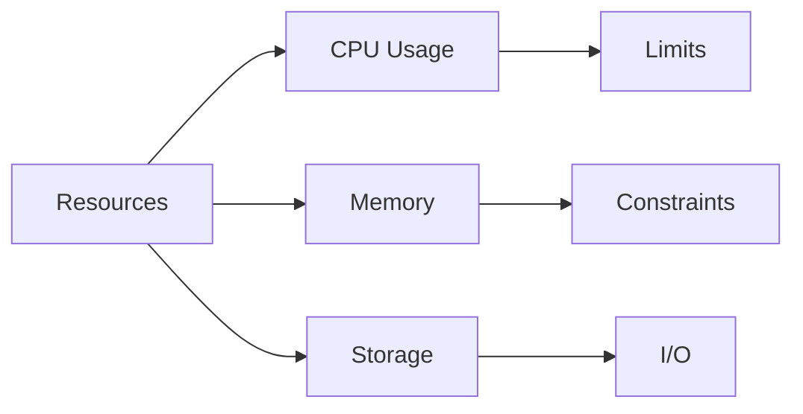

## Troubleshooting Guide

1. **Common Issues**
   - Script syntax errors
   - Package installation failures
   - Network connectivity
   - Permission problems

2. **Debugging Steps**
```mermaid
graph TB
    A[Debug] --> B[Check Logs]
    A --> C[Validate Config]
    A --> D[Test Scripts]
    
    B --> E[/var/log/cloud-init.log]
    C --> F[YAML Syntax]
    D --> G[Test Environment]
```

## Example Configurations

### 1. LAMP Stack Setup
```yaml
#cloud-config
packages:
  - apache2
  - mysql-server
  - php
  - libapache2-mod-php
  - php-mysql

write_files:
  - path: /var/www/html/info.php
    content: |
      <?php
      phpinfo();
      ?>

runcmd:
  - systemctl restart apache2
```

### 2. Docker Environment
```yaml
#cloud-config
package_upgrade: true
packages:
  - docker.io
  - docker-compose

runcmd:
  - systemctl start docker
  - systemctl enable docker
  - usermod -aG docker ubuntu
```

## Multi-Cloud Compatibility

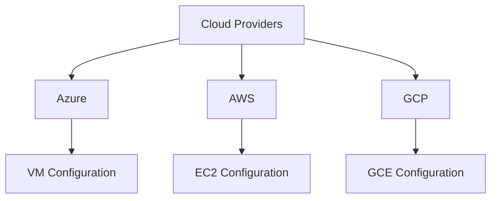

## Further Reading
- [Cloud-init Documentation](https://cloudinit.readthedocs.io/)
- [Azure Linux VM Documentation](https://learn.microsoft.com/en-us/azure/virtual-machines/linux/)
- [Cloud-init Examples](https://learn.microsoft.com/en-us/azure/virtual-machines/linux/tutorial-automate-vm-deployment)