# Azure Container Services (ACI and AKS)

## Overview
Azure provides two main container services: Azure Container Instances (ACI) for simple container workloads and Azure Kubernetes Service (AKS) for orchestrating complex container applications.

## Azure Container Instances (ACI)

### Core Components

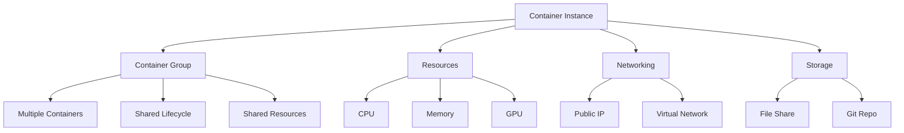

### Container Groups
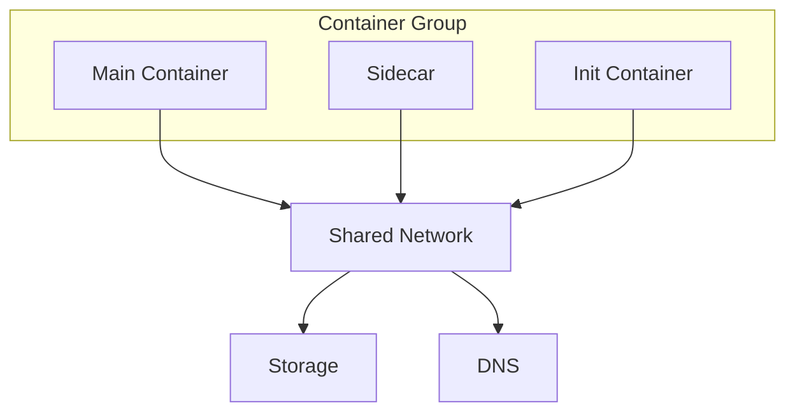

## Azure Kubernetes Service (AKS)

### Architecture Components

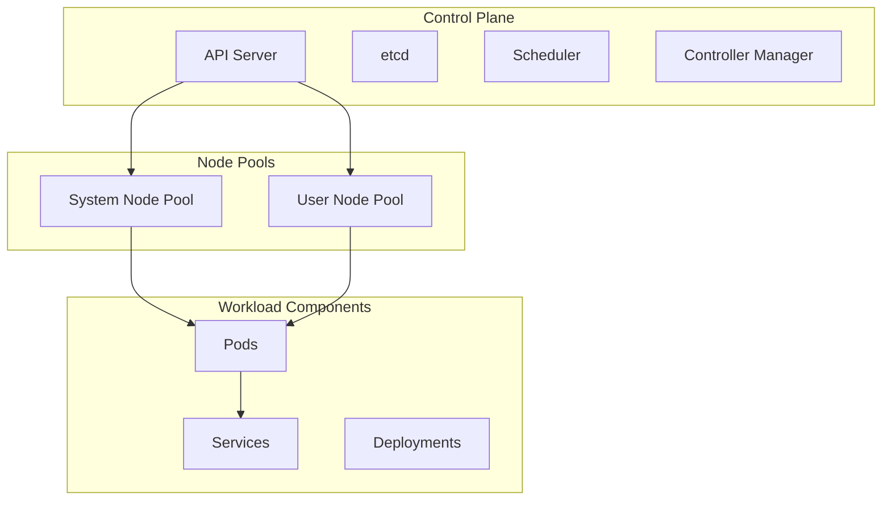

### Networking Models

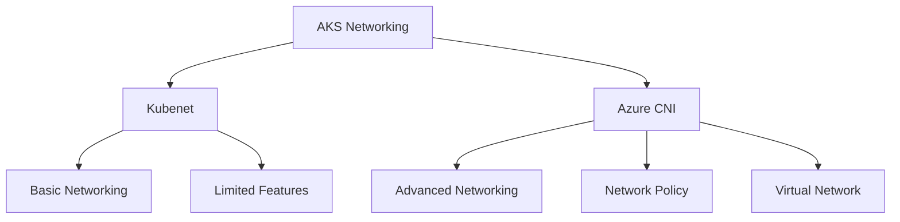

## Implementation Examples

### 1. Basic Container Instance
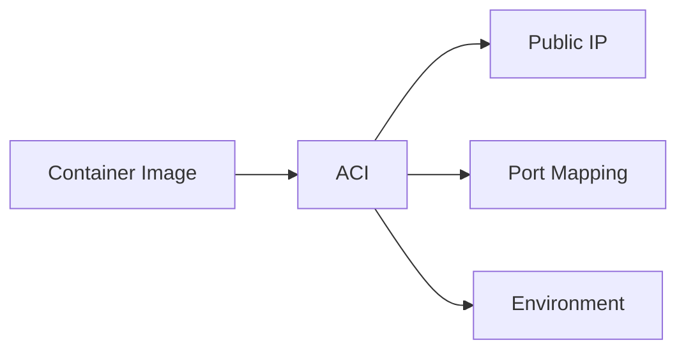

### 2. AKS Deployment
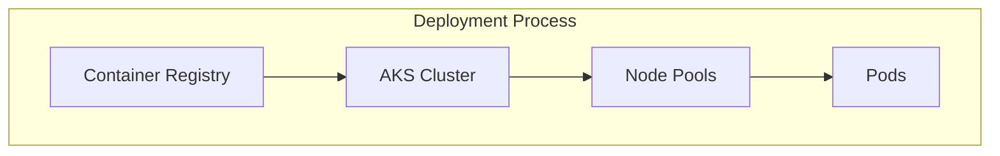

## Security Implementation

### 1. Container Security
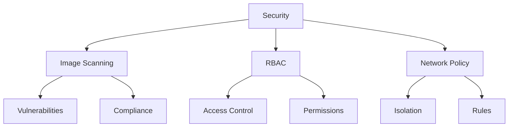

### 2. Identity and Access
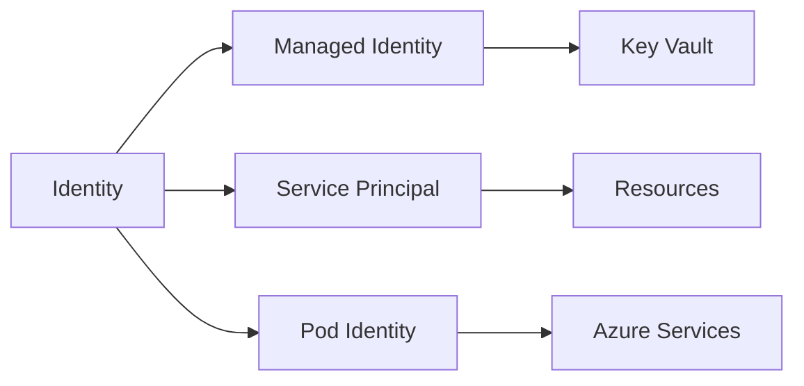

## Monitoring and Diagnostics

### 1. AKS Monitoring
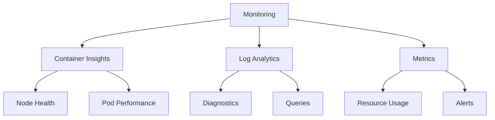

### 2. Diagnostic Tools
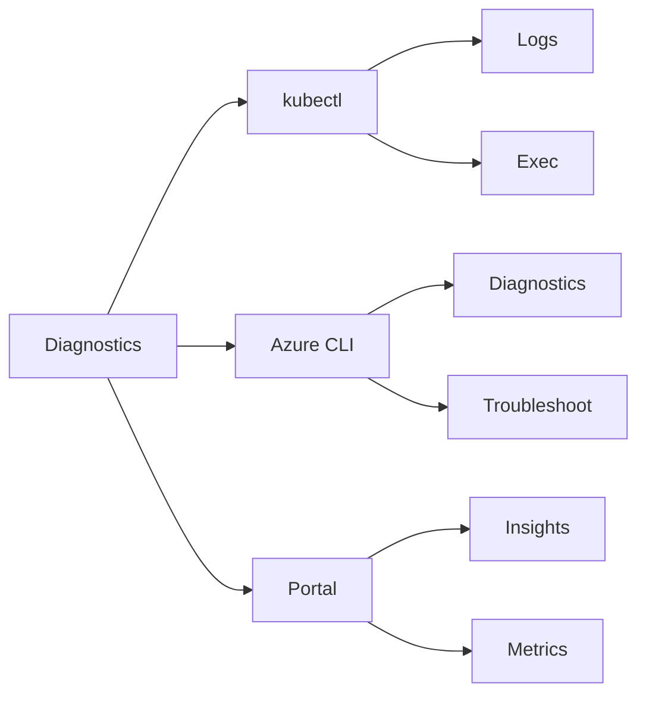

## Best Practices

### 1. Resource Management
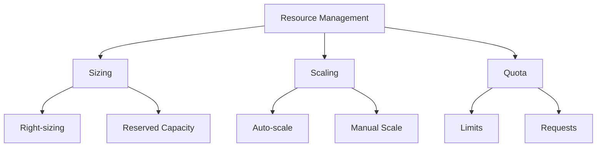

### 2. High Availability
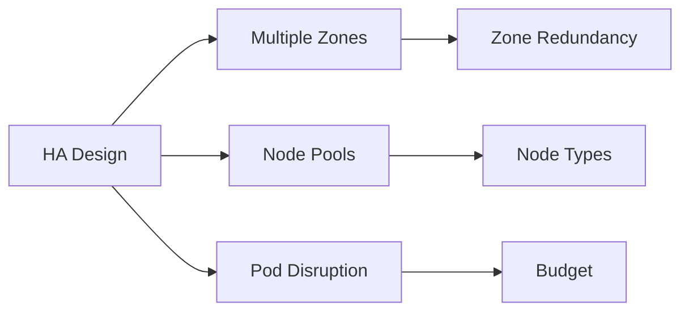

## Cost Optimization

### 1. AKS Cost Management
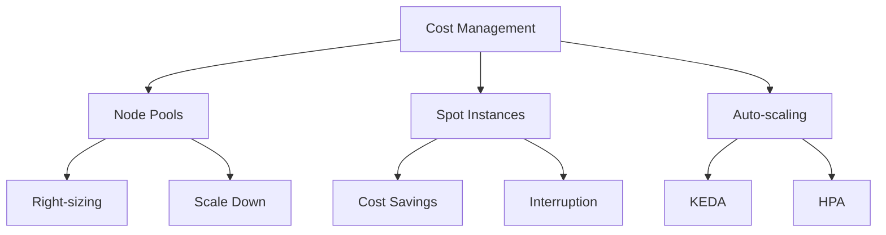

### 2. Resource Optimization
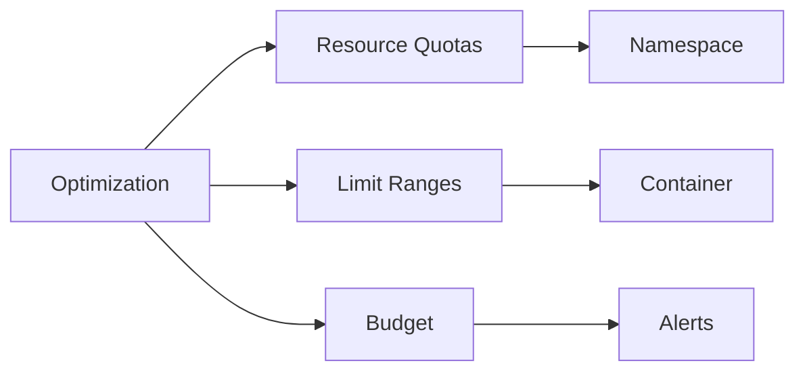

## Integration Features

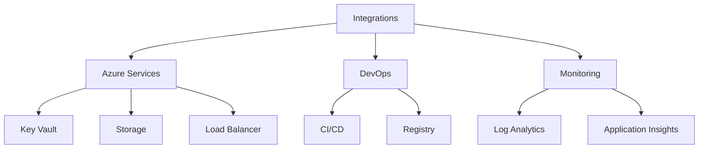

## Troubleshooting Guide

1. **Common Issues**
   - Pod scheduling failures
   - Network connectivity
   - Image pull errors
   - Resource constraints

2. **Diagnostic Process**
   ```mermaid
   graph TB
       A[Troubleshooting] --> B[Node Health]
       A --> C[Pod State]
       A --> D[Networking]
       
       B --> E[Resources]
       B --> F[System]
       
       C --> G[Events]
       C --> H[Logs]
       
       D --> I[DNS]
       D --> J[Connectivity]
   ```

## Best Practices Summary

1. **Container Design**
   - Use minimal base images
   - Implement health probes
   - Handle graceful shutdowns
   - Version your images

2. **AKS Management**
   - Regular cluster updates
   - Monitor resource usage
   - Implement auto-scaling
   - Use pod disruption budgets

3. **Security**
   - Enable network policies
   - Use pod security policies
   - Implement RBAC
   - Regular security scans

## Further Reading
- [Azure Container Instances Documentation](https://learn.microsoft.com/en-us/azure/container-instances/)
- [AKS Documentation](https://learn.microsoft.com/en-us/azure/aks/)
- [Container Best Practices](https://learn.microsoft.com/en-us/azure/container-apps/best-practices)