# Azure Cost Management and Billing

Azure Cost Management and Billing provides tools and capabilities to monitor, analyze, and optimize your cloud spending. It helps you understand your Azure bill, manage your account and subscriptions, monitor and control cloud spending, and optimize resource use through detailed cost analysis, budgets, alerts, and recommendations for cost savings.

## Overview
Azure Cost Management and FinOps practices help organizations plan, analyze, and optimize their cloud spending while maintaining operational excellence. This involves understanding costs, implementing governance, and optimizing resource usage.

## Core Components

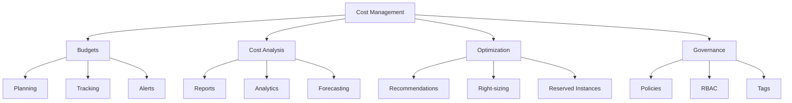

## Cost Analysis

### 1. Cost Views
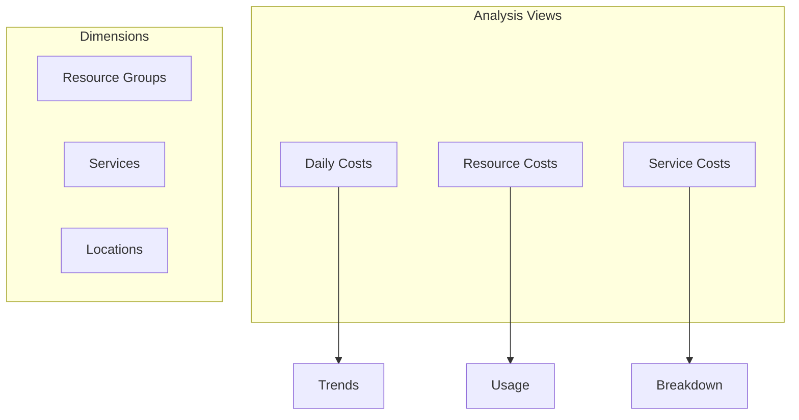

### 2. Cost Reporting
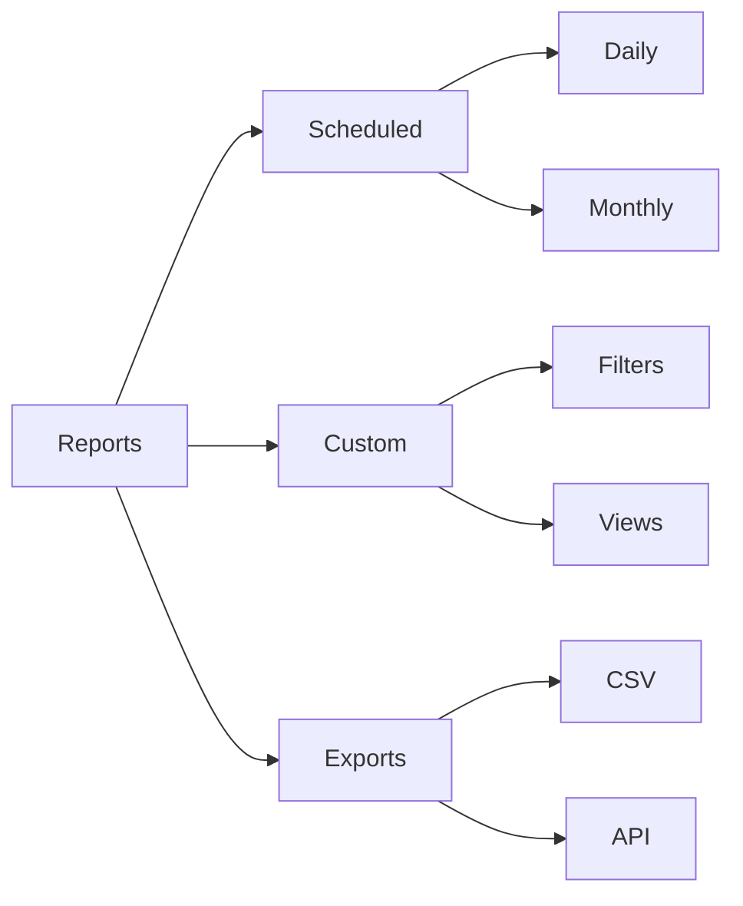

## Budgets and Alerts

### 1. Budget Configuration
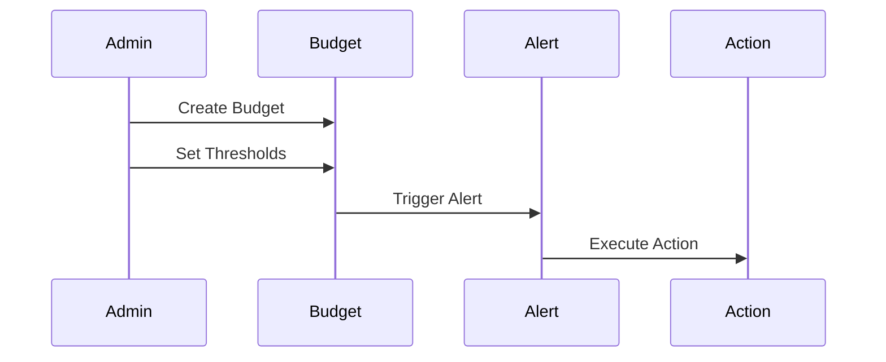

### 2. Alert Types
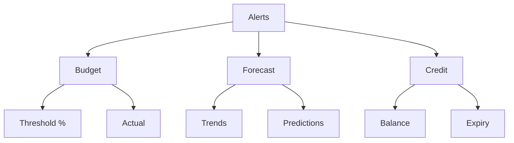

## Cost Optimization

### 1. Resource Optimization
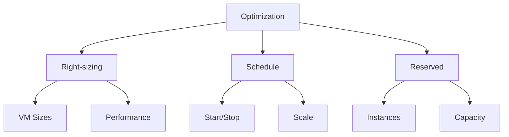

### 2. Reserved Instances
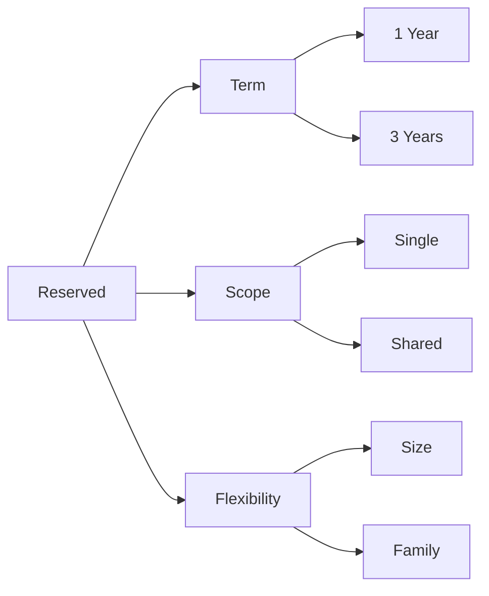

## Cost Governance

### 1. Policy Implementation
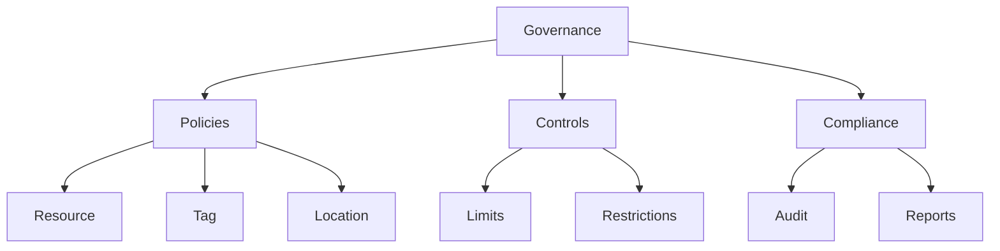

### 2. Tagging Strategy
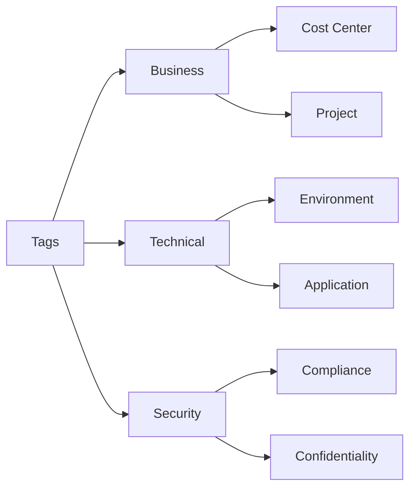

## Reporting and Analytics

### 1. Cost Reports
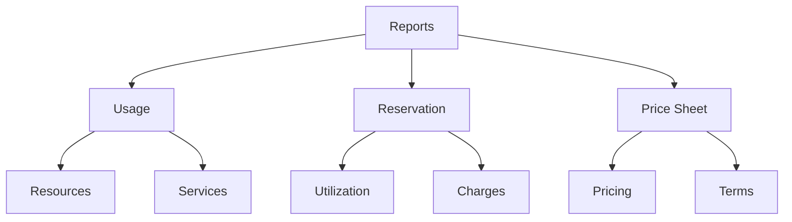

### 2. Performance Analytics
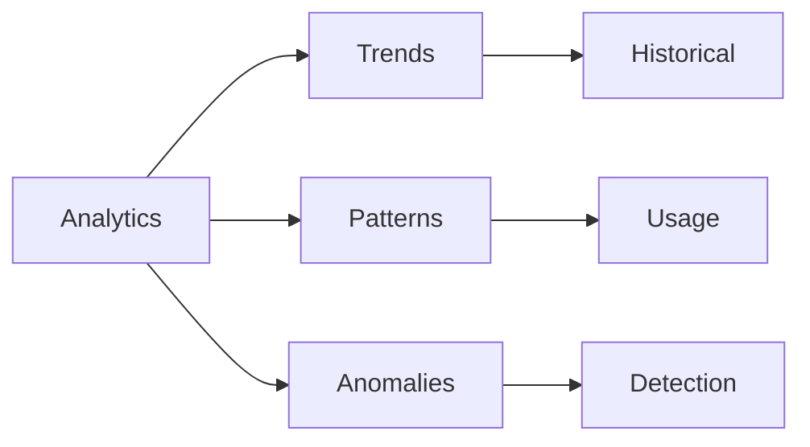

## FinOps Practices

### 1. Financial Planning
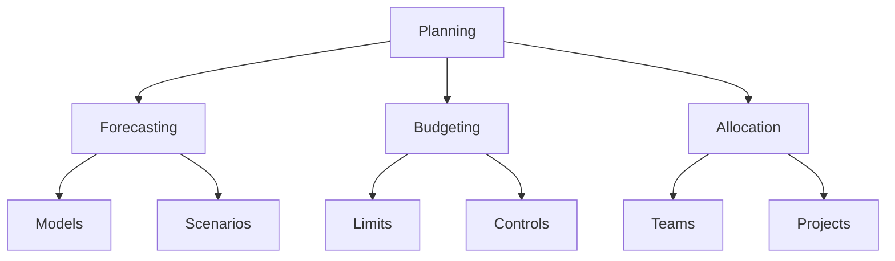

### 2. Operational Excellence
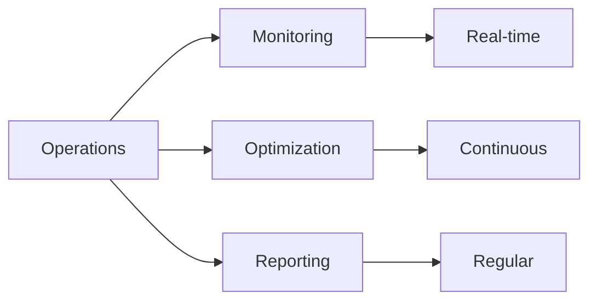

## Best Practices Summary

1. **Cost Planning**
   - Set detailed budgets
   - Configure alerts
   - Regular monitoring
   - Use forecasting

2. **Resource Optimization**
   - Right-size resources
   - Use reserved instances
   - Implement auto-scaling
   - Schedule resources

3. **Governance**
   - Implement policies
   - Use tagging
   - Regular reviews
   - Track compliance

## Implementation Guidelines

### 1. Cost Strategy
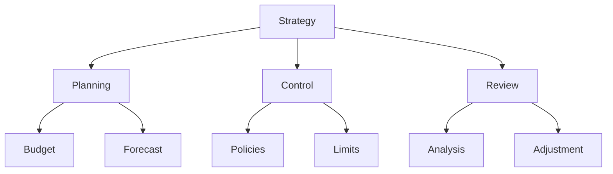

### 2. Optimization Process
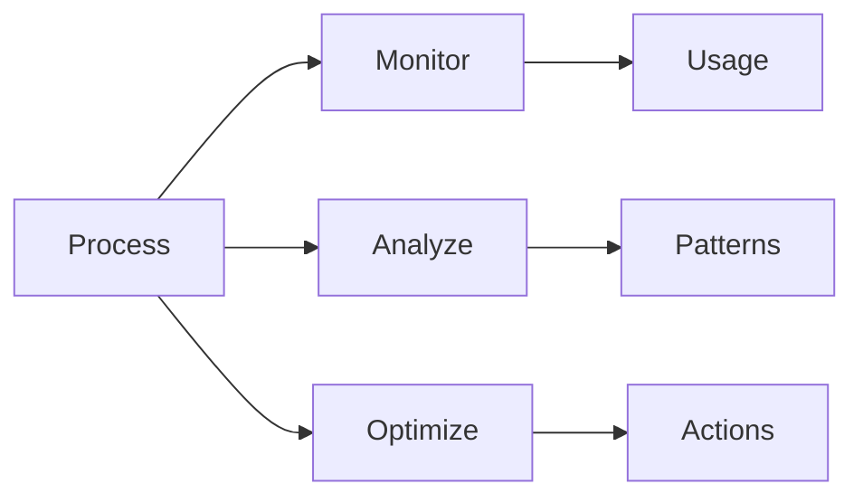

## Further Reading
- [Azure Cost Management Documentation](https://learn.microsoft.com/en-us/azure/cost-management-billing/)
- [FinOps in Azure](https://learn.microsoft.com/en-us/azure/cloud-adoption-framework/ready/finops/)
- [Cost Optimization Best Practices](https://learn.microsoft.com/en-us/azure/architecture/framework/cost/overview)