# Azure Cost Management and Billing

## Overview
Azure Cost Management and Billing provides tools to monitor, allocate, and optimize your Azure spending. It helps organizations plan, analyze, and reduce their cloud costs while maximizing their cloud investment.

## Core Components

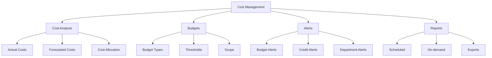

## Cost Analysis Features

### 1. Cost Views
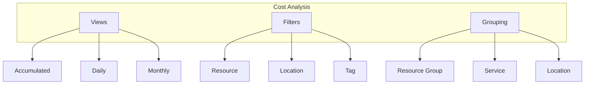

### 2. Cost Allocation
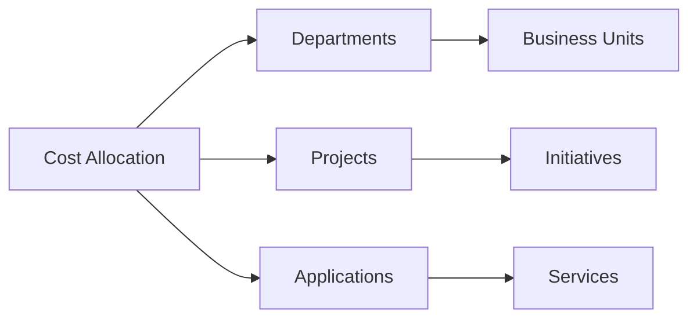

## Budget Management

### 1. Budget Creation
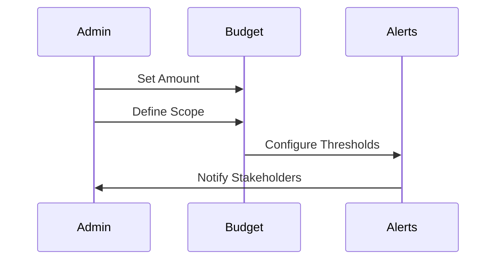

### 2. Budget Monitoring
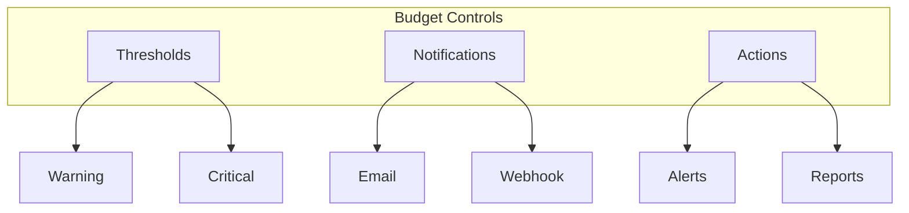

## Cost Optimization

### 1. Resource Optimization
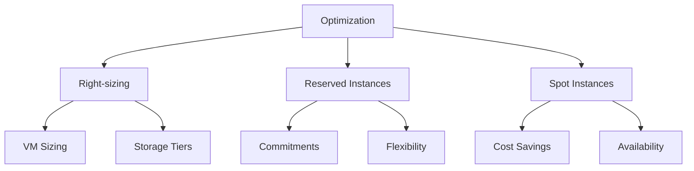

### 2. Cost Reduction Strategies
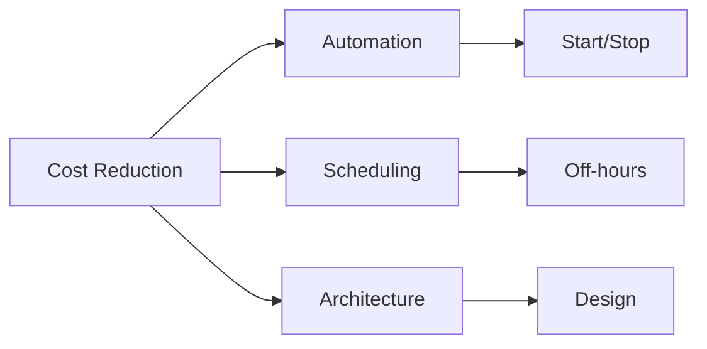

## Reporting and Analysis

### 1. Report Types
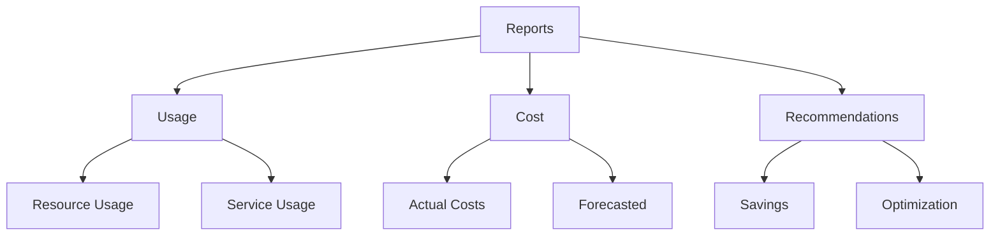

### 2. Data Analysis
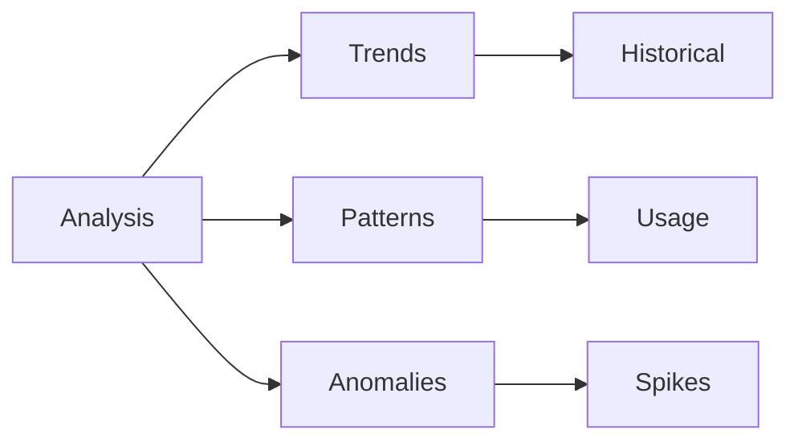

## Best Practices

### 1. Cost Governance
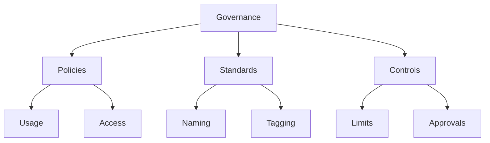

### 2. Resource Organization
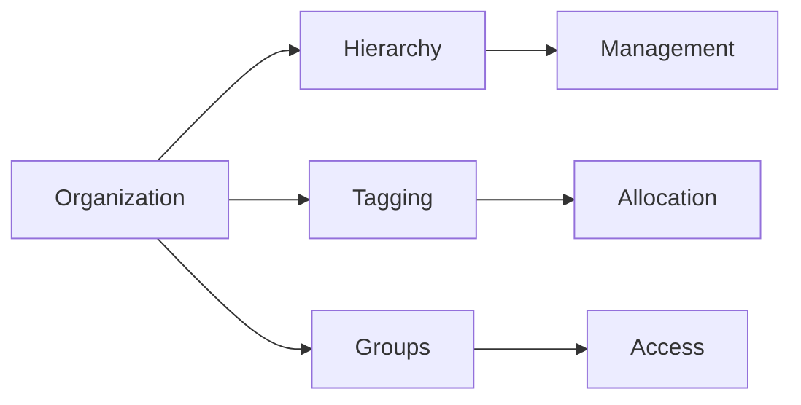

## Monitoring and Alerts

### 1. Cost Monitoring
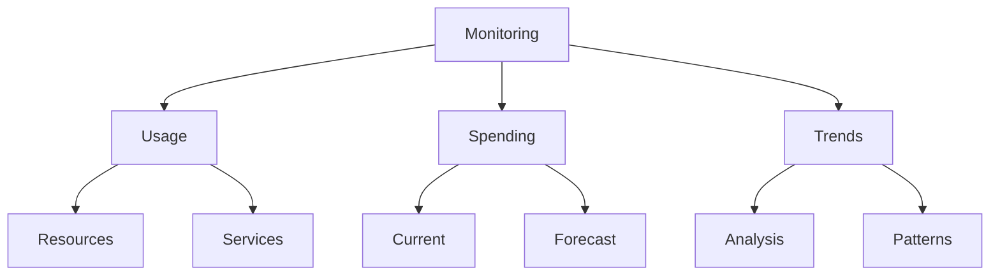

### 2. Alert Configuration
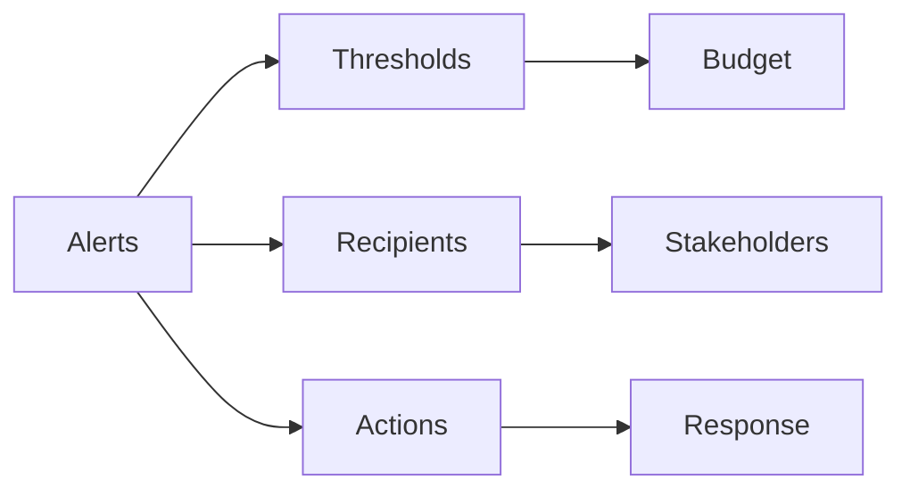

## Integration Features

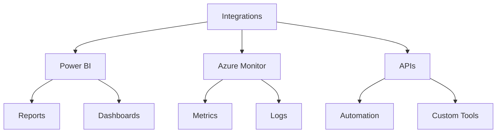

## Cost Management Workflow

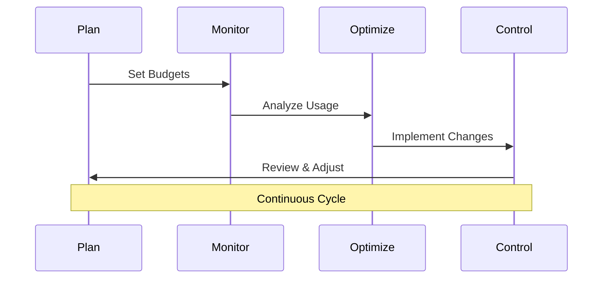

## Best Practices Summary

1. **Budget Management**
   - Set realistic budgets
   - Configure alerts
   - Regular reviews
   - Document policies

2. **Cost Optimization**
   - Use reserved instances
   - Implement auto-shutdown
   - Right-size resources
   - Regular cleanup

3. **Governance**
   - Implement tagging
   - Set up access control
   - Define policies
   - Regular auditing

## Further Reading
- [Azure Cost Management Documentation](https://learn.microsoft.com/en-us/azure/cost-management-billing/)
- [Cost Optimization Guide](https://learn.microsoft.com/en-us/azure/cost-management-billing/costs/cost-mgt-best-practices)
- [Billing Best Practices](https://learn.microsoft.com/en-us/azure/cost-management-billing/manage/getting-started)