# Azure DNS and Network Routing

## Overview
Azure DNS provides reliable and secure domain hosting while Azure network routing enables control over network traffic flow. Together, they form the backbone of Azure networking infrastructure.

## Azure DNS Components

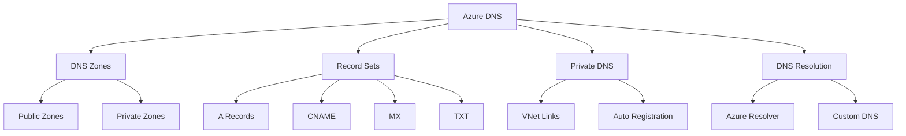

### DNS Zone Types

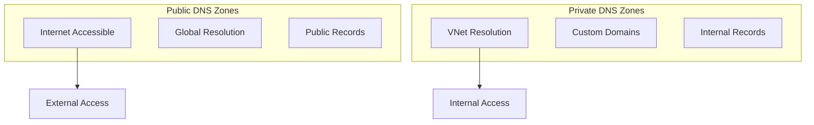

## Network Routing Components

### 1. Route Tables
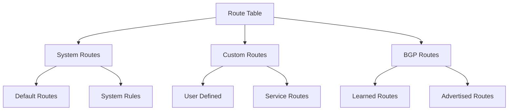

### 2. Next Hop Types
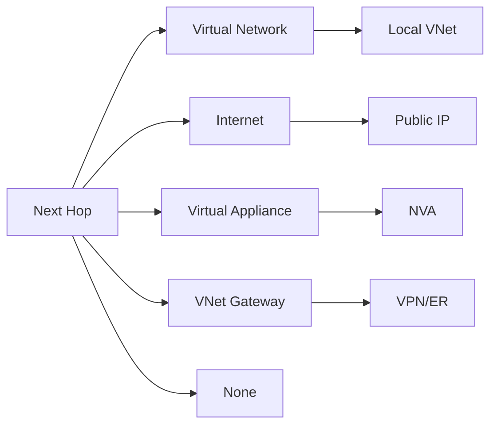

## Implementation Examples

### 1. DNS Configuration
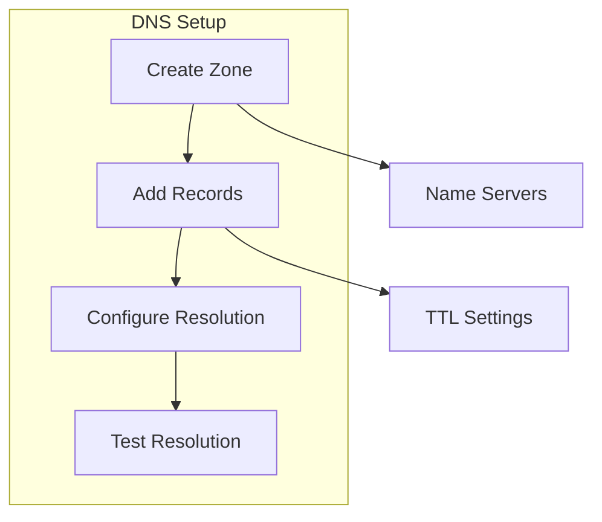

### 2. Custom Routing
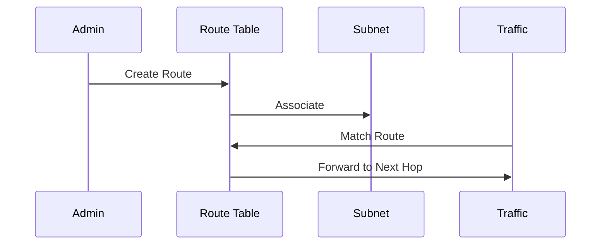

## DNS Record Management

### 1. Record Types
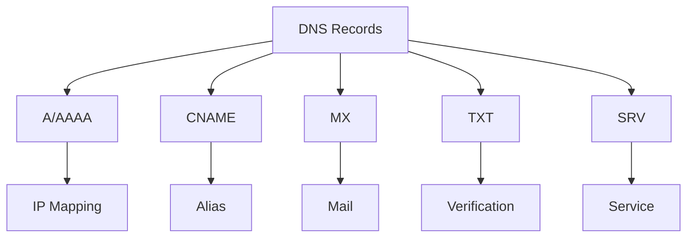

### 2. Record Sets
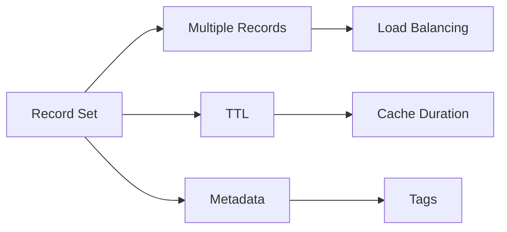

## Network Traffic Flow

### 1. Routing Decisions
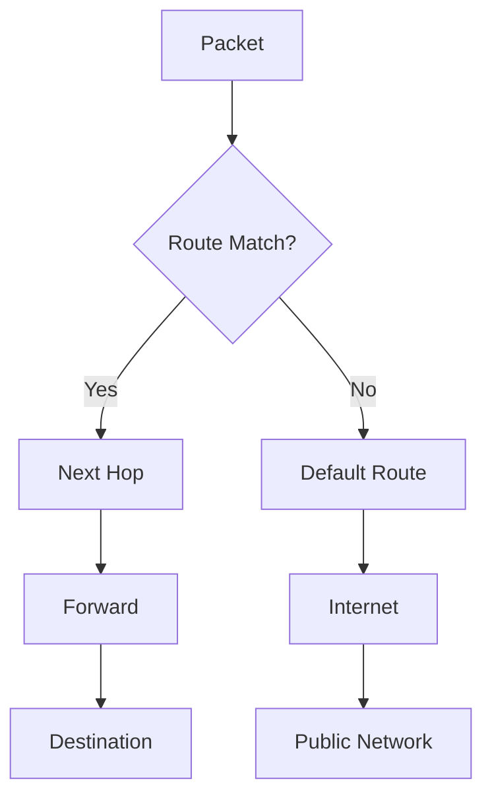

### 2. Traffic Control
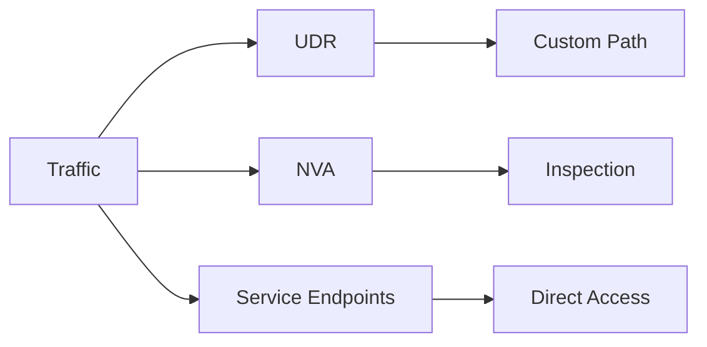

## Best Practices

### 1. DNS Management
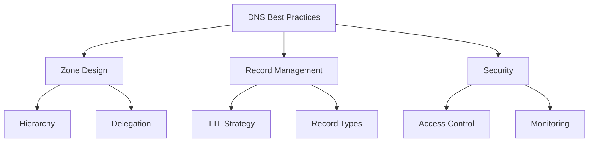

### 2. Routing Design
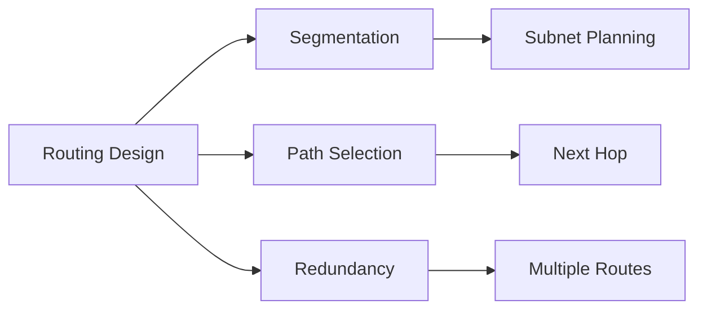

## Hybrid Connectivity

### 1. DNS Resolution
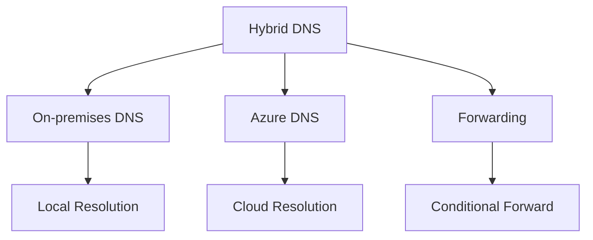

### 2. Network Integration
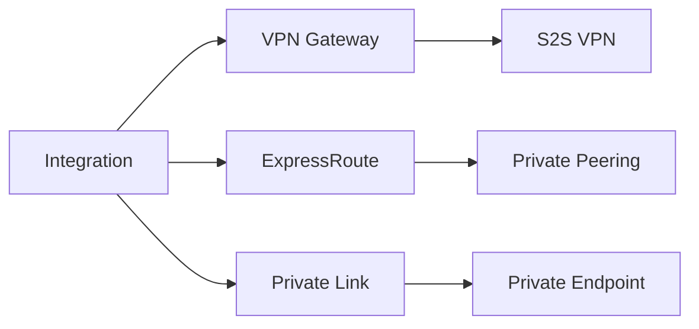

## Monitoring and Diagnostics

### 1. DNS Monitoring
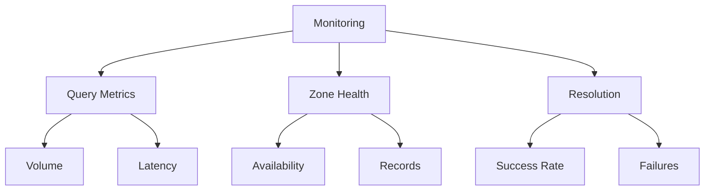

### 2. Route Diagnostics
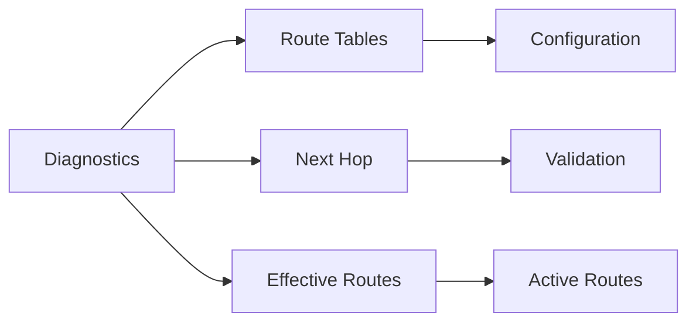

## Security Implementation

### 1. DNS Security
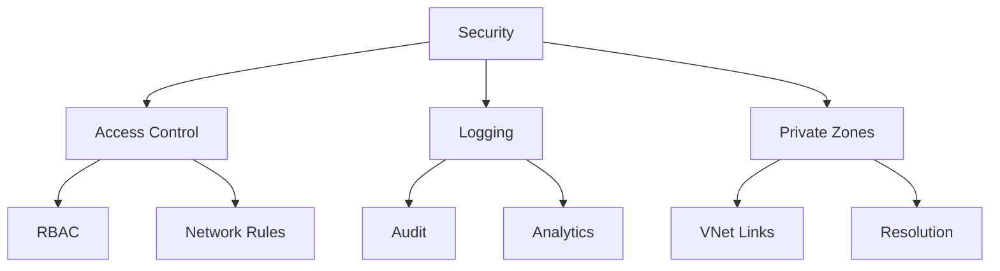

### 2. Network Protection
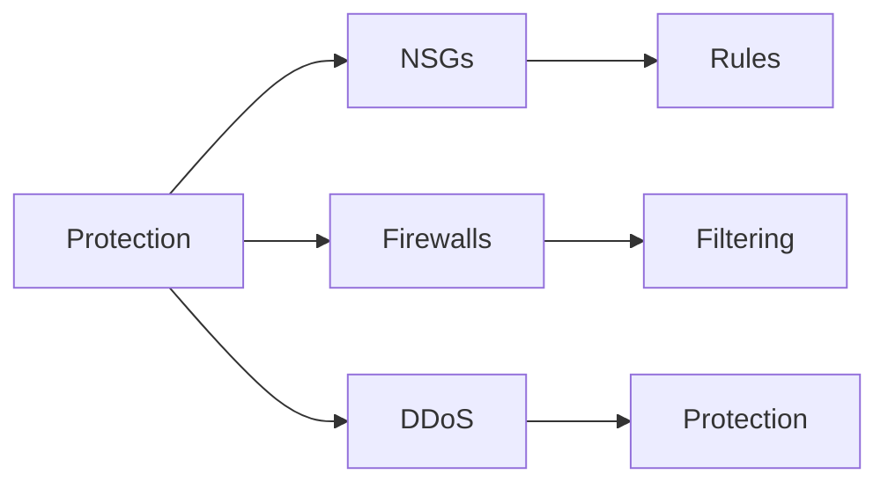

## Troubleshooting Guide

### 1. DNS Issues
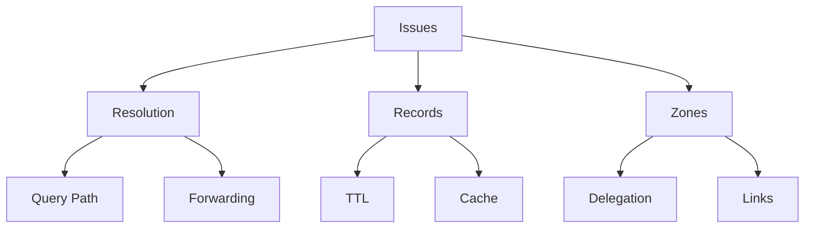

### 2. Routing Problems
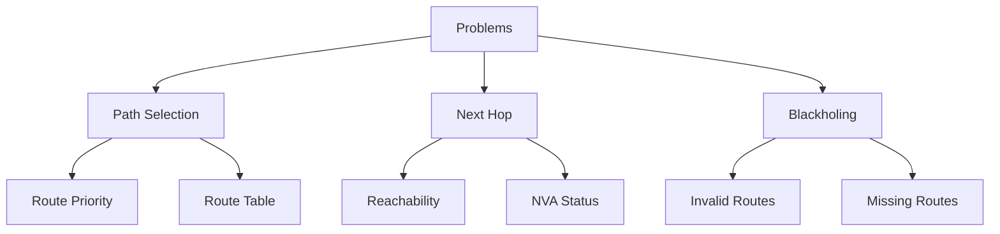

## Best Practices Summary

1. **DNS Configuration**
   - Plan zone hierarchy carefully
   - Use appropriate TTL values
   - Implement proper access controls
   - Regular monitoring and auditing

2. **Network Routing**
   - Document routing decisions
   - Validate route tables
   - Implement redundancy
   - Regular health checks

3. **Security Guidelines**
   - Use Private DNS zones
   - Implement RBAC
   - Enable logging
   - Regular security reviews

## Further Reading
- [Azure DNS Documentation](https://learn.microsoft.com/en-us/azure/dns/)
- [Virtual Network Routing](https://learn.microsoft.com/en-us/azure/virtual-network/virtual-networks-udr-overview)
- [Network Security Best Practices](https://learn.microsoft.com/en-us/azure/security/fundamentals/network-best-practices)