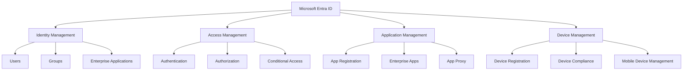
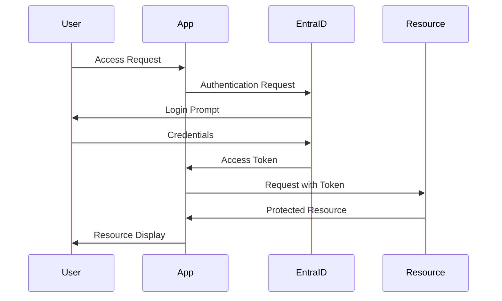
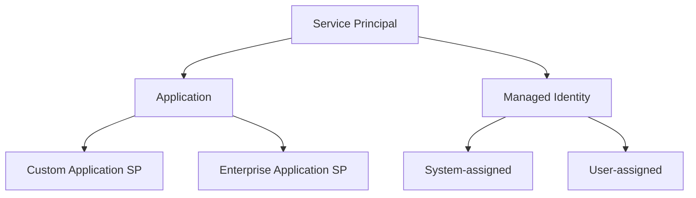
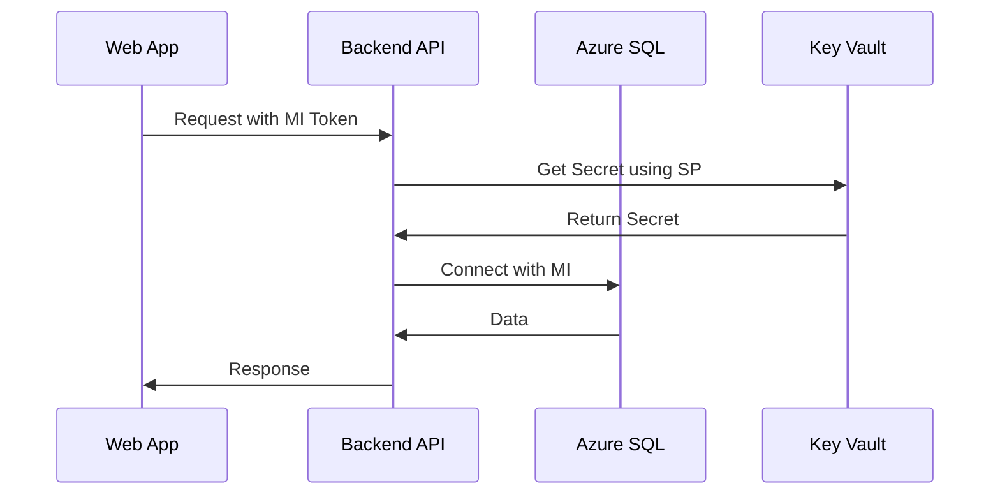
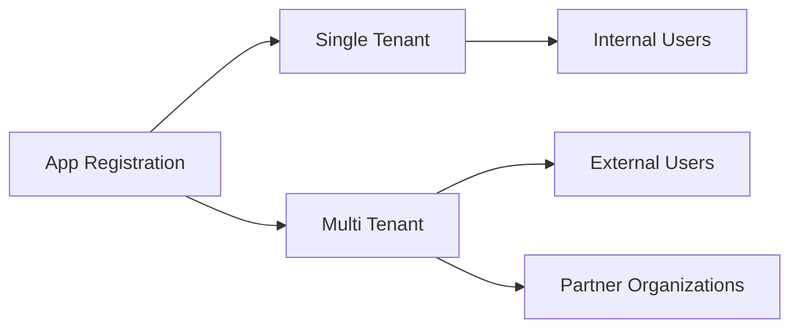
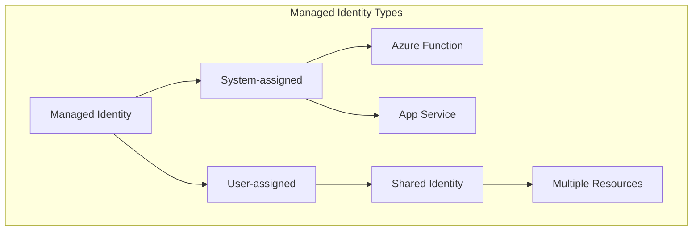
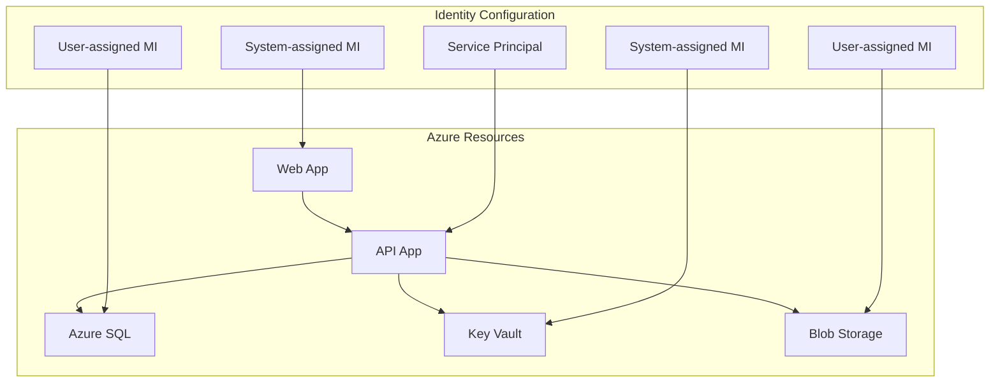
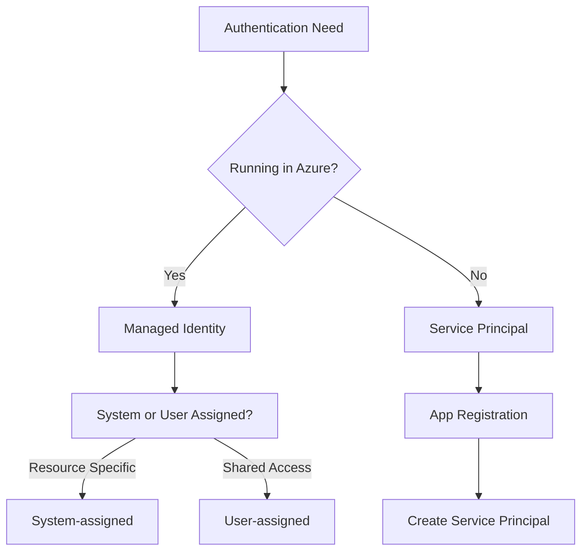
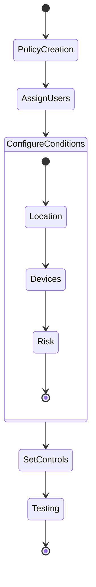
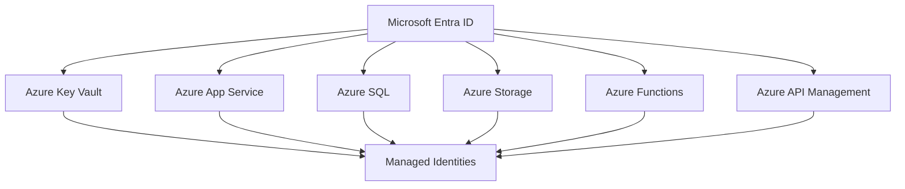

# Microsoft Entra ID (formerly Azure Active Directory)

## Overview
Microsoft Entra ID is a cloud-based identity and access management service that serves as the cornerstone of security for Microsoft cloud services and custom applications. It provides enterprise-grade identity management for applications, devices, and users, all from a centralized location.

## Core Components



## Authentication Flow



## Key Features

1. **Single Sign-On (SSO)**
   - Enables users to sign in once and access multiple applications
   - Reduces password fatigue
   - Improves security through centralized authentication

2. **Multi-Factor Authentication (MFA)**
   - Additional security layer beyond passwords
   - Multiple verification methods:
     - Phone call
     - Text message
     - Mobile app notification
     - Hardware tokens

3. **Conditional Access**
   ```mermaid
   graph LR
       A[Access Request] --> B{Conditional Access Policy}
       B -->|Match| C[Policy Evaluation]
       C --> D{Requirements Met?}
       D -->|Yes| E[Grant Access]
       D -->|No| F[Block/Limited Access]
       B -->|No Match| G[Default Access]
   ```

## Common Use Cases

1. **Enterprise Application Integration**
   - Connecting SaaS applications
   - Supporting legacy applications through App Proxy
   - Managing custom-developed applications

2. **B2B Collaboration**
   ```mermaid
   graph LR
       A[Partner Organization] --> B[Guest Users]
       B --> C[Your Organization]
       C --> D[Resources]
       D --> E[Applications]
       D --> F[Data]
       D --> G[Services]
   ```

3. **Zero Trust Security Implementation**
   ```mermaid
   graph TB
       A[Identity Verification] --> B{Trust Decision}
       B --> C[Device Health]
       B --> D[Location]
       B --> E[Risk Level]
       C --> F[Access Decision]
       D --> F
       E --> F
       F --> G[Grant Access]
       F --> H[Deny Access]
   ```

## Types of Identities in Microsoft Entra ID

### 1. Service Principals
A service principal is a security identity used by applications, services, and automation tools to access specific Azure resources. Think of it as the "service account" that allows an application to authenticate and access resources.



#### Example Scenario: Multi-tier Enterprise Application
Consider a scenario where you have a three-tier application:
- Frontend Web App
- Backend API
- Database



### 2. Application Objects
An application object is the global representation of your application across all tenants. It serves as the template from which service principals are derived.

#### Types of Applications:
1. **Single-tenant Applications**
   - Used within your organization
   - Example: Internal HR portal

2. **Multi-tenant Applications**
   - Used across multiple organizations
   - Example: SaaS application



### 3. Managed Identities
Managed identities eliminate the need for developers to manage credentials by providing an automatically managed identity in Microsoft Entra ID.

#### Types of Managed Identities:

1. **System-assigned Managed Identity**
   - Tied to Azure resource lifecycle
   - Automatically deleted when resource is deleted
   - One-to-one relationship with Azure resource

2. **User-assigned Managed Identity**
   - Independent lifecycle
   - Can be shared across multiple resources
   - Can be pre-created and assigned to resources



### Real-World Implementation Example

#### Scenario: E-Commerce Platform
Let's consider an e-commerce platform with the following components:



#### Implementation Details:

1. **Frontend (Web App)**
   - Uses System-assigned Managed Identity
   - Accesses API using OAuth 2.0
   - No stored credentials

2. **Backend API (App Service)**
   - Uses Service Principal for external service integration
   - Uses Managed Identity for Azure resources
   - Implements role-based access control

3. **Data Layer**
   - Uses User-assigned Managed Identity for database access
   - Implements least-privilege access
   - Centralized access management

### When to Use What?

1. **Use Service Principals When:**
   - Setting up CI/CD pipelines
   - Running applications outside of Azure
   - Implementing automation scripts
   - Needing custom role assignments

2. **Use Managed Identities When:**
   - Working with Azure resources
   - Need automatic credential management
   - Implementing Azure-to-Azure authentication
   - Working with Key Vault



### Best Practices for Identity Management

1. **Service Principals**
   - Implement credential rotation
   - Use certificate-based authentication
   - Regular access reviews
   - Implement least privilege access

2. **Managed Identities**
   - Prefer system-assigned when possible
   - Use user-assigned for shared scenarios
   - Regular role assignment audits
   - Monitor identity usage

3. **Application Objects**
   - Implement proper consent framework
   - Regular permission reviews
   - Monitor API usage
   - Implement proper token validation

## Best Practices

1. **Identity Protection**
   - Enable risk-based Conditional Access policies
   - Implement MFA for all users
   - Regular access reviews
   - Monitor sign-in patterns

2. **Group Management**
   - Use dynamic groups for automatic membership
   - Implement naming conventions
   - Regular group ownership reviews

3. **License Management**
   - Assign licenses through groups
   - Monitor license usage
   - Regular license audits

## Implementation Example

### Setting up Conditional Access Policy



### Enterprise Application Integration Steps

1. Add enterprise application
2. Configure single sign-on
3. Assign users and groups
4. Test access

## Monitoring and Troubleshooting

1. **Sign-in Logs**
   - Monitor authentication attempts
   - Track failed sign-ins
   - Analyze conditional access impacts

2. **Audit Logs**
   - Track configuration changes
   - Monitor permission changes
   - Review security alerts

3. **Usage Analytics**
   ```mermaid
   graph TB
       A[Usage Reports] --> B[Sign-in Activity]
       A --> C[App Usage]
       A --> D[User Activity]
       B --> E[Analytics Dashboard]
       C --> E
       D --> E
   ```

## Integration with Other Azure Services



## Security Recommendations

1. **Password Protection**
   - Enable password protection
   - Implement custom banned password lists
   - Regular password policy reviews

2. **Access Reviews**
   - Schedule regular access reviews
   - Automate review processes
   - Document review findings

3. **Security Defaults**
   - Enable security defaults for basic protection
   - Customize security policies for specific needs
   - Regular security posture assessment

## Further Reading
- [Microsoft Entra Documentation](https://learn.microsoft.com/en-us/entra/)
- [Security Best Practices](https://learn.microsoft.com/en-us/entra/identity/guidance/security-operations-introduction)
- [Implementation Guidelines](https://learn.microsoft.com/en-us/entra/identity/guidance/implementation-guidelines-overview)