# Azure File Sync

Azure File Sync extends your on-premises file servers with cloud benefits while maintaining local access performance and compatibility. It enables centralized file share management in Azure while caching frequently accessed files on-premises, providing a hybrid solution that combines the best of cloud storage with local file server performance.

## Overview
Azure File Sync is a service that centralizes your file shares in Azure Files while keeping the flexibility, performance, and compatibility of a Windows file server. It transforms Windows Server into a quick cache of your Azure file share.

## File Sync Architecture

### 1. Core Components
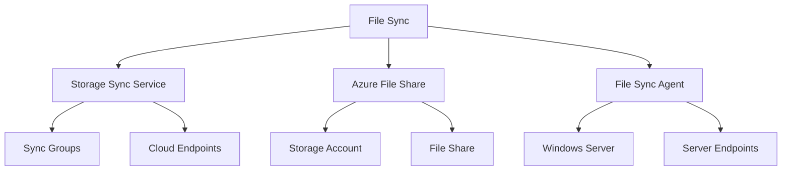

### 2. Sync Topology
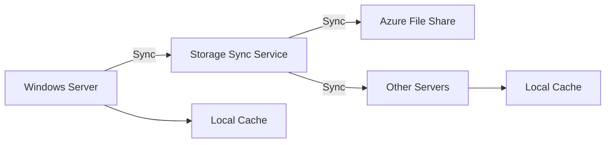

## Cloud Tiering

### 1. Tiering Process
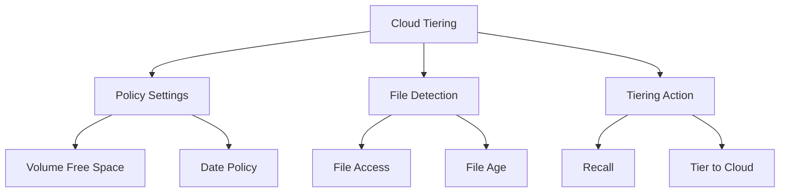

### 2. Cache Management
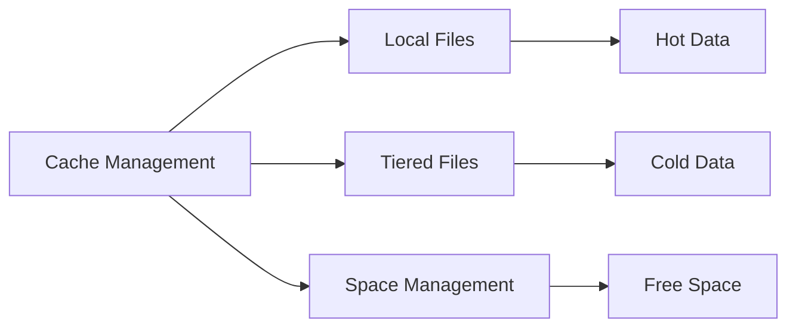

## Best Practices

1. **Initial Setup**
   - Properly size cache volumes
   - Configure network settings
   - Test sync patterns
   - Document configuration

2. **Performance Optimization**
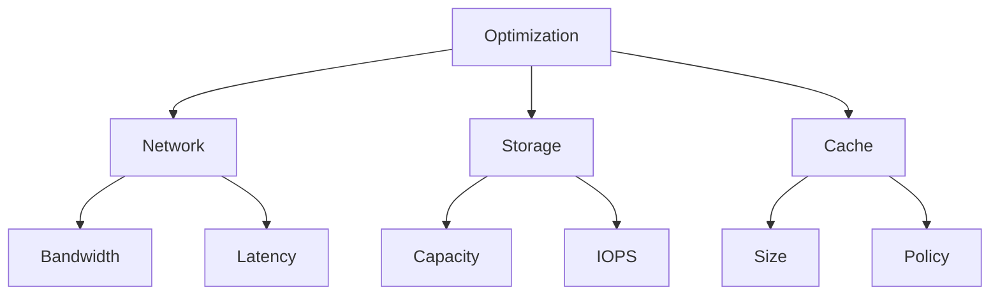

## Security Configuration

### 1. Access Control
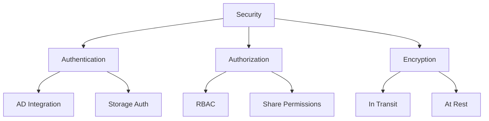

### 2. Network Security
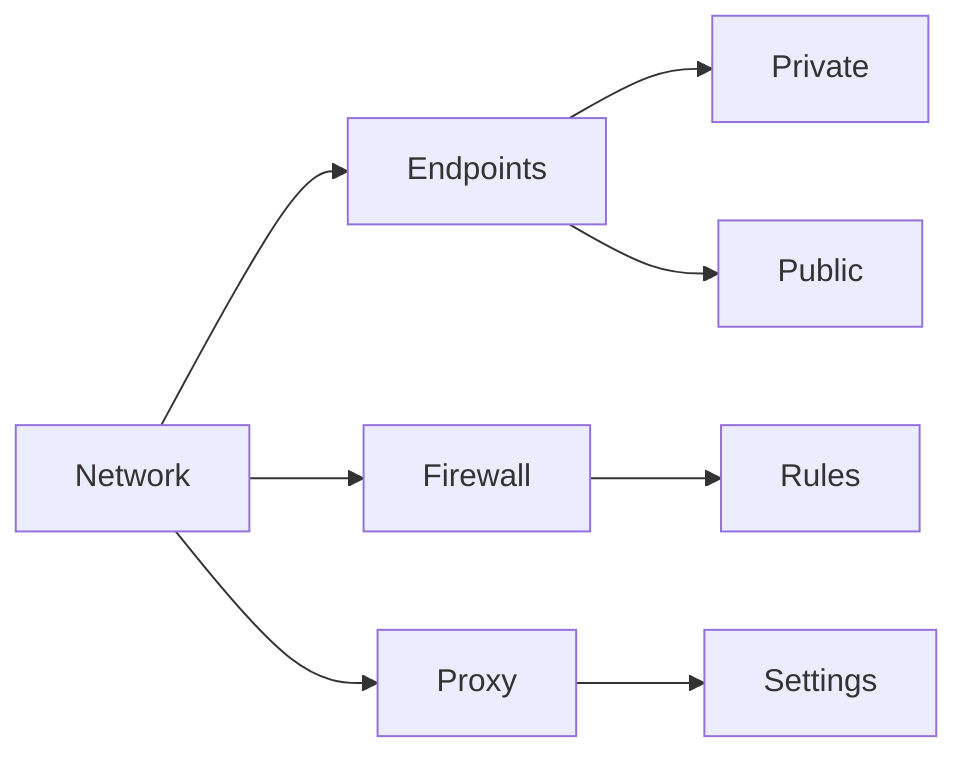

## Monitoring and Management

### 1. Health Monitoring
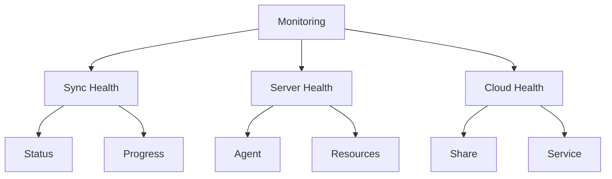

### 2. Reporting
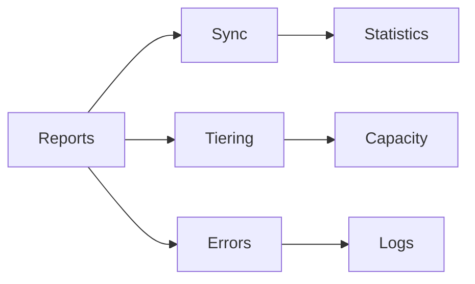

## Troubleshooting Guide

1. **Common Issues**
   - Sync conflicts
   - Connectivity problems
   - Tiering issues
   - Performance bottlenecks

2. **Resolution Steps**
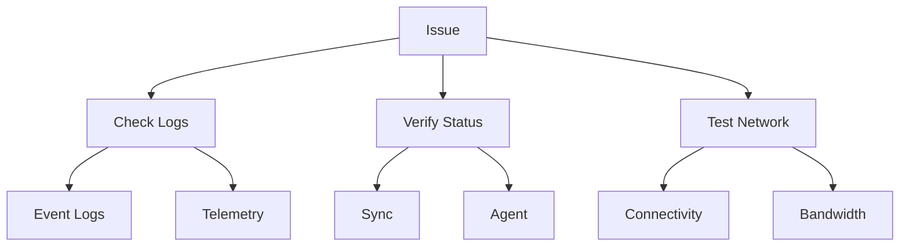

## Integration Features

### 1. Backup Integration
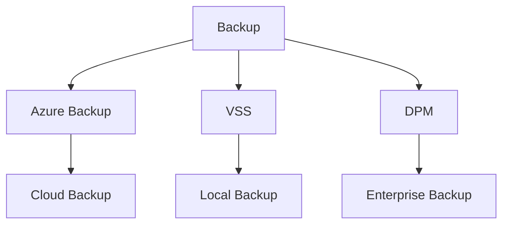

### 2. High Availability
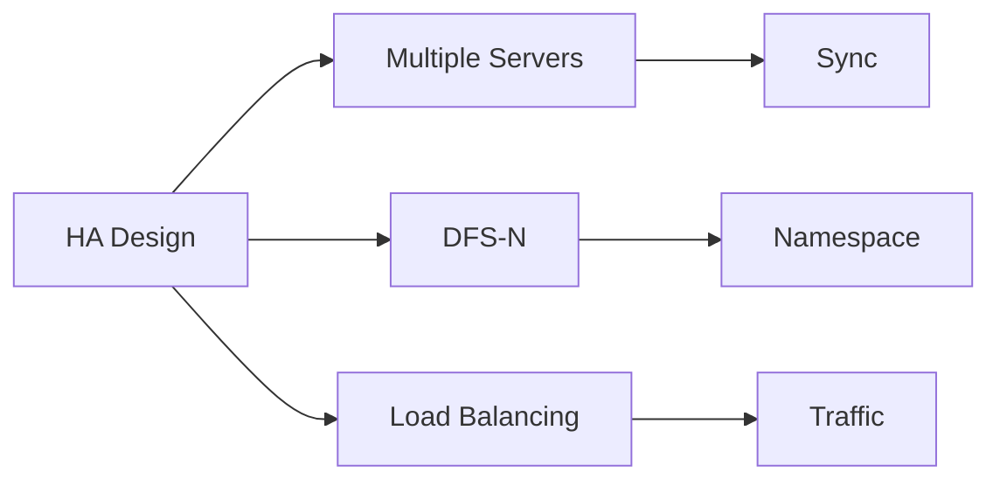

## Further Reading
- [Azure File Sync Documentation](https://learn.microsoft.com/en-us/azure/storage/file-sync/)
- [Implementation Guide](https://learn.microsoft.com/en-us/azure/storage/file-sync/file-sync-deployment-guide)
- [Best Practices](https://learn.microsoft.com/en-us/azure/storage/files/storage-sync-files-planning)