# Azure VPN Gateway and ExpressRoute

## Overview
Azure VPN Gateway and ExpressRoute provide secure connectivity between on-premises networks and Azure. VPN Gateway offers encrypted internet-based connections, while ExpressRoute provides private, dedicated connectivity through a service provider.

## Azure VPN Gateway

### Core Components

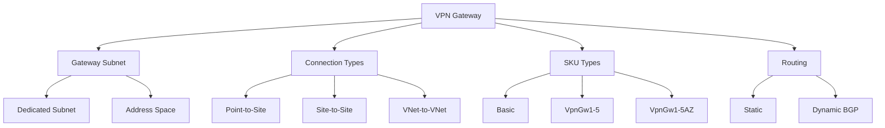

### Gateway Types

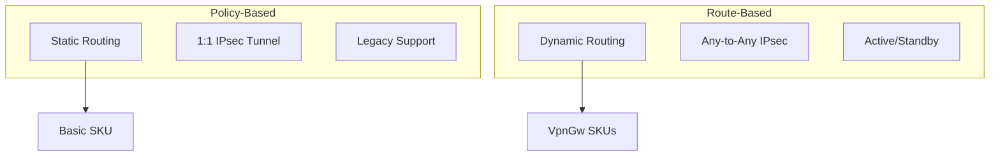

## ExpressRoute

### Architecture Components

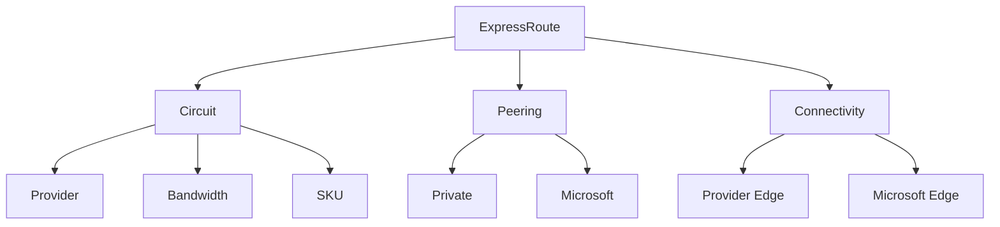

### Peering Types

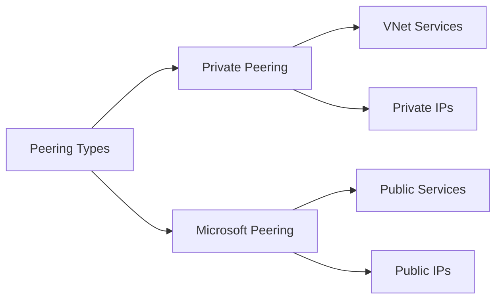

## Implementation Examples

### 1. VPN Gateway Setup
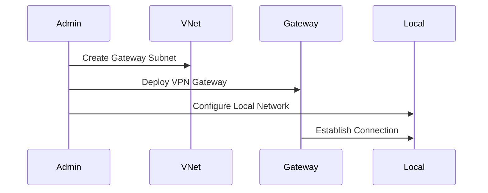

### 2. ExpressRoute Configuration
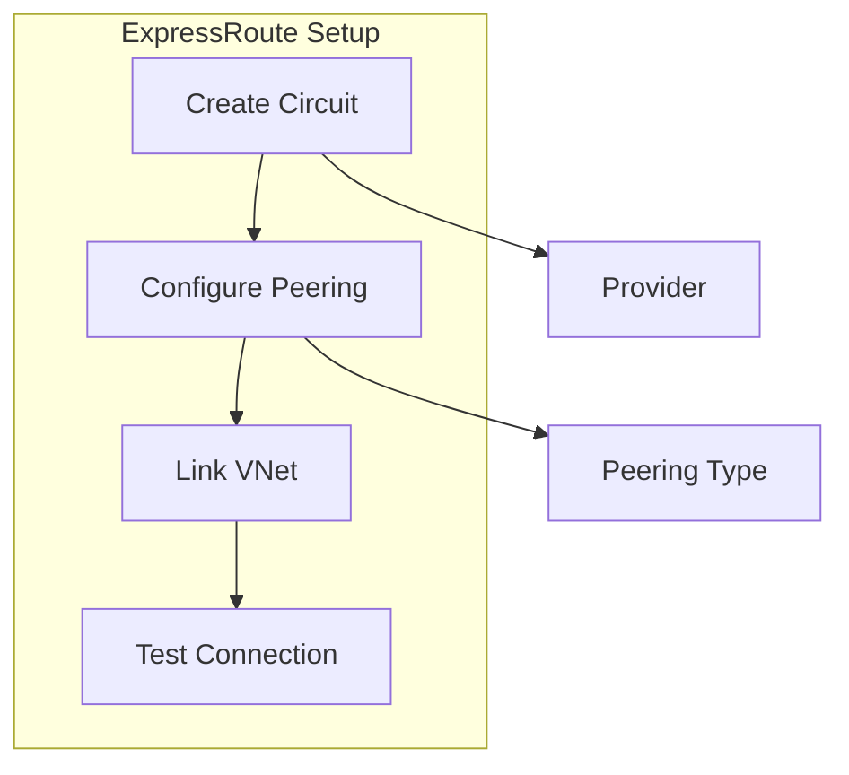

## Connectivity Patterns

### 1. Hybrid Connectivity
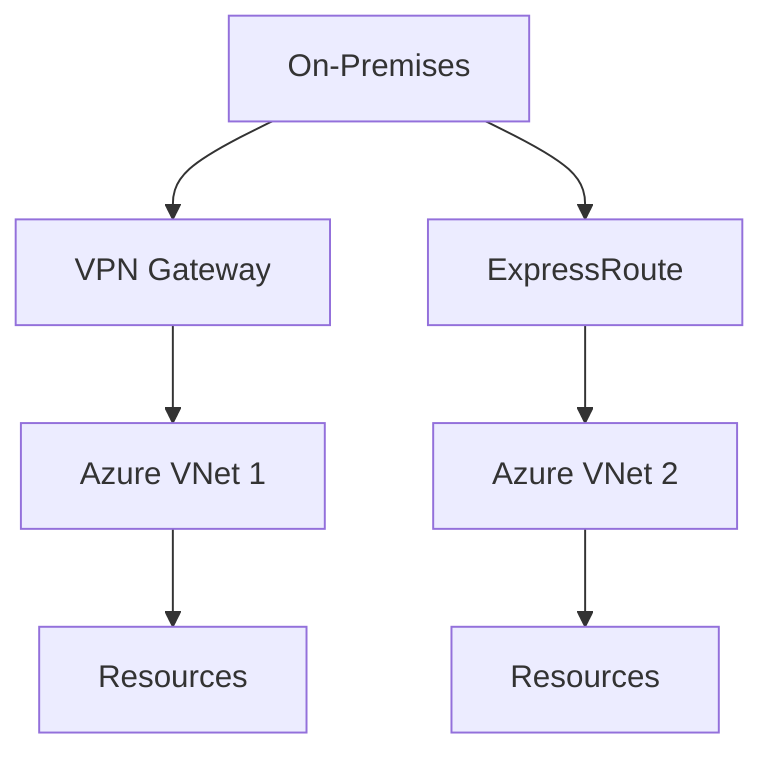

### 2. Multi-Site Connectivity
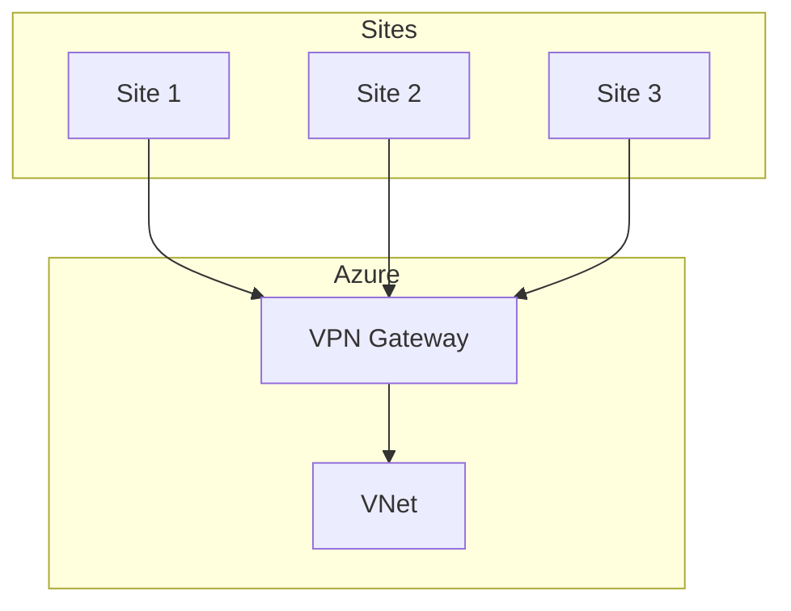

## Monitoring and Management

### 1. Gateway Monitoring
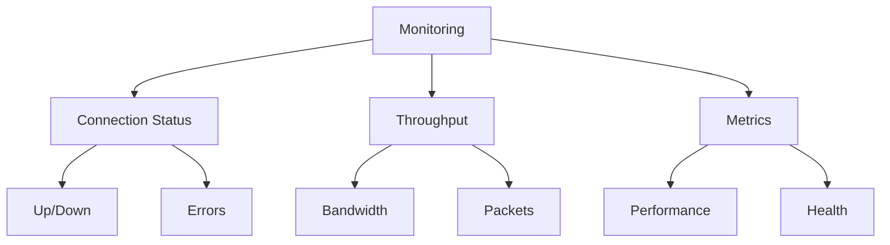

### 2. ExpressRoute Monitoring
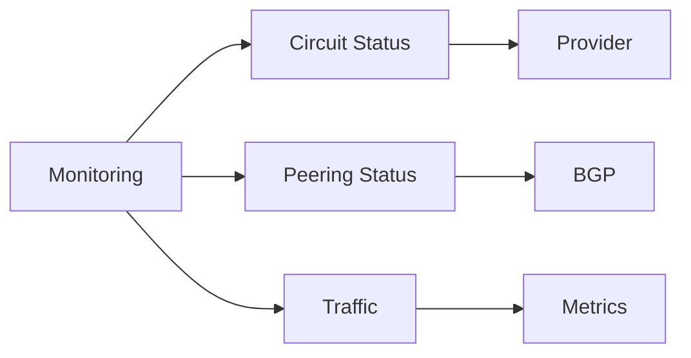

## High Availability

### 1. VPN Gateway HA
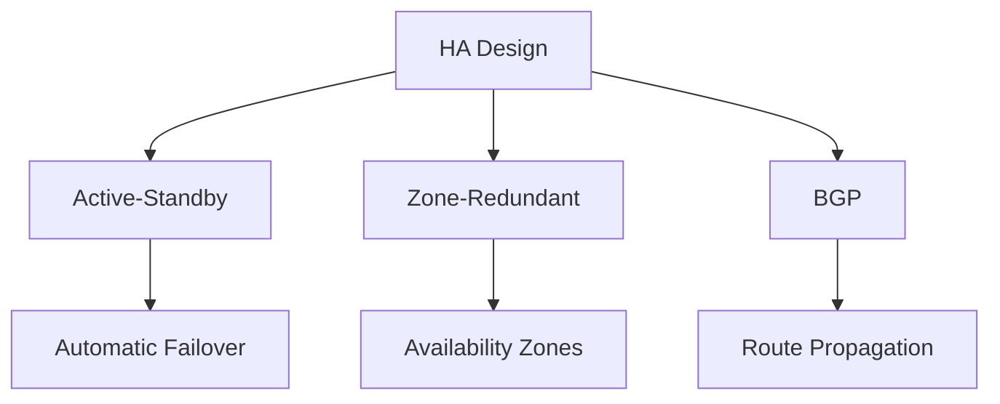

### 2. ExpressRoute HA
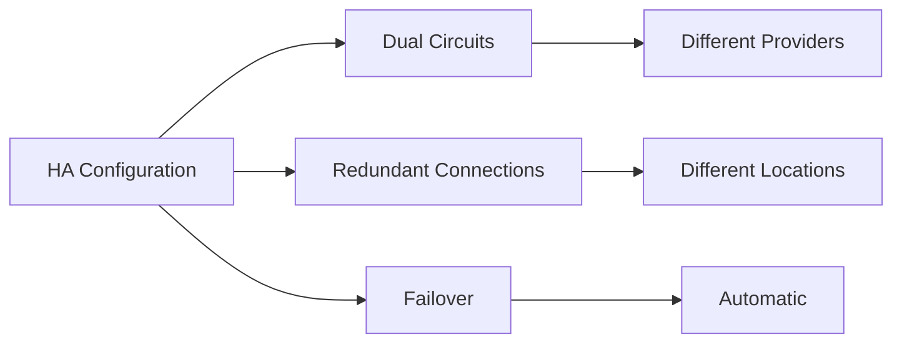

## Security Implementation

### 1. VPN Security
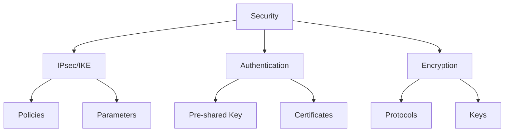

### 2. ExpressRoute Security
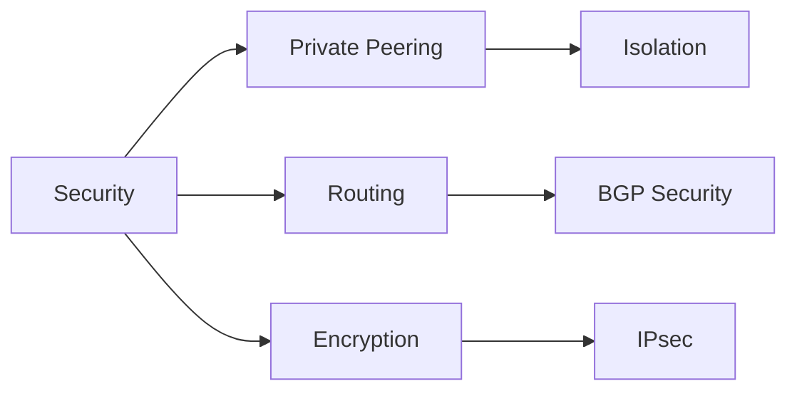

## Troubleshooting Guide

### 1. VPN Issues
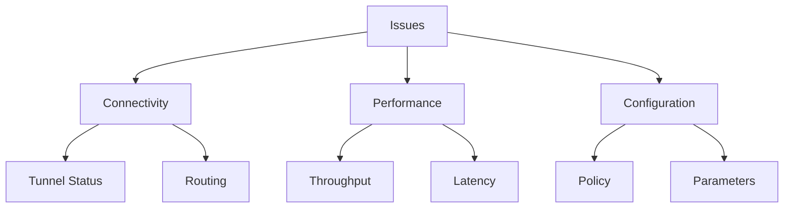

### 2. ExpressRoute Issues
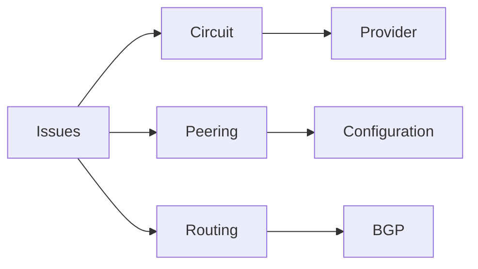

## Best Practices Summary

1. **VPN Gateway Configuration**
   - Choose appropriate SKU
   - Plan IP addressing
   - Configure BGP when possible
   - Implement HA design

2. **ExpressRoute Setup**
   - Plan bandwidth requirements
   - Configure redundancy
   - Implement proper routing
   - Monitor performance

3. **Security Guidelines**
   - Use strong encryption
   - Implement proper authentication
   - Regular security reviews
   - Monitor connections

## Further Reading
- [VPN Gateway Documentation](https://learn.microsoft.com/en-us/azure/vpn-gateway/)
- [ExpressRoute Documentation](https://learn.microsoft.com/en-us/azure/expressroute/)
- [Hybrid Connectivity Best Practices](https://learn.microsoft.com/en-us/azure/architecture/reference-architectures/hybrid-networking/)