# Azure Hybrid Networking: VPN Gateway and ExpressRoute

## Overview
Azure Hybrid Networking solutions enable organizations to connect their on-premises networks with Azure through secure and reliable connections using VPN Gateway and ExpressRoute services.

## Core Components

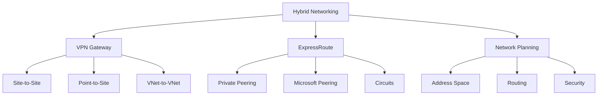

## VPN Gateway

### 1. VPN Types
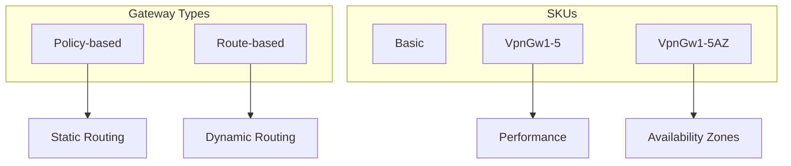

### 2. Site-to-Site Configuration
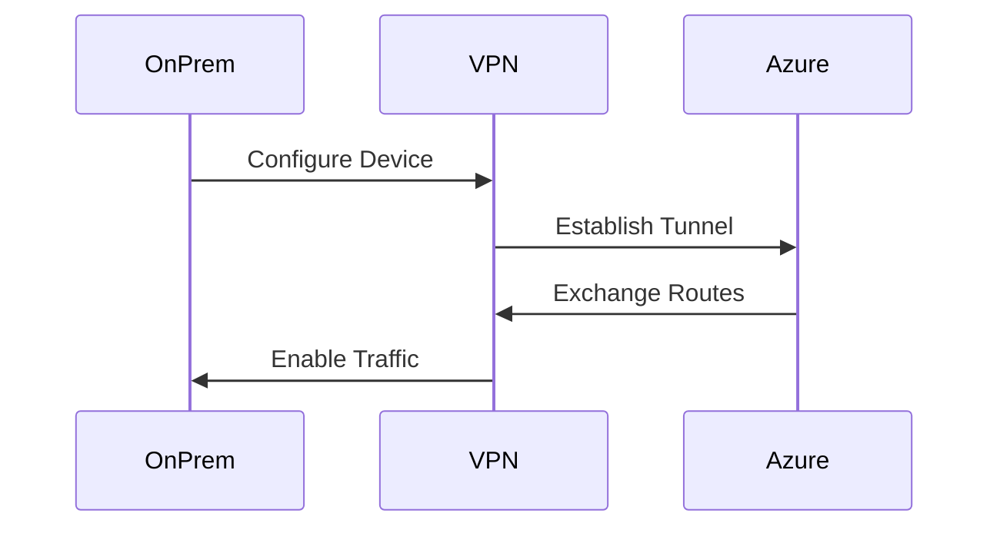

### 3. Point-to-Site Setup
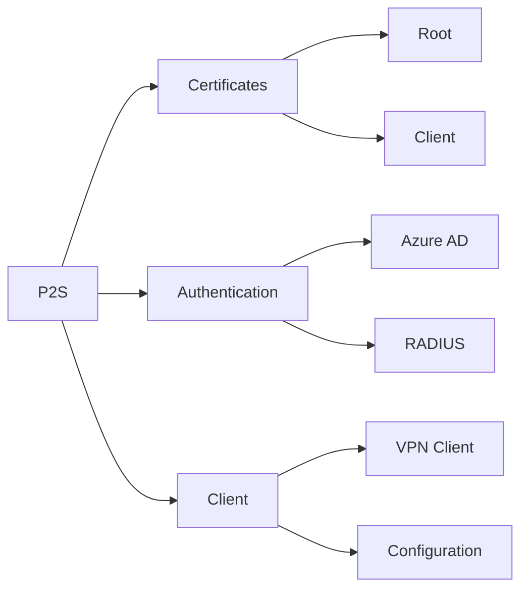

## ExpressRoute

### 1. Circuit Configuration
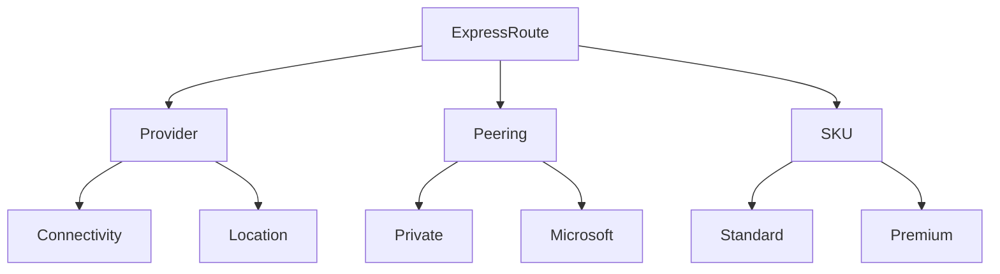

### 2. Routing Configuration
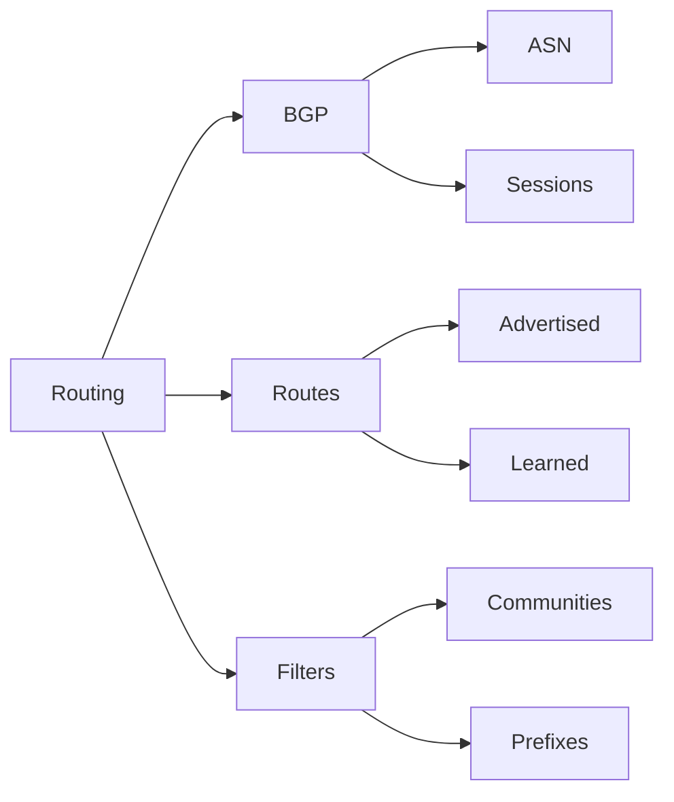

## High Availability

### 1. VPN Gateway HA
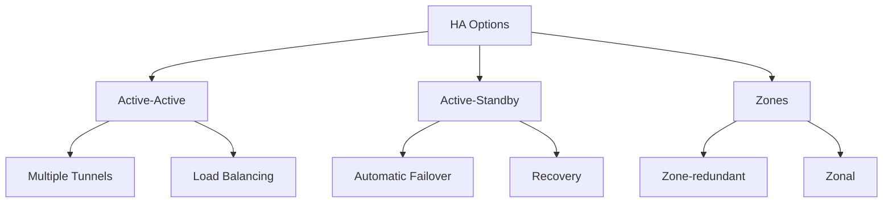

### 2. ExpressRoute HA
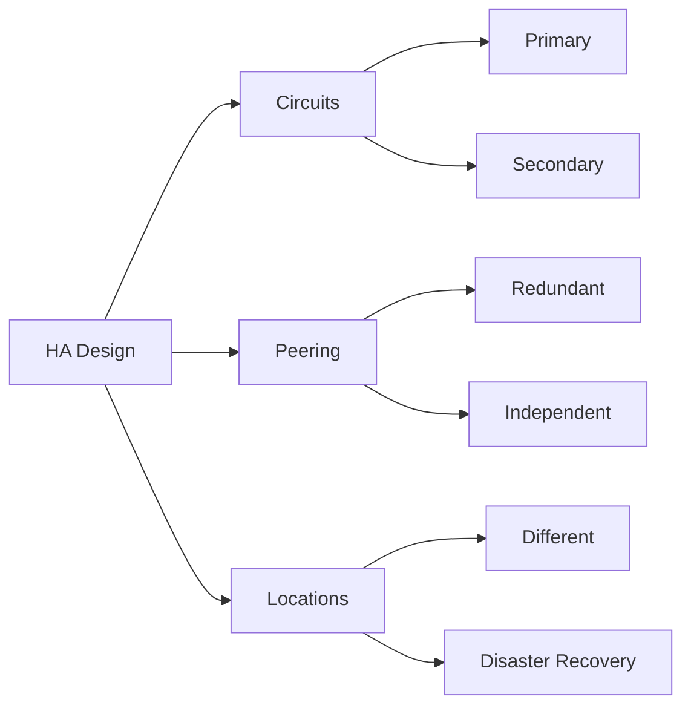

## Performance and Monitoring

### 1. Performance Metrics
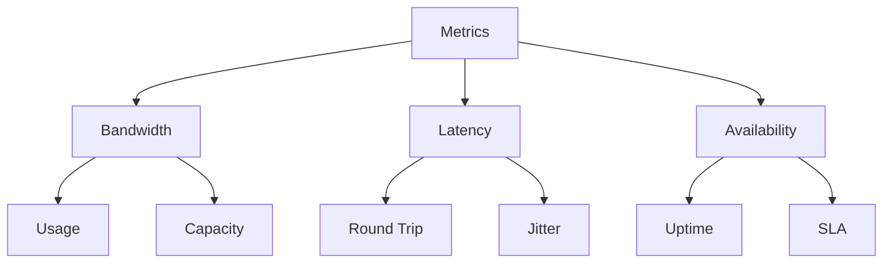

### 2. Monitoring Tools
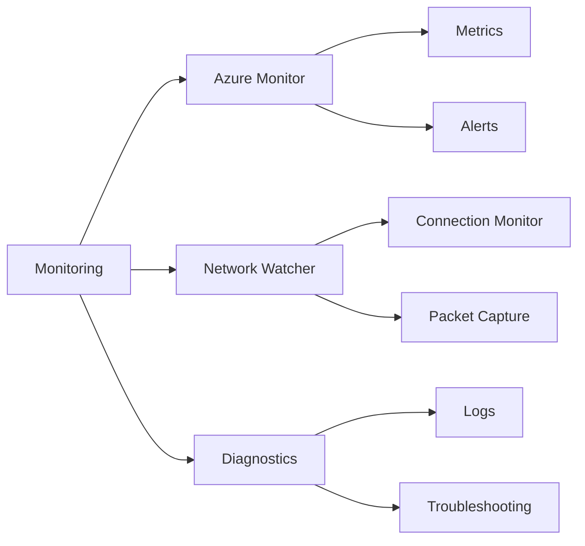

## Security Configuration

### 1. VPN Security
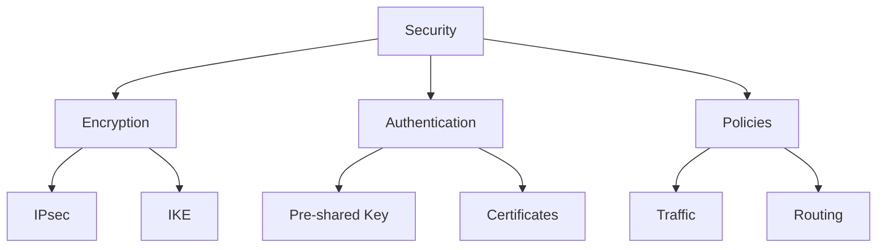

### 2. ExpressRoute Security
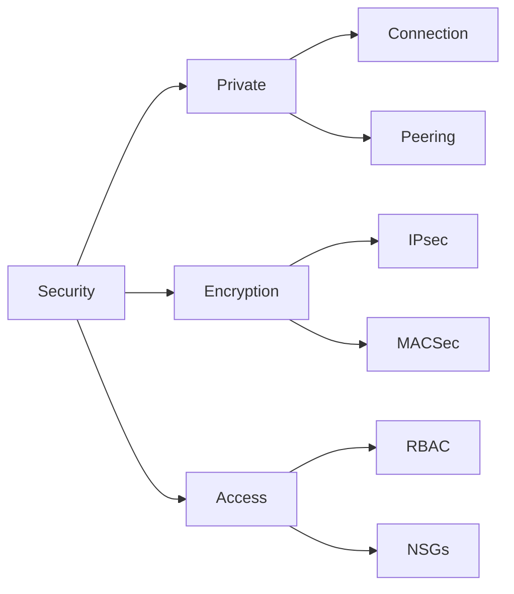

## Best Practices Summary

1. **Design Considerations**
   - Plan IP addressing
   - Configure redundancy
   - Implement monitoring
   - Security first approach

2. **Implementation Guidelines**
   - Use appropriate SKUs
   - Configure HA
   - Implement encryption
   - Regular testing

3. **Operational Excellence**
   - Monitor performance
   - Regular maintenance
   - Documentation
   - Disaster recovery

## Planning Guidelines

### 1. Network Design
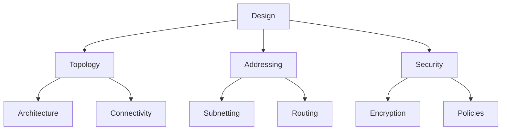

### 2. Implementation Process
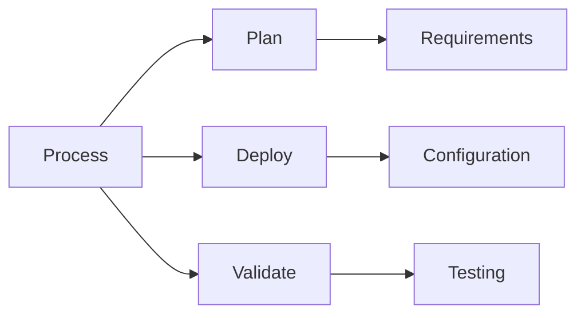

## Further Reading
- [VPN Gateway Documentation](https://learn.microsoft.com/en-us/azure/vpn-gateway/)
- [ExpressRoute Documentation](https://learn.microsoft.com/en-us/azure/expressroute/)
- [Hybrid Networking Best Practices](https://learn.microsoft.com/en-us/azure/architecture/reference-architectures/hybrid-networking/)