# Azure Active Directory (Microsoft Entra ID)

## Overview
Microsoft Entra ID (formerly Azure AD) is Microsoft's cloud-based identity and access management service. It helps your employees sign in and access resources in both external and internal resources.

## Core Components

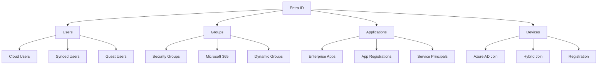

## Identity Management

### 1. User Management
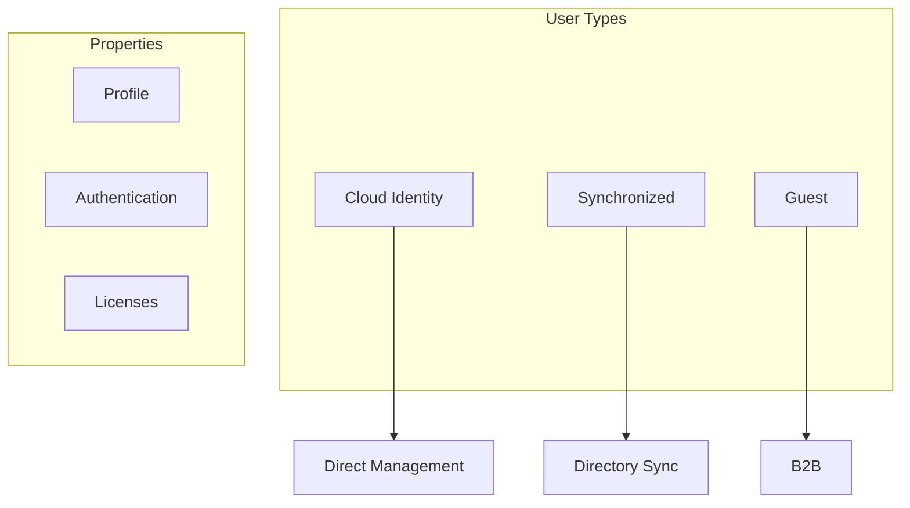

### 2. Group Management
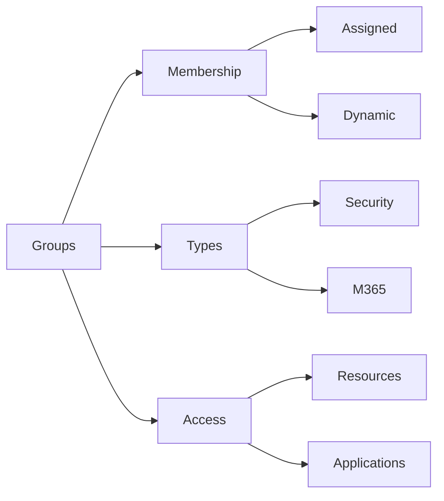

## Authentication

### 1. Authentication Methods
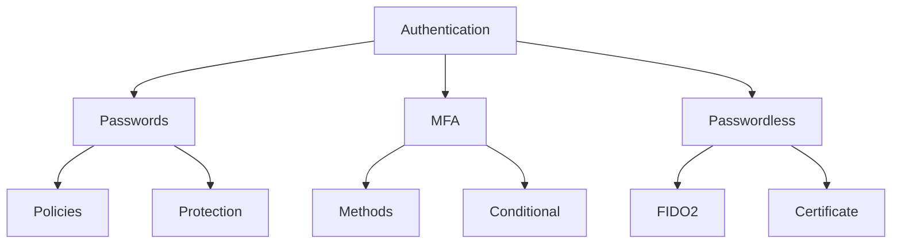

### 2. Conditional Access
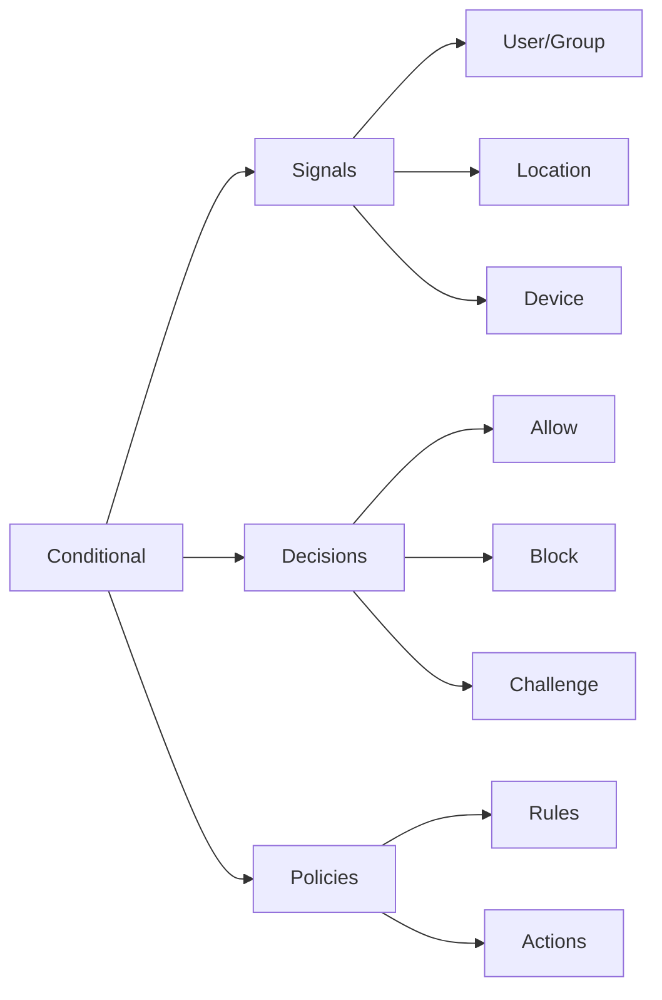

## Application Management

### 1. Enterprise Applications
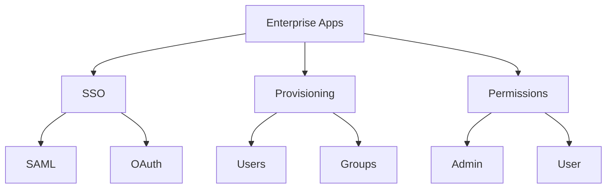

### 2. App Registration
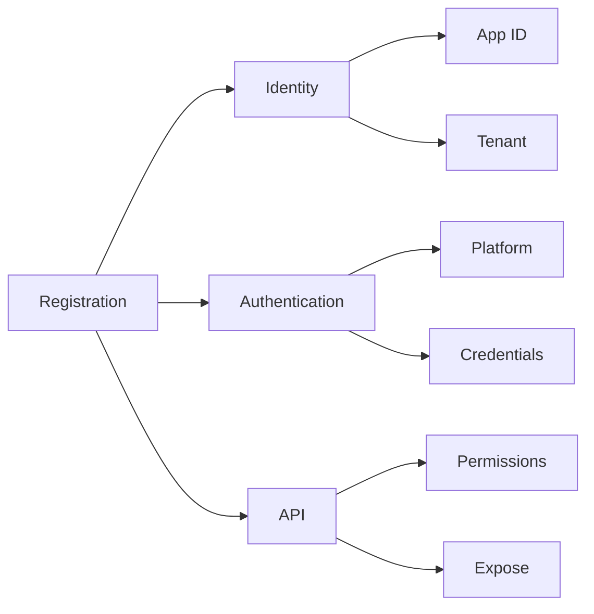

## Device Management

### 1. Device Identity
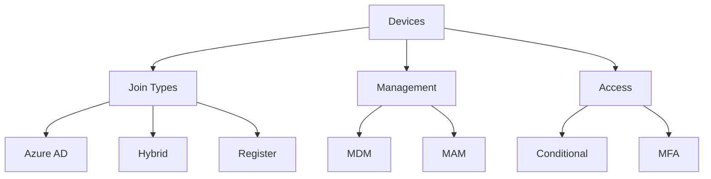

### 2. Device Compliance
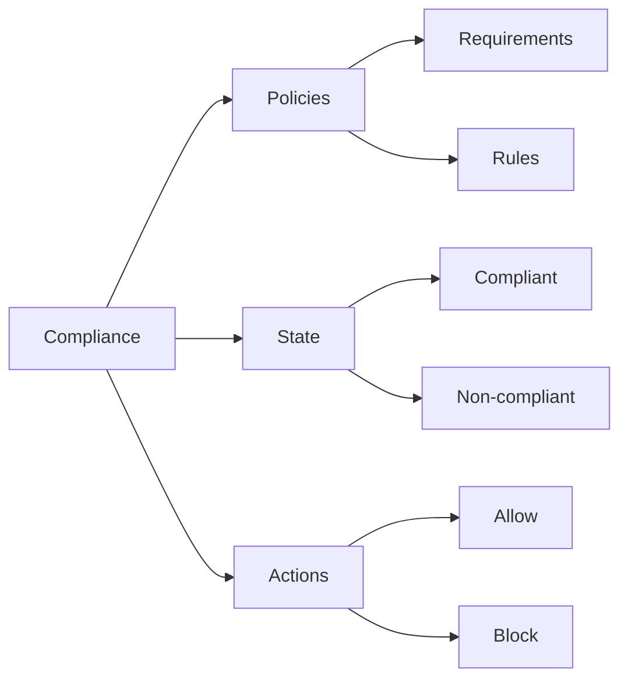

## Security Features

### 1. Identity Protection
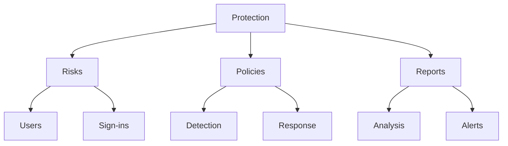

### 2. Access Reviews
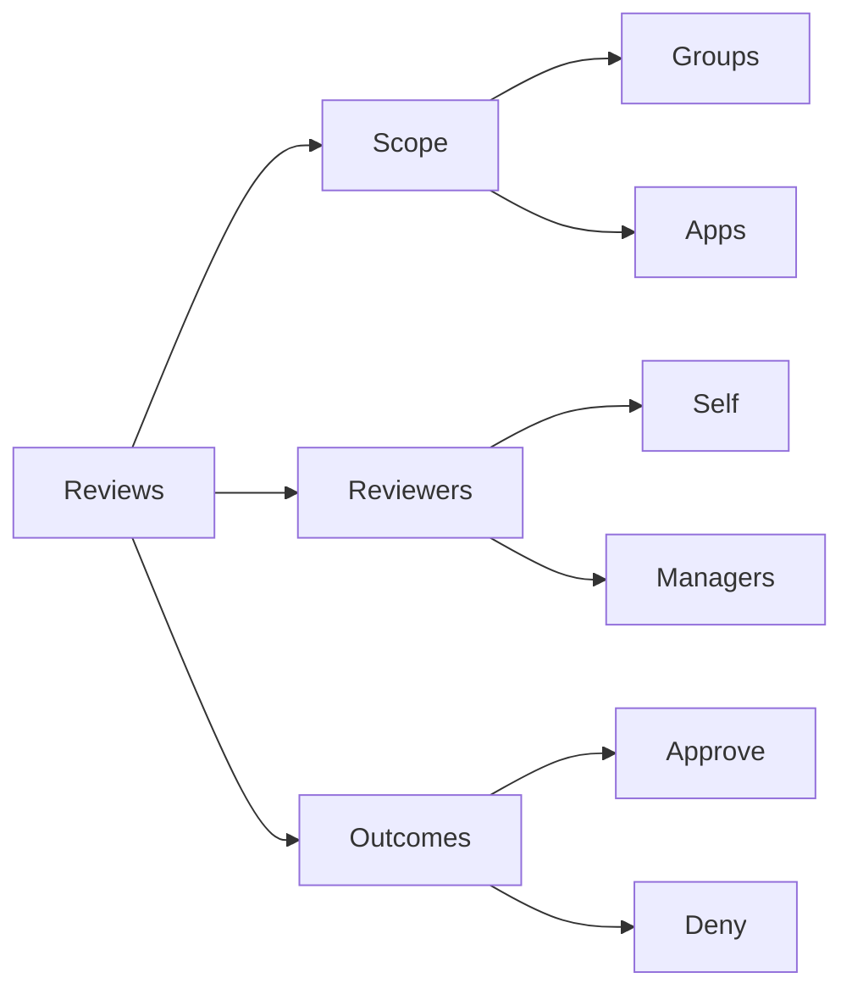

## Monitoring and Reporting

### 1. Audit Logs
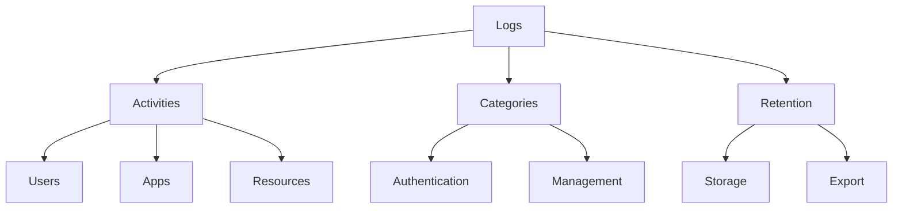

### 2. Sign-in Logs
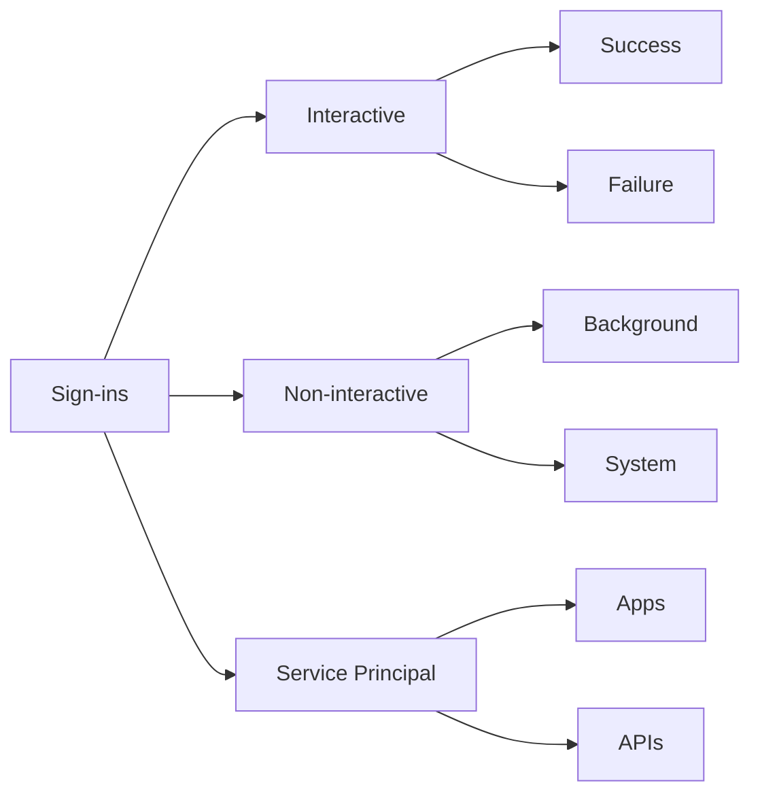

## Best Practices Summary

1. **Identity Security**
   - Enable MFA
   - Use Conditional Access
   - Monitor risky sign-ins
   - Regular access reviews

2. **Application Management**
   - Implement SSO
   - Manage permissions
   - Monitor usage
   - Regular cleanup

3. **Device Management**
   - Enforce compliance
   - Enable device management
   - Monitor device health
   - Regular updates

## Implementation Guidelines

### 1. Identity Strategy
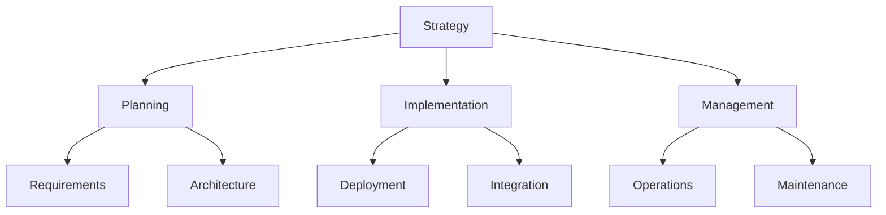

### 2. Security Roadmap
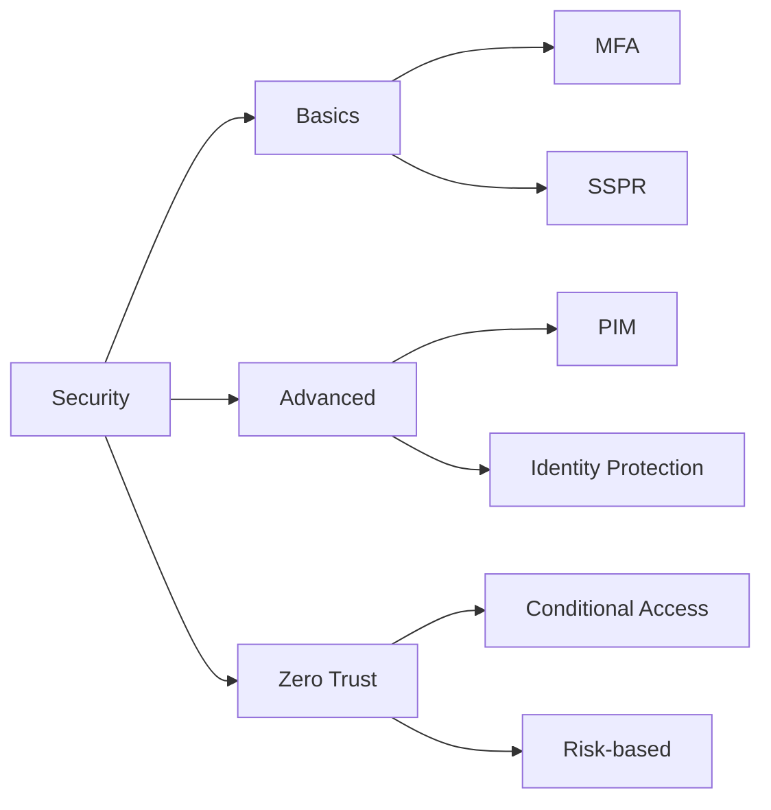

## Further Reading
- [Microsoft Entra ID Documentation](https://learn.microsoft.com/en-us/azure/active-directory/)
- [Identity Security Best Practices](https://learn.microsoft.com/en-us/azure/security/fundamentals/identity-management-best-practices)
- [Zero Trust Implementation Guide](https://learn.microsoft.com/en-us/security/zero-trust/)