# Azure Key Vault

Azure Key Vault is a cloud service for securely storing and accessing secrets, keys, and certificates. It provides centralized management of application secrets, helps meet compliance requirements, and offers hardware-backed security modules. With features like automated certificate management, secret rotation, and fine-grained access control, Key Vault helps protect sensitive information while maintaining high availability and scalability.

## Overview
Azure Key Vault is a cloud service that provides secure storage and access to secrets, keys, and certificates. It helps safeguard cryptographic keys and other secrets used by cloud applications and services.

## Core Components

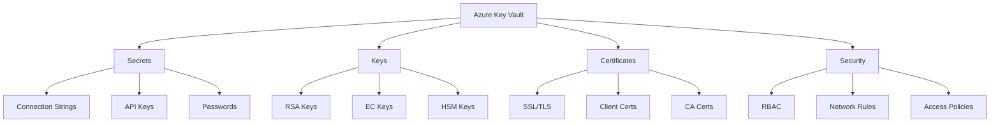

## Security Features

### 1. Authentication and Authorization
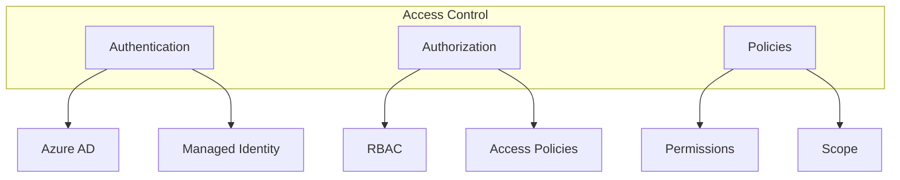

### 2. Network Security
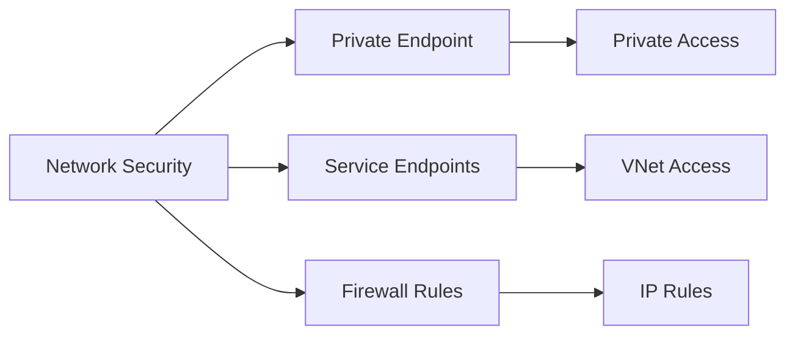

## Implementation Examples

### 1. Secret Management
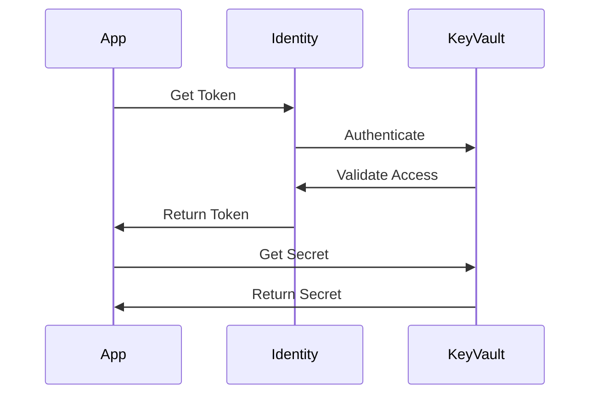

### 2. Certificate Management
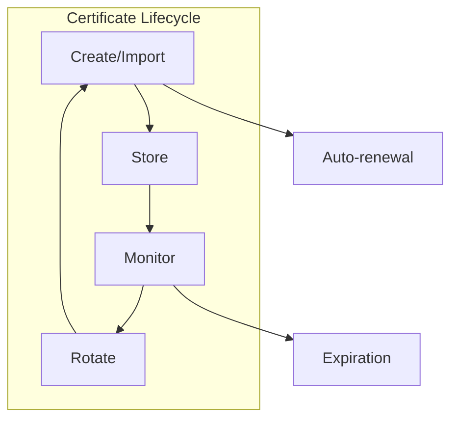

## Key Management

### 1. Key Types and Operations
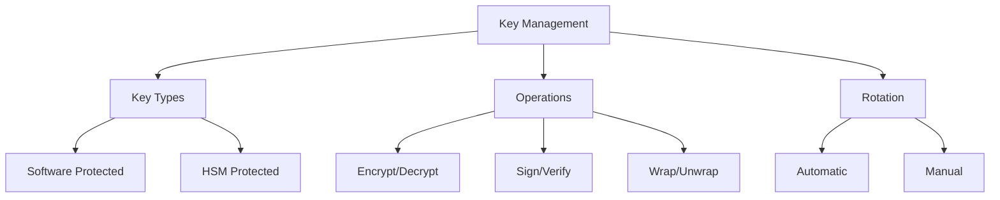

### 2. Key Protection
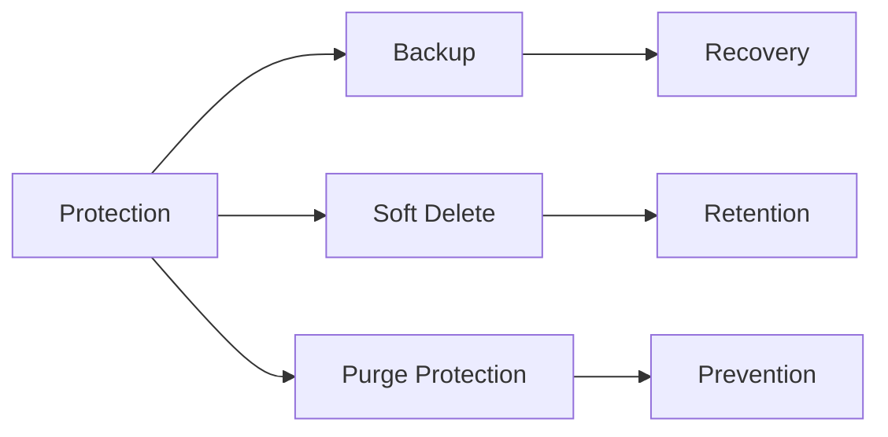

## Best Practices

### 1. Security Configuration
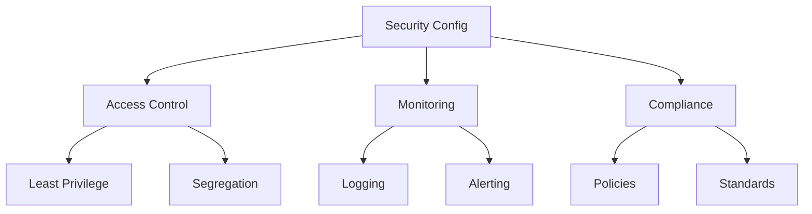

### 2. Operational Management
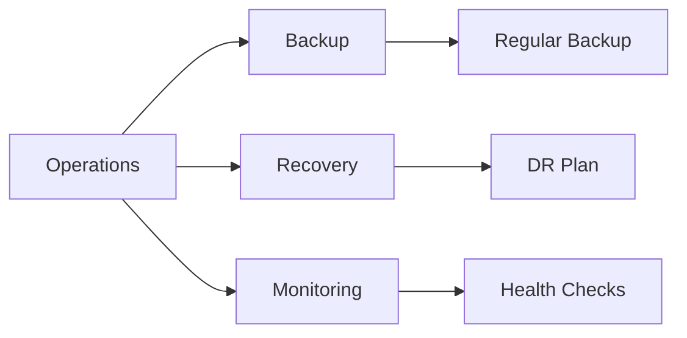

## Integration Patterns

### 1. Application Integration
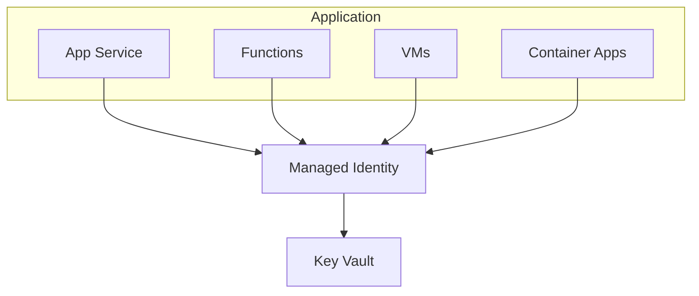

### 2. Service Integration
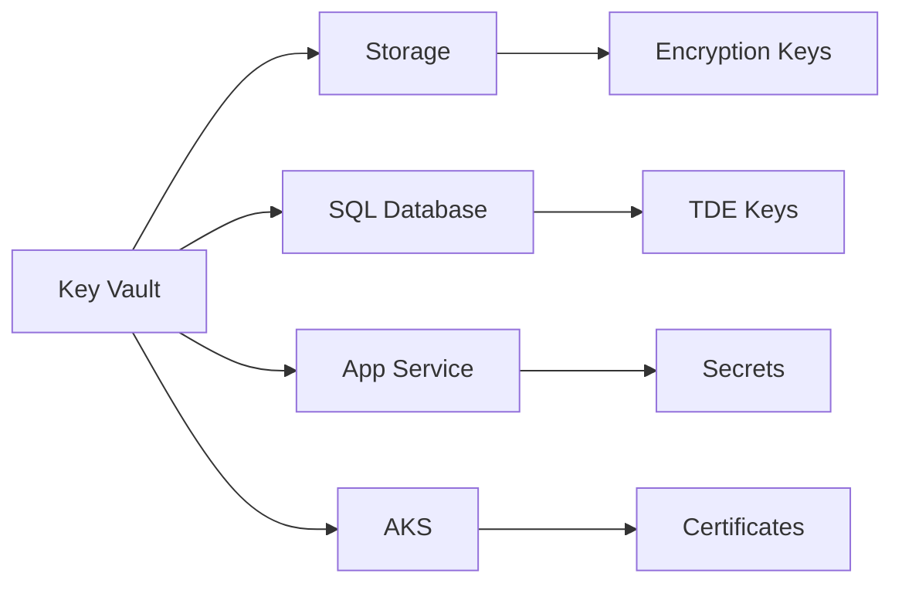

## Monitoring and Diagnostics

### 1. Audit Logging
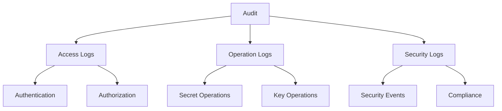

### 2. Health Monitoring
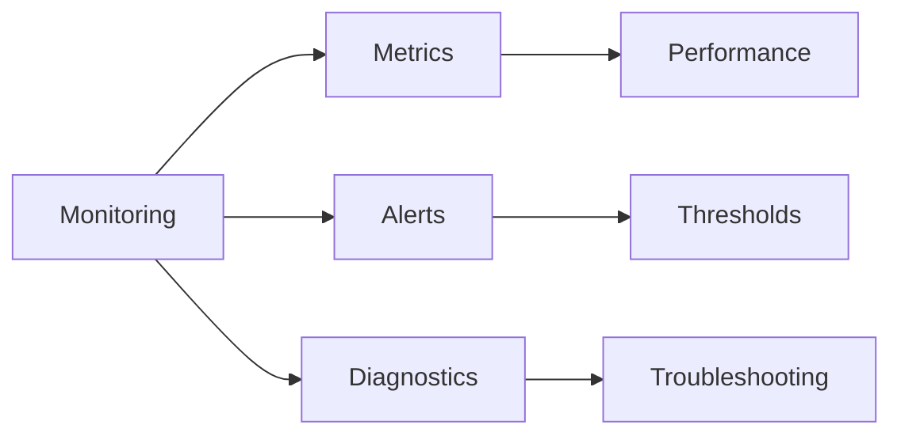

## Backup and Recovery

### 1. Backup Strategy
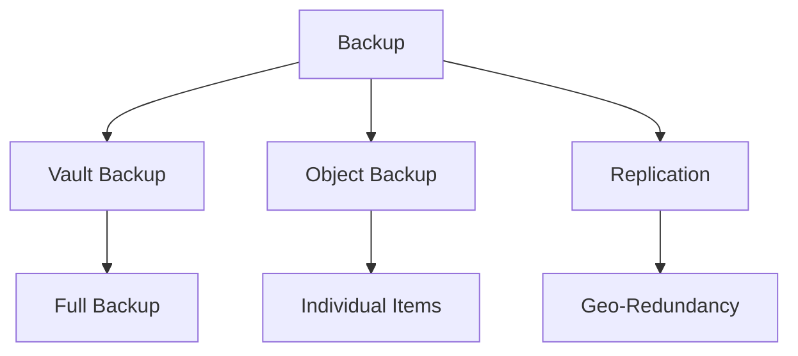

### 2. Recovery Process
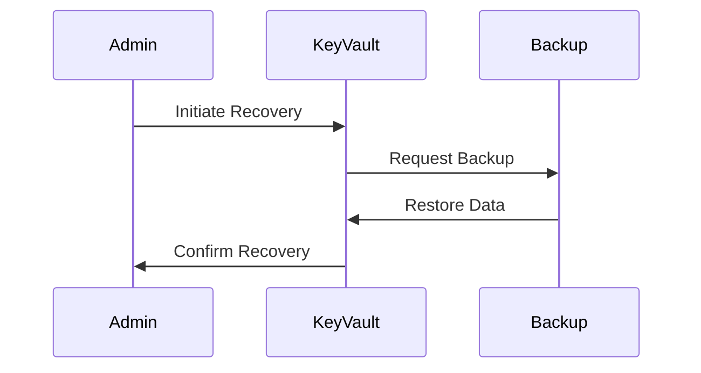

## Compliance and Governance

### 1. Compliance Features
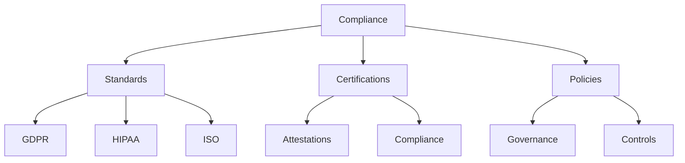

### 2. Policy Management
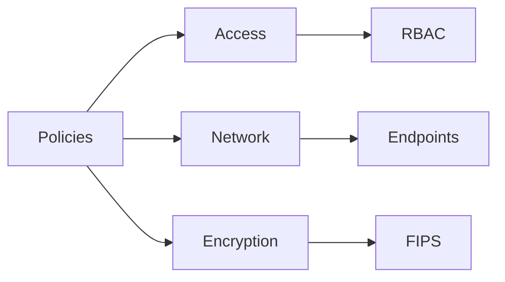

## Troubleshooting Guide

### 1. Common Issues
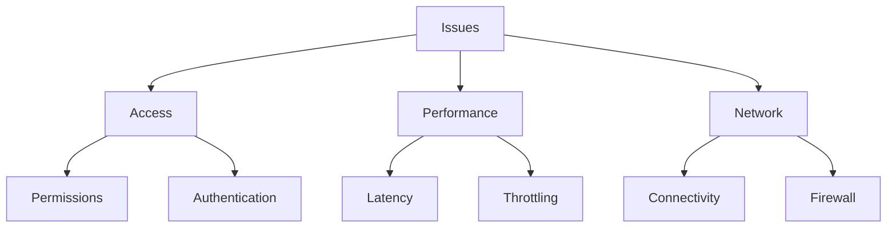

### 2. Resolution Steps
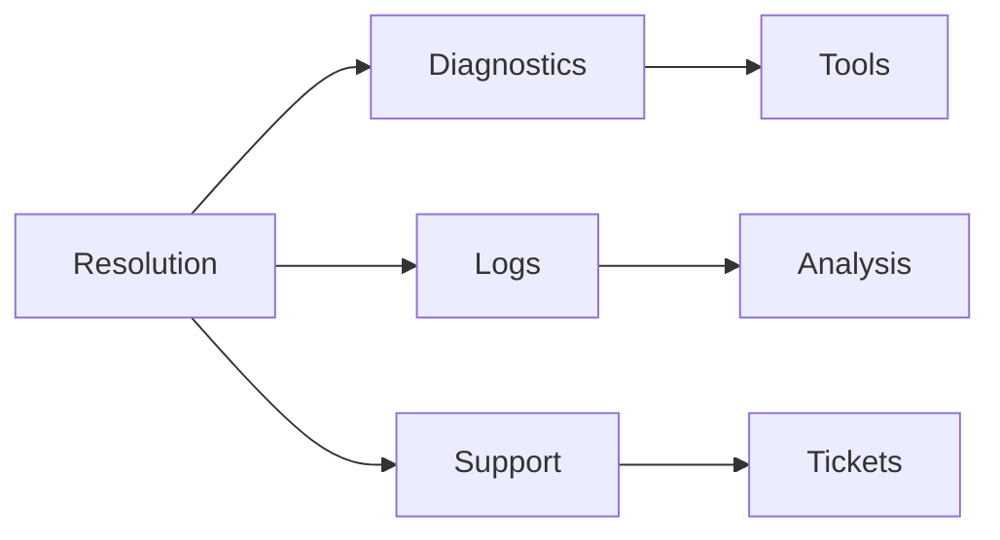

## Best Practices Summary

1. **Security Configuration**
   - Enable Soft Delete and Purge Protection
   - Use Managed Identities
   - Implement Network Security
   - Regular Access Reviews

2. **Operational Efficiency**
   - Automate Key Rotation
   - Monitor Certificate Expiry
   - Regular Backups
   - Audit Logging

3. **Compliance Requirements**
   - Document Access Policies
   - Regular Compliance Reviews
   - Maintain Audit Trails
   - Policy Enforcement

## Further Reading
- [Azure Key Vault Documentation](https://learn.microsoft.com/en-us/azure/key-vault/)
- [Security Best Practices](https://learn.microsoft.com/en-us/azure/key-vault/general/security-best-practices)
- [Key Vault Design Guidelines](https://learn.microsoft.com/en-us/azure/key-vault/general/best-practices)