# Azure Load Balancer and NAT Gateway

Azure Load Balancer and NAT Gateway are essential networking services that provide high availability, scalability, and outbound connectivity for your Azure resources. While Load Balancer distributes incoming traffic across multiple backends, NAT Gateway provides outbound internet connectivity for resources in a subnet.

## Load Balancer Overview

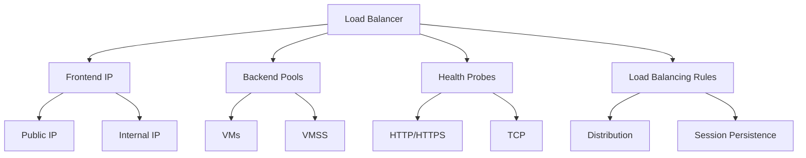

## NAT Gateway Features

### 1. Core Capabilities
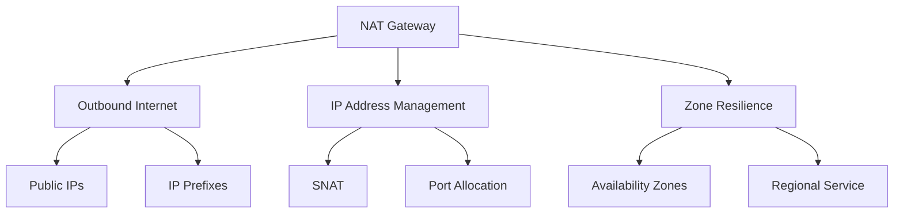

### 2. Integration Points
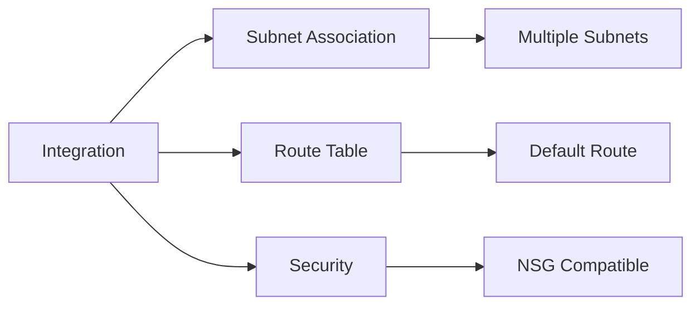

## Implementation Patterns

### 1. Load Balancer Scenarios
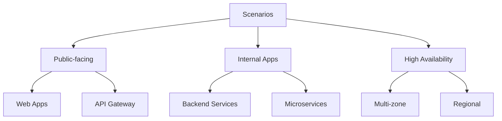

### 2. NAT Gateway Use Cases
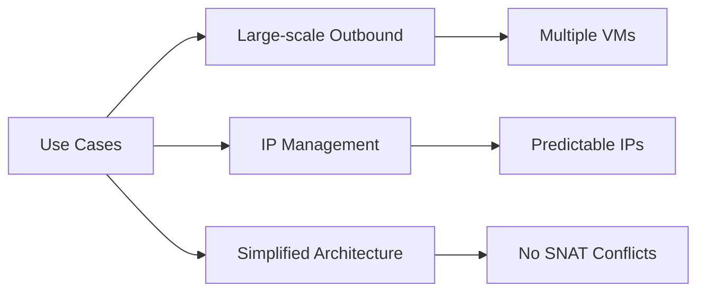

## Performance Optimization

### 1. Load Balancer Performance
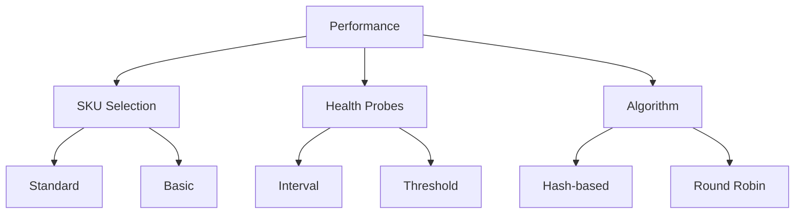

### 2. NAT Gateway Scaling
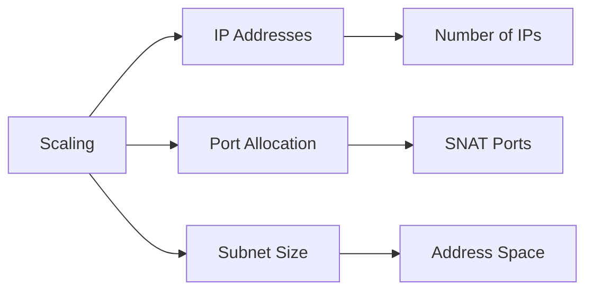

## High Availability Design

### 1. Load Balancer HA
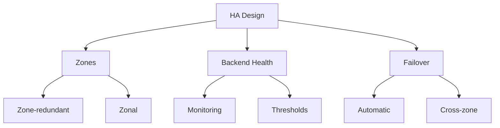

### 2. NAT Gateway Reliability
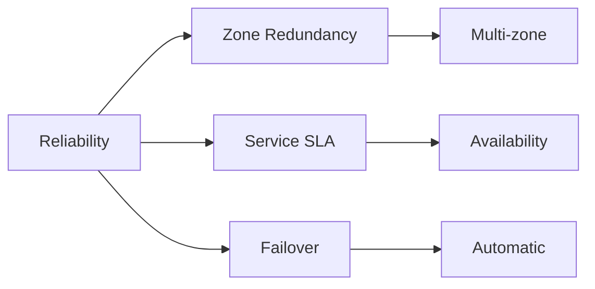

## Monitoring and Diagnostics

### 1. Load Balancer Metrics
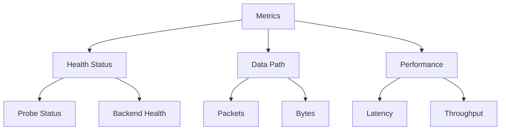

### 2. NAT Gateway Monitoring
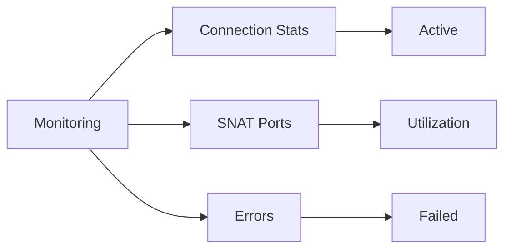

## Security Considerations

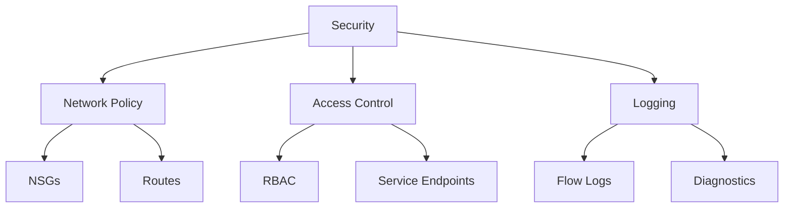

## Best Practices

1. **Design Guidelines**
   - Use Standard SKU for production
   - Implement proper health probes
   - Plan IP addressing carefully
   - Monitor resource usage

2. **Operation Management**
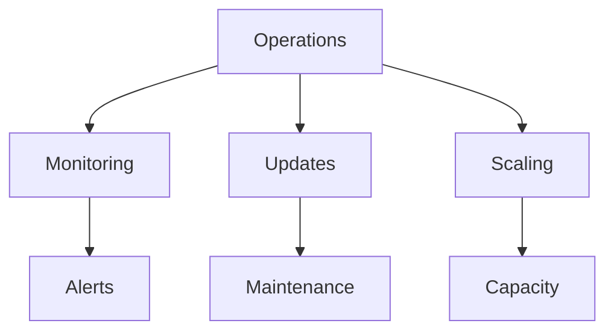

## Troubleshooting Guide

1. **Common Issues**
   - Health probe failures
   - Port exhaustion
   - Connectivity problems
   - Performance degradation

2. **Resolution Steps**
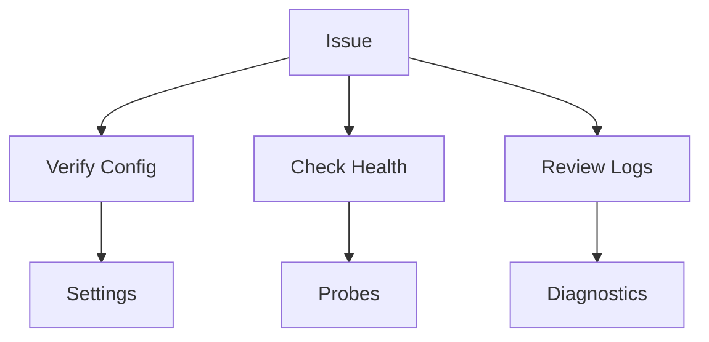

## Further Reading
- [Load Balancer Documentation](https://learn.microsoft.com/en-us/azure/load-balancer/)
- [NAT Gateway Guide](https://learn.microsoft.com/en-us/azure/virtual-network/nat-gateway/)
- [Networking Best Practices](https://learn.microsoft.com/en-us/azure/architecture/best-practices/networking)